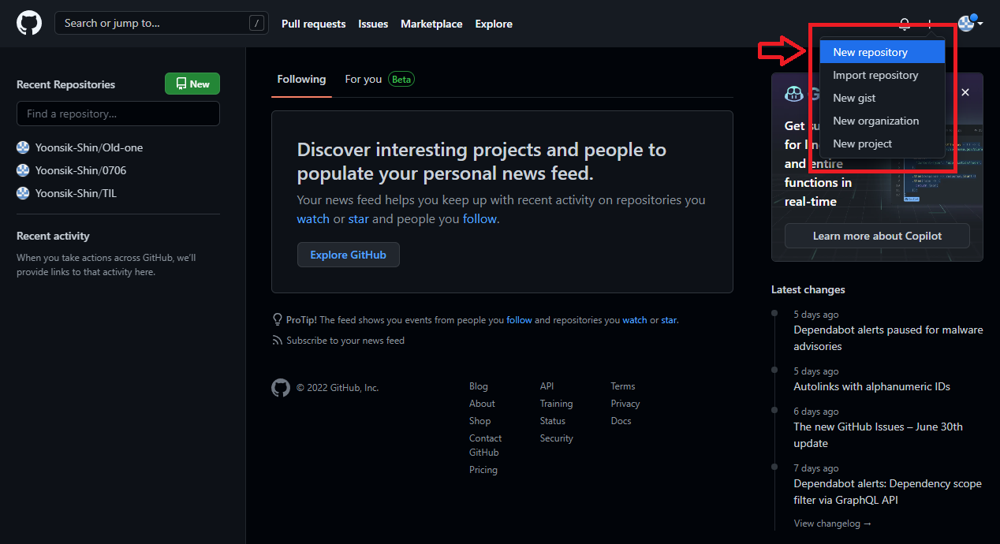
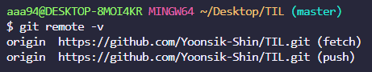

# 👻오늘 배운것 (22.07.06(수))

### 🔒원격저장소 (Remote Repository) 

- 네트워크를 활용한 저장소 

  - GitHub

  - GitLab

  - Bitbucket
  
    

- 원격저장소 기본흐름

  - 로컬 저장소 버전 <<  >> 원격 저장소

    

#### 1. GitHub에 원격 저장소 만들기

1.  깃허브 페이지에서 New Repository 생성




2. 저장소 환경설정

   


3. 저장소 url 확인

   https://github.com/**GitHub Username**/**저장소이름**.git


#### 2. 원격저장소 경로설정

- 원격 저장소 정보를 로컬 저장소에 추가해주는 작업

- 로컬 저장소에는 한번만 설정해주면 됨

```bash	
$ git remote add origin https://github.com/GitHub Username/저장소이름.git
```

😂 암기법

> 깃아 원격저장소에 추가해 origin으로


- 설정 여부 확인

```bash
$ git remote -v 
```




#### 3. 원격저장소로 Push

```bash	
$ git push origin master #git push <원격저장소이름><브랜치이름>
```
