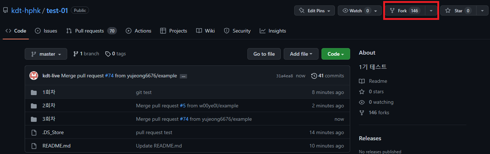
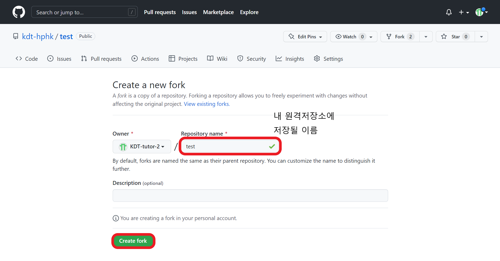
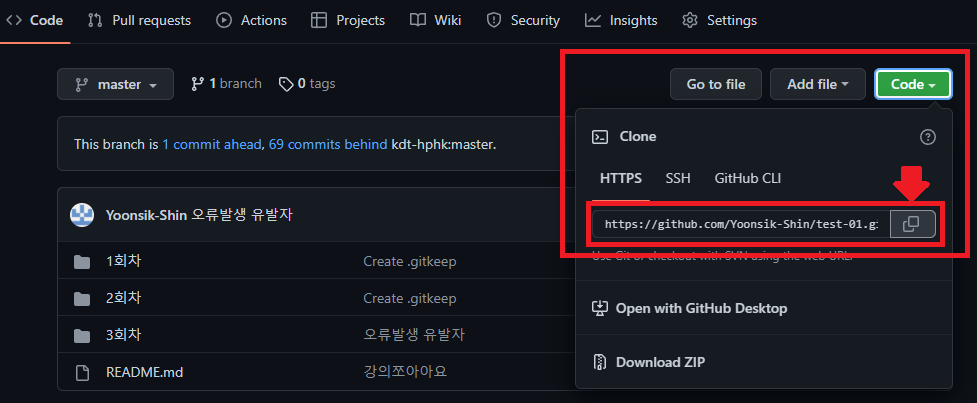
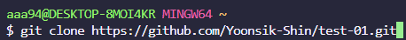
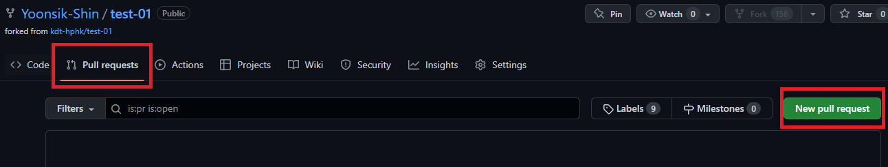

# 😁오늘 배운것 (22.07.07(목))

```bash
$ git pull origin master #
$ git clone <깃허브 주소> #
```


### Git branch

#### branch 관련 명령어

```bash
$ git branch <브랜치명>        # 브랜치 생성
$ git checkout <브랜치명>      # 해당 브랜치로 이동
$ git ckeckout -b <브랜치명>   # 브랜치 생성 후 이동까지 (주로 사용)
$ git branch -d <브랜치명>     # 해당 브랜치 삭제
$ git branch                 # 브랜치 목록 확인
$ git merge <브랜치명>        # 브랜치 병합 (master와 브랜치명)
```

> 이미 병합된 브랜치는 삭제한다


#### branch 병합시나리오

1. fast-forward 상황

   - 새로운 브랜치가 생성된 이후 master 브랜치에 변경사항이 없는 상황

     1. `<브랜치명>` 생성 및 이동

        ```bash
        (master) $ git branch -b <브랜치명>
        ```

     2. 작업완료 후 commit

        ```bash
        (<브랜치명>) $ touch a.txt
        (<브랜치명>) $ git add .
        (<브랜치명>) $ git commit -m '<커밋메시지>'
        (<브랜치명>) $ git log --oneline
        ```

        

   - merge commit 상황

2. merge commit 충돌 상황


### GitHub Fork & Pull Request

#### 1. (GitHub) Fork

1. Fork할 저장소에서 Fork버튼 누르기




2.  자신의 원격저장소에 저장될 이름 작성하고 Create fork




3. 원격저장소 확인


### 2. (Local) Clone & Branch 생성

1. Fork 받아온 저장소를 로컬로 clone 생성



⛔주의사항

> Clone URL 반드시 확인 >  본인의 저장소여야 함

```bash
$ git clone https://github.com/Yoonsik-Shin/test-01.git
```




branch 생성 및 이동

```bash
$ git checkout -b <브랜치이름>
```

 

작업 완료후 변경사항 반영

```bash
(브랜치이름) $ git add .
(브랜치이름) $ git commit -m '메시지'
(브랜치이름) $ git push origin <브랜치이름>
```


### (GitHub) Pull Request

1.  Github에서 `New pull request` 클릭




2. `pull request` 내용작성 후 `create pull request`

   

# 오늘의 교훈

메시지 잘 읽기 : 힌트 많음