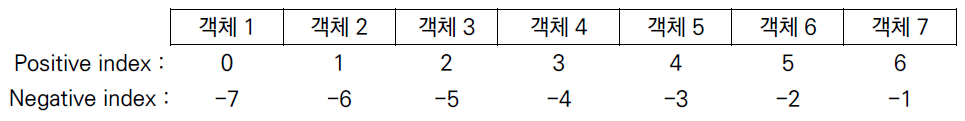

# ❓오늘 배운것 (22.07.11(월))


## 파이썬(Python) 이란?

- Easy to learn

- Expressive Langauage

- 크로스 플랫폼 언어


---


### 1. 특징

- 인터프리터 언어 (Interpreter)

- 객체지향 프로그래밍 (Object Oriented Programming)


---


### 2. 기초문법

> 코드 스타일 가이드

- 파이썬이 제안하는 가이드 : [PEP8](https://www.python.org/dev/peps/pep-0008/)

- 기업, 오픈소스등에서 사용 : [Google Style guide](https://google.github.io/styleguide/pyguide.html)


> 들여쓰기 (Identation)

- 문장 구분시 사용
- Space 4번 / Tab 1번  >>> ⛔ 혼용하여 사용하면 안됨


#### 2-1. 변수(Variable)

- 할당연산자(=)를 통해 값을 할당(assignment)

- 변수의 타입 확인

  ```python
  print(type(a)) # 변수 a의 타입 출력
  ```

- 메모리주소

  ```python
  print(id(b)) # 변수 b의 메모리주소 출력
  ```

- 변수 할당 특징

  - 같은 값을 동시에 할당할 수 있음

    ```python
    x = y = 1004  # x=1004, y=1004
    ```

    ```python
    # 자주 하는 실수
    x, y = 1
    TypeError Traceback (most recent call last)
    ----> 1 x, y = 1
    TypeError: cannot unpack non-iterable int object
    ```

    

  - 다른 값을 동시에 할당할 수 있음 (multiple assignment)

    ```python
    x = y = 1004
    ```

    ```python
    # 자주 하는 실수
    x, y = 1, 2, 3
    ValueError Traceback (most recent call last)
    ----> 1 x, y = 1, 2, 3
    ValueError: too many values to unpack (expected 2)
    ```


#### 2-2. 식별자 (Identifiers)

- 파이썬 객체(변수, 함수, 모듈, 클래스등)를 식별하는데 사용하는 이름

- 규칙

  - 가능한 문자 : 영문 알파벳, _, 숫자
  - 첫글자에 숫자가 올 수 없음 ✔️
  - 대소문자 구분 ✔️✔️
  - 예약어는 올 수 없음
  

  ```python
  # 예약어 확인하기
  import keyword
  print(keyword.kwlist)
  
  ['False', 'None', 'True', 'and', 'as', 'assert','async', 'await', 'break', 'class', 'continue','def', 'del', 'elif', 'else', 'except','finally', 'for', 'from', 'global', 'if','import', 'in', 'is', 'lambda', 'nonlocal','not', 'or', 'pass', 'raise', 'return', 'try','while', 'with', 'yield']
  ```


#### 2-3. 사용자 입력

```python
input('출력하고 싶은 문자열') ✔️ **반환값은 항상 문자열**
```


#### 2-4. 주석 (Comment)

- 한줄 주석

  ```python
  # 한줄 주석입니다.
  ```

- 여러줄 주석

  ```python
  '''
  여러줄
  주석입니다.
  '''


---


### 3. 기초 자료형 (DataType)

#### 3-1. 불린형 (Boolean Type)

- True, False > bool

- False로 변환되는 것들

  ```python
  0, 0.0, (), [], {}, '', None
  ```

- bool() 함수 : 특정 데이터가 True인지 False인지 검증

  

> 논리 연산자(Logical Operator) : 논리식을 판단하여 True, False를 반환

| 논리연산자 | 설명                                            |
| ---------- | ----------------------------------------------- |
| and        | 모두 True일때 True, 그렇지 않으면 False         |
| or         | 둘 중 하나만 True이면 True, 그렇지 않으면 False |
| not        | 참, 거짓의 반대 결과                            |


#### 3-2. 수치형 (Numeric Type)

```python
int #(정수, integer)
- 모든 정수 타입은 int
- 매우 큰 수를 나타낼 떄도 오버플로우가 발생하지 않음

float #(부동소수점, 실수, floating point number)
- 정수가 아닌 모든 실수는 float타입
- 실수를 컴퓨터가 표현하는 방식(2진수)에 의해 floating point rounding error가 발생하면 예기치 못한 결과가 발생할 수 있음
- 매우 작은 수보다 작은지 확인하거나 math 모듈 활용

# 1. 임의의 작은 수
abs(a - b) <= 1e-10
# 2. math 모듈 활용
import math
math.isclose(a, b)
# 아래는 참일까? 거짓일까?
3.14 - 3.02 == 0.12 # 0.1200000000000001

complex #(복소수, complex number)
- 실수부와 허수부로 구성
a = 3+4j # j는 허수부
a.real >> 3.0
a.imag >> 4.0
```


>산술 연산자 (Arithmetic Operator) 

| 연산자 | 내용     |
| ------ | -------- |
| +      | 덧셈     |
| -      | 뺼셈     |
| *      | 곱셈     |
| %      | 나머지   |
| /      | 나눗셈   |
| //     | 몫       |
| **     | 거듭제곱 |


> 복합 연산자 (In-place Operator) : 연산과 할당이 함께 이루어짐

| 연산자  | 내용       |
| ------- | ---------- |
| a += b  | a = a + b  |
| a -= b  | a = a - b  |
| a *= b  | a = a * b  |
| a /= b  | a = a / b  |
| a //= b | a = a // b |
| a %= b  | a = a % b  |
| a** b   | a = a ** b |


> 비교 연산자 (Comprarison Operator) : 값을 비교하여, True/False값을 리턴

| 연산자 | 내용                             |
| ------ | -------------------------------- |
| <      | 미만                             |
| <=     | 이하                             |
| >      | 초과                             |
| >=     | 이상                             |
| ==     | 같음                             |
| !=     | 같지않음                         |
| is     | 객체 아이덴티티(OOP)             |
| is not | 객체 아이덴티티(OOP)가 아닌 경우 |


#### 3-3. 문자열 (String Type)

- 모든 문자는 str타입
- 작은 따옴표(') or 큰 따옴표(") 활용
- Immutable : 변경불가능

```py
a = 'my string?'
a[-1] = ‘!’
TypeError Traceback (most recent call last)
----> 1 a[-1] = '!’
TypeError: 'str' object does not support item assignment
```

- Iterable : 반복가능

```python
a = '123'
for char in a:
print(char)
```


> 중첩 따옴표(Nested Quotes) : 따옴표 안에 다옴표를 표현할 경우

```python
print("문자열 안에 '작은 따옴표'를 사용하려면 큰 따옴표로 묶는다.")
print('문자열 안에 "큰 따옴표"를 사용하려면 작은 따옴표로 묶는다.')
```


> 삼중따옴표(Triple Quotes) 

```python
print('''문자열 안에 '작은 따옴표'나
"큰 따옴표"를 사용할 수 있고
여러 줄을 사용할 때도 편리하다.''')
```


> 인덱싱, 슬라이싱

```python
s = 'helao'
     01234
    
# 인덱싱
s[0] = 'h'
s[1] = 'e'

# 슬라이싱
s[1,4]  # a이상 b미만의 값 (1,2,3)
>> 'ela'
s[1,4,2] # 1과 3
>> 'ea'
s[4,2,-1] # (4,3)
>> 'oa'
s[:] # 처음부터 끝까지
✔️ s[::-1] : 문자열 순서 뒤집기
```


> 기타

```python
# 결합 (Concatenation)
'문자열1' + '문자열2'
>> '문자열1문자열2'

# 반복 (Repetition)
'hi'*3
>>'hihihi'

# 포함 (Membership)
'a' in 'apple'
>> True
'app' in 'apple'
>> True
'b' in 'apple'
>> False
```


> Escape sequence : 문자열 내에서 역슬래시(\\)를 활용하여 구분

| 예약문자 | 내용(의미)                 |
| -------- | -------------------------- |
| \n       | 줄 바꿈                    |
| \t       | 탭                         |
| \0       | 널(Null)                   |
| \\\      | \                          |
| \\'      | 단일인용부호(')            |
| \\"      | 이중인용부호(")            |
| \r       | 캐리지리턴 (맨앞으로 이동) |


> String Interpolation : 문자열을 변수로 활용하여 만드는 법

- %-formatting

  ```python
  name = 'Kim'
  score = 4.5
  print('Hello, %s' % name)
  print('내 성적은 %d' % score)
  print('내 성적은 %f' % score)
  # Hello, Kim
  # 내 성적은 4
  # 내 성적은 4.500000
  ```

- f-string (최신기술, 훨씬 더 편리)

  ```python
  name = 'Kim'
  score = 4.5
  print(f'Hello, {name}! 성적은 {score}')
  # Hello, Kim! 성적은 4.5
  pi = 3.141592
  print(f'원주율은 {pi:.3}. 반지름이 2일때 원의 넓이는 {pi*2*2}')
  ```


#### 3-4. None

- 값이 없음을 표현
- 반환값이 없는 함수에서 사용


---


### 4. 형변환 (Typecasting)

- 자료형 변환

  - 암시적 형변환 (Implicit) : 사용자가 의도하지 않고, 파이썬 내부적으로 자료형으로 변환하는 경우

  ```python
  True + 3
  # 4
  3 + 5.0
  # 8.0
  3 + 4j + 5
  # (8+4j)
  ```

  - 명시적 형변환 (Explicit) : 사용자가 의도적으로 자료형을 변환하는 경우

  ```python
  # 문자열은 암시적 타입 변환이 되지 않음
  '3' + 4
  # TypeError: can only concatenate str (not "int") to str
  
  # 명시적 타입 변환이 필요함
  int('3') + 4
  # 7
  
  # 정수 형식이 아닌 경우 타입 변환할 수 없음
  int('3.5') + 5
  # ValueError: invalid literal for int() with base 10: '3.5'
  
  float('3.5') + 5
  # 8.5
  
  ✔️ 형식에 맞는 문자열만 가능


---


### 5. 컨테이너 (Container)

- 정의 : 여러개의 값을 담을 수 있는 것

- 분류 : 순서가 있는 데이터 (Ordered) vs 순서가 없는 데이터 (Unordered)

  - 시퀀스
    - 문자열 (immutable) : 문자들의 나열
    - 리스트 (mutable) : 변경 가능한 값들의 나열
    - 튜플 (immutable) : 변경 불가능한 값들의 나열
    - 레인지 (immutable) : 숫자의 나열

  - 컬렉션 / 비시퀀스

    - 세트 (mutable) : 유일한 값들의 모음
  
    - 딕셔너리 (mutable) : 키-값들의 모음
  


#### 5-1. 시퀀스형 컨테이너 (Sequence Container)

> 시퀀스형 주요 공통 연산자

| 연산       | 결과                                                         |
| ---------- | ------------------------------------------------------------ |
| s[i]       | s의 i번째 항목                                               |
| s[i:j]     | s의 i에서 j까지 슬라이싱                                     |
| s[i:j:k]   | s의 i에서 j까지 스텝k로 슬라이싱                             |
| s + t      | s와 t의 이어붙이기                                           |
| s * n      | s를 n번 더하기                                               |
| x in s     | s 의 항목 중 하나가 x 와 같으면 True, 그<br/>렇지 않으면 False |
| x not in s | s 의 항목 중 하나가 x 와 같으면 False, 그<br/>렇지 않으면 True |
| len(s)     | s의 길이                                                     |
| min(s)     | s의 가장 작은 항목                                           |
| max(s)     | s의 가장 큰 항목                                             |


##### 5-1-1. 리스트 (List)

- 정의

  - 변경 가능한 값들의 나열된 자료형

  - 순서 o, 서로 다른 타입의 요소 o

  - 변경 가능 (mutable), 반복 가능 (iterable)

  - 대괄호 ([]), 요소는 콤마로 구분

    




- 생성

```python
# 생성
my_list = []
another_list = list()
type(my_list)
# <class 'list'>
type(another_list)
# <class 'list'>
```


- 접근, 변경

```python
# 값 접근
a = [1, 2, 3]
print(a[0])
# 1
# 값 변경
a[0] = '1'
print(a)
# ['1', 2, 3]
```


- 값 추가 / 삭제

```python
# 추가 (append)
even_numbers = [2, 4, 6, 8]
even_numbers.append(10)
even_numbers
# => [2, 4, 6, 8, 10]

# 삭제 (pop)
even_numbers = [2, 4, 6, 8]
even_numbers.pop(0)
even_numbers
# => [4, 6, 8]
```


##### 5-1-2. 튜플 (Tuple)

- 정의 

  - 불변한 값들의 나열

  - 순서 o, 서로 다른 타입의 요소 o

  - 변경 불가능 (immutable), 반복가능 (iterable)

  - 소괄호 () , 요소는 콤마로 구분

    

- 생성 / 접근

  - 값 변경은 불가능하여 추가/삭제도 불가능함
  - 접근은 리스트와 동일하게 인덱스 활용

```python
# 값 접근
a = (1, 2, 3, 1)
a[1]

# 값 변경 => 불가능
a[1] = ‘3’

TypeError Traceback (most recent call last)
1 # 값 변경 => 불가능 ---->
2 a[1] = '3’
TypeError: 'tuple' object does not support item assignment
```


##### 5-1-3. 레인지 (Range)

- 정의

  - 숫자의 시퀀스를 나타내기 위해 사용
  - 변경 불가 (immutable), 반복 가능 (iterable)

  | 형태              | 활용           | 설명                                         |
  | ----------------- | -------------- | -------------------------------------------- |
  | 기본형            | range(n)       | 0부터 n-1까지의 숫자의 시퀀스                |
  | 범위 지정         | range(n, m)    | n부터 m-1까지의 숫자의 시퀀스                |
  | 범위 및 스텝 지정 | range(n, m, s) | n부터 m-1까지 s만큼 증가시키며 숫자의 시퀀스 |

  ```python
  range(4)
  # range(0, 4)
  list(range(4))
  # [0, 1, 2, 3]
  type(range(4))
  # <class 'range'>
  
  ✔️담겨있는 숫자를 확인하기 위하여 리스트로 형변환
  ```

  

#### 5-2. 비시퀀스형 컨테이너 (Associative Container)

##### 5-2-1. 세트 (Set)

- 정의

  - 유일한 값들의 모음 (collection)

  - 순서 x, 중복값 x

  - 수학의 집합과 동일 구조, 집합 연산도 가능

  - 변경 가능 (mutable), 반복 가능 (iterable) 

​			✔️단, 순서가 없어 반복의 결과가 정의한 순서와 다를 수 있음


- 생성

```python
{1, 2, 3, 1, 2}
# {1, 2, 3}
type({1, 2, 3})
# <class 'set'>
blank_set = set()

{1, 2, 3}[0]  #순서가 없어 인덱스 접근 등 특정 값에 접근할 수 없음
TypeError Traceback (most recent call last)
<ipython-input-95-0c8fa4a2ff15> in <module>
----> 1 {1, 2, 3}[0]
TypeError: 'set' object is not subscriptable
```


- 추가 / 삭제

```python
# 추가 (add(값))
numbers = {1, 2, 3}
numbers.add(5)
numbers
# => {1, 2, 3, 5}
numbers.add(1)
numbers
# => {1, 2, 3, 5}

# 삭제 (remove(값))
numbers = {1, 2, 3}
numbers.remove(1)
numbers
# => {2, 3}
numbers.remove(5)
# Traceback (most recent call last):
# File "<stdin>", line
```


- 중복값 제거 활용

```python
my_list = ['서울', '서울', '대전', '광주',
'서울', '대전', '부산', '부산’]
len(set(my_list))
# 4
set(my_list)
# {'광주', '대전', '부산', '서울'}
```


##### 5-2-2. 딕셔너리 (Dictionary)

- 정의
  - 키-값 (key-value)쌍으로 이루어진 모음 (collection)
    - 키 (key) : 불변 자료형만 가능 (리스트, 딕셔너리는 불가능)
    - 값 (values) : 어떤 형태든 관계 없음
  - 키와 값 구분 기호 {키:값} 
  - 변경 가능 (mutable), 반복 가능 (iterable)


- 생성

```python
dict_a = {'이름':['민석','민기','지현']}

# 불가능
dict_c = {[1, 2, 3]: 'hi’}
TypeError Traceback (most recent call last)
----> 1 dict_c = {[1, 2, 3]: 'hi’}
TypeError: unhashable type: 'list'         
```


- 접근

```python
movie = {
'title': '설국열차',
'genres': ['SF', '액션', '드라마'],
'open_date': '2013-08-01',
'time': 126,
'adult': False,
}

movie['genres']
# ['SF', '액션', '드라마']
```


- 키-값 추가 / 변경

```python
# 이미 해당하는 키가 있다면 기존 값이 변경

students = {'홍길동': 100, '김철수': 90}
students['홍길동'] = 80
# {'홍길동': 80, '김철수': 90}
students['박영희'] = 95
# {'홍길동': 80, '김철수': 90, '박영희': 95}
```


- 키-값 삭제

```python
# pop(키)

students = {'홍길동': 30, '김철수': 25}
students.pop('홍길동')
students
# {'김철수': 25}
```

