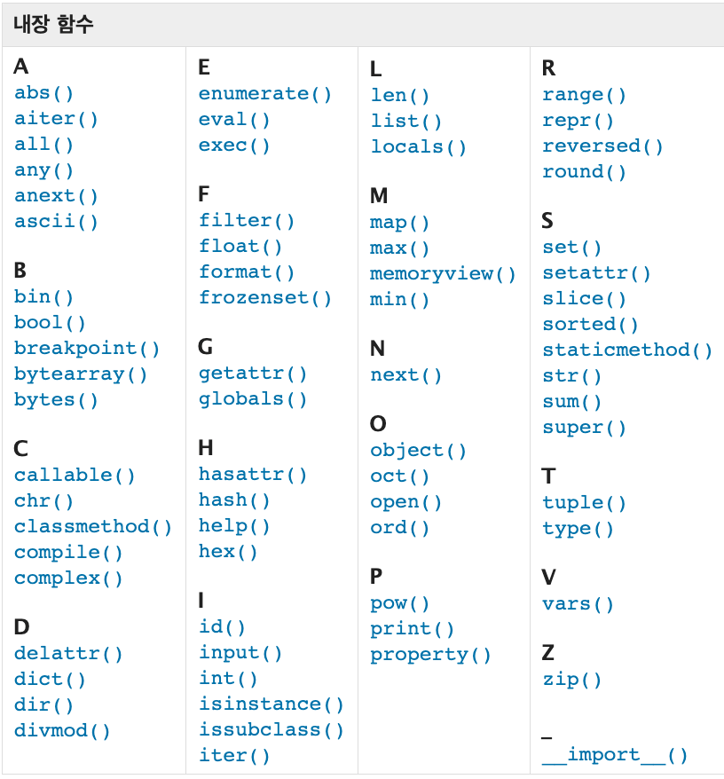

# ❓오늘 배운것 (22.07.13(수))


## 🔃 함수 (Function)

### 1. 기초

- 정의

  - 특정 기능을 하는 코드의 묶음

    

- 사용자 함수 (Custom Function)

  - 구현되어 있는 함수가 없는 경우, 사용자가 직접 함수 작성 가능

  ```python
  def function_name
  	# code block
      return returning_value
  ```


- 함수 사용 이유

  - 코드 중복 방지
  - 재사용 용이

  > 함수 미사용 시 표준편차 계산

  ```python
  values = [100, 200, 300]
  total = 0
  cnt = 0
  
  # 평균 계산
  for value in values:
      total += value
      cnt += 1
  mean = total / cnt
  
  # 분산 계산
  total_var = 0
  for value in values:
      total_var += (value - mean) ** 2
      
  sum_var = total_var / cnt
  target = sum_var
  
  # 표준편차 계산
  while True:
      root = 0.5 * (target + (sum_var/target))
      if (abs(root - target) < 0.00000000001):
          break
      target = root
      
  std_dev = target
  print(std_dev)
  ```

  

  > 내장함수 (Built-in Fuction) 활용

  ```python
  import math
  
  values = [100, 200, 300]
  mean = sum(values) / len(values)
  sum_var = sum(pow(value - mean, 2) for value in values) / len(values)
  std_dev = math.sqrt(sum_var)
  
  print(std_dev)
  ```

  ✔️  New Tech (리스트 내포)

  ```python
  x = [표현식 for i in 반복가능객체 (if 조건문)]
  
  x =[표현식 for 항목1 in 반복가능객체1 if 조건문1
   	      for 항목2 in 반복가능객체2 if 조건문2
   	      ...
   	      for 항목n in 반복가능객체n if 조건문n]
  ```

  

  > pstdev 함수 (파이썬 표준 라이브러리 - statisitics)

  ```python
  import statisitics
  
  values = [100, 200, 300]
  
  statistics.pstdev(values)
  ```

  

- 함수 기본 구조

  - 선언  (define)

    - 선언은 `def` 키워드를 활용

    - 들여쓰기를 통해 Function body 작성

    - Docstring은 Functionbody 앞에 선택적으로 작성 가능 (''' ''' 사용)

      

  - 호출 (call)

    - ```함수명()``` 으로 호출
    - parameter가 있는 경우 >> `함수명(값1, 값2, ...)` 

    ```python
    def f():
    	return True
    ▶️ print(f())
    
    def add(x, y):
        return x + y
    ▶️ print(add(3, 4))
    ```

  - 입력 (Input)
  - 범위 (Scope)
  - 결과값 (Output)

  

  

```python
''' 
keyword name (parameters)
	fuction body
'''
def pstdev (data, mu=None): 	# keyword name (parameters)
    var = pvariance(data, mu) 	# fuction body	
    try:						# fuction body	
        return var.sqrt()		# fuction body
    except AttributeError:		# fuction body
        return math.sqrt(var)	# return
```


---


### 2. 결과값 (Output)

- return

  - 함수는 반드시 값을 하나만 return한다.

  - 명시적인 return이 없는 경우에도 `None` 을 반환한다.

  - 함수는 return을 만나면 실행을 종료한다.

    

- return문을 한번만 사용하여 두 개 이상의 값을 반환

  ```python
  # 오류x, 제일 처음 return값만 반환되고 나머지 return은 실행안됨
  def mandp(x, y):
      return x - y
  	return x + y
  	return x * y
  
  print(mandp(4, 5))
  >> -1
  
  # return문을 한번만 사용하여 두 개 이상의 값을 반환
  def mandp(x, y):
      return x - y, x + y, x * y
  
  print(mandp(4, 5))
  >> (-1, 9, 20)  # 튜플 형식으로 반환됨 
  ```


---


### 3. 입력(Input)

- Parameter : 함수를 실행할 때, 함수 내부에서 사용되는 식별자
- Argument : 함수를 호출 할 때, 넣어주는 값

``` python
def function(x):  			# parameter : x
    return x * 2

print(function('help')) 	# argument ; 'help'
>> helphelp
```


> Argument

```python
func_name(argument)
```

- 필수 Argument : 반드시 전달되어야하는 값

- 선택 Argument : 값을 전달하지 않아도 되는 경우, 기본값이 전달됨

  

- Positional arguments

  - 기본적으로 함수 호출시 위치에 따라 함수 내로 전달

  


- Keyword arguments

  - 직접 변수의 이름으로 특정 Argument를 전달가능
  - Keyword Argument 다음에 Positional Argument를 활용할 수 없음

  


- Default Arguments Values
  - 기본값을 지정, 함수 호출시 argument값을 설정하지 않도록 함
  - 정의된 것보다 더 적은 갯수의 arguments 호출 가능


- ❗정해지지 않은 개수의 arguments❗

  - 여러 개의 Positional Arugument를 하나의 필수 parameter로 받아서 사용

  - 몇 개의 Positional Argument를 받을지 모르는 함수를 정의할 때 유용

  - Argument들은 **튜플**로 묶여 처리되며, parameter에 `*`을 붙혀서 표현

    ``` python
    def add(*args):   # args는 바뀔수 있음 (args = arguments)
        for arg in args:
        	print(arg)
            
    # add(2) 가능
    # add(2, 3, 4, 5) 가능
    ```


- 정해지지 않은 개수의 _keyword_ arguments

  - 임의의 개수 Argument를 Keyword Argument로 호출될 수 있도록 지정

  - Argument들은 딕셔너리로 묶여 처리되며, parameter에 `**`를 붙여 표현

    ```python
    # 키만 출력
    def family(**kwargs):   # kwargs는 바뀔 수 있음 (kwargs = Keyword arguments)
        for key in kwargs:
            print(key)
    family(father='john', mother='Jane', me='John Jr.')
    
    # 키와 값 모두 출력
    def family(**kwargs):   # kwargs는 바뀔 수 있음 (kwargs = Keyword arguments)
        for key, value in kwargs.items(): ❗❗
            print(key, ":", value)
    family(father='john', mother='Jane', me='John Jr.')
    ```


---


### 4. 범위 (Scope)

- 함수는 코드 내부에 local scope를 생성하며, 그 외의 공간인 global scope로 구분


>scope

- global scope : 코드 어디에서든지 참조할 수 있는 공간
- local scope : 함수가 만든 scope로써, 함수 내부에서만 참조 가능


> variable

- global variable : global scope에 정의된 변수
- local variable : local scope에 정의된 변수


> 객체 수명주기 (Lifecycle)

- built-in scope
  - 파이썬이 실행된 이후부터 영원히 유지
- global scope
  - 모듈이 호출된 시점 이후 or 인터프리터가 끝날 때까지 유지
- local scope
  - 함수가 호출될 때 생성되고, 함수가 종료될 때까지 유지


> 이름 검색 규칙 (Name Resolution)

- 파이썬에서 사용되는 이름(식별자)들은 이름공간 (namespace)에 저장되어 있음

- LEGB Roule

  - Local ▶️ Enclosed ▶️ Global ▶️ Built-in

  


---


### 5. 응용

- 내장 함수 응용




- map 함수

  - 순회 가능한(iterable) 모든 요소에 함수(function) 적용하고 결과를 map object로 반환

  ```python
  map(function, iterable)
  
  a, b = map(int, input().split())
  ```

  
