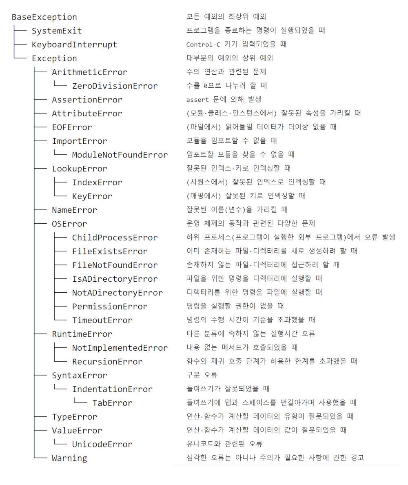

# ❓오늘 배운것 (22.07.18(월))

## 에러 / 예외처리 (Error / Exception Handling)

### # 디버깅

- 디버깅 체크 요소

  - 오류가 많이 발생하는 장소
  - 오류가 발생했을 때 중점적으로 봐야하는 것
    - 제어가 되는 시점
    - 조건문, 반복문
    - 함수

  ```markdown
  - branches : 모든 조건이 원하는대로 동작하는지
  - for loops : 반복문에 진입하는지, 원하는 횟수만큼 실행되는지
  - while loops : for loops와 동일, 종료조건이 제대로 작동하는지
  - function : 함수 호출시, 함수 파라미터, 함수 결과
  ```


- 디버깅 방법
  - print( ) 함수 활용
    - 특정 함수 결과, 반복/조건 결과등을 나눠서 생각
    - 코드를 bisection으로 나눠서 생각
  - 개발 환경에서 제공하는 기능활용
    - breakpoint
    - 변수 조회
  - Python tutor 활용
  - 뇌 컴파일, 눈 디버깅 (Pure Man Power)


---


### # 에러와 예외

#### 1. 문법 에러 (Syntax Error)

- SyntaxError 발생시에는 파이썬 프로그램 실행 안됨
- 파일 이름, 줄번호, `^` 문자를 통해 문제가 발생한 위치 표현


> EOL (End of Line) : 

```py
print('hello
# File "<ipython-input-6-2a5f5c6b1414>", line 1
# print('hello
#             ^
# SyntaxError: EOL while scanning string literal
```


> EOF (End of File) :

```python
print(
# File "<ipython-input-4-424fbb3a34c5>", line 1
# print(
#     ^
# SyntaxError: unexpected EOF while parsing
```


> Invailid syntax

```python
while
# File "<ipython-input-7-ae84bbebe3ce>", line 1
# while
#         ^
# SyntaxError: invalid syntax
```


> assign to literal

```python
5 = 3
# File "<ipython-input-28-9a762f2c796b>", line 1
# 5 = 3
# ^
# SyntaxError: cannot assign to literal
```


---


#### 2. 예외 (Exception)

- 실행 도중 예상치 못한 상황을 맞이하면, 프로그램은 실행을 멈춤
- 문장이나 표현식이 문법적으로 올바르더라도 발생하는 에러
- 실행 중에 감지되는 에러들을 예외라고 부름
- 모든 내장 예외는 Exceptiom Class를 상속받아 이루어짐
- 사용자정의 예외를 만들어 관리할 수 있음


> ZeroDivisionError : 0으로 나누고자 할 때 발생

```python
10/0
# ---------------
# ZeroDivisionError Traceback (most recent call last)
# ----> 1 10/0
# ZeroDivisionError: division by zero
```


> NameError : 정의되지 않은 변수를 사용한 경우

```python
print(name_error)
# ---------------------------
# NameError Traceback (most recent call last)
# ----> 1 print(name_error)
# NameError: name 'name_error' is not defined
```


> TypeError

1.  타입 불일치

```py
1 + '1'
# --------------
# TypeError Traceback (most recent call last)
# ----> 1 1 + '1'
# TypeError: unsupported operand type(s) for +: 'int' and 'str'

round('3.5')
# ---------------
# TypeError Traceback (most recent call last)
# ----> 1 round('3.5')
# TypeError: type str doesn't define __round__ method
```

2. arguments 부족 / 초과

```python
divmod()
# ------------
# TypeError Traceback (most recent call last)
# ----> 1 divmod()
# TypeError: divmod expected 2 arguments, got 0 
>> 2개의 arguments를 예상했는데 아무것도 안들어있다.

import random
random.sample()
# ---------
# TypeError Traceback (most recent call last)
# 1 import random
# ----> 2 random.sample()
# TypeError: sample() missing 2 required positional arguments: 
'population' and 'k'
>> population과 k 인자가 없다.

import random
random.sample(1, 2)
# ------
# TypeError Traceback (most recent call last)
# 1 import random
# ----> 2 random.sample(1, 2)
# ~/.pyenv/versions/3.8.6/lib/python3.8/random.py in sample(self, population, k)
# 357 population = tuple(population)
# 358 if not isinstance(population, _Sequence):
# --> 359 raise TypeError("Population must be a sequence or 
# set. For dicts, use list(d).")
# 360 randbelow = self._randbelow
# 361 n = len(population)
# TypeError: Population must be a sequence or set. For dicts, use list(d)
>> 인자에 잘못된 타입의 값이 들어가 있다. 리스트를 써라
```


> ValueError : 타입은 올바르나 값이 적절하지 않거나 없는 경우

```python
int('3.5')
# ------
# ValueError Traceback (most recent call last)
# ----> 1 int('3.5')
# ValueError: invalid literal for int() with base 10: 
'3.5'

range(3).index(6)
# ------
# ValueError Traceback (most recent call last)
# ----> 1 range(3).index(6)
# ValueError: 6 is not in range
```


> indexError : 존재하지 않는 키를 호출하는 경우

```python
song = {'IU': '좋은날'}
song['BTS']
# ------
# KeyError Traceback (most recent call last)
# 1 song = {'IU': '좋은날'}
# ----> 2 song['BTS']
# KeyError: 'BTS'
```


> ModuleNotFoundError : 존재하지 않는 모듈을 import하는 경우

```python
import nonamed
# ------
# ModuleNotFoundError Traceback (most recent call last)
# ----> 1 import nonamed
# ModuleNotFoundError: No module named 'nonamed'
```


> import Error : 모듈은 존재하나 존재하지 않는 클래스나 함수를 가져오는 경우

```python
from random import samp
# ------
# ImportError Traceback (most recent call last)
# ----> 1 from random import samp
# ImportError: cannot import name 'samp' from 'random'
```


> IndentationError - Indentation (들여쓰기)이 적절하지 않은 경우

```python
for i in range(3):
print(i)
# File "<ipython-input-56-78291925d94f>", line 2
# print(i)
# ^
# IndentationError: expected an indented block
```


> KeyboardInterrupt : 임의로 프로그램을 종료하였을 때 ( `ctrl`+`c`)

```python
while True:
continue
# ------
# KeyboardInterrupt Traceback (most recent call last)
# <ipython-input-55-6a65cf439648> in <module>
# 1 while True:
# ----> 2 continue
# KeyboardInterrupt: 
```


> 파이썬 내장 예외 (buit-in-exception) 클래스 계층 구조




---


### # 예외처리

- try문
  - 오류가 발생할 가능성이 있는 코드를 실행
  - 예외가 발생되지 않으면, except없이 실행 종료
- except문            
  - 예외가 발생하면, except절 실행
  - 예외 상황을 처리하는 코드를 받아 적절한 조치를 취함

```python
❗try문에는 반드시 한 개 이상의 except문 필요❗ 

try:
    'try 명령문'
except 예외그룹1:
	'예외처리 명령문1'
except 예외그룹2:
	'예외처리 명령문2'
finally:                   # 선택사항
    'finally 명령문'
```


- 정리

  - try : 코드 실행
  - except : try문에서 예외 발생시 실행
  - else : try문에서 예외가 발생하지 않았을 때 실행
  - finally : 예외 발생 여부와 관계없이 항상 실행

  

- 예시

```python
try:
	num = input('값을 입력하시오: ')
	100/int(num)
except ValueError:
	print('숫자를 넣어주세요.')
except ZeroDivisionError:
	print('0으로 나눌 수 없습니다.')
except:
	print('에러는 모르지만 에러가 발생하였습니다.')
```


---


### # 예외 발생 시키기

- raise를 통해 예외를 강제로 발생

```python
raise <표현식> (메시지)
# 표현식에는 예외 타입 지정
# 주어지지 않을 경우 현재 스코프에서 활성화된 마지막 예외를 다시 일으킴
```

```python
raise 
# -------
# RuntimeError Traceback (most recent call last)
# ----> 1 raise
# RuntimeError: No active exception to reraise
```


