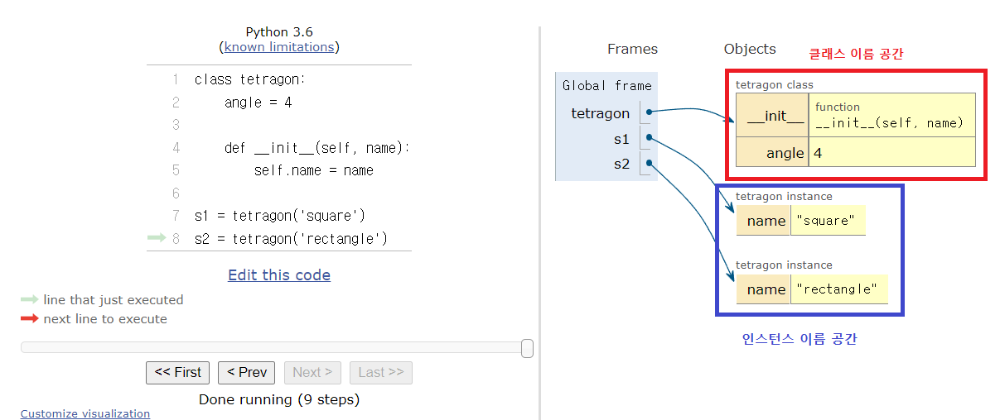
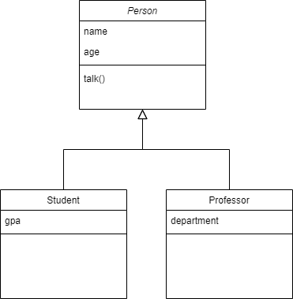
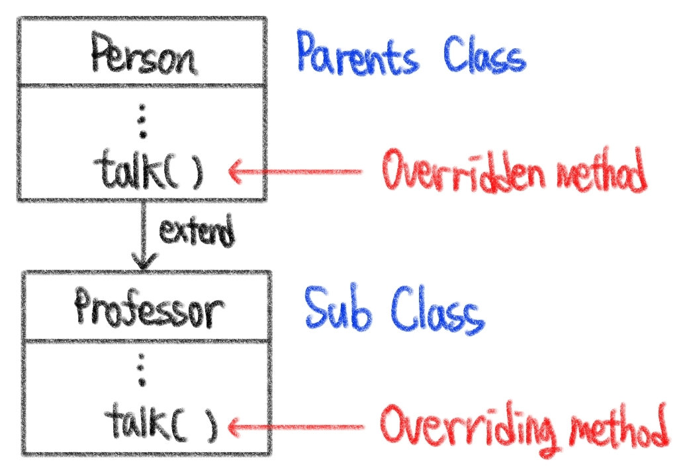

# ❓오늘 배운것 (22.07.20(수))

## 💫 클래스

### 1. 클래스 속성 (attribute)

- 한 클래스의 인스턴스라면 모두 똑같은 값을 가지는 것
- 클래스 선언 내부에서 정의
- `클래스명/인스턴스명.속성`으로 접근 및 할당

```python
# 클래스 선언
class tetragon:
    angle = 4  << 클래스 변수 정의

# 인스턴스 정의
c1 = tetragon()
c2 = tetragon()

# 활용
print(tetragon.angle)   ## 속성뒤에는 () 안씀
print(c1.angle)
print(c2.angle)
```


> 인스턴스와 클래스 간의 이름 공간 (namespace)

- 클래스 정의시, 클래스와 클래스에 해당하는 이름 공간 생성
- 인스턴스 생성시, 인스턴스 객체와 이름 공간 생성
- 인스턴스에서 특정 속성 접근시, from `인스턴스`  to  `클래스` 순으로 탐색




### 2. 인스턴스 메소드

- 호출한 인스턴스를 의미하는 self 매개변수를 통해 인스턴스를 조작

  

### 3. 클래스 메소드

- 클래스가 사용할 메소드

- `@classmethod` 데코레이터를 사용하여 정의     
  - ❗데코레이터 : 함수를 어떤 함수로 꾸며서 새로운 기능을 부여❗
- 호출 시, 첫 번째 인자로 클래스 (cls)가 전달됨

```python
class MyClass
	
    @classmethod
    def method(cls, arg1, ...)
    
# 활용
MyClass.method()
```


### 4. 스태틱 메소드

- 인스턴스 변수, 클래스 변수를 전혀 다루지 않는 메소드
- 속성을 다루지 않고 기능만 하는 메소드를 정의할 때 사용
- `@staticmethod` 데코레이터를 사용하여 정의
- 호출 시, 어떠한 인자도 전달되지 않음
- 클래스 정보에 접근 / 수정이 불가능

```python
class MyClass

	@staticmethod
    def method(arg1, ...)
```


> 정리

```python
class Myclass:
    
    def method(self):
        return 'instance method', self
    
    @classmethod
    def classmethod(cls):
        return 'class method', cls
   	
    @staticmethod
    def staticmethod():
        return 'static method'
    
a = Myclass()

print(a.method())
>> ('instance method', <__main__.Myclass object at 0x00000276913A3A90>)

print(a.classmethod)
>> ('class method', <class '__main__.Myclass'>)

print(a.staticmethod)
>> static method
```


---


## 객체지향

- 핵심 4가지
  - 추상화
  - 상속
  - 다형성
  - 캡슐화


### 1. 추상화 (Abstraciton)

- 공통의 속성이나 기능을 묶어 이름을 붙이는 것

```python
# 학생, 교수는 사람이라는 공통점이 있다.
Class Person:
    
    def __init__(self, name, age):
        self.name = name
        self.age = age
      
    def talk(self):
        print(f'반갑습니다. {self.name}입니다.)
```

```python
Class Student:
    
    def __init__(self, name, age, gpa)
    	self.name = name
        self.age = age
        self.qpa = qpa
       
    def talk(self):
        print(f'반갑습니다. {self.name}입니다.)
      
    def study(self):
```

```python
Class Professor:
    
    def __init__(self, name, age, department):
        self.name = name
        self.age = age
        self.department = department
        
    def talk(self):
        print(f'반갑습니다. {self.name}입니다.)
              
    def teach(self):
              self.age += 1
```


### 2. 상속 (Inheritance)

- 두 클래스 사이에 부모-자식 관계를 갖는 것
- __부모클래스__의 `속성`, `메소드` 가 _자식 클래스_에 상속되어 코드 재사용성이 높아짐
- 하위 클래스는 상위 클래스에 정의된 속성, 행동, 관계 및 제약조건을 모두 상속 받음
  - ex. 부모 클래스 : 학교 // 자식 클래스 : 초등학교, 중학교, 대학교
- super( )를 통해 부모 클래스의 요소를 호출할 수 있음
- 메소드 오버라이딩을 통해 자식 클래스에서 재정의 가능
- 상속관계에서의 이름 공간은 인스턴스 -->> 자식 클래스 -->> 부모 클래스 순으로 탐색


> 상속을 통한 메소드 재사용

```python
Class Person:
    def __init__(self, name, age):
        self.name = name
        self.age = age
      
    def talk(self):
        print(f'반갑습니다. {self.name}입니다.)
 
class Professor(Person):
    def __init__(self, name, age, department):
              self.name = name
              self.age = age
              self.department = department

Class Student(Person):
    def __intit__(self, name, age, gpa)
              self.name = name
              self.age = age
              self.gpa = gpa
```

```python
p1 = Professor('자비에', 100, '멘탈케어')
s1 = Student('로건', 45, 1.7)

p1.talk()
>> 반갑습니다. 자비에입니다.

s1.talk()
>> 반갑습니다. 로건입니다.
```




> 상속관련 함수와 메소드

1. isinstance(인스턴스, 클래스 정보)
   - 클래스 정보의 인스턴스이거나 상속받은 하위 클래스일때 `True`를 반환
2. issubclass(클래스, 클래스 정보)
   - 클래스가 클래스 정보의 하위 클래스이면 `True`반환
   - 클래스 정보는 클래스 객체의 튜플도 가능

3. super ( )✍️✅☑️❗

   - 자식 클래스에서 부모클래스를 사용하고 싶을 때 사용

   ```python
   class Person
   	def __init__(self, name, age, number, email):
           self.name = name
           self.age = age
           self.number = number
           self.email = email
           
   class Student(Person):
       def __init__(self, name, age, number, email, student_id):
           # Person 클래스
           super().__init__(namem, age, number, email) ✍️✅☑️❗
           self.student_id = student_id
   ```


> 다중 상속

- 두 개 이상의 클래스를 상속받는 경우
- 중복된 속성이나 메소드가 있는 경우 **상속 순서**에 의해 결정


### 3. 다형성 (Polymorphism)

- 여러 모양을 뜻하는 그리스어
- 동일한 메소드가 클래스에 따라 다르게 행동할 수 있음을 의미


> 메소드 오버라이딩

- 상속받은 메소드를 재정의
- 클래스 상속시, 부모 클래스에서 정의한 메소드를 자식 클래스에서 변경
- 부모 클래스의 메소드 이름과 기본 기능은 그대로 사용하지만, 특정 기능을 바꾸고 싶을 때 사용



```python
class Person
	def __init__(self, name):
        self.name = name
        
    def talk(self):
        print(f'반갑습니다. {self.name}입니다.') ◀️◀️
        
# 자식 클래스 - Professor
class Professor(Person):
    def talk(self):
        print(f'{self.name}일세.') ◀️◀️
        
# 자식 클래스 - Student(Person):
	def talk(self):
        super().talk()
        print(f'저는 학생입니다.')  ◀️◀️
```


### 4. 캡슐화

- 데이터 구조와 데이터를 다루는 방법들을 결합시켜 묶는 것
- 객체의 일부 구현에 대해 외부로 부터의 직접적인 액세스를 차단
- 파이썬에서 기능상으로는 존재하지 않지만, 관용적으로 사용되는 표현이 있음


> 접근제어자

1. Public Access Modifier
   - `_`(언더바) 없이 시작하는 메소드나 속성
   - 어디서나 호출 가능
   - 하위 클래스 `override` 허용
2. Protected Access Modifier
   - `_`(언더바) __1__개로 시작하는 메소드, 속성
   - 암묵적 규칙에 의해 부모 클래스 내부와 자식 클래스에서만 호출 가능
3. Private Access Modifier
   - `_`(언더바)  __2__개로 시작하는 메소드, 속성
   - 본 클래스 내부에서만 사용 가능
