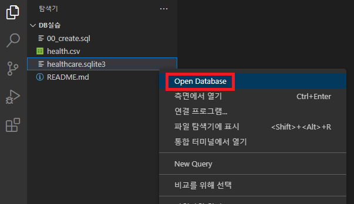
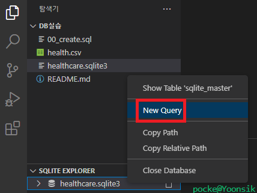
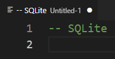
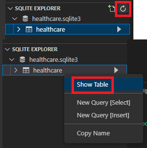
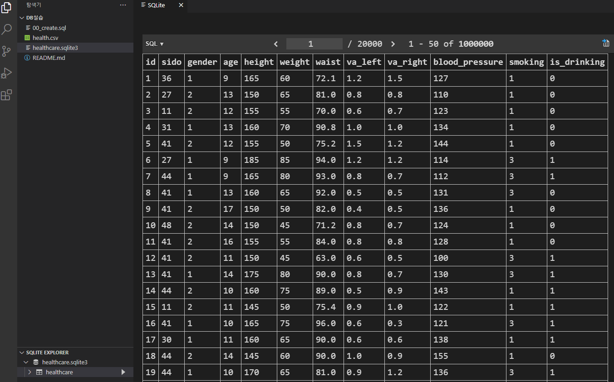
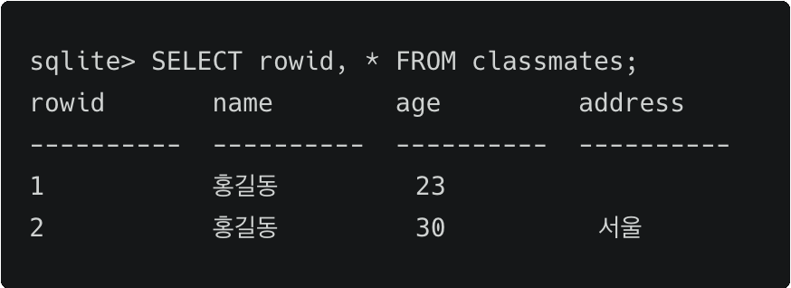

# DB (1)

## 1️⃣ DB, RDB, SQL 개념

### Database

- DB 장점
  - 데이터 중복 최소화
  - 데이터 무결성 (정확한 정보 보장)
  - 데이터 일관성
  - 데이터 독립성
  - 데이터 표준화데이터 보안유지

​    

### Table

- 열과 행의 모델을 사용해 조직된 데이터 요소들의 집합

- 열(column), 필드(field) : 각 열에 고유한 데이터 형식 지정
  
- 행(row) , 레코드(record) : 실제 데이터가 저장되는 형태
  
- 기본키 (Primary Key) 
  
  - 각 행의 고유값
  - 반드시 설정해야 하며, DB관리 및 관계설정시 활용

​    

### Schema

- DB의 자료구조, 관계, 표현방식등의 명세를 기술한 것

| column | datatype |
| ------ | -------- |
| id     | INT      |
| name   | TEXT     |

​    

### RDB

- 관계형 데이터베이스 (Relational Database)
- 키(key), 값(value)들의 관계(relation)를 표(table) 형태로 정리한 데이터베이스

​    

### RDBMS

- 관계형 데이터베이스 관리시스템
- 종류 : MySQL, PostgreSQL, SQLite, ORACLE-SQL, MS-SQL

​    

### SQL

- Structured Query Language
- RDBMS의 데이터 관리를 위해 설계된 특수목적 프로그래밍 언어
- DB 스키마 생성 및 수정
- 자료 검색 및 관리
- DB 객체 접근 조정 관리

| 분류                                               | 개념                               | 예시                                          |
| ------------------------------------------------ | -------------------------------- | ------------------------------------------- |
| DDL (Data Definition Language) <br />- 데이터 정의어   | RDB의 구조 (테이블, 스키마)를 정의 하기 위한 명령어 | CREATE<br />ALTER<br />DROP<br />TRUNCATE   |
| DML (Data Manipulation Language) <br />- 데이터 조작어 | 데이터를 저장, 조회, 수정, 삭제등을 하기 위한 명령어  | SELECT<br />INSERT<br />UPDATE<br />DELETE  |
| DCL (Data Control Language)<br /> - 데이터 제어어      | DB 사용자의 권한 제어를 위해 사용하는 명령어       | GRANT<br />REVOKE<br />COMMIT<br />ROLLBACK |

> 주석

```sql
-- 주석1
# 주석2
```

> 문자열에는 작은따옴표를 사용

```sql
mysql> insert into <테이블명>(컬럼명) values ('he said "haha"')

-- 부득이하게 문자열내에 작은따옴표 있을 경우 \(백슬래시) 사용
mysql> insert into <테이블명>(컬럼명) values ('shin\'s house')
```

​    

---

## 2️⃣ MySQL 

### SQL모드

- SQL 모드 확인

```sql
SELECT @@GLOBAL.sql_mode;  -- 전역에 활성화되어 있는 글로벌 모드 설정
SELECT @@SESSION.sql_mode;  -- 현재 세션의 설정
```

- SQL 모드 설정

```sql
SET GLOBAL sql_mode = '모드';
SET SESSION sql_mode = '모드';
```

> 모드 종류

1. STRICT_TRANS_TABLES
   - INSERT, UPDATE같은 데이터 변경문에서 MySQL이 유효하지 않거나 누락된 값을 처리하는 방식을 제어
   - 기본적으로 활성화되어 있는 모드
2. ONLY_FULL_GROUP_BY
   - GROUP BY를 할 때, 선택할 수 있는 컬럼을 제어
   - SELECT 목록이 집계되지 않은 컬럼을 참조하는 쿼리를 거부함
3. NO_ZERO_IN_DATE / NO_ZERO_DATE
   - 날짜형식에 0이 들어가는 것을 제어함 
   - 모드 활성화시 `2023-01-00` 같은 데이터 금지

​    

---

## 3️⃣ SQLite

- 서버 형태가 아닌 파일 형식으로 응용 프로그램에 넣어 사용 (비교적 가벼운 DB)
- 구글 안드로이드 OS에 기본 탑재
- 임베디드 SW에도 많이 활용
- 로컬에서 간단한 DB구성가능
- 오픈소스 프로젝트

​    

> csv파일을 table로 만들기

```sqlite
sqlite> .mode csv
sqlite> .import <csv파일명.csv> <테이블명>
sqlite> .table
-- 테이블명
```

​    

> 터미널 view 변경하기

```sqlite
.headers on
.mode column
```

​    

> SQLite 확장프로그램 다루기

1. SQLite 파일 우클릭 -> Open Database 클릭



​    

2. New Query 클릭 -> SQL명령어를 작성하는 페이지 출력



​    

3. 코드 작성후 우클릭 -> Run Query (전체 코드 실행) or Run Selected Query (선택코드만 실행)


​    

4. 새로고침 후 DB변화 확인





​    

> SQLite Data Type

1. `NULL`
2. `INTEGER`
3. `REAL` : 8byte 부동소수점
4. `TEXT`
5. `BLOB` : 입력된 그대로 저장 (별 타입 없이 그대로 저장)

​     

> SQLite Type Affinity (유형 선호도)

- 특정 컬럼에 저장하도록 권장하는 데이터 타입

| Detail                                                       | Resulting Affinity (결과 선호도) |
| ------------------------------------------------------------ | -------------------------------- |
| INT<br />INTEGER<br />SMALLINT<br />MEDIUMINT<br />BIGINT<br />UNSIGNED BIG INT<br />INT2<br />INT8 | INTEGER                          |
| CHARACTER(20)<br />VARCHAR(255)<br />VARYING CHARACTER(255)<br />NCHAR(55)<br />NATIVE CHARACTER(70)<br />NVARCHAR(100)<br />TEXT<br />CLOB | TEXT                             |
| BLOB                                                         | BLOB                             |
| REAL<br />DOUBLE<br />DOUBLE PRECISION<br />FLOAT            | REAL                             |
| NUMERIC<br />DECIAL(10, 5)<br />BOOLEAN<br />DATE<br />DATETIME | NUMERIC                          |

​    

> rowid : SQLite에서 PRIMARY KEY가 없을 경우 자동으로 증가하는 컬럼



​    

> 스키마에 id 직접 작성시 입력할 column을 명시하지 않으면 자동 입력 x

```sqlite
sqlite> CREATE TABLE classamtes (
    ...> id INTEGER PRIMARY KEY,
    ...> name TEXT NOT NULL,
    ...> age INT NOT NULL,
    ...> ); 

-- 입력
INSERT INTO classmates VALUES ('홍길동', 500, '서울');

-- 에러발생
Error: table classmates has 4 columns but 3 values were supplied

-- 해결법
1. id를 포함한 모든 value 작성
INSERT INTO classmates VALUES (1, '홍길동', 500, '서울');

2. 각 value에 맞는 column들을 명시적으로 작성
INSERT INTO classmates (name, age, address) VALUES ('김선생', 100, '미국'), ('홍길동', 500, '서울');
```
