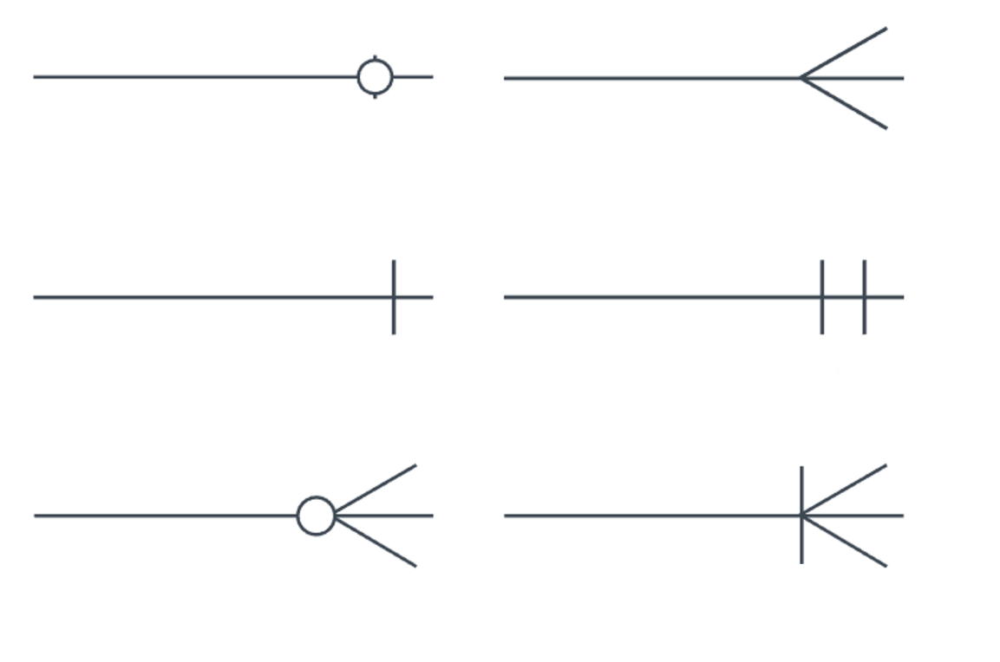
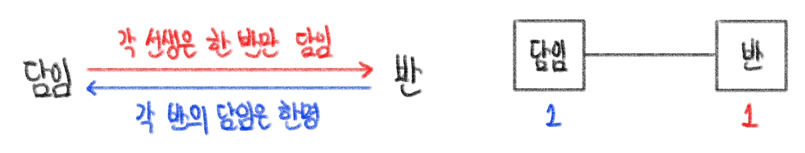
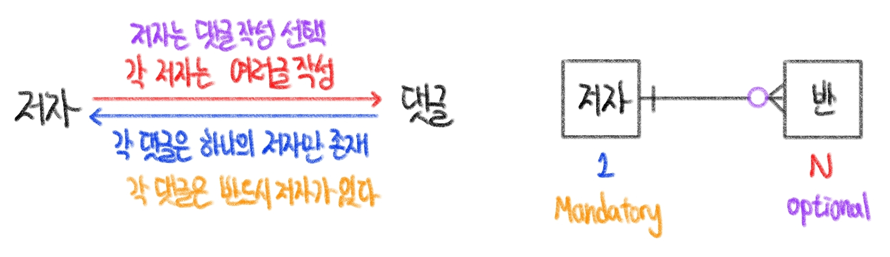
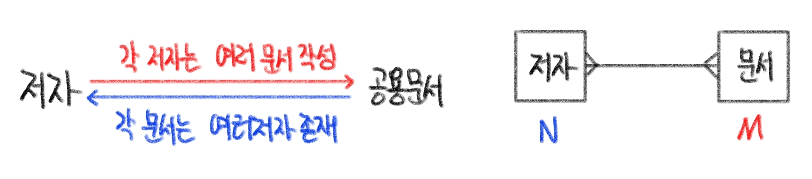

# DB (6)

## 데이터 모델링

- 현실 세계의 정보를 인간과 컴퓨터가 이해할 수 있도록 추상화하여 표현한 모델

> 데이터 모델 절차

- 요구 조건 분석 > 개념적 데이터 모델 > 논리적 데이터 모델 > 물리적 데이터 모델

​    

### 1️⃣ 요구조건 분석

- 요구사항 간 상충을 해결하고 범위를 파악 (업무파악)

​    

### 2️⃣ 개념적 데이터 모델링

- 핵심 개체(Entity) 사이의 관계를 찾아내고 표현
- `ERD`으로 표현

#### ERD

- 개체 관계 모델 (Entiity Relation Diagram)
- 구성요소
  1. 엔티티 (Entity) : 업무가 관여하는 정보 (⬜로 표현됨)
  2. 속성 (Attribute) : 엔티티가 가지는 성격, 데이터 타입과 크기 및 제약사항 지정 (⚪로 표현) 
  3. 관계 (Relationship) : 엔티티간의 관계, 연관성 (🔷로 표현)

​     

#### 식별자

- 기본키 (Primary Key [PK]) : 후보키중에서 우리가 선택한 식별자
- 후보키 (candidate Key) : 식별자가 될 수 있는 후보들
- 대체키 (alternate key) : 후보키중 기본키가 되지 못하고 남은 후보키들
- 중복키 (composite key) : 여러 엔티티를 합쳐서 식별가능하게 되는 키들

​    

#### 관계

-  카디널리티 [Cardinality] : 수적 관계

>  1 : 1 관계

> 1 : N 관계

> M : N 관계

>  옵셔널리티

- 필수 ( | )
- 선택 ( o )

​     

### 3️⃣ 논리적 데이터 모델링

- 데이터베이스 설계 프로세스의 과정
- 정보의 논리적 구조와 규칙을 명확하게 표현하는 기법 / 과정
- Crow's feet

| 개념적         | 논리적 |
| -------------- | ------ |
| Entity ⬜       | Table  |
| Attribute ⚪    | Column |
| Relationship 🔷 | PK, FK |

​    

### 4️⃣ 물리적 데이터 모델링

- 논리적 데이터 모델을 특정 DBMS의 특성 및 성능을 고려하여 물리적인 스키마를 만드는 일련의 데이터 모델
