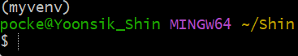
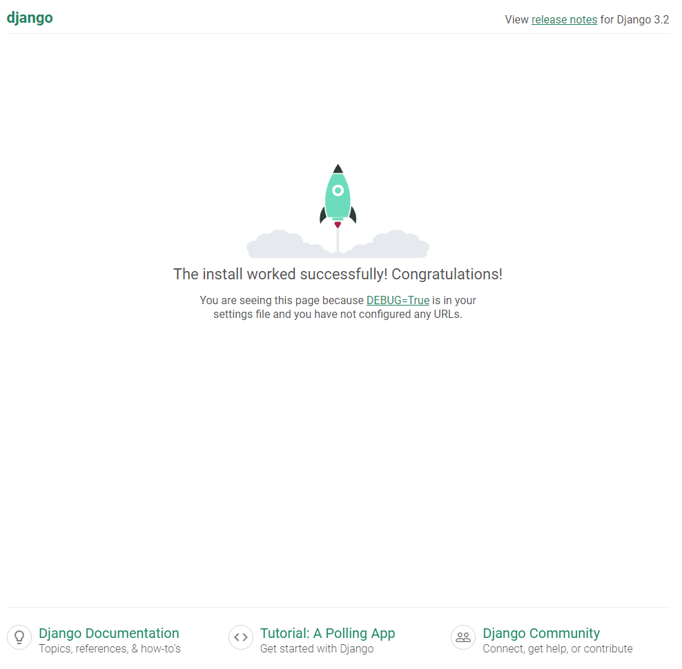

# Django 개발환경 설정 가이드

​    

## 1️⃣ 가상환경 생성 및 실행

1. 가상환경을 실행할 파일만들기

```bash
$ mkdir 파일명
$ mkdir yoonsik
```

2. 만든 파일로 이동하기

```bash
$ cd 파일명
$ cd yoonsik
```

3. 가상환경 파일 설치하기

```bash
$ python -m venv 가상환경이름
$ python -m venv myvenv
```

4. 가상환경 실행하기

```bash
$ source 가상환경이름/Scripts/activate
$ source myvenv/Scripts/activate
```

>  정상 실행시   

>  가상환경해제 
>
> ```bash
> $ deactivate
> ```

​    

---

## 2️⃣ LTS버전 설치

- 현재 4.0 버전이 릴리즈 되어있지만 안정성을 위해 3.2(LTS) 버전을 사용

```bash
$ pip install django==3.2.13
```

​    

> 설치된 패키지 확인목록 생성하기

```bash
$ pip freeze                     # 터미널상에 목록이 나타남
$ pip freeze > requirements.txt  # 목록이 들어있는 txt파일이 만들어짐
```

​    

> LTS 란?

- Long Term Support : 장기 지원 버전
- 컴퓨터 SW의 제품 수명주기 관리 정책
- 일반 버전과 달리 안정성에 중점을 둔 버전
- 일반적인 경우보다 장기간에 걸쳐 지원하도록 고안된 SW버전

​    

---

## 3️⃣ 프로젝트 생성

```bash
$ django-admin startproject 프로젝트명 .
```

- 프로젝트 이름에는 하이픈 [`-`] 사용불가
- `.` 안붙이면 파일 위치 꼬임

​    

---

## 4️⃣ Django 서버 실행

```bash
$ python manage.py runserver
```

- 실행 성공시 (http://127.0.0.1:8000/ or [localhost:8000](http://localhost:8000/))



​    

> Terminal에서 VScode로 이동하기
>
> ```bash
> $ code .
> ```