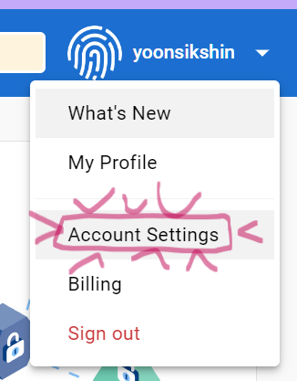
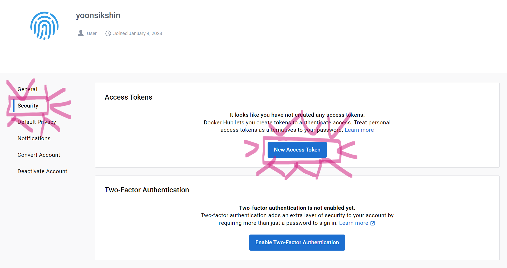

# Docker (1)

## 0️⃣ 설치

- 우분투

```bash
$ sudo apt-get update
$ sudo apt-get install curl
$ curl -fsSL https://download.docker.com/linux/ubuntu/gpg | sudo apt-key add -
$ sudo usermod -aG docker $USER # 사용자 권한부여
```

- 윈도우

>  [WSL2 설치가이드](https://www.lainyzine.com/ko/article/a-complete-guide-to-how-to-install-docker-desktop-on-windows-10/)

- 도커사이트

> [Docker](https://www.docker.com/)

​    

---

##  1️⃣ 기본개념

- 개발환경을 동일하게 맞추기 위해 사용
- 가상머신과 비슷한 개념이지만 더 빠르고, 자원을 효율적으로 사용
- 추가적으로 운영체제 설치가 필요없음

​    

###  컨테이너

- 애플리케이션을 실행하는 전체환경을 포함하는 작은 패키지
- 이미지의 구체적인 실행 인스턴스
- 소프트웨어 실행 유닛이 실행됨

​    

### 이미지

- 모든 설정 명령과 모든 코드가 포함된 공유 가능한 패키지
- 실제 코드와 코드를 실행하는데 필요한 도구를 포함
- 이미지를 정의하면 여러개의 동일한 환경의 컨테이너를 만들어 낼 수 있음 (블루프린트)
- 읽기 전용 (Read-Only)
- 스스로 실행되지 않고 컨테이너로만 실행될 수 있음

> UFS (Union File System)

- 여러 개의 레이어를 하나의 파일 시스템으로 사용할 수 있게 해주는 기능을 의미

​    

#### 이미지 생성

- 이미 존재하는 이미지 사용 (dockerhub)
- 자신만의 이미지 만들어 사용 (`Dockerfile`)

```dockerfile
# Dockerfile
FROM node # 노드가 설치된 컴퓨터 불러오기
COPY . /app  # 내 컴퓨터에서 가상 컴퓨터속 app폴더에 프로젝트 모든 내용 복사
WORKDIR /app  # 명령어를 실행할 작업 폴더 지정
RUN npm install # 이미지가 생성될 때마다 실행
ARG DEFAULT_PORT=80 # Dockerfile에서만 사용할 수 있는 환경변수 기본값 (CMD에서도 적용불가)
ENV PORT $DEFAULT_PORT # 환경변수 설정
EXPOSE $PORT # 외부포트  
CMD node server.js # 컨테이너가 실행될 때 명령어 실행
```

​    

- `FROM` : 다른 이미지에서 자신이 필요로 하는 이미지를 가져옴

```dockerfile
FROM `이미 존재하는 이미지`
```

- `WORKDIR` : 컨테이너 내의 작업 디렉토리 설정

```dockerfile
WORKDIR `도커내부 작업 디렉토리`
```

> `./` : 도커 컨테이너의 현재 작업 디렉토리를 의미

- `COPY` : 로컬파일들을 컨테이너로 복사

```dockerfile
COPY `복사될 자료` `복사된 자료를 이미지에 넣을 경로`
COPY `Host file system` `Image/container file system`
```

- `RUN` : 이미지에 명령 내리기

```dockerfile
RUN `npm 파일 설치하기`
```

- `ARG` : 환경변수 기본값 지정

```bash
ARG DEFAULT_PORT=80
```

- `--build-arg` 옵션으로 `Dockerfile`의 `ARG`에 선언된 기본값 덮어쓰기 가능

```bash
docker build --build-arg DEFAULT_PORT=8000
```

- `ENV` : 환경변수 설정

```dockerfile
# 환경변수 선언
ENV 환경변수명 환경변수값

# 환경변수 활용
명령어 $환경변수명
```

> Dockerfile에 직접저장하면 안되는 환경변수들은 런타임에만 사용되는 별도의 환경변수 파일로 이동시켜 활용함(``docker run`)

- `EXPOSE` : 컨테이너 실행시, 로컬 시스템에 특정포트를 노출

```dockerfile
EXPOSE `로컬에서 사용할 포트번호`
```

- `CMD` : 이미지가 생성될 때 실행되지 않고, 컨테이너가 시작될 때 실행됨

```dockerfile
CMD ["node", "server.js"]
```

> 배열 구조로 명령어를 입력해줘야함 

​    

#### 이미지 레이어

- 기본적으로 명령어를 다시 실행했을 때의 결과 이전과 동일하고 추론하면 캐시된 데이터를 가져옴
- 다시 실행해야 하는 항목만 다시 빌드하여 이미지 생성속도를 빠르게함
- `package.json`에서 수정된 부분이 없는 파일들도 불필요하게 다시 설치됨

```dockerfile
# Dockerfile
COPY . /app
RUN yarn install
# 위와 같은 순서로 실행시키면 소스코드의 일부만 수정해도 `yarn install` 명령어가 다시 실행되는 경우가 발생
```

> ✔️ 레이어 활용 최적화 예시

```dockerfile
# Dockerfile
FROM node
WORKDIR /app

COPY package.json /app # 패키지는 따로 관리
COPY yarn.lock /app
RUN yarn install

COPY . /app # 코드 변경시 패키지에는 영향x
EXPOSE 80 
CMD node server.js
# 위와 같이 작성하면 package.json과 yarn.lock 파일 수정시에만 `yarn install`이 다시 실행됨
```

​    

---

## 2️⃣ 주요 명령어

### 도움말

```bash
$ docker [command] --help
```


### `build`

- `Dockerfile`을 빌드하고 파일을 기반으로 자신만의 이미지 생성

```bash
$ docker build . # Dockerfile이 있는 위치에서 실행해야함
```

- `-t`

```bash
$ docker build -t `name:tag` .
$ docker build -t goals:13 .
```

- `name `: 이미지의 일반적인 이름 설정 (리포지토리)
- `tag` : 이미지의 특정화된 버전 정의

​    

### `tag`

- 이미 존재하는 이미지를 복사한 후 새로운 태그를 부여

```bash
$ docker tag `기존 name:tag` `새로운 name:tag`
```

​    

### `run`

- 이미지를 기반으로 __새 컨테이너__를 만들고, 새 컨테이너를 실행
- `-p (publish)` : 로컬의 포트로 내부 도커 포트를 엑세스 [__포트포워딩__] 

```bash
$ docker run -p `로컬포트:도커포트` `이미지ID or 이름 or 태그`
$ docker run -p 3000:80 34abda4213
```

- `-i` : 인터렉티브 모드
  - 표준 입력을 열린상태로 유지
  - `attached`모드가 아니여도 무언가를 입력할 수 있게 해줌
- `-t` : 터미널 생성
- `-it` : 터미널에 입력가능한 상태로 만들어줌

```bash
$ docker run -it `이미지ID`
```

- `--rm` : 컨테이너가 중지되었을 때 자동으로 삭제되도록 설정

```bash
$ docker run --rm `이미지ID`
```

- `--name` : 컨테이너 이름설정

```bash
$ docker run --name `커스텀 컨테이너 이름` `이미지ID`
```

- `--env / -e` : 환경변수 설정

```bash
$ docker run --env `환경변수명=환경변수값`
$ docker run -e `환경변수명=환경변수값`
```

- `--env-file` : `.env`파일 경로지정

```bash
$ docker run --env-file ./.env
```

- `--build-arg` : `Dockerfile`의 `ARG`에 선언된 기본값 덮어쓰기 가능

```bash
docker build --build-arg DEFAULT_PORT=8000
```

​     

### `ps`

- 현재 실행중인 프로세스만 표시

```bash
$ docker ps
```

- 모든 프로세스 표시

```bash
$ docker ps -a
```

​    

### `stop`

- 실행중인 컨테이너 종료

```bash
$ docker stop `컨테이너ID or 이름 or 태그`
```

​    

### `start`

- 종료된 컨테이너 실행

```bash
$ docker start `컨테이너ID or 이름 or 태그`
$ docker start -ai `컨테이너ID` # 입력값이 있을 경우
```

​    

### `create`

- run 명령어와 달리 컨테이너를 프로세스에 올리지 않고 snapshot만 생성

```bash
$ docker create -it --name 컨테이너명 이미지명
```


### `Attached vs Detached`

- `Detached`

  - 컨테이너는 실행중이지만, 터미널과는 연결되어있지 않음
  - __docker start__ 로 실행시 default
  - `docker run`에서 detached 모드로 실행

  ```bash
  $ docker run -d `컨테이너ID`
  ```

  - detached 상태에서 생성된 로그보기

  ```bash
  $ docker logs `컨테이너ID or 이름`
  $ docker logs -f `컨테이너ID or 이름` # Attached 상태로 만듬
  ```

​    

- `Attached`

  - __docker run__으로 실행시 default
  - 실행중인 컨테이너와 다시 연결하기

  ```bash
  $ docker attach `컨테이너ID or 이름`
  ```

  - 실행중지된 컨테이너 다시 실행시에 attached 모드로 실행

  ```bash
  $ docker start -a `컨테이너ID or 이름`
  ```

​    

### `images`

- 현재 가지고있는 모든 이미지 표시

```bash
$ docker images
```

​    

### `rm`

- 컨테이너 삭제
- 삭제하기전에 컨테이너가 실행종료상태여야함

```bash
# 특정 컨테이너 삭제
$ docker rm `컨테이너ID or 이름`

# 상태가 exited인 컨테이너 모두 삭제
$ docker rm $(docker ps --filter 'status=exited' -a -q)
```


### `rmi`

- 이미지 삭제
- 이미지로 생성된 컨테이너가 먼저 삭제되어야 이미지 삭제가능

```bash
# 특정 이미지 삭제
$ docker rmi `이미지ID or 이름`

# 특정 이미지명이 포함된 것만 삭제
$ docker rmi $(docker images | grep 특정이미지명)

# 특정 이미지명이 포함된 것을 제외하고 모두 삭제
$ docker rmi $(docker images | grep -v 특정이미지명)

# 이미지 전체 삭제
$ docker rmi $(docker images -q)
```

​    

### `image prune`

- 사용되지 않는 모든 이미지 제거

```bash
$ docker image prune

# 태그된 이미지를 포함하여 모든 이미지 제거
$ docker image prune -a
```

​    

### `image inspect`

- 이미지의 내부 구조를 JSON 형태로 제공

```bash
$ docker image inspect `이미지ID`
```

- `--format` : 보고 싶은 정보를 필터링

```bash
$ docker image inspect --format"{{.Os}} {{.}}" `이미지ID`
```

​     

### `image history`

- Dockerfile을 통해 이미지가 빌드되는 과정을 출력해줌

```bash
$ docker image history `이미지ID`
```

​    

### `cp`

- 실행중인 컨테이너 안에서 밖으로 or 밖에서 안으로 파일이나 폴더를 복사할 수 있음

```bash
$ docker cp `폴더or파일` `복사경로(컨테이너이름:컨테이너내부경로)`

# 로컬 >>> 도커내부
$ docker cp dummy/. aaa:/test

## 도커내부 >>> 로컬
$ docker cp aaa:/test dummy
```

​    

### 도커 내부 접속

```bash
$ docker exec -it 컨테이너ID bash
$ docker exec -it 컨테이너ID /bin/bash
```

- 화면이 bash쉘로 바뀜
- 도커가 돌아가고 있는 가상 컴퓨터의 터 미널로 들어온 것을 의미

> 컨테이너 내부확인

```bash
$ ls
$ df -h
$ hostname
$ ps -ef
$ ifconfig
$ lsns
```

​    

---

## 3️⃣ `.dockerignore`

- 기존에 있는 `node_modules` 폴더의 복사를 방지하기 위해 사용

```dockerfile
# .dockerignore
node_modules
Dockerfile
.git
```

​     

---

## 4️⃣ 이미지 공유하기

- 방법
  1. `Dockerfile` 공유하기
  2. `DockerHub` 이용하기

​    

### 1. [DockerHub](https://hub.docker.com/)

- 레포지토리 만들기

.assets/image-20230309022217005.png)

.assets/image-20230309022246843.png)

> Private는 계정당 한개만 만들수 있음

.assets/image-20230309022338250.png)

- 로그인

1. 비밀번호 입력

   - `/home/유저/.docker/config.json` 파일에 비밀번호가 그대로 노출되어있어 보안에 취약

   ```bash
   $ docker login
   Username:
   Password: 
   ```

2. Access Token 사용

   - docker hub에서 제공하는 `Access Token` 이용

   ```bash
   $ vim .access_token
   $ cat .access_token | docker login --username yoonsikshin --password-stdin
   ```

​    

.assets/image-20230828121518727.png)

.assets/image-20230828121537696.png)


- 로그아웃

```bash
$ docker logout

# 로그아웃 확인
$ docker info | grep Username
```

​    

### `push`

```bash
$ docker push `dockerhub아이디/레포이름:태그이름`
$ docker push yoonsikshin/test:tagname

# 새로운 태그를 달아서 push
$ docker image tag `태그이름:버젼` `레포이름/태그이름:버전`
```

​    

### `pull`

- 최신 이미지만 가져옴

```bash
# docker hub 이미지 다운
$ docker pull `dockerhub아이디/레포이름:태그이름`

# private registry 이미지 다운
$ docker pull `192.168.52.153:5000/레포이름:태그이름`

# 클라우드 저장소(ECR, GCR) 이미지 다운
$ docker pull `ecr.io/레포이름:태그`
$ docker pull `gcr.io/레포이름:태그`
```

- pull받지 않고 `docker run`을 실행하면 로컬에서 파일 못 찾으면, dockerhub(`docker.io`)로 접근시도
- 만약 이전에 사용한 로컬파일이 있다면 `docker run` 만으로는 최신 업데이트된 이미지를 제공받지 못함

​    

### 2. 백업 / 이전 

- 압축파일로 만들어 전달

```bash
# 이미지 파일 압축하기
$ docker image save `이미지이름:태그` | gzip > 파일명.tar.gz

# 이미지 파일 압축풀기
$ docker image load < `이미지이름:태그`
```

​    

----

## 5️⃣ Container registry

- 기업 내부에서 생성한 프로젝트 이미지는 보안상 public registry에 올리지 않고 Private Registry를 구축
- Docker hub의 `registry` 이미지를 활용하여 private docker registry 구축
- 적은 용량의 컨테이너 서비스로 사용하기 적합

```bash
$ docker pull registry
$ docker run -d \
> -v /home/ec2-user/registry_data:/var/lib/registry \
> -p 5000:5000 \
> --restart=always \
> --name=local-registry \
> registry
```


