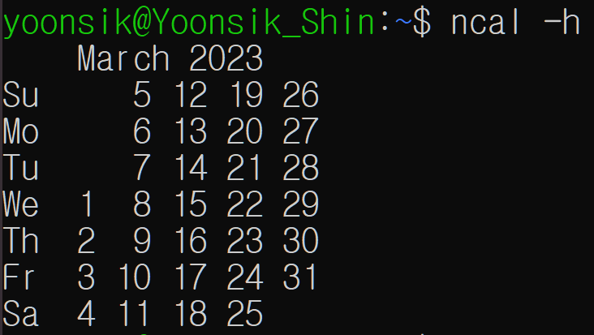
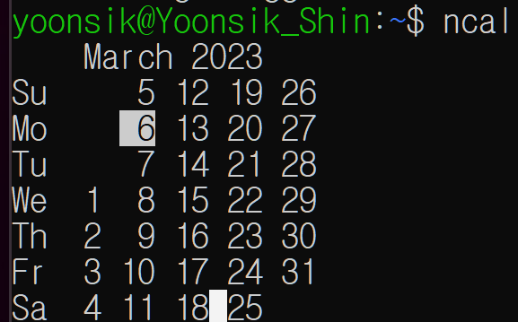
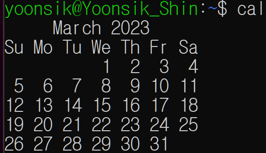

# Linux (1)

​    

## 0️⃣ Terminal

### Terminal

- 텍스트를 통해 내 기기와 상호작용할 수 있는 텍스트기반의 프롬프트
- 실제 앱인 SW
- 컴퓨터에 대한 모든 엑세스 권한같은 것을 제공

​    

### Shell

- 사용자와 컴퓨터 하드웨어 or 운영체제간의 인터페이스
- 사용자의 명령을 해석해 커널에 명령을 요청해줌
- Terminal 내에서 바꿔서 실행 가능
- `Bash`와 `Z Shell` 을 많이 씀

​    

---

## 1️⃣ Command

- 명령어
- 기본적으로 대소문자를 구분하지만, 모든 명령어에서 구분 되는 것은 아님

   

---

## 2️⃣ Arguments

```bash
$ command argument1 argument2 ...
```

- 인자, 매개변수, 피연산자
- 명령어가 작업/연산할 값을 제시해주는 것

> ncal 2023

.assets/image-20230306161207573.png)

​    

---

## 3️⃣ Options

```bash
$ command -option1option2option3 ...
# or
$ command -option1 -option2 -option3 ...
```

- 옵션을 줄때는 항상 `-`를 붙힘
- 패턴만 파악하고, 모든 옵션을 외울수는 없음



### 영단어로 된 옵션

- `--`를 사용함
- 모든 옵션이 긴 형태의 이름을 지원하지는 않음

```bash
$ date --universal
```

​      

---

## 4️⃣ 도움말 명령어

### man

```bash
$ man command
```

- 구조
  - NAME
  - SYNOPSIS
  - DESCRIPTION

- 명령어
  - `b` : 한페이지 뒤로
  - `space` or `f` : 한페이지 앞으로
  - `g` : 페이지 맨 위로 이동
  - 방향키 : 한줄 이동
  - `/` : 검색    
  - `q` : man 페이지 끄기


### type

```bash
$ type command
```

- 명령어의 종류
  - executable program (실행가능한 프로그램) - mkdir
  - build-in shell (쉘 내장) - cd, pwd
  - shell function (쉘 함수)
  - alias (별칭)


​    

### which

```bash
$ which command
```

- 명령어의 위치 반환

​    

### help

```bash
$ help command
```

- man 페이지에 존재하지 않는 것을 찾을때
- 쉘에 내장된 명령어 사용가능

​    

---

## 5️⃣ 단축키

```bash
ctrl + l === clear
ctrl + a # 행의 맨 앞으로 커서이동
ctrl + e # 행의 맨 뒤로 커서이동

alt + f # 한 단어씩 앞으로 커서 이동
alt + b # 한 단어씩 뒤로 커서 이동

ctrl + u # 커서 앞 글자를 모두지움
ctrl + k # 커서 뒤 글자를 모두지움

alt + d # 한 단어 지우기 (커서 뒤에만 지워서 단어 맨앞에서 실행해야함)
ctrl + d # 커서가 위치한 한 글자 삭제

ctrl + y # 삭제한 글을 붙여넣을 수 있음
```

​    

---

## 6️⃣ 명령어 History

- `.bash_history` 파일에 저장됨

```bash
$ history # 지금까지 사용한 명령어들의 목록을 보여줌
$ history | less # 페이지 단위로 나눠서 보여줌

$ !히스토리번호 # 해당 히스토리 명령어 실행
$ !73 
```

​    

- 기존 명령어 검색 .assets/image-20230524113307342.png)

```bash
ctrl + r  # 명령어 history 검색모드 진입
esc # 명령어 history 검색모드 해제
```

​    

- history 저장개수

```bash
$ echo $HISTFILESIZE # 저장가능 개수보기
$ echo $HISTSIZE # 현재 세션의 메모리에 저장되어있는 히스토리 수보기
```

​    

---

## 7️⃣ 날짜 시간 명령어

### date

- 현재 날짜/시간을 보여줌

```bash
$ date
```


### ncal / cal 

- 현재 월 달력을 보여줌

```bash
# 없을 경우
$ sudo apt install ncal
```





​     