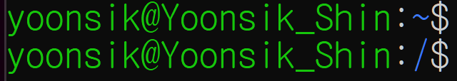

# Linux (2)

​    

## 0️⃣ 경로

> root [`/`] : 최상위 디렉토리
>
> home [`~`] : 현재 로그인한 사용자의 홈



​    

### 상대경로

- 현재 디렉토리의 위치를 기준으로 움직임

```bash
$ cd ../..  # 현재 디렉토리에서 상위로 두번 이동
```

​    

### 절대경로

- 컴퓨터의 어느 폴더에서나 사용하면 그 경로로 가짐
- 루트 디렉토리에서`/ `로 시작

```bash
/루트디렉토리/ ~ /상위디렉토리/현재디렉토리
```

​    

> 자동완성 : 두글자이상 입력 후 `Tab`

​    

> `Man` - 리눅스

- manual
- help와 같이 정보를 주는 역할
- 파일 시스템에는 영향을 주지 않음
- 파일이나 폴더를 생성하거나 디렉토리를 바꾸지 않음

```bash
$ man ls   # ls에 대한 정보를 제공하는 man페이지가 나옴
```

​    

> 플래그 flag

- 명령어 뒤에 `-`로 붙이는 추가 명령
- 함수에 전달하는 인수와 비슷한 개념 (똑같지는 않음)

```bash
$ ls -a  # 숨겨진 파일까지 보여줌
```

​    

---

## 1️⃣ 기본 명령어

### 1. 디렉토리 상태확인

#### 1-1. 홈 디렉토리 [`~`]

- 새로운 디렉토리 생성시 홈 디렉토리가 자동으로 나옴
- 홈 디렉토리는 사용자 계정 디렉토리로 계정에 따라 각각 고유한 홈 디렉토리를 가짐

​    

#### 1-2.`ls`

- List를 의미
- 현재 있는 디렉토리의 콘텐츠 나열

```bash
$ ls
$ ls -a # 숨겨진 파일도 보여줌
$ ls -l # 파일에 대해 더 자세히 나옴
$ ls -al
$ ls -al --sort=size # 파일 사이즈를 기준으로 정렬
```

​    

#### 1-3.`pwd`

- Print Working Directory
- 현재 어느 파일에 있는지 알려줌

```bash
$ pwd
```

​    

### 2. 디렉토리 변경 [`cd`]

- Change Directory
- 상위 디렉토리나 하위 디렉토리로 이동

```bash
$ cd 이동할디렉토리명   # 해당 디렉토리로 이동
$ cd ..    # 한 디렉토리 뒤로가기
$ cd ~     # 한번에 홈디렉토리로 이동
```

​    

### 3. 디렉토리 생성하기 [`mkdir`]

- make directory
- 비어있는 새 폴더를 만들어줌
- 이미 존재하는 디렉토리 만들기를 명령하면 이미 존재한다고 알려줌

```bash
$ mkdir 새디렉토리명
$ mkdir -p 상위디렉토리/하위디렉토리 # 상위디렉토리가 없으면 같이 생성됨
```

​    

### 4. 파일 만들기 [`touch`]

- 기존에 있는 파일을 입력시 접근/수정 시간만 변경됨
- ❗파일명에 공백 사용 지양

```bash
$ touch 파일명.확장자
```

​    

### 5. 파일 / 디렉토리 제거

- 휴지통으로 가는게 아니라 아예 사라짐

#### 5-1`rm`

```bash
$ rm 삭제할파일명.확장자
$ rm -d 삭제할빈디렉토리 
$ rm -i 삭제할디렉토리  # 하위폴더들의 삭제여부(y/n)를 물어봄
```

​    

#### 5-2`rmdir`

- remove directory
- 빈 디렉토리에서만 작동

```bash
$ rmdir 삭제할빈디렉토리 
```

​    

#### 5-3.`rm -rf`

- 디렉토리가 비어있지 않아도 작동
- `r` : recursive (반복) - 하위 디렉토리를 포함한 모든 파일 삭제
- `f`: force (강행) - 강제로 파일/디렉토리 삭제
- `i`: 삭제시 마다 확인메시지 표시

```bash
$ rm -rf 삭제할디렉토리/파일
```

​    

> 파일 속성보기 [file]

```bash
$ file 파일
```

​    

### 6. 파일/디렉토리  복사[`cp `]

- 복사하기

```bash
$ cp 원본 목적지/[변경할이름]
$ cp -r 복사할디렉토리명 새로복사된디렉토리명
```

- 복사 후 파일/디렉토리명 변경

```bash
$ cp 원본 목적지/변경할이름
```

​    

### 7. 파일/디렉토리 옮기기 [`mv`]

````bash
$ mv 원본 목적지 # 단일파일
$ mv 원본1 원본2 ... 목적지 # 여러파일 옮기기
$ mv Test/ .. # 상위폴더로 옮기기
````

- 옮긴 후 파일/디렉토리명 변경

```bash
$ mv 원본 목적지/변경할이름
```

