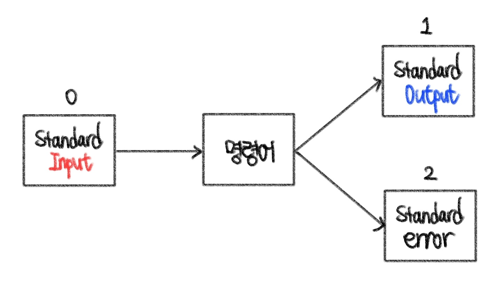

# Linux (3)

​    

## 1️⃣ 파일 보기

### cat 

- concatenate
- 파일의 내용을 터미널에 출력

```bash
$ cat 파일명
$ cat 파일1 파일2 # 첫번째 파일 내용 뒤에 두번째 파일 내용이 결합되어 출력
```

​    

### less

- cat과 유사하게 파일내용을 보여주지만, man와 유사한 형태의 페이지로 보여줌

```bash
$ less 파일명
```

​    

### tac

- cat과 유사하게 파일내용을 보여주지만, 맨아래줄부터 역순으로 내용을 보여줌
- 활용도 낮음

```bash
$ tac 파일명
```

​    

### rev

- cat과 유사하게 파일내용을 보여주지만, 문장의 단어를 역순으로 보여줌
- 활용도 낮음

```bash
$ rev 파일명
```

​    

### head / tail

- 파일 내용의 길이를 제한해서 보여줌
- 기본값 : 10

```bash
$ head 파일명
$ tail 파일명
```

- `-n` options

```bash
$ head -n 20 파일명 # 첫줄에서 20번째줄까지 보여줌
$ tail -n 15 파일명 # 마지막줄에서 15번째줄까지 보여줌

# 더 간단히 사용
$ head -20 파일명
```

- tail에만 있는 options `-f`

```bash
$ tail -f 파일명 # 마지막 부분을 출력하고 추가되는 내용을 계속 출력
```

​    

### wc

- word count
- 단어 세기 명령어
- 파일의 줄 수, 단어 수, 바이트 수를 알려줌

```bash
$ wc 파일명
>> 줄수 단어수 바이트수 파일명
```

- 옵션
  - `-l` : 줄수만 뽑기
  - `-w` : 단어수만 뽑기
  - `-c` : 바이트수만 뽑기


​    

### sort 

- 파일 자체를 변경하지는 않고 출력만 함
- 알파벳 순으로 정렬하여 파일내용을 보여줌
- 다른 정렬알고리즘과 다르게 소문자 > 대문자순으로 정렬됨

```bash
$ sort 파일명
>> a
>> A
>> b
>> B
```

- `-r` : 역순으로 정렬
- `-n` : 숫자 정렬
- `-u` : 중복값을 제외하고, 고유값만 정렬

```bash
$ sort -r 파일명
$ sort -n 파일명
$ sort -u 파일명
```

- `-k` : 데이터의 특정열을 정해서 정렬

```bash
$ sort 파일명 -k 기준이될열
$ sort 파일명 -nk 기준이될열 # 정렬기준이 숫자일 경우
```

​    

---

## 2️⃣ 표준스트림 / Redirection




### 표준출력 (Standard Output) [stdin]

- 기본적으로 명령어에 의해 터미널에 출력된 값을 말함

- 명령어의 출력값을 파일로 저장하거나, 다른 명령어의 입력값으로 활용할 수 있음

- 파일 디스크립터 : 1

- 표준출력의 redirection

  1. 표준입력을 다른 파일이 다른 명령의 결과로 바꾸는 것
  2. 결과가 출력되는 곳을 터미널창 대신 파일에 저장하는 것

- `>` 

  - 파일을 생성하고 그 파일에 명령어로 출력된 결과값을 저장함
  - 이미 파일이 있으면 지우고 덮어씀

  ```bash
  $ 명령어 > 파일명
  ```

- `>>`

  - 이미 존재하는 파일의 끝에 결과값을 추가함

  ```bash
  $ 명령어 >> 파일명
  ```

​    

### 표준입력 (Standard Input) [stdout]

- 파일 디스크립터 : 0

- 표준입력의 redirection

  - 명령줄에 인자를 입력하지 않고, 데이터를 리다이렉션하지도 않으면 표준입력을 기다리는 상태가 됨

- `<`

  - 파일의 내용을 명령어의 입력으로 전달할 수 있음

  ```bash
  $ 명령어 < 파일명
  ```

​    

### 표준오류 (Standard Error) [stderr]

- 에러정보를 전달

- 파일 디스크립터 : 2

- 표준오류의 redirection

- `2>`

  - 에러값을 해당파일에 저장함

  ```bash
  $ 에러가발생하는명령어 2> 에러로그를저장할파일
  ```

- `2>>`

  - 이미 존재하는 파일의 끝에 결과값을 추가함

  ```bash
  $ 에러가발생하는명령어 2>> 에러로그를저장할파일
  ```

​    

### 활용

- Combo

```bash
# a.txt파일의 내용을 출력한 후 b.txt파일을 만들어 그 안에 저장
$ cat < a.txt > b.txt

# c.txt와 d.txt파일 결합후 결과를 e.txt 저장, 이 때 에러가 있다면 error.txt에 에러로그 저장
$ cat c.txt d.txt > e.txt 2> error.txt
```

- `2>&1` or `&> : 표준 출력과 표준 에러를 같은 파일에 저장

```bash
$ 명령어 > 파일명 2>&1
$ 명령어 &> 파일명

# 같은 구문
$ ls -lz > a.txt 2> a.txt
$ ls -lz > a.txt 2>&1
$ ls -lz &> a.txt
```

​    

---

`*` : 경로명 확장

글로브, 글로브 패턴, 와일드카드 문자

`?` : 한 문자

`[]` : 문자의 범위

`[^]`: 부정

`~` : 홈 디렉토리 echo ~파일명  , 해당 파일이 없으면 그냥 출력


중괄호 확장 (Brace Expansion)


산술 확장 (Arithmetic Expansion)

- 수학 계산을 가능하게 해줌
- 정수 계산밖에 안되서 정확하지 않을 수 있음

```bash
$ echo $(( 수학식 ))
$ echo $((10+3))
>> 13
```


따옴표 (Qutes)

큰따옴표

- 쉘이 공백문자 보존
- `$, |, 백틱`을 제외한 나머지 특수문자를 그대로 표시

작은따옴표

- 모든 종류의 특수문자 무시


명령어 치환 (Command Substitution)

- 명령어 치환부분을 먼저 처리하고 명령어를 실행함
- 명령어 치환부분이 오류 발생시, 그 부분의 오류를 출력한 후 제외한 후 명령어가 실행됨

```bash
$ $(명령어) # 명령어가 실행된 후 리턴값으로 치환됨
$ echo Where are we? $(whoami)
```

- 또다른 방법 : 백틱 활용

```bash
$ `명령어`
```

​     

---

## 검색

### locate

- 문자열과 일치하는 파일 이름, 경로이름을 찾아냄
- 사전에 생성된 DB파일을 이용하여 하나의 파일만 검색하여 속도 빠름

```bash
$ locate 문자열

# 없을 경우
$ sudo apt-get install mlocate
```

- 정규표현식도 사용가능

```bash
$ locate star?
```

- `-i`: 대소문자 구분 무시
- `-l숫자` : 결과 개수 제한

```bash
$ locate -l5
```

- 수동으로 DB파일 업데이트

```bash
$ sudo updatedb
```

- `-e` : DB파일 업데이트 전에 변경사항 보여줌

​    

### find

- 디렉토리 전체, 컴퓨터 전체를 검색하여 locate 명령어보다 강력하지만, 실행시간이 더 오래걸림

```bash
$ find # 현재 경로를 기준으로 하위디렉토리를 포함한 모든파일 보여줌
$ find | wc -l # 현재 경로를 기준으로 모든 파일 개수 세기
```

- `-type`
- 파일만 찾을지, 디렉토리만 찾을지 정해줄 수 있음

```bash
$ find -type f # 파일만 검색
$ find -type d # 디렉토리만 검색
```

- `-name "찾을문자열"`
- 대소문자 구분 o

```bash
$ find ~ -type f -name "*.txt" # 사용자 홈디렉토리에서만
```

- `-iname "찾을문자열"` 

```bash
$ find ~ -iname # 대소문자 구분 x
```

- `-size +/-숫자단위`
- find로 나온 파일 중 파일 크기로 필터링

```bash
$ find -size +1G
```

- `-user`
- 특정 사용자가 가지고 있는 파일을 찾아줌

```bash
$ find -user 사용자명
```

- `-empty`
- 비어있는 파일 or 디렉토리를 찾아줌

```bash
$ find -empty -type f # 비어있는 파일
$ find -empty -type d # 비어있는 디렉토리
```


>  타임스탬프

1. mtime
   - 파일 내용이 마지막으로 변경된 시각
   - `ls -l`로 확인가능
2. ctime
   - 이름변경, 경로변경, 권한수정등이 일어나면 갱신
   - mtime이 변경되면 ctime도 변경됨
   - `ls -lc`로 확인가능
3. atime
   - 파일을 읽을 때 갱신
   - `ls -lu`로 확인가능


#### 타임스탬프 활용

- 부호를 사용하지않으면 정확히 숫자시간에 해당하는 것만 찾음

- 분단위

  - `-mmin +/-숫자` : 최종 수정 시각에 기반하여 검색
  - `-cmin` 
  - `-amin` : 파일 접근 시간을 기준으로 검색

  ```bash
  $ find -mmin 30 # 정확히 30분전에 수정된 파일 찾기
  $ find -mmin +30 # 수정한지 30분이 넘은 파일 찾기
  $ find -mmin +30 # 수정한지 30분이 넘지않은 수정된 파일 찾기
  ```

- 일단위 (24시간)

  - `-mtime`
  - `-ctime`
  - `-atime`

  ```bash
  $ find -atime +1 # 최소 2일전에 접근했던 파일
  ```

​    

#### Logical Operators 활용

```bash
$ find -type f -not -name "*.html" # .html로 끝나는 파일을 제외한 나머지 파일을 찾아라
```

1. `-and`
2. `-or`
3. `-not === !`

​    

#### exec  활용

- find로 찾은 것에 대해 어떤 명령을 수행
- `{}`에는 find로 찾은 것들이 들어감
- find로 찾은 것들이 하나하나씩 여러번 실행됨

```bash
$ find -exec 명령어 '{}' ';'
$ find -ok 명령어 '{}' ';' # 개별 파일에 대해 명령어 실행을 일일히 물어봄
```

- 예시

```bash
# broken이라는 문자열이 들어간 파일/디렉토리 삭제
$ find -name "*broken" -exec rm '{}' ';'

# .html로 끝나는 모든파일을 찾아, 파일 사본을 만듬
$ find -type f -nmae "*.html" -exec cp '{}' '{}_COPY' ';'
=== cp a.html a.html_COPY
    cp b.html b.html_COPY
    cp c.html c.html_COPY
```

​    

#### xargs 활용

- 표준 입력으로부터 데이터를 가져와 다른 명령어의 인자로 제공
- 인자 목록은 전달이 가능하고 표준 입력을 받지 않는 명령어에서 사용할 수 있음

```bash
# .txt로 끝나는 확장자를 가진 파일을 찾아 그 파일들을 입력으로 받아 ls를 실행
$ find -name "*.txt" | xargs ls
=== ls a.txt b.txt c.txt
```


---

## grep

```bash
$ grep "찾으려는문자열" 파일명 
$ grep "hi" hello.txt # hello.txt 파일에서 "hi"가 있는 행을 출력
```

- 파일 내부 내용을 검사하고 찾으려는 정보를 출력

- 꼭 파일이 아니여도 사용가능

- 대소문자 구분 o

- 옵션

  - `-i` : 대소문자 구분x

  - `-w` : 찾으려는 패턴과 정확히 일치하는 단어를 찾음

  - `-r` : 재귀 옵션
    - 디렉토리를 따로 지정하지 않으면 현재 위치한 디렉토리를 기준으로 안에 있는 모든 파일과 디렉토리를 검사함
    - 특정 디렉토리를 지정할 수 도 있음
  - `-c` : 패턴이 포함된 행의 수 
  - `-n` : 행 번호 알아내기
  - `-m숫자` : 표시되는결과 출력 제한

​    

### 확장 정규식 구문

- Extended Regular Expressions
- 일반적으로 정규식에서 사용되는 특수문자를 사용하면 특수문자들이 단순 글자로 사용됨
- `-E` 옵션을 추가하면 특수문자들이 정규식 문법으로 사용됨

```bash
$ grep "cat" -w test.txt 
$ grep "cats?" -w test.txt # cats? 라는 글 자체를 찾음
$ grep "cats?" -wE test.txt # ?가 정규표현식 문법으로 사용됨 (cat, cats)
```
