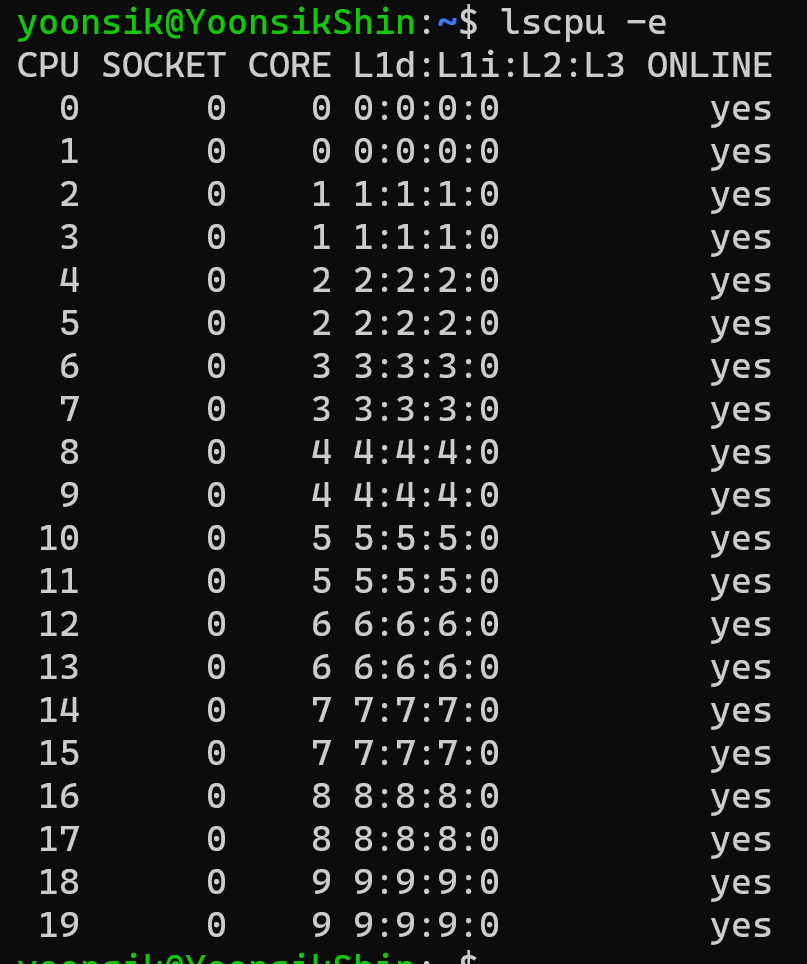
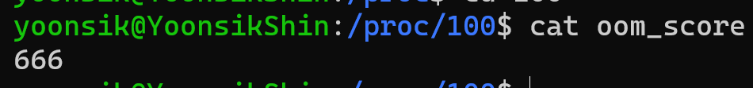

# Linux (5)

| 명령어  | 역할                                |
| ------- | ----------------------------------- |
| uptime  | 시스템 가동시간, Load Average 확인  |
| dmesg   | 커널 메시지 확인                    |
| free    | 메모리 사용현황 확인                |
| df      | 디스크 여유 공간 및 inode 공간 확인 |
| top     | 프로세스의 CPU 사용률 확인          |
| netstat | 네트워크 연결 정보 확인             |


### uptime

- 얼마나 많은 부하를 받고있는지 확인

```bash
$ uptime
```

- 시스템의 가동시간
- 로그인한 사용자수
- Load Average (서버가 받고 있는 부하 평균) 확인
  - 단위시간 (1분, 5분, 15분) 동안 R과 D 상태의 프로세스 개수
  - Load Average는 상대적인 값으로, 두 서버의 Load Average가 1이라고 해도 CPU 개수에 따라 의미가 달라짐

.assets/image-20231001161228832.png)

> Load Average가 CPU 개수보다 크다

- 현재 처리가능한 수준에 비해 많은 수의 프로세스가 존재한다는 의미
- CPU 개수보다 많은 부하를 받고 있다면 어떤 종류의 프로세스 때문인지 확인해야함

> CPU 개수 확인

```bash
$ lscpu -e
```



> R 과 D

- R
  - CPU 위주의 작업
  - R상태의 프로세스가 많다면 CPU 개수를 늘리거나, 스레드 개수를 조절해야함
- D
  - I/O 위주의 작업
  - D상태의 프로세스가 많다면 IOPS가 높은 디바이스로 변경하거나, 처리량을 줄여야함


### vmstat

> R, D 프로세스 확인

```bash
$ vmstat 1
```

- `procs` 컬럼 확인

.assets/image-20231001162601317.png)

​    

### dmesg

- 커널에서 발생하는 다양한 메시지들을 출력

```bash
$ dmesg
```

.assets/image-20231001163211162.png)

```bash
$ dmesg -T # 편하기 보는 옵션
```

.assets/image-20231001163253389.png)

> 어떤 메시지를 봐야하는가?

1. OOME (Out Of Memeory Error)

   - 가용한 메모리가 부족해서 더 이상 프로세스에게 할당해줄 메모리가 없는 상황
   - 이 상황이 되면 커널은 `OOM Killer`를 동작시켜 특정 프로세스를 선택하여 종료 시켜서 메모리를 확보함
   - 스코어 높은 프로세스를 우선적으로 종료시킴
   - `/proc/` 폴더속 프로세스에서 `cat oom_score` 명령어를 통해 스코어를 알 수 있음

   .assets/image-20231001163816262.png)

   

   - OOM 발생 여부 확인

   ```bash
   $ dmesg -TL | grep -i oom
   ```

2. SYN Flooding

```bash
$ dmesg -TL | grep -i "syn flooding"
```

- 공격자가 대량의 SYN 패킷만 보내서 소켓을 고갈시키는 공격
- 공격자가 SYN 패킷만 보내고 ACK를 보내지 않아 SYN Backlog queue에 있는 소켓 정보가 Listen Backlog로 넘어가지 못하고 계속 쌓이게 되어 queue가 꽉 차게되어 새로운 요청을 처리할 수 없게됨
- `SYN Cookie`를 사용하면 SYN 정보로 Cookie를 만들어 내려주게 되어, 따로 SYN Backlog에 저장하지 않고, ACK를 확인하여 Listen Backlog로 넘어감
- 하지만, `SYN Cookie` 사용시 `TCP Option` 헤더를 무시하기 때문에 windows Scaling등의 성능향상을 위한 옵션이 동작하지 않음
- 평상시에는 `SYN cookie`를 사용하지 않고, `SYN Flooding`상황이 의심될 때 동작을 실행함
- `SYN Flooding`공격에 의해 서비스가 불통이 되는 것보다는 느려지는게 더 나은 선택이 될 수 있음

​    

### free

- 시스템의 메모리 사용 현황 체크

```bash
$ free -m # 단위 mb 옵션
```

.assets/image-20231001193100547.png)

> free vs available

- free
  - 아무도 사용하고 있지 않은 메모리
- available
  - 애플리케이션에게 실질적으로 할당 가능한 메모리
  - available = free + buff/cache

> buff/cache

- buff : 블록 디바이스가 가지고 있는 블록 자체에 대한 캐시
- cache : I/O 성능향상을 위해 사용하는 페이지 캐시
- I/O 성능향상을 위해 사용하므로, 애플리케이션이 메모리를 필요로 하는 경우 이 영역을 해제하여 메모리를 확보함
- buff/cache가 높다면 I/O가 많이 일어나는 환경

> 페이지 캐시

- 블록 디바이스의 내용을 페이지 캐시란 곳에 저장하여 I/O 자체를 줄여줌

> Swap

- 메모리가 부족한 상황에서 사용되는 가상 메모리 공간
- 블록 디바이스의 일부 영역을 사용함
- `swap in`이 되어도 swap 영역에서 지우지 않음, 이 영역을 `swap cached`라고 부름
- swap 영역이 사용되면 메모리 참조에 I/O가 빈번해지므로 성능저하가 발생함
- swap 영역이 사용된다는 의미는 메모리가 부족하다라는 신호

​    

### VS

성능이 떨어지더라도 OOM Killer의 동작을 막고, Swap을 사용할 것인가?

성능이 떨어지지 않도록 OOM Killer로 메모리를 확보할 것인가?

최근 트렌드는 swap 영역을 비활성화함

EC2의 기본설정에도 Swap 비활성화

쿠버네티스 환경에서는 컨테이너를 빠르게 띄울 수 있기 때문에 대부분 swap 영역을 비활성화함

​    

### df

- 디스크 여유공간 및 inode 공간 확인

```bash
# h 옵션 : human readable
$ df -h 
```

.assets/image-20231001195131776.png)

- 디스크 사용량 모니터링은 기본 중의 기본 ✔️✔️
- 파일 시스템이 100%가 되면 `No space left on device` 에러 메시지가 나타남
- 심한 경우 SSH 접속도 안될 수 있음


> 디렉토리별 사용량 측정

```bash
# 루트 디렉토리에서 사용
$ du -sh ./*
```

.assets/image-20231001195557117.png)

​    

> 파일 핸들

- 디스크 공간 확보를 위해 파일을 삭제해도 공간이 확보되지 않는 경우 해당 파일을 참조하고 있는 프로세스가 파일에 대한 파일 핸들을 가지고 있으면 지워진 처리가 되지만 실제로는 지워지지 않음
- `lsof` : 파일핸들을 확인하는 명령어

```bash
$ sudo lsof | grep 파일명
```

- 참조하고 있는 프로세스를 종료하면 파일 핸들이 반환되고 실제로 파일이 지워짐

​    

> inode

- 파일 or 디렉토리에 대한 메타데이터를 저장하는 구조체
- 파일과 디렉토리의 개수를 의미함

```bash
$ df -i
```

.assets/image-20231001200314060.png)

> fs.file-max

- 동시에 파일을 몇개까지 열 수 있는가를 정의하는 값
- 커널 파라미터

​    

### top

- 프로세스 상태, CPU, 메모리 사용률 확인
- 메모리 사용률은 `free`에서도 사용할 수 있음

```bash
$ top
```

.assets/image-20231001201607709.png)

​    

> hot key 사용법

- 넘버패드 `1` : CPU별 사용량

.assets/image-20231001201743344.png)

- `us`
  - user를 의미
  - 프로세스의 일반적인 CPU 사용량
  - us가 높다면 CPU를 많이 사용하고 있다는 의미 > 더 좋은 CPU를 가진 서버로 변경
- `wa`
  - waiting을 의미
  - I/O 작업을 대기할 때의 CPU 사용량
  - wa가 높다면 I/O 작업이 많다는 걸 의미 > 더 좋은 블록 디바이스를 가진 서버로 변경
- `d` : 인터벌 변경 (default : 3s)

.assets/image-20231001201857682.png)


> 프로세스 상태

- `D`
  - uninterruptible sleep (I/O)
  - uptime의 Load Average에 포함 (vmstat의 b)
  - I/O 대기상태
- `R`
  - running (CPU)
  - uptime의 Load Average에 포함
- `S`
  - sleeping
  - 작업중이 아닌 프로세스
- `Z`
  - zombie
  - 따로 성능에 해를 끼치지 않지만 이슈를 이르킬 가능성이 있음

> zombie 프로세스

- 부모 프로세스가 죽었는데도 살아있는 자식 프로세스
- 시스템 리소스를 사용하지는 않지만, PID 고갈을 일으킬 수 있음

```bash
$ sudo sysctl -a | grep -i pid_max
```

.assets/image-20231001204351138.png)

- `Kernel.pid_max`라는 파라미터를 통해 동시에 존재할 수 있는 프로세스수 를 확인할 수 있음
