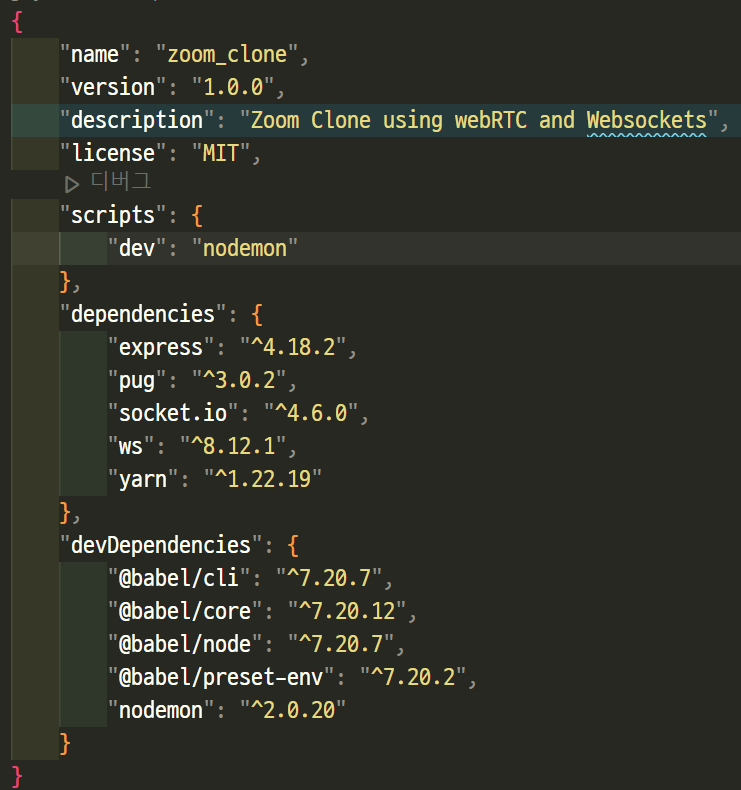

# node.js (1)

## 1️⃣ 기본개념 

### Node.js

- JavaScript는 브라우저에서만 실행 가능했었음
- node.js를 통해 로컬 환경에서 JavaScript를 실행할 수 있게 해줌
- 크롬의 V8 엔진으로 만들어진 자바스크립트 런타임
- Non-blocking I/O : 모든 요청을 접수받고 빨리 완료되는 것부터 처리
- SNS, 채팅서비스등에 많이 사용
- 수학연산, 이미지 처리등의 라이브러리가 부족하고 처리속도가 떨어지는 단점이 있음


### npm

- Node Package Manager  ([npmjs.com](https://www.npmjs.com/))
- 노드 기반에서 실행될 수 있는 모듈을 관리

    ```bash
    $ npm init # package.json 자동생성
    $ npm install  # node_modules 파일이 없을 때 다시 설치
    ```


### package.json

- 어떤 라이브러리를 설치했는지 기록 



- `dependencies` : 실행에 필요한 라이브러리 모음
- `devDependencies` : 개발시에만 적용되는 라이브러리 모음


### export / import 설정

```js
{
  "name": "파일명",
  "version": "1.0.0",
  "main": "index.js",
  "license": "MIT",
  "type": "module" ✔️✔️ // 입력해주기
}
```


###  node_modules

- 라이브러리에 필요한 자료들을 담는 공간

​    

### yarn

- npm 개량판
- 페이스북이 개발

```bash
$ npm install yarn  # yarn 설치
$ yarn init  # package.json 자동생성
$ yarn install  # node_modules 파일이 없을 때 다시 설치
```


### node 파일실행

- 실행하는 파일의 상위폴더에서 입력해야함

```bash
$ node 파일명.js
$ node index.js
```


### Nodemon

- 서버를 자동으로 재시작해줌

```bash
# 설치
$ npm install -g nodemon
$ yarn add global nodemon

# 실행
$ nodemon server.js

# package.json에 아래 내용 추가
{
  ...
  "scripts": {  
    "dev": "nodemon index.js"
  }
  ...
}
```

​    

---

## 2️⃣ GraphQL

### Rest vs GraphQL

| Rest-API                     | GraphQL-API                  |
| ---------------------------- | ---------------------------- |
| 모든 데이터를 받아야함       | 필요한 데이터만 받을 수 있음 |
| https://google.com/profile/1 | profile(1)                   |
| axios 사용                   | apollo-client 사용           |

> CRUD

|      | axios  | apollo-client |
| ---- | ------ | ------------- |
| 생성 | POST   | MUTATION      |
| 수정 | PUT    | MUTATION      |
| 삭제 | DELETE | MUTATION      |
| 조회 | GET    | QUERY         |

```js
// axios
import axios from 'axios'

const result = axios({
  method: 'post',
  url: API_URL
})

// apollo-client
import { useMutation, useQuery } from '@apollo/client'

const result = useMutation()
const result = useQuery()
```

​    

### apollos-server 설치

```bash
$ yarn add @apollo/server graphql
```

​    

### 스키마 정의

- rest-api의 swagger와 유사

```js
import { ApolloServer } from '@apollo/server';
import { startStandaloneServer } from '@apollo/server/standalone';

const typeDefs = `
  type Book {
    title: String
    author: String
  }
  
  type Query {
    books: [Book]
  }
`;
```

​    

### resolver 정의

```js
const resolvers = {
  Query: {
    books: () => 'hello',
  },
};
```

- express와 비교

```js
app.get('/', (req, res) => {
  res.send()
})
```

​    

### Apollo Server 인스턴스 만들기

```js
const server = new ApolloServer({
  typeDefs,
  resolvers,
});

const { url } = await startStandaloneServer(server, {
  listen: { port: 4000 },
});

console.log(`🚀  Server ready at: ${url}`);
```

- express와 비교

```js
app.listen(4000)
```

​    

### API 만들기 정리

```js
const resolvers = {
  Mutation: {
    createBoard: (parent, args, context, info) => {}
  }
}
```

- `parent` : 부모의 type resolver에서 반환된 결과를 가진 객체
- `args` : 쿼리 요청시 전달된 parameter를 가진 객체
- `context` : GraphQL의 모든 resolver가 공유하는 객체, 로그인 인증 / DB 접근권한 등에 사용
- `info` : 명령 실행 상태 정보를 가진 객체

> 사용하지 않는 매개변수는 `_`(언더바)로 선언

```js
import { ApolloServer } from "@apollo/server";
import { startStandaloneServer } from "@apollo/server/standalone";

// 타입 정의
const typeDefs = gql`
	
	type Query {
		
	}

	type Mutation {
	
	}
`

const resolvers = {
  Query: {
    fetchBoards: () => {}
  }
  
  Mutation: {
  	createBoard: (_, args) => {
		// 1. 데이터를 등록하는 로직 => DB에 접속해서 데이터 저장하기
    	// 2. 저장 결과 응답 주기
    	return '성공'
        }
	}
}
```

​    

---

## 3️⃣ 이메일 템플릿 생성함수 만들기

### 토큰만들기

- 실무규칙1 : 하나의 함수는 하나의 기능만

```js
// 간단한 6자리 토큰 만들기
function getToken(digit) {
  // 검증추가
  if (digit === undefined || digit === null) {
    console.error('유효한 개수를 입력해주세요.')
    return
  }  
  if (digit <= 0) {
    console.error('1보다 큰 수를 입력해주세요.')
    return
  }
  if (digit > 10) {
    console.error('10보다 작은 수를 입력해주세요.')
    return
  }
    
  const result = String(Math.floor(Math.random() * (10**digit))).padStart(digit, '0')
  console.log(result)
}

getToken(6)
```

​    

### 휴대폰으로 토큰 전송하기 [퍼사드 패턴 (Facade)]

```js
// index.js
import { checkValidationPhone, getToken, sendTokenToSMS } from './phone.js'

function createTokenOfPhone(phoneNumber, digit) {
  // 1. 핸드폰번호 자릿수 맞는지 확인하기
  if (!checkValidationPhone(phoneNumber)) {
    return
  }

  // 2. 핸드폰 토큰 6자리 만들기
  const token = getToken(digit)
  
  // 3. 핸드폰으로 토큰 전송하기
  sendTokenToSMS(phoneNumber, token)
} 

createTokenOfPhone('01012345678', 5)
```

```js
// phone.js
// 검증
export function checkValidationPhone(phoneNumber) {
  if (phoneNumber.length !== 10 && phoneNumber.length !== 11) {
    console.error('핸드폰 번호를 제대로 입력해주세요.')
    return false
  } else {
    return true
  }
}

// 간단한 6자리 토큰 만들기
export function getToken(digit) {
  if (digit === undefined || digit === null) {
    console.error('유효한 개수를 입력해주세요.')
    return
  }  
  if (digit <= 0) {
    console.error('0보다 큰 수를 입력해주세요.')
    return
  }
  if (digit > 10) {
    console.error('10보다 작은 수를 입력해주세요.')
    return
  }

  const result = String(Math.floor(Math.random() * (10**digit))).padStart(digit, '0')
  return result
}

// 전송
export function sendTokenToSMS(phoneNumber, token) {
  console.log(phoneNumber + ' 번호로 인증번호 ' + token + '을 전송합니다')
}
```

​    

### 유효성검사

```js
// index.js
import { checkValidationEmail, getWelcomeTemplate, sendTemplateToEmail } from "./email.js";

function createUser(user) {
  // 1. 이메일이 정상인지 확인 (1-존재여부, 2-'@'포함여부)
  const isValid = checkValidationEmail(user.email)
  if (isValid) {
    // 2. 가입환영 템플릿 만들기
    const mytemplate = getWelcomeTemplate(user)

    // 3. 이메일에 가입환영 템플릿 전송
    sendTemplateToEmail(user.email, mytemplate)
    console.log('전송이 완료되었습니다')
  }
}
```

```js
// email.js
import { getToday } from "./utils.js"

// 1. 이메일이 정상인지 확인 (1-존재여부, 2-'@'포함여부)
export function checkValidationEmail(email) {
  if (email === undefined || !email.includes('@')) {
    console.log('이메일을 제대로 입력해 주세요.')
    return false
  }
  return true
}

// 2. 가입환영 템플릿 만들기
export function getWelcomeTemplate({name, age}) {
  const result = `
    <html>
      <body>
        <h1>${name}님 가입을 환영합니다.</h1>
        <hr />
        <div>이름 : ${name}</div>
        <div>나이 : ${age}세</div>
        <div>가입일 : ${getToday()}</div>
      </body>
    </html>
  `
  return result
}

// 3. 이메일에 가입환영 템플릿 전송
export function sendTemplateToEmail(email, mytemplate) {
  console.log(`${email}이메일주소로 ${mytemplate}를 전송합니다.`)
}
```

​    

---

## 4️⃣ SMS 전송

>  [Coolsms](https://console.coolsms.co.kr/dashboard) 활용 

```bash
$ yarn add coolsms-node-sdk
```

```js
import coolsms from'coolsms-node-sdk'

export async function  sendTokenToSMS(phoneNumber, token) {
  const MySms = coolsms.default
  const messageService = new MySms(process.env.SMS_KEY, process.env.SMS_SECRET)
  const result = await messageService.sendOne({
    to: phoneNumber,
    from: process.env.SMS_SENDER,
    text: `[문자메시지 전송 테스트중] 인증번호는 ${token} 입니다.`
  })
}
```

