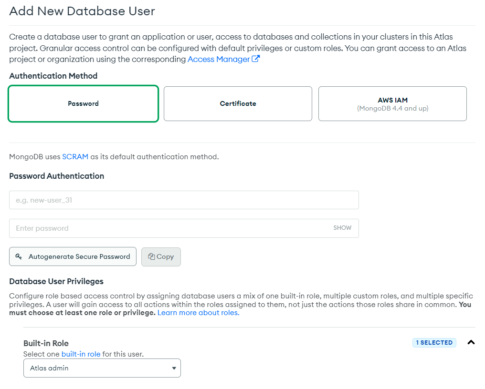

# Node.js (2) 

​    

## 0️⃣ MongoDB 개념

- NoSQL의 한 종류

- 스키마 정의 x, SQL문 x

- JOIN 연산이 어려움

- 스케일링이 쉬움

- Key-value, Document 모델을 차용

  

- database : 폴더
- collection : 파일

.assets/db_collection.jpg)

​    

## 1️⃣ [MongoDB Atlas](https://www.mongodb.com/) 설정

### Database Access

- DB접속용 ID, Password 생성

.assets/image-20230323000150509.png)



​    

### Network Access

- DB에 접속할 수 있는 IP 정의
- `0.0.0.0/0` 이나 `Allow access from anywhere`

.assets/image-20230323000451587.png)

.assets/image-20230323000522159.png)

​    

### Database

- `Connect` 클릭

.assets/image-20221218134729332.png)

- `connect your application` 선택

.assets/image-20221218134738740.png)

​    

---

## 2️⃣ 기본설정

### 설치

```bash
$ npm install mongodb
$ npm install mongodb@3.6.4  # 버전
$ yarn add mongodb
```

​    

### 기본세팅

```js
import { MongoClient } from 'mongodb'

// URL에 DB Access 메뉴에서 만든 ID, PW 입력필요
const uri = "mongodb+srv://yoonsik-Shin:<password>@cluster0.yezylr1.mongodb.net/<DB명>?retryWrites=true&w=majority";

MongoClient.connect(uri, { useNewUrlParser: true, useUnifiedTopology: true }, (error, client) => {
    if (error) {
        return console.log(error);
    }
    let db = client.db('DB명');
    app.listen(8080, () => {
        console.log("listening on 8080");
    });
});
```

.assets/image-20221218135110983.png)

​    

---

## 3️⃣ DB 데이터 다루기

### EJS

```bash
$ npm install ejs
$ yarn add ejs
```

- 파일확장자 : `.ejs`
- ejs 파일들은 `views`폴더 안에 생성해야함
- ejs문법을 이용하여 Server 데이터 삽입 가능

```ejs
<!-- HTML 중간에 서버데이터 사용하기 -->
<%= 변수이름 %>
```

```js
// 상단에 등록
app.set('view engine', 'ejs');

app.get('/', (request, response) => {
  // DB에 저장된 col이라는 collection안의 모든 데이터 꺼내기
  db.collection('col').find().toArray((error, result) => {
    console.log(error);
    response.render('*.ejs', { result : result });
  });
})
```

​    

> 반복문 사용해보기

```ejs
<% for (let i = 0; i < data.length; i++) { %>
	array[i]
<% } %>
```

​    

> component 형식으로 만들기

- 네비게이션바 : views/nav.html

```ejs
<%- include('nav.html') %>
```

​    

### 데이터 저장

```js
db.collection('').insertOne()
```

```js
// 기본
db.collection('collection명').insertOne('저장할데이터(Object자료형)', (에러, 결과) => {
  console.log('저장완료');
});

// 예시1
db.collection('post')
  .insertOne({ _id : 100, 이름 : 'John' }, (error, result) => {
	    console.log('저장완료'); 
});
```

​    

### 데이터 불러오기

```js
db.collection('').find()
db.collection('').findOne()
```

```js
// 예시1
app.get('/', (req, res) => {
  db.collection('collection명')  // 해당 collection에서 속한
    .find() // 모든 데이터를 찾아
    .toArray((error, result) => {  // Array 자료형으로 가져옴
    	console.log(result)
    	
    	// result값을 post라는 이름으로 ejs파일에 보내줌
    	res.render('파일.ejs', { posts: result })
  })
})

// 예시2 - 수정(동적) 페이지
app.get('/edit/:id', (req, res) => {
  db.collection('').findOne({_id: parseInt(req.params.id)}, (error, result) => {
    res.render('edit.ejs', { post: result })
  })
})
```

​    

### 데이터 수정

```js
db.colleciton('').updateOne({'바꾸고싶은 값'}, { <operator>: {'새롭게 바뀔값'} }, 
	(error, result) => { // 끝나면 실행할 함수
})

db.colleciton('').updateOne({name: 'a'}, { $set: {count: 1} }, (error, result) => {})
```

>operator

1. `$set` : 변경 

```js
{ $set : {totalPost : 바꿀값} }
```

2. `$inc` : 증가

```js
{ $inc : {totalPost: 기존값에 더해줄 값} }
```

3. `$min` : 기존값보다 적을때만 변경

4. `$rename` : key값 이름변경

​    

### auto increment

- DB에 항목을 추가할 때마다 `_id`를 자동으로 1증가 시켜 저장
- MongoDB는 해당기능이 없어 직접 구현해야함

.assets/image-20230323012516743.png)

.assets/image-20230323012710613.png)

```js
app.post('/', (req, res) => {
  res.send();
  db.collection('counter').findOne({name : '게시물수'}, (error, result) => {
    // 현재 글 개수 불러오기
    let totalPostCount = result.totalPost
    
    // 새로운 글 발행 
    const post = {
      _id : totalPostCount + 1,
      writer: req.user.id
    }
    
    db.collection('post').insertOne(post, (error, result) => {
      console.log(result)
      
      // counter라는 collection에 있는 totalPost값을 1 증가
      db.collection('counter').updateOne({ name:'개시물개수' }, { $inc : {totalPost:1}}, 
      (error, result) => {	
        if (error) { return console.log(error) }
      })
    })
  })
})
```

​    

### 데이터 삭제

```js
db.collection('').deleteOne({}, () => {})
```

```js
app.delete('/', (req, res) => {
  req.body._id = parseInt(req.body._id)  // 형변환
  db.collection('').deleteOne({
     _id: req.body._id, 
     writer: req.user._id 
  	}, (error, result)=> {
  })
})
```

​    

### method-override

- method-override 라이브러리
- HTML에서 PUT/DELETE 요청을 할 수 있게 해줌

```bash
$ npm install method-override
$ yarn add method-override
```

```js
// server.js
import { methodOverride } from 'method-override'
app.use(methodeOverride('_method'))
```

```ejs
<!-- ejs -->
<form action='/edit?_method=PUT' method="POST"></form>
```

2. AJAX 이용


---

## 4️⃣ css파일 넣기

- public이라는 폴더 생성 후 그안에 생성 : `public/main.css`

```js
// static 파일을 보관하기 위해 public 폴더 사용을 정의
app.use('/public', express.static('public'));
```
