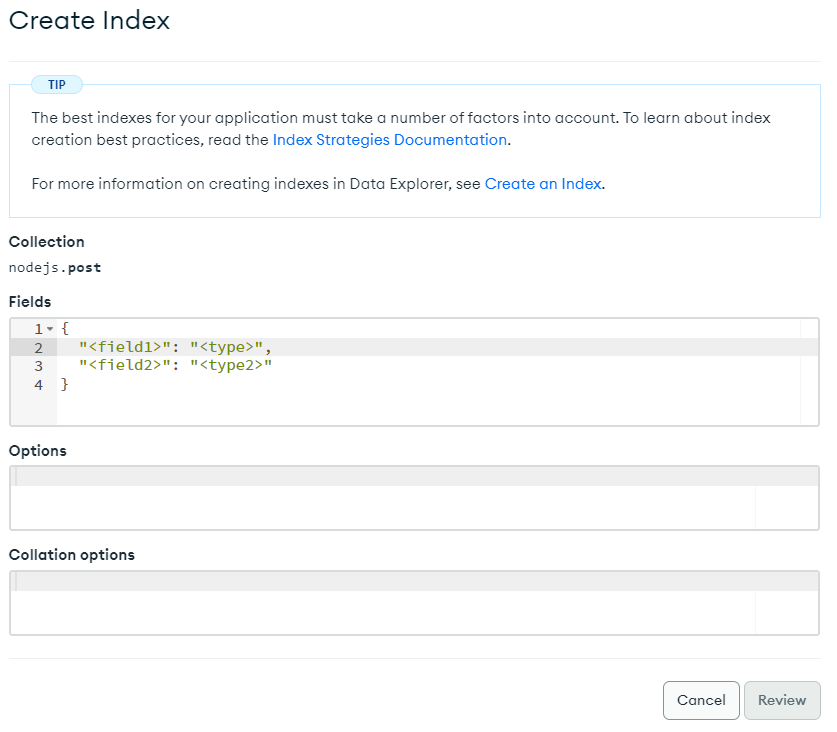

# Node.js (3) 


## 1️⃣ 로그인 (Session 방식)

### 설치 

```bash
$ npm install passport passport-local express-session
$ yarn add passport passport-local express-session
```

​    

### 기본세팅

```js
// server.js
import passport from 'passport'
import { Strategy as LocalStrategy } from "passport-local";
import session from 'express-session';

// 미들웨어
app.use(session({secret: '비밀코드', resave: true, saveUninitialized: false}));
app.use(passport.initialize());
app.use(passport.session());
```

> `app.use()` : 미들웨어, 요청-응답 중간에서 실행되는 코드

​    

### Strategy

```js
// Strategy
passport.use(new LocalStrategy({
  usernameField: 'id',  // form태그에서 'id'라는 name속성을 가진 input의 값
  passwordField: 'pw',  // form태그에서 'pw'라는 name속성을 가진 input의 값
  session: true,  // 로그인 후 세션을 저장할 것인지 여부
  passReqToCallback: true,  // 다른 정보도 검증을 원할시 사용
}), (req, inputID, inputPW, done) => {  // 회원 검증 로직
  db.collection('회원정보 저장된 collection명').findOne({id: inputID}, (error, result) => {
    if (error) return done(error)
    if (!result) return done(null, false, { message: '존재하지 않는 ID입니다.' })
    if (inputPW == result.pw) return done(null, result)
	return done(null, false, { message: '비밀번호가 일치하지 않습니다.' })
  })
})
```

> `done('서버에러', '성공시 사용자의 DB데이터', [에러메시지])`

​    

### 로그인 API

```js
app.post('/login', passport.authenticate('local', { // 회원 인증 과정
  failureRedirect: '/fail'  // 회원인증 실패시 이동할 페이지
}), (req, res) => {
  res.redirect("/");
})

// 세션을 저장하는 코드 (로그인 성공시 실행)
passport.serializeUser((user, done) => {
  done(null, user.id)
}) 
```

​    

- 마이페이지

```js
// 로그인 여부 확인 미들웨어 함수
const isLogin = (req, res, next) => {
  if (req.user) { 
    next() 
  } else {
    res.send('로그인해주세요.')
  }
}

// req.user에 유저정보가 담겨있음
app.get('/mypage', isLogin, (req, res) => {
  response.render("mypage.ejs", { user: req.user });
})

// 로그인한 유저의 개인정보를 DB에서 찾는 역할
passport.deserializeUser((id, done) => {
  db.collection('login').findOne({ id: id }, (error, result) => {
     done(null, result)
  })
})
```

​    

---

## 2️⃣ 환경변수

```bash
$ npm install dotenv
$ yarn add dotenv
```

```js
// server.js
import dotenv from "dotenv";
dotenv.config();

const URI = process.env.URI
```

```yaml
# .env
URI=http://~~
```

​     

---

## 3️⃣ 검색

### Query string

- Get요청시 데이터 전달
- 문제점 : 정확히 일치하는 것만 찾아줌

```http
?key1=value1&key2=value2
```

```html
<input  id="search-input">
<button  id="search">검색</button>

<script>
	document.querySelector('#search').addEventListener('click', () => {
    let inputValue = document.querySelector('#search-input').value
    window.location.replace(`/search?value=${inputValue}`)
  })
</script>
```

```js
// 서버에서 query string 확인
app.get('/search', (req, res) => { 
  console.log(req.query)  // object형태로 반환
})
```

​    

### Indexing

- 인덱싱만 되어있으면 binary search를 활용하여 빠르게 검색가능 
- MongoDB Atlas내 기능 사용

​    

####  text search

- 띄어쓰기 검색시 `or` 연산 적용 (`신발 양말` => 신발이나 양말이라는 단어가 포함된 항목만)
- 단어 앞에 `-`붙이면 그 단어를 제외하고 검색 (`신발 -양말` => 양말이라는 단어가 포함되지 않는 신발을 검색)
- `""`를 사용하면 정확하게 일치하는 항목만 검색 (`"신발 양말"` => `신발 양말`이라는 덩어리가 포함된 항목 검색)
- 영어가 아니면 정확성이 떨어짐 (`글쓰기` 검색시 `글쓰기입니다!`는 못찾아줌)

.assets/image-20230323212813799.png)



- Fields

```json
{
  "인덱싱할 항목(문자열)": "text", 
  "인덱싱할 항목(오름차순)": 1,  
  "인덱싱할 항목(내림차순)": -1
}
```

- 등록된 Indexing 활용

```json
{
  "text": "text"
}
```

```js
app.get('/search', (req, res) => {
  db.collection('post').find({ $text: { $search: req.qeury.value } }).toArray((error, result) => {
    res.render('search.ejs', { posts: result })
  })
})
```


#### Search index

- text search의 단점 보완

.assets/image-20230323214937850.png)

.assets/image-20230323215055678.png)

.assets/image-20230323215134822.png)

```js
app.get('/search', (req, res) => {
  const searchCondition = [
    {
      $search: {
        index: 'titleSearch'  // 내가 만든 인덱스명
        text: {
        	query: req.query.value // 찾을 값
        	path: [] // 값이 포함되었는지 알고싶은 항목
      	}
      }
    }
  ]
  
  db.collection('post').aggregate(searchCondition).toArray((error, result) => {
    res.render('search.ejs', { posts: result })
  })
})
```

> aggregate

- 검색조건을 여러개 넣을 수 있게 해줌

```js
aggregate([{검색조건1}, {검색조건2}, ...])
```

```js
const searchCondition = [
    {
      $search: {
        index: 'titleSearch'  // 내가 만든 인덱스명
        text: {
        	query: req.query.value // 찾을 값
        	path: [] // 값이 포함되었는지 알고싶은 항목
      	}
      }
    },
    { $sort: { _id: 1} },  // _id를 오름차순으로 정렬
    { $limit: 10 },  // 맨위의 10개 항목만 보여줌
    { $project: { _id: 1, title: 0, score: { $meta: "searchScore" } } },  // _id는 보여주고, title은 제외
  ]
```

- `$sort` : 결과를 정렬해서 가져옴
- `$limit` : 결과의 수를 제한해서 보여줌
- `$project` :  찾아온 결과중에 원하는 항목만 보여줌 (`0: 제외 / 1: 포함`)
- `score: { $meta: "searchScore" }` : mongoDB가 검색어와 검색된 정보의 관련정도를 나타내는 수치

​    

---

## 4️⃣ Route 파일관리

- `routes` 폴더 생성

```js
// routes/shop.js
import { Router } from "express";

const router = Router();

// 해당파일의 router들에만 미들웨어 모두 적용
router.use((req, res, next) => {
  next()
})

router.get("/a", (req, res) => {
    res.status(201).send("a");
});
router.get("/b", (req, res) => {
    res.status(201).send("b");
});

export default router;
```

```js
// server.js
import indexRouter from './routes/index.js'

app.use('/공통으로 사용되는 키워드', '파일명Router')
app.use('/shop/detail', shopRouter)  // ('/common'으로 시작하는 라우트들, 'shop.js' 파일)
```

​    

---

## 5️⃣ 이미지 업로드

```html
<form method='post' action="/upload" enctype="multipart/form-data">
  <input type='file' name='profile'>
</form>
```

```js
app.get('/upload', (req, res) => {
  res.render('upload.ejs')
})
```

​    

### multer

```bash
$ npm install multer
$ yarn add multer
```

- `public/image` 폴더안에 저장

```js
import multer from 'multer';

// HDD에 저장
const storage = multer.diskStorage({
  // public/image 폴더안에 이미지 저장
  destination: (req, file, cb) => { 
  	cb(null, './public/image')
  },
  // 저장하는 이미지 파일명 설정
  filename: (req, file, cb) => {
    cb(null, file.orginalname)
  },
  // 파일 형식(확장자) 필터
  filefilter: (req, file, cb) => {
    
  },
  limits:
}) 

const upload = multer({ storage })

// 단일 파일업로드
app.post('/upload', upload.single('input의 name속성명'), (req, res) => { })

// 다중 파일업로드
app.post('/upload', upload.array('input의 name속성명', '받을 최대갯수'), (req, res) => { })

// 업로드된 파일보내기
app.get('/image/:imgName', (req, res) => {
  res.sendFile(`${__dirname}/public/image/${req.params.imgName}`)
})
```

```js
 // RAM에 저장
const storage = multer.memoryStorage({})
```

​    

