# Bootstrap

- CSS 프레임워크

>  [Getbootstrap](https://getbootstrap.com/)

​    

## 1️⃣ 적용법

1. CDN 활용

- Content Delivery(Distribution) Network
- 컨텐츠(CSS, JS, Image, Text 등)을 효율적으로 전달하기 위해 여러 노드에 가진 네트워크에 데이터를 제공하는 시스템

```css
/* CSS */
<link href="https://cdn.jsdelivr.net/npm/bootstrap@5.1.3/dist/css/bootstrap.min.css" rel="stylesheet" integrity="sha384-1BmE4kWBq78iYhFldvKuhfTAU6auU8tT94WrHftjDbrCEXSU1oBoqyl2QvZ6jIW3" crossorigin="anonymous">
```

```html
<!-- JS -->
<script src="https://cdn.jsdelivr.net/npm/bootstrap@5.1.3/dist/js/bootstrap.bundle.min.js" integrity="sha384-ka7Sk0Gln4gmtz2MlQnikT1wXgYsOg+OMhuP+IlRH9sENBO0LRn5q+8nbTov4+1p" crossorigin="anonymous"></script>

<!-- 추가 -->
<script src="https://cdn.jsdelivr.net/npm/@popperjs/core@2.10.2/dist/umd/popper.min.js" integrity="sha384-7+zCNj/IqJ95wo16oMtfsKbZ9ccEh31eOz1HGyDuCQ6wgnyJNSYdrPa03rtR1zdB" crossorigin="anonymous"></script>
<script src="https://cdn.jsdelivr.net/npm/bootstrap@5.1.3/dist/js/bootstrap.min.js" integrity="sha384-QJHtvGhmr9XOIpI6YVutG+2QOK9T+ZnN4kzFN1RtK3zEFEIsxhlmWl5/YESvpZ13" crossorigin="anonymous"></script>
```

2. 파일 다운로드 후 활용

​        

----

## 2️⃣ 그리드 (Grid)

- 공간 분배를 화면 크기에 따라 달라지게 하는 반응형 레이아웃
- `flexbox`로 제작되어 모든 속성 사용가능 (justify, align)
- 컨테이너 안에서만 작동
- `row`(행) 클래스를 사용하여 행을 만들어야함
- 부트스트랩의 모든 행에는 분배될 공간이 12유닛씩 존재❗
- 기본요소
  - `Column` : 실제 컨텐츠를 포함하는 부분
  - `Gutter` : 컬럼들 사이의 공간 [`g`]
  - `Container` : 컬럼들을 담고 있는 공간

```html
<div class="container">
  <div class="row">
    <div class="col-6">1 / 12 ~ 6 / 12</div>
    <div class="col-6">7 / 12 ~ 12 / 12</div>
  </div>
  <div class="row">
    <div class="col"></div>     <!-- 균일하게 배치 -->
    <div class="col"></div>     <!-- 균일하게 배치 -->
  </div>
</div>
```

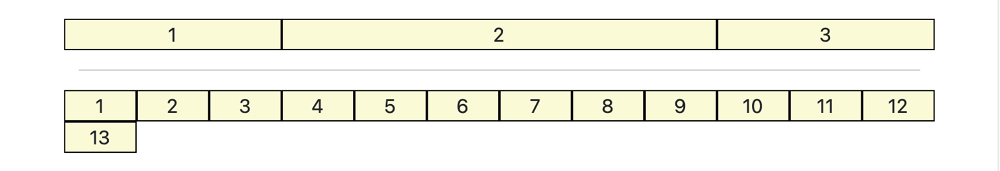

> container-fluid

- 전체 너비 컨테이너가 되어 뷰포트 전체 너비를 차지

```html
<div class="container-fluid"></div>
```


> Offset

- 열을 오른쪽으로 이동
- 열의 왼쪽 여백을  늘림


​    

### ✔️ 중단점 (Breakpoints)

- 6개의 `grid breakpoints`를 가짐

| 중단점            | 표기   | 너비                 | 컨테이너 (max-width) |
| ----------------- | ------ | -------------------- | -------------------- |
| X-Small           | (생략) | 0 < X < 576px        | (자동)               |
| Small             | sm     | 576px <= X < 768px   | 540px                |
| Medium            | md     | 768px <= X < 992px   | 720px                |
| Large             | lg     | 992px <= X < 1200px  | 960px                |
| Extra large       | xl     | 1200px <= X < 1400px | 1140px               |
| Extra extra large | xxl    | 1400px <= X          | 1320px               |

```css
@media (min-width: 576px) {
	.container-sm, .container {
		max-width: 540px;
		}
}
@media (min-width: 768px) {
	.container-md, .container-sm, .container {
		max-width: 720px;
	}
}
@media (min-width: 992px) {
	.container-lg, .container-md, .container-sm, .container {
		max-width: 960px;
	}
}
@media (min-width: 1200px) {
	.container-xl, .container-lg, .container-md, .container-sm, .container {
		max-width: 1140px;
	}
}
@media (min-width: 1400px) {
	.container-xxl, .container-xl, .container-lg, .container-md, .container-sm, .container {
		max-width: 1320px;
	}
}
```

​    

----

## 3️⃣ 유틸리티 (Utility)

### 3-1. 텍스트 (Text)

```html
<!-- 정렬 -->
<p class="text-start">왼쪽정렬</p>
<p class="text-center">가운데 정렬</p>
<p class="text-end">오른쪽 정렬</p>

<!-- 텍스트 자동 줄바꿈 -->
<div class="text-break"></div>

<!-- 링크 태그에 밑줄 제거 -->
<a href="#" class="text-decoration-none">Non-underlined link</a>

<!-- 폰트 굵기 -->
<p class="fw-bold">Bold text.</p>
<p class="fw-normal">Normal weight text.</p>
<p class="fw-light">Light weight text.</p>

<!-- 폰트 스타일 -->
<p class="fst-italic">Italic text.</p>

<!-- 글꼴 크기 -->
<p class="fs-1">.fs-1 text</p>   <!-- bigger -->
<p class="fs-6">.fs-6 text</p>   <!-- smaller -->

<!-- 행간 -->
<p class="lh-1"></p>
<p class="lh-sm"></p>
<p class="lh-base"></p>
<p class="lh-lg"></p>
```

​    

### 3- 2. 색상 (Colors) 

- `bg-값`

```html
<div class="bg-primary"></div>
```

​    

### 3-3. 크기 조절 (Sizing)

```html
<!-- 너비(width) -->
<div class="w-100">Width 100%</div>
<div class="w-auto"></div>

<!-- 높이(height) -->
<div class="h-100">Width 100%</div>
<div class="h-auto"></div>
```

​    

### 3-4. 간격 (Spacing) - 마진, 패딩

```html
<태그 class="{property}{sides}-[{breakpoint}]-{size}"></태그>
<div class="mx-lg-5"> 예시 </div>
```

| property      | sides              | size | rem  | px   |
| ------------- | ------------------ | ---- | ---- | ---- |
| margin - `m`  | top - `t`          | 0    | 0    | 0    |
| padding - `p` | bottom - `b`       | 1    | 0.25 | 4    |
|               | left - `l`         | 2    | 0.5  | 8    |
|               | right - `r`        | 3    | 1    | 16   |
|               | left + right - `x` | 4    | 1.5  | 24   |
|               | top + bottom - `y` | 5    | 3    | 48   |
|               |                    | auto |      |      |

> ✔️ mx-auto : 블록 요소, 수평 중앙 정렬, 가운데 정렬 ✔️

​    

### 3-5. borders  (테두리)

- 방향

```html
<span class="border"></span>
<span class="border-top"></span>
<span class="border-end"></span>
<span class="border-bottom"></span>
<span class="border-start"></span>
```

- 색상

```html
<span class="border border-primary"></span>
<span class="border border-secondary"></span>
<span class="border border-success"></span>
<span class="border border-danger"></span>
<span class="border border-warning"></span>
<span class="border border-info"></span>
<span class="border border-light"></span>
<span class="border border-dark"></span>
<span class="border border-white"></span>
```

- 두께

```html
<span class="border border-1"></span>
<span class="border border-2"></span>
<span class="border border-3"></span>
<span class="border border-4"></span>
<span class="border border-5"></span>
```

- 모서리 (모서리 크기)

```html


```

​    

### 3-6. Shadow

```html
<div class="shadow-none p-3 mb-5 bg-light rounded">No shadow</div>
<div class="shadow-sm p-3 mb-5 bg-body rounded">Small shadow</div>
<div class="shadow p-3 mb-5 bg-body rounded">Regular shadow</div>
<div class="shadow-lg p-3 mb-5 bg-body rounded">Larger shadow</div>
```

​    

### 3-7. Display

```html
<div class="d-inline"></div>
<div class="d-block"></div>
<div class="d-none"></div>
```

​    

### 3-8. Position (위치)

- 앱위에 메시지수 등을 나타낼 때 사용

```html
<div class="position-static top-0">...</div>
<div class="position-relative">...</div>
<div class="position-absolute">...</div>
<div class="position-fixed">...</div>
<div class="position-sticky">...</div>
```

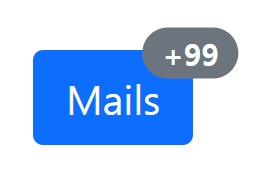

```html
<button type="button" class="btn btn-primary position-relative">
  Mails <span class="position-absolute top-0 start-100 translate-middle badge rounded-pill bg-secondary">+99 <span class="visually-hidden">unread messages</span></span>
</button>
```

​     

### 3-9. Flex

- flexbox 속성 모두 사용가능

​    

---

## 4️⃣ 컴포넌트 (Component)

### 4-1. 버튼 (Button)

```html
<button type="button" class="btn btn-primary">Primary</button>
<button type="button" class="btn btn-secondary">Secondary</button>
<button type="button" class="btn btn-success">Success</button>
<button type="button" class="btn btn-danger">Danger</button>
<button type="button" class="btn btn-warning">Warning</button>
<button type="button" class="btn btn-info">Info</button>
<button type="button" class="btn btn-light">Light</button>
<button type="button" class="btn btn-dark">Dark</button>
<button type="button" class="btn btn-link">Link</button>
```

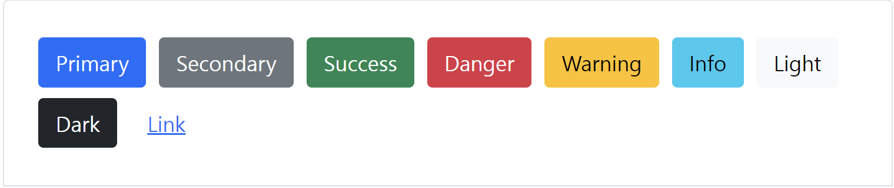

​    

### 4-2.버튼 그룹 (Button group) : 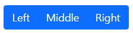

```html
<div class="btn-group" role="group" aria-label="Basic example">
  <button type="button" class="btn btn-primary">Left</button>
  <button type="button" class="btn btn-primary">Middle</button>
  <button type="button" class="btn btn-primary">Right</button>
</div>
```

​    

### 4-3. 네비게이션 바 (Navbar)

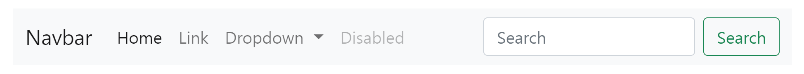

​    

### 4-4. 카드 (Card)

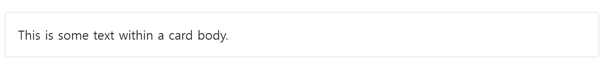

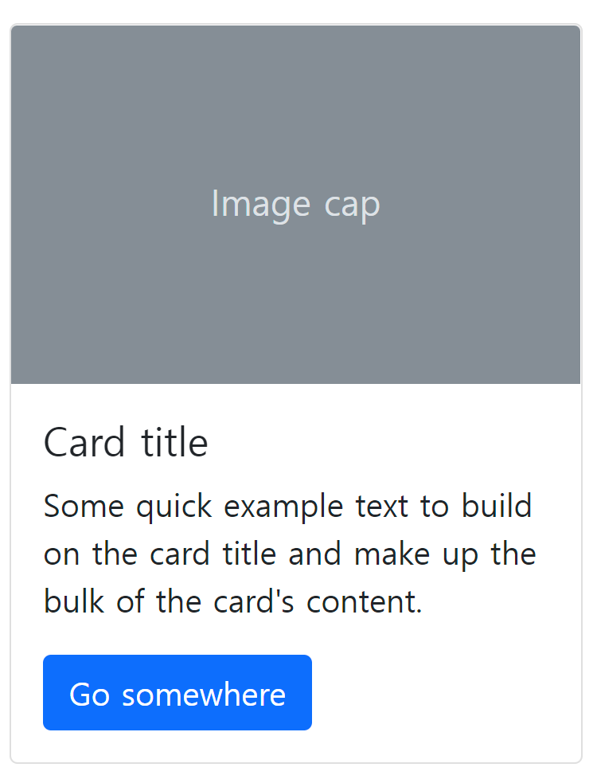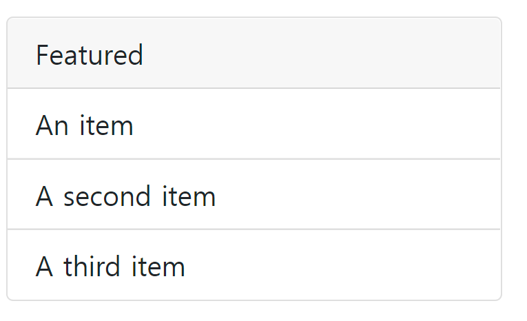

​    

### 4-5. 캐러셀 (Carosel)

- 콘텐츠를 순환시키기 위한 슬라이드쇼

​    

### 4-6. 드롭다운 (Dropdowns)

```html
<!-- 단일버튼 -->
<div class="dropdown">
  <a class="btn btn-secondary dropdown-toggle" href="#" role="button" id="dropdownMenuLink" data-bs-toggle="dropdown" aria-expanded="false">
    Dropdown link
  </a>
  <ul class="dropdown-menu" aria-labelledby="dropdownMenuLink">
    <li><a class="dropdown-item" href="#">Action</a></li>
    <li><a class="dropdown-item" href="#">Another action</a></li>
    <li><a class="dropdown-item" href="#">Something else here</a></li>
  </ul>
</div>
```

- `<a>` 태그의 button 속성을 이용해도 가능

​    

### 4-7. 경고창 (Alerts)

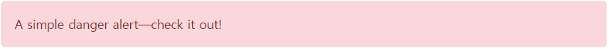

```html
<div class="alert alert-danger" role="alert">
  A simple danger alert—check it out!
</div>
```

- 아이콘 사용

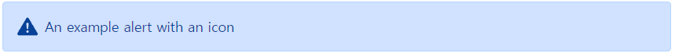

```html
<div class="alert alert-primary d-flex align-items-center" role="alert">
  <svg xmlns="http://www.w3.org/2000/svg" width="24" height="24" fill="currentColor" class="bi bi-exclamation-triangle-fill flex-shrink-0 me-2" viewBox="0 0 16 16" role="img" aria-label="Warning:">
    <path d="M8.982 1.566a1.13 1.13 0 0 0-1.96 0L.165 13.233c-.457.778.091 1.767.98 1.767h13.713c.889 0 1.438-.99.98-1.767L8.982 1.566zM8 5c.535 0 .954.462.9.995l-.35 3.507a.552.552 0 0 1-1.1 0L7.1 5.995A.905.905 0 0 1 8 5zm.002 6a1 1 0 1 1 0 2 1 1 0 0 1 0-2z"/>
  </svg>
  <div>
    An example alert with an icon
  </div>
</div>
```

- 무시 (`X`)

  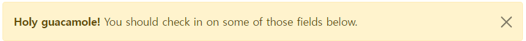

```html
<div class="alert alert-warning alert-dismissible fade show" role="alert">
  <strong>Holy guacamole!</strong> You should check in on some of those fields below.
  <button type="button" class="btn-close" data-bs-dismiss="alert" aria-label="Close"></button>
</div>
```

> 접두사 aria
>
> - 접근성이나 스크린 리더와 관련

​    

### 4-8. 배지 (Badges)

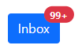

```html
<button type="button" class="btn btn-primary position-relative"> Inbox
  <span class="position-absolute top-0 start-100 translate-middle badge rounded-pill bg-danger">99+</span>
</button>
```

- 둥근 배지 : 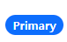

```html
<span class="badge rounded-pill bg-primary">Primary</span>
```

​    

### 4-9. 모달 (Modal)

- 대화창을 띄우는 도구
- 사용자와 상호작용을 하기 위해 사용
- 긴급 상황을 알리는 데 주로 사용
- 현재 열려 있는 페이지 위에 또 다른 레이어 띄움
- 페이지를 이동하면 자연스럽게 사라짐
- JS 활용, target속성과 id 속성이 일치하여야함

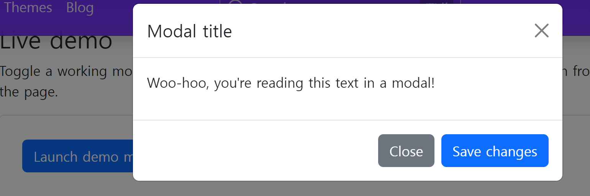

​    

### 4-10. 스피너 (Spinners)   

​    

----

## 5️⃣ 컨텐츠 (Content)

### 5-1. 타이포그래피 (Typography)

- 문서 전체에 걸친 변경 사항을 알려줌

#### 5-1-1. display

- 매우 큰 헤더를 만드는데 사용
- 크기만 다르고 heading 속성의 차이는 없음

```html
<h1 class="display-1">Display 1</h1>
<h1 class="display-2">Display 2</h1>
<h1 class="display-3">Display 3</h1>
<h1 class="display-4">Display 4</h1>
```

#### 5-1-2. Lead

- 단락 강조

```html
<p class="lead"></p>
```

#### 5-1-3. Blockquotes

- 블록 형태의 인용문
- 출처 추가 : `blockqoute-footer`

```html
<figure>
  <blockquote class="blockquote">
    <p>A well-known quote, contained in a blockquote element.</p>
  </blockquote>
  <figcaption class="blockquote-footer">
    Someone famous in <cite title="Source Title">Source Title</cite>
  </figcaption>
</figure>
```

#### 5-1-4. 목록

```html
<!-- 스타일 제거 -->
<ul class="list-unstyled">
  <li>This is a list.</li>
</ul>

<!-- 인라인 만들기 -->
<ul class="list-inline">
  <li class="list-inline-item">This is a list item.</li>
  <li class="list-inline-item">And another one.</li>
</ul>
```

​    

---

## 6️⃣ 폼 (Forms)

- 문서의 자료를 보고 필요한 것들 활용

>  [문서 : 폼](https://getbootstrap.kr/docs/5.1/forms/overview/)
