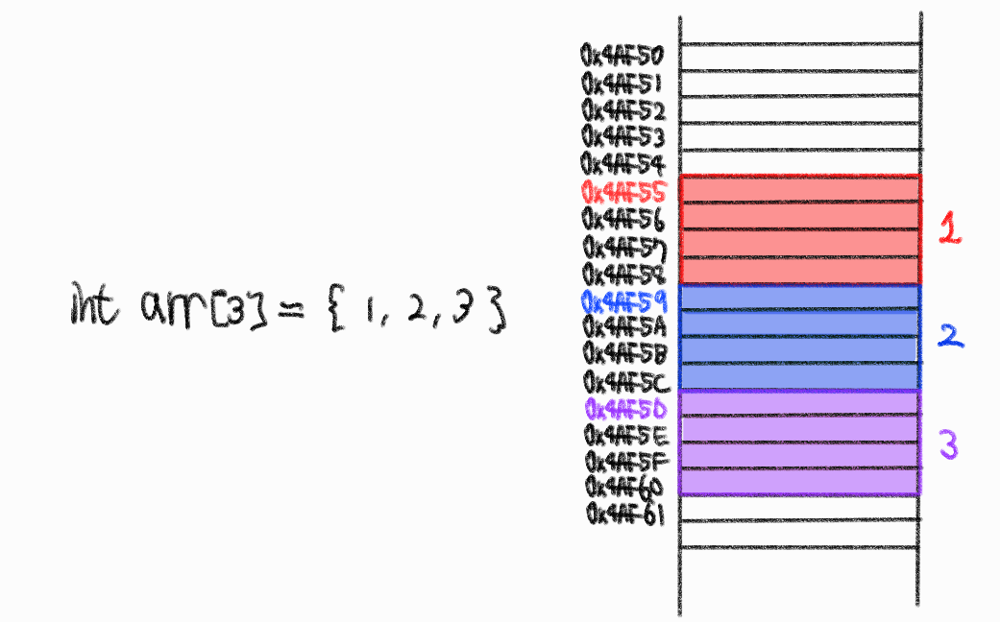
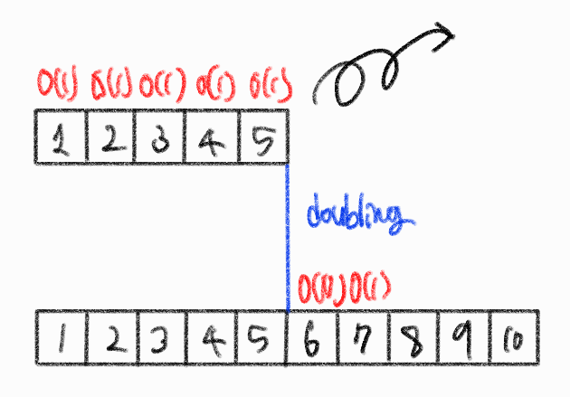
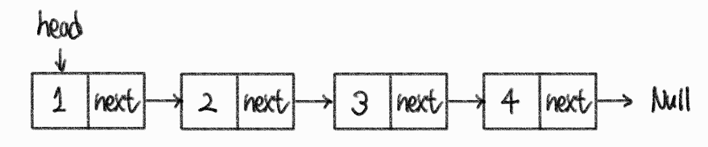
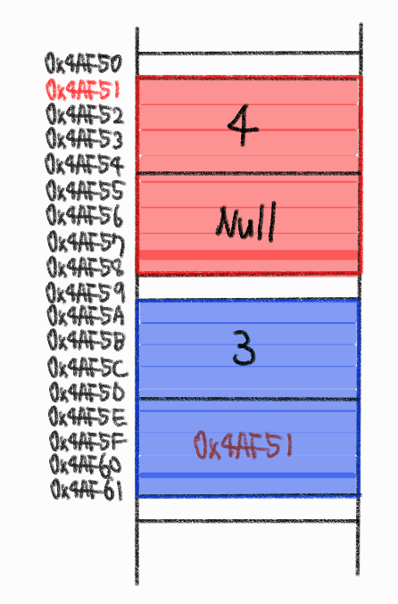
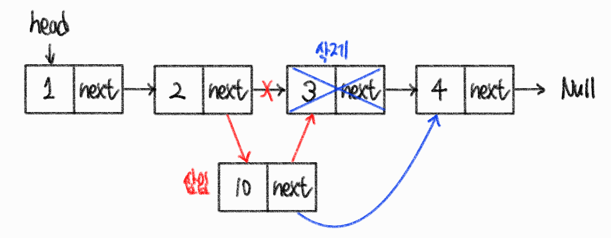
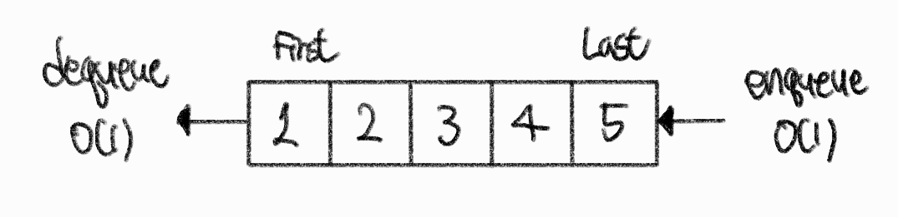
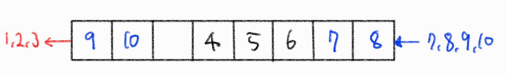
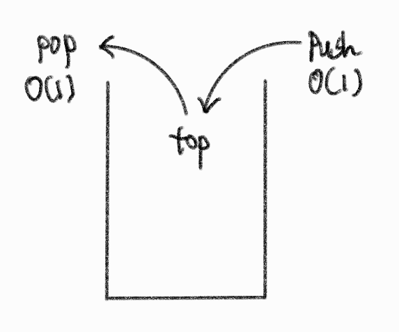
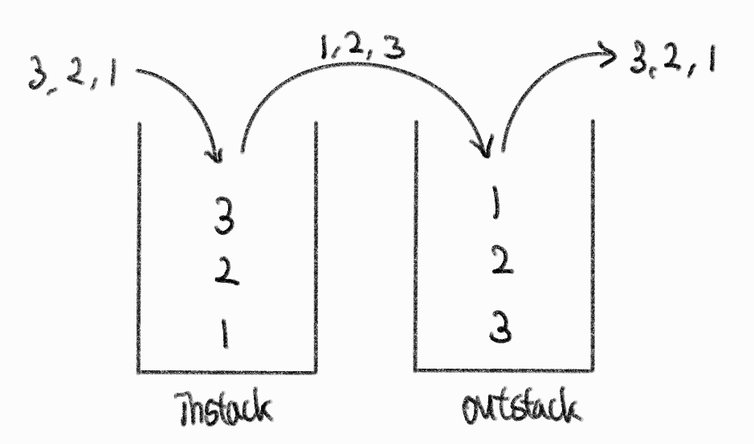
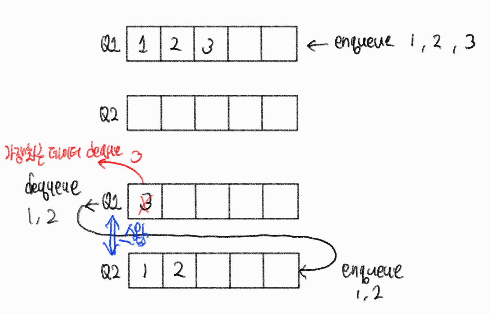

# 자료구조

​    

## Array

### 1. Array

- 연관된 데이터를 __메모리상에 연속적__이며 __순차적__으로 __미리 할당된 크기만큼__ 저장하는 자료구조
- 조회와 append가 빨라 조회를 자주 해야하는 작업에서 많이 사용됨 (장점)
- 선언시에 Array의 크기를 미리 정해야하여, 메모리 낭비나 추가적인 overhead가 발생할 수 있음 (단점)

| 동작                        | 시간복잡도 |
| --------------------------- | ---------- |
| 조회                        | O(1)       |
| 마지막 인덱스 추가 (append) | O(1)       |
| 마지막 인덱스 삭제 (pop)    | O(1)       |
| 삽입 삭제, 탐색             | O(n)       |



​    

> random access

- 배열의 연속된 구조를 이용하여 배열의 첫번째 메모리 위치와 데이터 크기를 이용하여 조회하는 방법

```c
// 3의 주소값 = 첫번째 주소값 + (4byte(숫자) * (3-1)번째 인덱스) 
    04xAF5D   =   0x4AF55    + (     4      *        2       )byte
```


> 미리 예상한 것보다 더 많은 데이터를 저장하게되어 Array의 사이즈를 넘게 되었을때 어떻게 해결해야할까?

- 기존 Array 사이즈보다 더 큰 Array를 선언하고 기본 데이터를 새 Array에 옮겨 할당합니다.
- 그 후, 모든 데이터를 옮겼다면 기본 Array는 메모리에서 삭제됩니다.
- 이러한 방식으로 동적으로 배열의 크기를 조절하는 자료구조를 `Dynamic array`라고 함
- 사이즈 예측이 어렵다면 Array대신 Linked list를 사용해 데이터가 추가될 때마다 메모리 공간을 할당받는 방식을 사용하는 것을 추천함

​    

### 2. Dynamic Array

- 사이즈를 자동적으로 재조정한는 Array로 기존 고정된 사이즈를 가진 Static Array의 한계점을 보완하고자 고안되었습니다.
- 데이터를 계속 추가하다가 기존에 할당된 메모리를 초과하게되면, 사이즈를 늘린 배열을 선언하고 그곳으로 모든 데이터를 옮겨담아 새로운 사이즈를 가진 배열이 됩니다.
- 사이즈를 미리 고민하지 않아도 되는 장점이 있습니다.
- 사이즈 재조정의 대표적인 방법에는 기존 배열의 사이즈의 2배를 할당하는 doubling이 있습니다.

​    

> Doubling

- 데이터를 추가하다가 메모리를 초과하게되면 기존 배열의 사이즈보다 두 배 더 큰 배열을 선언하고 데이터를 일일히 옮기는 방법으로
- n개의 데이터를 일일히 옮겨야하므로 O(n)의 시간복잡도를 가집니다.



> 분할 상환 시간복잡도 (Amortized time complexity)

- 가끔 발생하는 O(n)의 resize 시간을 자주 발생하는 O(1)의 작업들이 분담해 나눠가져 전체적으로는 O(1)의 시간이 걸린다고 말하며 이를 amortized O(1)이라고 부릅니다.

​        

### 3. Linked List

- Node라는 구조체로 이루어져 있습니다.
- 이 때, Node는 데이터 값과 다음 Node의 주소값을 저장하고 있습니다.
- 물리적 메모리상에서는 비연속적으로 저장되지만, 각각의 Node가 다음 Node의 주소값을 가리키고 있어 논리적으로는 연속성을 가진다고 말하는 자료구조입니다.





- 물리적으로 옮길 필요가 없이 next address가 가리키는 주소값만 변경하면돼 삽입/삭제에 O(1)의 시간복잡도를 가집니다.



​    

### 4. 꼬리질문

> Array와 Linked List를 비교하여 설명

- Array는 물리적 메모리상에 연속적으로 데이터를 저장하는 자료구조이고, Linked List는 물리적 메모리상에서 연속적이지 않지만, 각각의 Node가 다음 Node의 메모리 주소값을 저장해놓아 논리적으로 연속성을 유지하는 자료구조입니다.
- 데이터 조회시 Array는 random access(즉시접근)를 통해 O(1)의 시간복잡도를 가지고 Linked List는 sequential access(순차접근)을 하여 O(n)의 시간복잡도를 가집니다.
- 데이터 삽입과 삭제시에는 Array는 O(n)의 시간복잡도를 가집니다. Linked List는 O(1)의 시간복잡도를 가지는데 특정 인덱스에 접근하려면 O(n)의 시간이 걸리므로 실질적으로는 O(n)의 시간복잡도를 가집니다.
- 만약 얼마만큼 데이터를 저장할지 미리 알고, 조회를 많이 한다면 Array를 사용하는 것이 좋고, 몇개의 데이터를 저장할지 불확실하고 삽입, 삭제가 잦으면 Linked List를 사용하는 것이 더 좋습니다.

​    

> 어느 상황에서 Linked List가 Array보다 나을까?

- 데이터 삽입/삭제가 잦을때
- 얼마만큼 데이터가 들어올지 예측할 수 없을 때
- 조회가 많지 않을 때

​    

> 어느 상황에서 Array가 Linked List보다 나은가?

- 조회작업이 잦을 때
- Array 선언 당시에 데이터 개수를 알고 있을 때
- 반복문을 통해 빠르게 순회할 때
- 메모리를 적게 쓰는게 중요할 때
- 미리 들어올 데이터의 양을 알고 있을 때

​    

> Array와 Linked List의 memory allocation은 언제 일어나며, 메모리의 어느 영역에 할당받는지?

- Array는 compile 단계에서 메모리할당이 일어납니다.
- 이를 Static memory allocation이라고 하고, Stack 메모리 영역에 할당됩니다.
- Linked List는 runtime 단계에서 새로운 Node가 추가될 때 마다 메모리할당이 일어납니다.
- 이를 Dynamic memory allocation이라고 하고, Heap 메모리 영역에 할당됩니다.

​    

## Queue

- 선입선출 자료구조 (FIFO: First In First Out)
- enqueue와 dequeue 모두 O(1)의 시간복잡도를 가집니다.
- Queue의 활용예시로는 Cache 구현, 프로세스 관리, 너비우선탐색(BFS)등이 있습니다.




> 구현방식

1. Array-Based queue
   - enqueue와 dequeue 과정에서 남는 메모리가 생기는 문제가 발생하는데 이를 circular queue 형식을 통해 해결할 수 있음
2. List-Based queue
   - 재할당이나 메모리 낭비

​    

> 확장

1. deque (double-ended queue)
   - 양쪽에서 enqueue와 dequeue가 가능
2. priority queue
   - 시간순서가 아닌 우선순위가 높은 순서로 deque 진행

​    

> 활용예시

- 하나의 자원을 공유하는 프린터
- CPU task scheduling
- cache 구현
- 너비우선탐색 (BFS)


> circular queue



​    

> Array Based와 List Based의 차이?

- Array-Based queue는 메모리를 효율적으로 사용하기 위해 일반적으로 circular queue로 구현합니다.
- enqueue가 계속 발생하면 fixed size를 넘어서기 때문에, dynamic Array와 같은 방법으로 Array의 사이즈를 확장시킵니다.
- enqueue의 시간복잡도는 amortized O(1)을 가지게 됩니다. 
- List-Based queue는 보통 singly-linked List로 구현합니다.
- enqueue는 단순히 singly-linked list에서 append하는 것으로 구현되어 O(1)의 시간복잡도를 가집니다.
- dequeue는 맨 앞의 원소를 삭제하고 first head를 변경하는 방식으로 구현되어 O(1)의 시간복잡도를 가집니다.
- 두 종류 모두 enqueue, dequeue는 O(1)의 시간복잡도를 가집니다.
- Array-Based가 전반적인 퍼포먼스가 좋지만, resize가 필요한 worst case에서는 훨씬 느릴 수 있음
- List-Based는 enqueue시 메모리할당을 해야함으로 전반적인 런타임이 느릴 수 있음 

​    

## Stack

- 시간 순서상 가장 최근 추가한 데이터가 가장 먼저 나오는 후입선출(LIFO: Last In First Out) 자료구조
- 스택의 활용예시에는 후위 표기법 연산, 괄호 유효성 검사, 웹브라우저 방문기록 (뒤로가기), 깊이 우선 탐색(DFS)이 있습니다.



​    

> Stack 두개를 이용하여 Queue 구현



1. 첫번째 stack에 데이터를 push
2. 첫번째 stack의 값을 pop한 후, 두번째 stack에 push
3. 두번째 stack에서 pop하면 가장 먼저 왔던 데이터가 가장 먼저 추출됨

```typescript
class Queue {
    instack = [];
    outstack = [];
    
    enqueue(element) {
        this.instack.push(element)
    }
    
    dequeue() {
        if (this.outstack.length === 0) {
            while (this.instack.length !== 0) {
                this.outstack.push(this.instack.pop())
            }
        }
        return this.outstack.pop()
    }
}
```

- 시간복잡도
  - `enqueue()` : instack.push()를 한번만 하므로 O(1)
  - `dequeue()` : 두가지 경우를 고려해야함
    1. worst case : outstack이 비어있는 경우, instack에 있는 n개의 데이터를 instack.pop()한 후 outstack.push()를 해줘야하여 2n번의 실행이 일어나므로 O(n)의 시간복잡도를 가짐
    2. outstack이 비어있지 않은 경우 outstack.pop()만 해주면 됨으로 O(1)의 시간복잡도를 가짐
  - 이 둘을 종합하면 amortized O(1)의 시간복잡도를 갖게됨

​    

> Queue 두개를 이용하여 stack 구현



1. push()
   - Q1에 enqueue()로 데이터 저장
2. pop()
   - Q1에 저장된 데이터의 개수가 1개이하로 남을 때 까지 dequeue()한 후, 추출된 데이터를 Q2에 enqueue()하여 가장 최근 데이터를 제외한 모든 데이터는 Q2로 이동
   - Q1에 남아있는 하나의 데이터를 dequeue()하여 가장 최근 저장된 데이터(LIFO)를 반환함
   - 다음에 진행될 pop()을 위해 Q1과 Q2이름을 서로 바꿔줌

- 시간복잡도
  - `push()` : Q1에서 enqueue()가 한번만 일어나므로 O(1)
  - `pop()` : Q1에 저장되어있는 n개의 원소중 n-1개를 Q2에 옮겨야함으로 O(n)의 시간복잡도를 가짐

​    

> Queue와 Priority Queue 비교

- 
