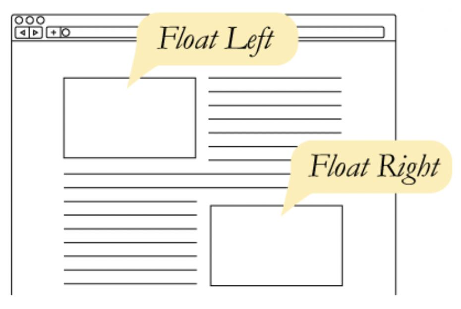
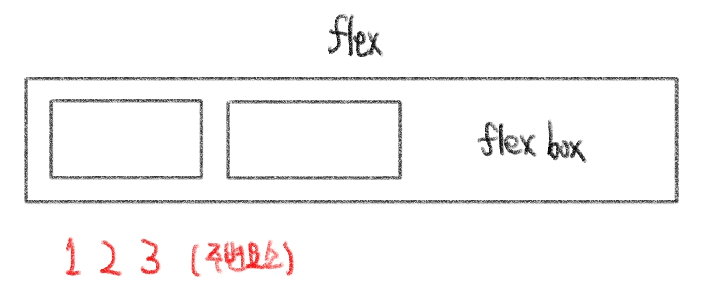
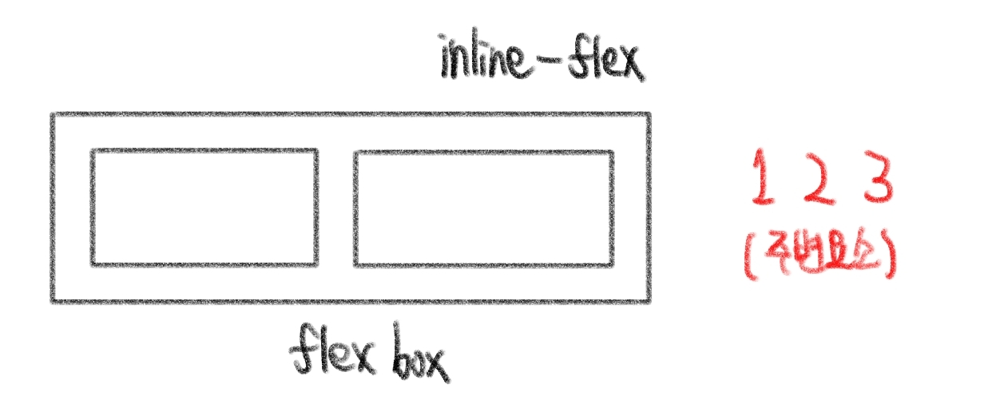
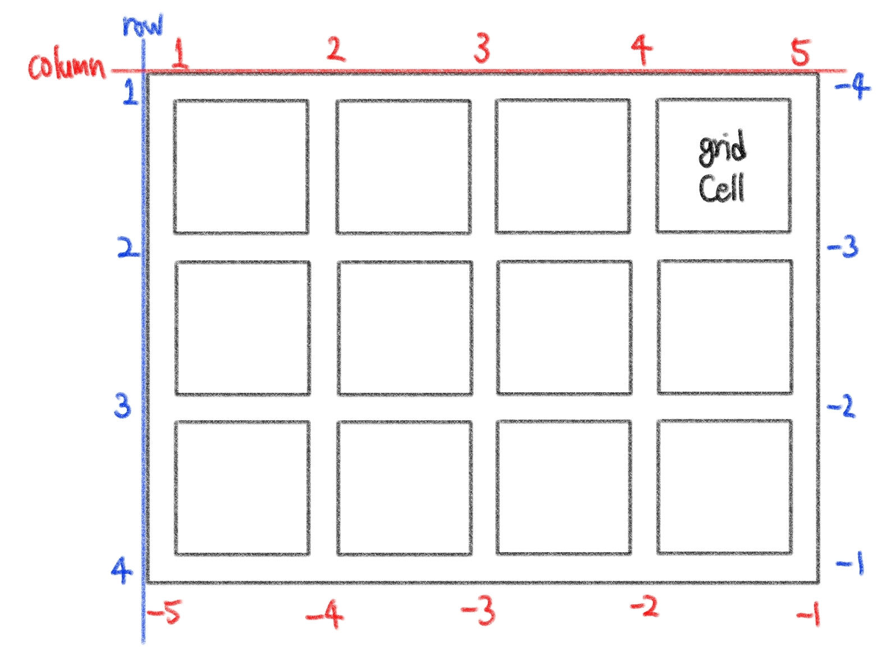
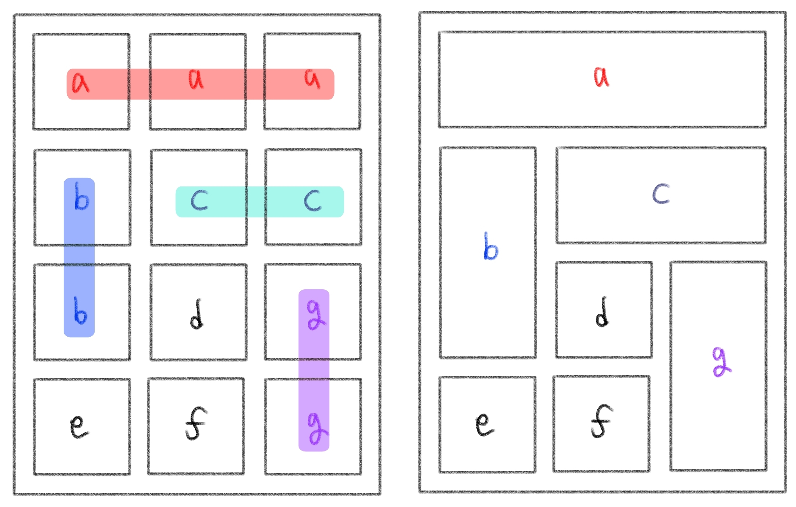

# CSS정리_3

​    

## 1️⃣ CSS 원칙 (Normal Flow)

- 모든 요소는 박스모델(네모)
- 위에서부터 아래로, 왼쪽에서 오른쪽으로 쌓임 (좌측상단)

​    

## 2️⃣ CSS Position

- 문서상에서 요소의 위치를 지정

1. static
   - 모든 태그의 기본 값 (기준 위치)
   - 좌측상단의 일반적인 요소의 배치 순서 따름 
   - 부모 요소내에 배치시 부모 요소의 위치를 기준으로 배치

```css
position: static;
```

---

⬇️ 좌표 프로퍼티 (top, bottom, left, right) 사용하여 이동

2. relative (상대위치)
   - normal flow 유지
   - static 위치를 기준으로 이동

```css
position: relative;
top: 100px;
left: 100px;
bottom: 100px;
right: 100px;
```

3. absolute (절대 위치) 

- normal flow에서 벗어남 ❗
- static이 아닌 부모 요소를 기준으로 이동
- static이 아닌 부모요소가 없을 경우 브라우저 화면 기준으로 이동
- 특정 영역 위에 존재할 때 사용 ❔

```css
position: absolute;
top: 100px;
left: 100px;
bottom: 100px;
right: 100px;
```

4. fixed (고정 위치)

- normal flow에서 벗어남 ❗
- 부모 요소와 관계없이 __viewport__를 기준으로 이동 ❗
- 스크롤 시에도 항상 같은 곳에 위치

```css
position: fixed;
top: 100px;
left: 100px;
bottom: 100px;
right: 100px;
```

5. sticky

- 스크롤에 따라 static에서 fixed로 변경

- 평소에는 `position: static`과 같은 흐름, 스크롤로 인한 페이지 이동시 `position: fixed`와 같이 화면에 고정

```css
position: sticky;
top: 100px;
left: 100px;
bottom: 100px;
right: 100px;
```


---

## 3️⃣ Float

- 박스를 왼쪽 or 오른쪽으로 이동시켜 텍스트를 포함 인라인 요소들이 주변을 wrapping하도록 함
- 요소가 Normal flow를 벗어나도록 함

```css
.<class> {
  float: left/right;
}
```



​     

---

## 4️⃣ CSS Flexbox


- 페이지의 콘텐츠 상자안에 아이템을 배치하는데 사용
- `main axis` (메인 축)과 `cross axis` (교차 축) 존재
- `Flex Container` (부모 요소)와 `Flex Item` (자식 요소) 존재

```css
display: flex;  /* 부모 요소 */
display: inline-flex; /* flex 컨테이너 주변요소와의 관계 설정 */
```





| 배치 설정      | 공간 나누기           | 정렬                             |
| -------------- | --------------------- | -------------------------------- |
| flex-direction | justify-contet (main) | align-items (모든 아이템, cross) |
| flex-wrap      | align-content (cross) | align-self (개별 아이템, cross)  |
| flex-flow      |                       |                                  |

​    

### ◾배치 설정

#### 1. flex-direction

- main axis (주축)
- 역방향시 HTML 태그 선언 순서와 시각적으로 다르므로 유의❗

```css
flex-direction: row;                 /* main axis : 좌우 */
flex-direction: row-reverse;         /* main axis : 우좌 */
flex-direction: column;              /* main axis : 상하 */
flex-direction: column-reverse;      /* main axis : 하상 */
```

#### 2. flex-wrap

- 아이템이 컨테이너를 벗어나는 경우 해당 영역 내에서 배치되도록 설정

```css
flex-wrap: wrap;
flex-wrap: nowrap;
flex-wrap: wrap-reverse;
```

#### 3. flex-flow 

- `flex-direction` 와 `flex-wrap`을 한번에 사용

```css
flex-flow: flex-direction flex-wrap;
```

​    

### ◾공간 나누기

#### 1. justify-content

- main axis (주축)을 기준으로 요소와 컨텐츠를 어떻게 배치할지 결정하는 속성

```css
justify-content: flex-start;      /* 주축 시작점 */
justify-content: flex-end;        /* 주축 끝점 */
justify-content: center;          /* 주축 중앙 */
justify-content: space-between;   /* 아이템 사이 간격 균일 분배 */
justify-content: space-around;    /* 영역에 대한 간격 균일 분배 */
justify-content: space-evenly;    /* 전체영역에 간격 균일 분배 */
```

#### 2.align content

- 행이나 열이 여러 개일 때 cross axis (교차축)을 기준으로 정렬
- 열이나 행 사이의 공간 조정 (단일 행이나 열에서는 효과x)

```css
align-content: flex-start;      /* 교차축 시작점 */
align-content: flex-end;        /* 교차축 끝점 */
align-content: center;          /* 교차축 중앙 */
align-content: space-between;   /* 아이템 사이 간격 균일 분배 */
align-content: space-around;    /* 영역에 대한 간격 균일 분배 */
align-content: space-evenly;    /* 전체영역에 간격 균일 분배 */
```


​    

### ◾정렬

####  1. align-items

- cross axis (교차축)을 따라 아이템 배열

```css
align-items: stretch;     /* [기본값] 컨테이너를 가득 채움 */
align-items: flex-start;  /* 위 */
align-items: flex-end;    /* 아래 */
align-items: center;      /* 가운데 */
align-items: baseline;    /* 텍스트의 기준선에 맞춰 정렬 */
```

#### 2. align-self

- cross axis (교차축)을 기준으로 단일요소의 위치 적용

```css 
align-self: stretch;
align-self: flex-start;
align-self: flex-end;
align-self: center;
```

​    

### ◾속성

#### 1. Flex-basis

- 요소가 배치되기 전에 요소의 최초 크기 결정
- 플렉스 컨테이너에 추가되기 전 시작점
- 요소가 한 줄로 늘어서 있을 때 너비의 기준이 됨
- main axis (주축)

```css
flex-basis: 400px;
```

#### 2. Flex-grow

- 공간이 있을 때 요소가 그 공간을 얼마나 차지할지 정함
- 단위 없음
- `max/min-width` 추가 가능 

```css
flex-grow: 1;
```

#### 3. Flex-shrink

- 컨테이너에 충분한 공간이 없을 때 요소들이 줄어드는 비율 통제
- `flex-grow`의 반대개념
- 단위없음

``` css
flex-shrink: 1;
```

#### 4. Flex

- `flex-basis`, `flex-grow`, `flex-shrink`를 한번에 사용
- 2 요소 사용시에 단위 있으면 `flex-basis`, 단위가 없다면 `flex-shrink`

```css
flex: flex-grow flex-shrink flex-basis;
```

​    

> 수평 수직 가운데 정렬

```css
/* 컨테이너만 활용 */
.container {
  display: flex;
  justify-content: center; 
  align-items: center; 
}

/* 컨테이너 + 아이템 활용 */
.container {
  display: flex;
}
.item {
  margin: auto; ✔️✔️
}
```

​    

---

## 5️⃣ Grid

## 

```css
.container {
  display: grid;
  grid-template-columns: repeat(5, 1fr);  /* 1fr은 한 공간을 차지한다는 의미 */ 
  grid-template-rows: ;
  
  /* 몇 줄인지 상관 없이 각 줄당 값을 배정 
  컨텐츠가 없어도 최소높이만큼 유지, 컨텐츠가 많으면 자동으로 조절*/ 
  grid-auto=rows: minmax(최소높이, auto);  
  
  /* 그리드 사이사이에만 공간을 줌 */
  grid-gap: ;
  grid-column-gap: ;
  grid-row-gap: ;
}

.item {
  grid-column-start: 2;
  grid-column-end: 4;
  grid-row-start: 1;
  grid-row-end: 3;
  
  grid-column: 2 / span 2;  /* 2열에서부터 2칸 차지 */
  grid-column: 2 / -1;       /* 2열에서부터 끝까지 차지 */
  grid-row: 1 / 3;          /* 1행에서부터 3행까지 차지 */
}
```


- grid-area 사용법

```css
/* grid-area */
.container{
  display: grid;
  grid-template-columns: repeat(3, 1fr);\
  grid-auto-rows: 150px;
  grid-gap: 1rem;
  grid-template-areas:
    'a a a'
    'b c c'
    'b d g'
    'e f g'
}

.img1 {
  grid-area: a; 
}
.img2 {
  grid-area: b;
}
.img3 {
  grid-area: c;
}
.img4 {
  grid-area: d;
}
.img5 {
  grid-area: e;
}
.img6 {
	grid-area: f;
}
.img7 {
  grid-area: g;
}
```



​    

----

## 6️⃣ Media Query

- viewport 기준

```css
/* 800px이상에만 대괄호 내용 적용 */
@media (min-width: 800px){
  h1{
    
  }
}
