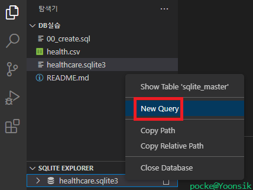
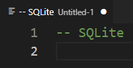
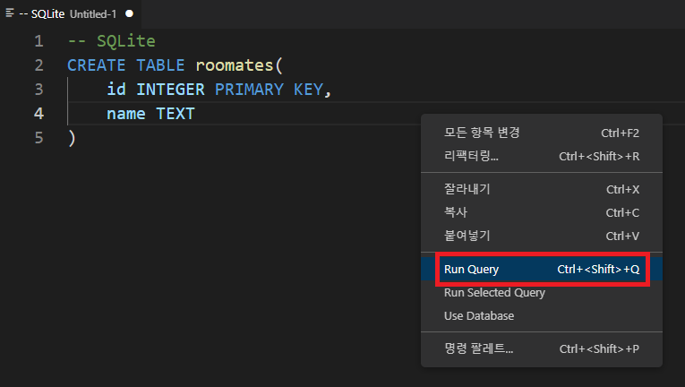

# ❓오늘 배운것 (22.08.16(화))

## 🆕 DB, RDB, SQL 개념

### 1. DB (Database) : 데이터 베이스

- DB 장점
  
  - 데이터 중복 최소화
  
  - 데이터 무결성 (정확한 정보 보장)
  
  - 데이터 일관성
  
  - 데이터 독립성
  
  - 데이터 표준화
  
  - 데이터 보안유지

### 2. 테이블 (table)

- 열과 행의 모델을 사용해 조직된 데이터 요소들의 집합

- 열 == column == 필드(field)
  
  - 각 열에 고유한 데이터 형식 지정

- 행 == row == 레코드(record)
  
  - 실제 데이터가 저장되는 형태

- ❗기본키 (Primary Key) ❗
  
  - 각 행의 고유값
  - 반드시 설정해야 하며, DB관리 및 관계설정시 활용

### 3. 스키마 (Schema)

- DB의 자료구조, 관계, 표현방식등의 명세를 기술한 것

| column | datatype |
| ------ | -------- |
| id     | INT      |
| name   | TEXT     |

### 4. RDB (Relational Database) : 관계형 데이터베이스

- 키(key), 값(value)들의 관계(relation)를 표(table) 형태로 정리한 데이터베이스

### 5. RDBMS : 관계형 데이터베이스 관리시스템

- 종류 : MySQL, SQLite, ORACLE-SQL, MS-SQL, PostgreSQL

#### ✍️ SQLite (주로 사용할 RDBMS)

- 서버 형태가 아닌 파일 형식으로 응용 프로그램에 넣어 사용 (비교적 가벼운 DB)
- 구글 안드로이드 OS에 기본 탑재
- 임베디드 SW에도 많이 활용
- 로컬에서 간단한 DB구성가능
- 오픈소스 프로젝트

> SQLite Data Type

1. `NULL`
2. `INTEGER`
3. `REAL` : 8byte 부동소수점
4. `TEXT`
5. `BLOB` : 입력된 그대로 저장 (별 타입 없이 그대로 저장)

> SQLite Type Affinity (유형 선호도)

- 특정 컬럼에 저장하도록 권장하는 데이터 타입

| Detail                                                                                                                                      | Resulting Affinity (결과 선호도) |
| ------------------------------------------------------------------------------------------------------------------------------------------- | --------------------------- |
| INT<br />INTEGER<br />SMALLINT<br />MEDIUMINT<br />BIGINT<br />UNSIGNED BIG INT<br />INT2<br />INT8                                         | INTEGER                     |
| CHARACTER(20)<br />VARCHAR(255)<br />VARYING CHARACTER(255)<br />NCHAR(55)<br />NATIVE CHARACTER(70)<br />NVARCHAR(100)<br />TEXT<br />CLOB | TEXT                        |
| BLOB                                                                                                                                        | BLOB                        |
| REAL<br />DOUBLE<br />DOUBLE PRECISION<br />FLOAT                                                                                           | REAL                        |
| NUMERIC<br />DECIAL(10, 5)<br />BOOLEAN<br />DATE<br />DATETIME                                                                             | NUMERIC                     |

### 6. SQL (Structured Query Language)

- RDBMS의 데이터 관리를 위해 설계된 특수목적 프로그래밍 언어
- DB 스키마 생성 및 수정
- 자료 검색 및 관리
- DB 객체 접근 조정 관리

| 분류                                               | 개념                               | 예시                                          |
| ------------------------------------------------ | -------------------------------- | ------------------------------------------- |
| DDL (Data Definition Language) <br />- 데이터 정의어   | RDB의 구조 (테이블, 스키마)를 정의 하기 위한 명령어 | CREATE<br />ALTER<br />DROP<br />TRUNCATE   |
| DML (Data Manipulation Language) <br />- 데이터 조작어 | 데이터를 저장, 조회, 수정, 삭제등을 하기 위한 명령어  | SELECT<br />INSERT<br />UPDATE<br />DELETE  |
| DCL (Data Control Language)<br /> - 데이터 제어어      | DB 사용자의 권한 제어를 위해 사용하는 명령어       | GRANT<br />REVOKE<br />COMMIT<br />ROLLBACK |

---

## 🆙 SQLite 다루기

> 데이터베이스 생성하기

```sqlite
$ sqlite3 <DB이름>.sqlite3
sqlite> .database  -- '.'은 sqlite에서 활용되는 명령어
```

> csv파일을 table로 만들기

```sqlite
sqlite> .mode csv
sqlite> .import <csv파일명.csv> <테이블명>
sqlite> .table
-- 테이블명
```

> 터미널 view 변경하기

```sqlite
.headers on
.mode column
```

> SQLite 확장프로그램 다루기

1. SQLite 파일 우클릭 -> Open Database 클릭

2. New Query 클릭 -> SQL명령어를 작성하는 페이지 출력

3. 코드 작성후 우클릭 -> Run Query (전체 코드 실행) or Run Selected Query (선택코드만 실행)

4. 새로고침 후 DB변화 확인


---

## 🆕 SQL _CRUD

#### 1. 테이블 생성 및 삭제  (CREATE)

##### 1-1. CREATE

```sql
CREATE TABLE <테이블명> (
    <컬럼명> <데이터타입> PRIMARY KEY,
);
```

```sqlite
-- 테이블 종류 확인
sqlite> .tables 
>> <테이블명>

-- 특정 테이블의 schema 조회
sqlite> .schema <테이블명>
>> CREATE TABEL <테이블명> (
    <컬럼명> <데이터타입> [],
);
```

> 필드 제약 조건

- NOT NULL : NULL값 입력금지
- UNIQUE : 중복값 입력금지 (NULL값은 중복 입력 가능)
- PRIMARY KEY : 테이블에서 반드시 하나만 존재 (NOT NULL + UNIQUE)
- FOREIGN KEY : 외래키, 다른 테이블의 Key
- CHECK : 조건으로 설정된 값만 입력 허용
- DEFAULT : 기본 설정 값

```sql
-- 활용 예시
CREATE TABLE students(
    id INTEGER PRIMARY KEY,
  name TEXT NOT NULL,
  age INTEGER DEFAULT 1 CHECK (0 < age)
);
```

##### 1-2. DROP

```sqlite
sqlite> DROP TABLE <테이블명>;
```

#### 2. 데이터 추가

##### 2-1. INSERT

```sql
-- 단일 행 삽입
INSERT INTO <테이블명> (컬럼1, 컬럼2, ...) VALUES (값1, 값2, ...);

-- 모든 컬럼에 맞춰 순서대로 입력
INSERT INTO <테이블명> VALUES (값1, 값2, 값3, ...);
```

> rowid : SQLite에서 PRIMARY KEY가 없을 경우 자동으로 증가하는 컬럼


> 스키마에 id 직접 작성시 입력할 column을 명시하지 않으면 자동 입력 x

```sqlite
sqlite> CREATE TABLE classamtes (
    ...> id INTEGER PRIMARY KEY,
    ...> name TEXT NOT NULL,
    ...> age INT NOT NULL,
    ...> ); 

-- 입력
INSERT INTO classmates VALUES ('홍길동', 500, '서울');

-- 에러발생
Error: table classmates has 4 columns but 3 values were supplied

-- 해결법
1. id를 포함한 모든 value 작성
INSERT INTO classmates VALUES (1, '홍길동', 500, '서울');

2. 각 value에 맞는 column들을 명시적으로 작성
INSERT INTO classmates (name, age, address) VALUES ('홍길동', 500, '서울');
```

#### 3. 데이터 읽기

##### 3-1. SELECT

- 테이블에서 데이터를 조회

> SELECT의 다양한 절(Clause)

- LIMIT 
  
  - 쿼리에서 반환되는 __행 수__ 제한
  - 특정 행부터 시작하여 조회하기 위해 OFFSET과 함께 사용 가능
  
  ```sql
  SELECT 컬럼1, 컬럼2, ... FROM <테이블명> LIMIT <조회할 컬럼수> OFFSET <'숫자' 이후부터 시작>;
  
  -- 예시
  SELECT rowid, name FROM classmates LIMIT 1 OFFSET 2;
  rowid name
  ----- ----
  3            이동영
  ```

- OFFSET
  
  - 처음부터 주어진 요소나 지점까지의 차이를 나타내는 정수형
  
  ```sql
  SELECT * FROM MY_TABLE LIMIT 10 OFFSET 5;
  -- 해석
  6번째 행부터 10개의 행 조회 (6행부터 10개 출력)
  -- 주의사항
  OFFSET은 인덱스처럼 0부터 시작
  ```

- WHERE
  
  - 특정 검색 조건 지정

- SELECT DISTINCT
  
  - 조회 결과에서 중복행 제거
  - DISTINCT절은 SELECT 키워드 바로 뒤에 작성

```sql
SELECT DISTINCT 컬럼 FROM <테이블명>;
```


---


## ✍️ DB 실습


### 사전 설정

#### - 실행

```bash
$ sqlite3 healthcare.sqlite3 
```

#### - Column 출력 설정

```sql
sqlite3> .headers on 
sqlite3> .mode column
```

#### - table 및 스키마 조회

```sql
sqlite3> .tables
healthcare

sqlite3> .schema healthcare
CREATE TABLE healthcare (
id PRIMARY KEY,        
sido INTEGER NOT NULL, 
gender INTEGER NOT NULL,
age INTEGER NOT NULL,  
height INTEGER NOT NULL,
weight INTEGER NOT NULL,
waist REAL NOT NULL,   
va_left REAL NOT NULL, 
va_right REAL NOT NULL,

blood_pressure INTEGER 
NOT NULL,
smoking INTEGER NOT NULL,
is_drinking BOOLEAN NOT NULL
);
```

### 문제

#### 1. 추가되어 있는 모든 데이터의 수를 출력하시오.

```sql
SELECT COUNT(*) FROM healthcare;
```

```
COUNT(*)
--------
1000000
```

#### 2. 나이 그룹이 10(age)미만인 사람의 수를 출력하시오.

```sql
SELECT COUNT(*) FROM healthcare WHERE age < 10;
```

```
COUNT(*)
--------
156277
```

#### 3. 성별이 1인 사람의 수를 출력하시오.

```sql
SELECT COUNT(*) FROM healthcare WHERE gender = 1;     
```

```
COUNT(*)
--------
510689
```

#### 4. 흡연 수치(smoking)가 3이면서 음주(is_drinking)가 1인 사람의 수를 출력하시오.

```sql
SELECT COUNT(*) FROM healthcare WHERE smoking = 3 and is_drinking = 1;
```

```
COUNT(*)
--------
150361
```

#### 5. 양쪽 시력이(va_left, va_right) 모두 2.0이상인 사람의 수를 출력하시오.

```sql
sqlite> SELECT COUNT(*) FROM healthcare WHERE va_left >= 2.0 and va_right >= 2.0; 
```

```
COUNT(*)
--------
2614
```

#### 6. 시도(sido)를 모두 중복 없이 출력하시오.

```sql
SELECT DISTINCT sido FROM healthcare
```

```
36
27
11
31
41
44
48
30
42
43
46
28
26
47
45
29
49
```

