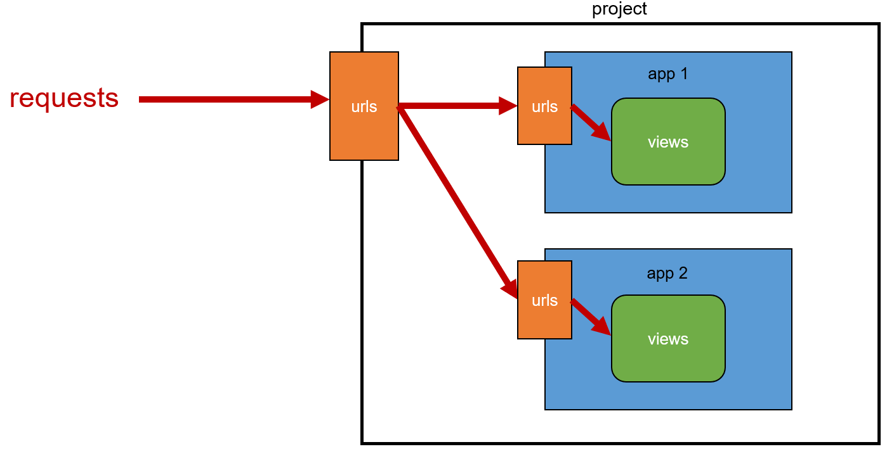

# Django정리 (2)


## 0️⃣ URLs

- 장고프레임워크는 URL끝에 `/` 자동으로 붙여줌


---

## 1️⃣ App URL mapping

- 앱이 다수일 때, urls.py를 각 app에 매핑시키기

1. 각 앱의 view 함수를 다른 이름으로 import [✖️비추천]

```python
# 프로젝트/urls.py
from articles import views as articles_views
from pages import views as pages_views

urlpatterns = [
  path('', articles_views.index)
  path('', pages_view.index)
]
```

​    

2. 각 앱안에 urls.py 만들어 연결



```python
# articles/urls.py
from django.urls import path
	path('index/', views.index),
urlpatterns = [
  
]
```

```python
# 프로젝트/urls.py 
from django.urls import path, include

urlpatterns = [
  path('articles/', include('articles.urls')),
] 
```

​    

> `include()`

- 다른 URL들을 참조할 수 있도록 돕는 함수

​    

---

## 2️⃣ Templates namespace

- 장고는 기본적으로 app_name/templates/ 경로에 있는 templates 파일들만 찾을 수 있음
- settings.py의 INSTALLED_APPS에 작성한 app순서로 template 검색 후 렌더링
- 디렉토리 생성으로 물리적인 이름공간 구분하기
  - Templates의 기본 경로에 app과 같은 이름의 폴더를 생성
  - app_name/templates/app_name/ 형태로 변경됨

```python
# articles/views.py
return render(request, 'articles/index.html')

# pages/views.py
return render(request, 'pages/index.html')
```

