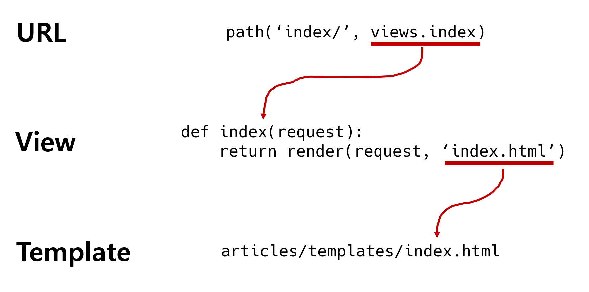

# ✍️ django 구조

​    

## 1️⃣ django 프로젝트

### 1-1. 프로젝트 구조

#### 1.`__init__.py`

- Python에게 프로젝트 디렉토리를 하나의 Python 패키지로 다루도록 지시
- 별도 추가 코드 작성 필요 없음 ❌

​    

#### 2.`asgi.py`

- Asynchronous Server Gateway Interface
- Django 애플리케이션이 비동기식 웹 서버와 연결, 소통하는 것을 도움
- 배포시 사용

​    

#### 3.`settings.py` ✔️✔️

- Django 프로젝트 설정을 관리

​    

#### 4.urls.py ✔️✔️

- 사이트의 url과 적절한 views의 연결을 지정

​    

#### 5.`wsgi.py`

- Web Server Gateway Interface
- Django 애플리케이션이 웹 서버와 연결, 소통하는 것을 도움
- 배포시 사용

​    

#### 6. manage.py`

- Django 프로젝트와 다양한 방법으로 상호작용하는 커맨드라인 유틸리티

```bash
$ python manage.py <command> [options]

# 예시
$ python manage.py runserver 
```

​    

---

## 2️⃣ django Application

### 2-1. APP 생성 

- 애플리케이션 이름은 __복수형__으로 작성하는 것을 권장

```bash
$ python manage.py startapp <앱명>

# 예시
$ python manage.py startapp articles
```

​    

### 2-2. APP 구조

#### 1.`apps.py`

- 앱의 정보가 작성되는 곳
- 별도로 추가 코드 작성 x  ❌

​    

#### 2.`models.py`

- 애플리케이션에서 사용하는 Model을 정의하는 곳
- MTV 패턴의 M에 해당

​    

#### 3.`tests.py`

- 프로젝트의 테스트 코드를 작성하는 곳

​    

#### 4.`views.py` ✔️✔️

- view 함수들이 정의되는 곳
- MTV 패턴의 V에 해당

​    

---

## 3️⃣ 실행순서

- 프로젝트에서 앱을 사용하기 위해서는 반드시 `settings.py`의 `INSTALLED_APPS` 리스트에 앱명을 추가해야함
- 일반적으로 가장 위에 추가함
- 반드시 앱 생성 후 등록해야함
- 리스트 마지막 줄에 `,`를 넣어주는게 관례

```python
# settings.py

INSTALLED_APPS = [
  # Local apps
	'새로운 앱 이름',
  
  # Third party apps
  
  # Django apps
	'...',
]
```

​    

> INSTALLED_APPS

- Django installation에 활성화된 모든 앱을 지정하는 문자열 목록

​    

> Project와 Application

| Project                           | Application                                      |
| --------------------------------- | ------------------------------------------------ |
| collection of apps                | 실제 요청을 처리하고 페이지를 보여주는 역할 담당 |
| 앱의 집합                         | 일반적으로 하나의 역할, 기능 단위로 작성         |
| 여러 앱이 포함될 수 있음          |                                                  |
| 앱은 여러 프로젝트에 있을 수 있음 |                                                  |

​    

---

## 4️⃣ 요청과 응답

- 데이터 흐름 : URL ➡️ View ➡️ TEMPLATE



​    

1. URL

```python
# urls.py
from django.contrib import admin
from django.urls import path  
 
# from 프로젝트명 import views  ✔️✔️
from articles import views ⬅️⬅️

urlpatterns = [	
  path('admin/', admin.site.urls),
  # path('url뒤에 붙일 문자', view파일의 index함수) ✔️✔️
  path('index/', views.index), ⬅️⬅️
]
```

​    

2. Views

- HTTP 요청을 수신하고 HTTP 응답을 반환하는 함수 작성
- Template에게 HTTP 응답 서식을 맡김

```python
# articles/views.py
def index(request): 
  context = {
    '키': 값
  }
	return render(request, 'index.html', context)
```

​    

> render()

```python
render(request, template_name, context)
```

- 템플릿을 컨텍스트 데이터와 결합하고 렌더링된 텍스트와 함께 HttpResponse객체를 반환하는 함수
- `request` : 응답을 생성하는데 사용되는 요청 객체
- `template_name` : 템플릿의 전체 이름 or 템플릿 이름의 경로
- `context` : 템플릿에서 사용할 데이터 (딕셔너리 타입)

​    

3. Templates

- 실제 내용을 보여주는데 사용되는 파일
- 파일의 구조 or 레이아웃 정의 (HTML파일)
- 파일 이름 헷갈리면 안됨 (`templates`) ❗❗
- 파일의 경로
  - app 폴더안의 templates 폴더
  - app_name/templates/

​    

---

## 5️⃣ django Template

- 데이터 표현을 제어하는 도구, 표현에 관련된 로직
- HTML 정적 부분에 동적 컨텐츠 삽입가능

​    

### 5-1. DTL (Django Template Language)

- django template에서 사용하는 내장 template 시스템
- 조건, 반복, 변수치환, 필터등의 기능 제공
- Python 코드로 실행되는 것이 아님으로 주의


### 5-2. DTL Syntax

#### 1. Variable

```django
{{ variable }}
```

- `render()`의 세번째 인자로 딕셔너리 형태로 넘겨받아 __키__ == 변수명으로 사용 

​    

#### 2. Filters 

```django
{{ variable|filter }}

{{ name|lower }}  {# 예시: name변수를 모두 소문자로 출력 #}
{{ name|truncatewords:30 }}
```

- 표시할 변수를 수정할 때 사용
- 60개의 내장 template 필터 제공
- 일부 필터는 인자를 받음

​    

#### 3. Tags

```django


```

- 출력 텍스트를 만들거나, 반복이나 논리를 수행하여 제어흐름을 만드는 등 변수보다 복잡한 일을 수행할 때 사용
- 일부 태그는 시작/종료 태그가 필요
- 24개의 내장 template 태그 제공

​    

#### 4. Comments

- 주석 표현

```django
{# 한줄 주석 #} 


 여러줄 주석

```