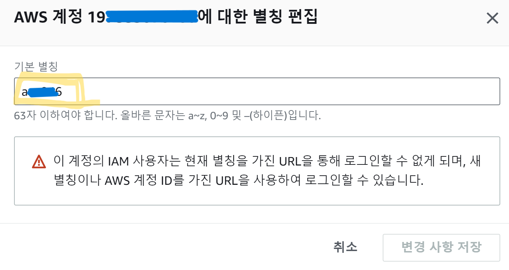
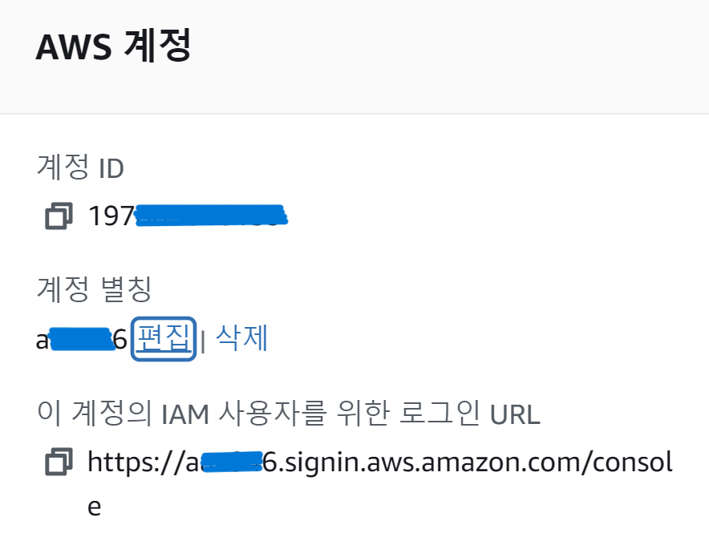
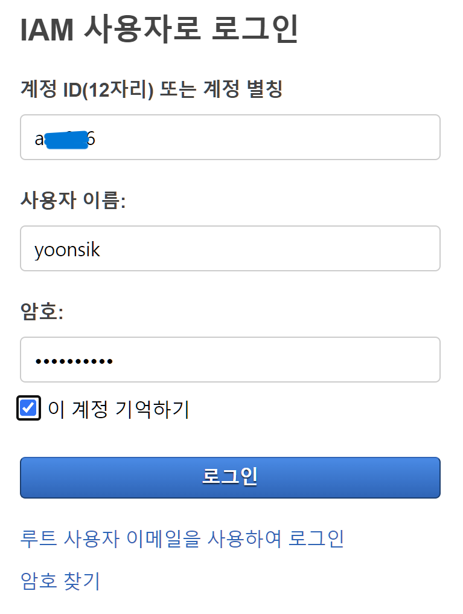

# AWS (1)

## IAM

- Identity and Access Management
- 사용자를 생성하고 그룹에 배치
- 글로벌 서비스
- Root 계정이 기본으로 생성됨
- Root 계정은 계정을 생성할 때만 사용되어야 함, 그 이후에는 사용하거나 공유해서는 안되고 사용자를 생성하여 사용해야함
- 그룹은 사용자만 배치할 수 있음, 다른 그룹은 포함시킬 수 없음
- 그룹에 속하지 않은 사용자도 있을 수 있음 (비추천)
- 한 사용자가 다수의 그룹에 속할 수도 있음
- IAM정책이라고 불리는 JSON 문서를 지정할 수 있음
- 특정 사용자 or 특정 그룹에 속한 모든 사용자들 어떤 작업에 권한을 가지고 있는지를 설명해 놓은것

```json
{
    "Version": "2012-10-17",
    "Statement": [
        {
            "Effect": "Allow",
            "Action": "ec2:Describe*",
            "Resource": "*"
        },
        {
            "Effect": "",
            "Action": "",
            "Resource": ""
        },
                {
            "Effect": "",
            "Action": "",
            "Resource": ""
        }
    ]
}
```

- AWS에서는 __최소권한의 원칙__을 적용함
- 사용자가 꼭 필요로 하는 것 이상의 권한을 주지 않음

​    

>  관리자 사용자와 일반사용자 생성

.assets/image-20230814151716288.png)

.assets/image-20230814153609776.png)

.assets/image-20230814152205323.png)

.assets/image-20230814153916306.png)

.assets/image-20230814152254437.png)

.assets/image-20230814152405446.png)

.assets/image-20230814152428356.png)

- 계정별칭은 계정에 더 빠르게 로그인하기 위해 설정할 수 있음

.assets/image-20230814152814704.png)





- IAM 사용자는 루트 사용자가 할 수 있었던 걸 거의 할 수 있음
- IAM 사용자는 자신의 자격 증명(사용자 이름 및 암호 또는 액세스 키)을 사용하여 AWS 서비스에 액세스함

​    

### IAM 정책

> IAM 정책 상속 (Inheritance)


- AWS 서비스에 요청을 보내는 권한의 집합을 정의하고 IAM 사용자, 사용자 그룹 및 IAM 역할이 사용할 수 있는 JSON 문서
- Version : 정책 언어 버젼
- Id : 정책을 식별 (선택사항)
- Statement: 갯수가 여러개일 수 있음
  - Sid : 문장의 식별자 (선택사항)
  - Effect: 특정 API에 접근하는 걸 허용할지 거부할지에 대한 내용 (Allow, Deny)
  - Principal :  특정 정책이 적용될 사용자, 계정, 혹은 역할로 구성됨
  - Action: Effect에 기반해 허용 및 거부되는 API의 호출 목록
  - Resource: 적용될 Action의 리소스의 목록
  - Condition: Statement가 언제 적용될지를 결정. (선택사항)

```json
{
    "Version": "2012-10-17",
    "Id": "S3-Account-Permissions",
    "Statement": [
        {
            "Sid": "1",
            "Effect": "Allow",
            "Principal": {
                "AWS": ["arn:aws:iam::351235:root"]
            },
            "Action": [
                "s3:GetObject",
                "s3:PutObject"
            ],
            "Resource": ["arn:aws:s3:::mybucket/*"]
        }
    ]
}
```

​    

> 권한 추가

.assets/image-20230815143622846.png)

.assets/image-20230815144133638.png)

.assets/image-20230815143659125.png)

​    

> 커스텀 정책

.assets/image-20230604003747006.png)

.assets/image-20230604003804116.png)

.assets/image-20230604003811044.png)

   

---

### IAM 보안

- 사용자 정보 보호
- 방어 매커니즘

​    

#### 비밀번호 정책 생성

- 비밀번호의 최소길이 설정가능
- 특정 유형의 글자 사용을 요구할 수 있음
- IAM 사용자들의 비밀번호 변경을 허용 / 금지할 수 있음
- 일정 기간이 지나면 비밀번호를 만료시켜 새 비밀번호 설정을 요구할 수도 있음
- 사용자 비밀번호의 재사용을 막아 이전에 사용했던 비밀번호는 사용하지 못하게 할 수 있음

.assets/image-20230604005345185.png)

.assets/image-20230604005358945.png)

​     

#### MFA 

- Multi Factor Authentication 다요소 인증
- AWS에서 필수적으로 사용하도록 권장함
- 비밀번호와 보안장비를 함께 사용하는 것

> 종류

1. 가상 MFA 장치 (Virtual MFA device)

   - Google Authenticator 사용, 하나의 휴대폰에서만 사용가능

   - Authy 사용, 여러 장치에서 사용가능, 하나의 장치에서도 토큰을 여러개 지원함

2. U2F / 보안키 (Universal 2nd Factor / Security Key)

   - 'Yubico'사의 YubiKey
   - 3rd party 장비
   - 하나의 보안키에서 여러 루트 계정과 IAM 사용자를 지원하여 하나의 키로도 충분

3. 하드웨어 키 팝 MFA 장치 (Hardware Key Fob MFA Device)

   - Gemalto : 3rd party 장비
   - SurePassID: 미국 정부 클라우드 AWS GovCloud 사용시. 3rd party 장비

.assets/image-20230604005452137.png)

.assets/image-20230604005512515.png)

.assets/image-20230604005523764.png)

​    

### AWS 접속방법 

1. AWS Management Console 활용

2. AWS CLI 이용 

   - 명령줄에서 명령어를 사용하여 AWS 서비스들과 상호작용할 수 있도록 해주는 도구
   - AWS 서비스의 공용 API로 직접 엑세스가 가능
   - 리소스를 관리하는 스크립트를 개발해 일부 작업을 자동화할 수 있음
   - 오픈소스로 Github에서 모든 소스코드를 찾을 수 있음
   - Access key에 의해 보호
   - [AWS CLI 설치법](https://docs.aws.amazon.com/ko_kr/cli/latest/userguide/getting-started-install.html)
   
3. AWS SDK (Software Developer Kit) 

   - AWS로부터 애플리케이션 코드 내에 API를 호출하고자 할 때 사용되는 방식
   - 특정언어로 된 라이브러리의 집합
   - 프로그래밍 언어마다 개별 SDK가 존재함
   - Access key에 의해 보호됨

​    

> Access Key 생성 및 CLI 접속

- 타인과 공유해서는 안됨
- Access Key ID ~= username
- Secret Access Key ~= password
- 사용자 > 보안 자격 증명

.assets/image-20230604011409921.png)

.assets/image-20230604011448739.png)

.assets/image-20230604011508460.png)

.assets/image-20230604011649216.png)

.assets/image-20230604011753288.png)

​    

> AWS 클라우드 쉘

- AWS상에서 무료로 사용 가능한 터미널

.assets/image-20230815151242424.png)

​    

---

### IAM 역할 

- AWS 서비스에서 사용할 AWS 서비스 요청을 위한 권한 집합을 정의하는 IAM 엔티티
- AWS의 Entity가 단기간 동안 자격 증명을 얻고 필요한 작업을 할 수 있게 해줌

> 자주 사용하는 역할종류

- EC2 인스턴스 역할
- Lambda 함수 역할
- CloudFormation 역할

> 역할 생성

.assets/image-20230604152744964.png)

.assets/image-20230604152835978.png)

.assets/image-20230604152900916.png)

​    

----

### IAM 보안도구

1. IAM 자격 증명 보고서 (계정수준)
   - 계정에 있는 사용자와 다양한 자격 증명의 상태를 포함


2. IAM 엑세스 관리자 (사용자수준)
   - 사용자에게 부여된 서비스의 권한과 해당 서비스에 마지막으로 액세스한 시간이 보임
   - 어떤 권한이 사용되지 않는지 볼 수 있음


​    

---

### IAM 모범 사례

1. 루트 계정은 AWS 계정을 설정할 때를 제외하고는 사용하지 않아야함
2. 하나의 실제 유저는 하나의 AWS user라고 생각해야함
3. 타인이 자신의 AWS를 이용한다면 자격증명을 주지말고 새로운 사용자를 만들어줘야함
4. user들을 그룹에 넣고 해당 그룹에 권한을 부여해줌
5. 비밀번호 정책을 강력하게 만들어야함
6. MFA를 이용해야함
7. AWS서비스에 권한을 부여할 때마다 역할을 만들고 사용해야함
8. CLI나 SDK를 사용할 때는 반드시 엑세스키를 만들어야함
9. 계정의 권한을 감사할 때는 IAM 자격 증명 보고서와 IAM 액세스 분석기를 사용할 수 있음
10. 절대로 IAM 사용자와 액세스키를 공유하면 안됨


> 문제풀이 오답정리

