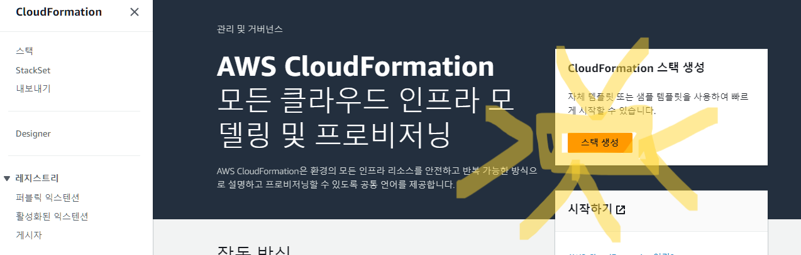
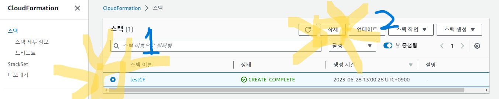
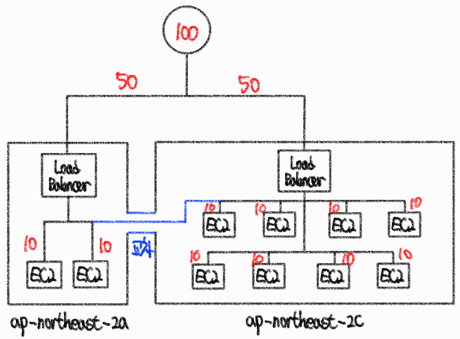

## 온프레미스

- 자체적인 공간과 자원으로 IT 환경을 구축 (On-Premises)
- 모든 것을 직접 구축
- 장점
  - 물리적 장비에 직접 접근이 가능하여 보안이 우수함
- 단점
  - 확장성을 고려한 설계가 필요함
  - 탄력적인 유지관리가 힘듬
  - 하드웨어의 감가상각이 있음

​    

## 클라우드 컴퓨팅

- 요구가 있을 때 즉시 IT 자원을 제공 (On-Demand)
- 사용한 만큼 비용을 지불 (Pay Per User)

### 서비스 유형

- 클라우드 공급자와 클라우드 사용자의 관리범위에 따라 클라우드 서비스 유형 분류

1. IaaS (Infrastructure-as-a-service)


- 클라우드 공급자가 인프라 영역까지 제공 (서버, DB, 스토리지)
- 나머지 영역은 클라우드 사용자가 직접 관리

2. PaaS (Platform-as-a-service)


- 클라우드 공급자가 하드웨어, 운영체제, 미들웨어, 런타임등을 정의해 플랫폼 형태로 제공
- 클라우드 사용자는 필요한 어플리케이션만 구성함

3. SaaS (Software-as-a-service)


- 클라우드 공급자가 IT자원의 모든 영역을 정의하고, SW형태로 제공함
- 클라우드 사용자는 별도의 작업없이 제공하는 SW 사용

​    

### 구축모델

- 클라우드 자원의 위치, 소유권, 주체에 따라 분류

1. 버블릭
   - 클라우드 자원의 주체가 클라우드 공급자에게 있음
   - 클라우드 사용자는 공급자에게 IT자원을 요구, 할당받고 사용한 만큼 비용 지불
2. 프라이빗
   - 온프레미스상에 구축되는 모델
3. 하이브리드 클라우드

​     

## AWS

### 인프라

- 리전에는 다수의 가용영역이 존재하여 장애, 자연재해등에 대비함
- 서로 초고속 네트워크 환경으로 구성됨


1. 리전 : 클라우드 자원이 모여있는 위치
2. 가용영역 : 리전내에 존재하는 데이터센터의 집합
3. 데이터센터 : 클라우드 자원을 보유하고 있는 가장 작은 단위

​    

### 클라우드 서비스

1. 컴퓨팅 서비스

- 클라우드 서버자원에서 가상서버를 생성하고 관리
- 종류 : EC2, ECS, EKS, Lambda, Ligthsail

2. 네트워킹/컨텐츠 전송

- 클라우드에서 생성한 다양한 자원들의 내/외부 통신을 위한 서비스
- 종류 : VPC, ELB, Route53, Transit Gateway, Global Accelerator, Direct Connect, VPC Peering, CloudFront, Site-to-Site VPN

3. 스토리지 서비스

- 클라우드에 안정적이고 확장성있는 데이터 스토어
- 종류 : S3, EBS, EFS

4. 데이터베이스 서비스

- 클라우드 상에서 완전관리되는 데이터베이스
- 종류 : Aurora, RDS, DynamoDB

​    

### 자원관리

1. AWS 관리콘솔 (Management Console)

- 웹 기반의 사용자 인터페이스를 제공

2. AWS CLI (Command Line Interface)

- shell 프로그램에서 명령어 기반으로 AWS 관리
- 오픈소스로 만들어진 awscli라는 도구를 사용하여 AWS와 상호작용함

3. AWS SDK (Software Development Kit)

- AWS자원을 프로그래밍에서 사용하기 위해 제공하는 라이브러리

​     

## EC2

- Elastic Compute Cloud
- AWS 클라우드 환경에서 확장 가능한 컴퓨팅 자원을 제공해 가상서버를 운영
- EC2 인스턴스라는 형태로 사용자에게 자원 임대


### EC2 인스턴스

- 가상의 컴퓨팅 환경 정의
- EC2 인스턴스 요소

1. 이름/태그
2. AMI(Amazon Machine Image) : 인스턴스의 운영체제, 소프트웨어 정의
3. 유형 : 가상의 CPU, Memory등과 같은 가상서버 스펙 정의
4. 키페어 : 자격증명을 위한 퍼블릭키/프라이빗키 설정
5. 네트워크 : VPC, 가용영역, 방화벽 설정
6. 스토리지 : 데이터 저장공간 정의 (스토리지유형, 디스크 용량)

​    

## CloudFormation

- AWS 클라우드 인프라를 특정 코드로 정의하고 선언하여 자원을 생성하거나 삭제하는 기능
- AWS에서 자체적으로 지원하는 IaC 서비스
- 템플릿을 구성하고 CloudFormation 스택을 생성하면 코드정의에 따라 클라우드 인프라 순차적으로 자동생성

> IaC(Infrastructure as Code) : 인프라를 코드로 정의
>
> 템플릿 : 코드로 인프라를 정의한 텍스트 파일 (JSON, YAML)
>
> 스택 : 다수의 AWS 클라우드 인프라들을 정의하는 단위


​    

### 생성




> 이후 설정할 것 없이 완료버튼 클릭


​    

### 삭제

- 생성된 자원을 일일히 삭제하는 것이 아닌 CloudFormation 스택 삭제만으로 모든 자원 순차적 자동삭제 가능




​     

​    

## VPC

- Virtual Private Cloud
- aws 클라우드 환경에서 독립된 가상의 프라이빗 네트워크를 구성하는 서비스
- 사용자만의 독립된 네트워크 환경을 구성할 수 있음


### 유형

|             | 기본 VPC (Default VPC) | 사용자 VPC (Custom VPC) |
| ----------- | ---------------------- | ----------------------- |
| 생성주체    | AWS                    | 사용자                  |
| 자원        | 정해진 자원 미리 생성  | 수동으로 자원 생성      |
| 리전별 수량 | 1개                    | 최대 5개                |

​    

### 서브넷

- vpc내에서도 서브넷을 통해 네트워크를 분리할 수 있음
- 서브넷의 IP CIDR는 VPC의 IP CIDR에 속해 있어야함
- 서브넷은 1개의 가용영역에 종속됨


- 서브넷 종류
  1. 퍼블릭 서브넷 : 외부 인터넷 구간과 직접적으로 통신할 수 있는 공공 네트워크
  2. 프라이빗 서브넷 : 외부 인터넷 구간과 직접적으로 통신할 수 없는 폐쇄적인 네트워크


​    

### 가상라우터 / 라우팅테이블

- VPC를 생성하면 자동으로 가상 라우터와 기본 라우팅 테이블을 생성됨


- 가상 라우터는 라우팅 테이블을 통해 라우팅을 수행
- 가상 라우터는 별도의 사용자 정의 라우팅 테이블을 생성하여 사용할 수 있음


​    

### 인터넷 게이트웨이

- 인터넷 구간과 직접적인 연결을 통해 통신을 수행하는 곳

​    

### NAT 게이트웨이

- Network Address Translation
- IP주소를 변환하는 기능을 수행
- 퍼블릭 IP주소를 프라이빗 IP주소로 변환할 때 사용
- 여러 단말들은 프라이빗 IP주소가 할당되고, 공유기 하나만 퍼블릭IP주소가 할당됨


### 실습

#### 퍼블릭 서브넷

.assets/image-20230628232228830.png)

> 기본 VPC

.assets/image-20230628232245091.png)

> Resource map

.assets/image-20230628232335052.png)

> VPC 생성

.assets/image-20230628232412197.png)

> VPC생성시 기본 라우팅 테이블 생성

.assets/image-20230628232519010.png)

> 서브넷 생성

.assets/image-20230628233040401.png)

.assets/image-20230628233203523.png)

> 라우팅 테이블 생성

.assets/image-20230628233436676.png)

.assets/image-20230628233508504.png)

.assets/image-20230628233602513.png)

.assets/image-20230628233616091.png)

.assets/image-20230628233628441.png)

> 인터넷 게이트웨이 생성

.assets/image-20230628233708735.png)

.assets/image-20230628233723762.png)

.assets/image-20230628233735050.png)

.assets/image-20230628233748109.png)

> 라우팅 테이블에 인터넷 게이트웨이 추가

.assets/image-20230628233905059.png)

.assets/image-20230628234001198.png)

> 완성 VPC Resource map

.assets/image-20230628234113681.png)

​    

#### 프라이빗 서브넷

> 서브넷 생성

.assets/image-20230701121404479.png)

> 라우팅테이블 생성

.assets/image-20230701121640903.png)

.assets/image-20230701121719162.png)

.assets/image-20230701121732261.png)

.assets/image-20230701121741350.png)

> NAT 게이트웨이 생성

.assets/image-20230701121824000.png)

.assets/image-20230701121925036.png)

> 프라이빗 라우팅 테이블에 NAT 게이트웨이 경로 추가

.assets/image-20230701122404469.png)

.assets/image-20230701122422391.png)

.assets/image-20230701122451479.png)

> Resouce map 확인

.assets/image-20230701122554713.png)

​    

### 보안기능

#### 네트워크 접근제어

- IT자원 보호를 위해 네트워크에서 트래픽을 허용하거나 거부하는 접근 제어하는 것
- IP주소, 프로토콜, 포트번호등으로 트래픽을 __식별__함
- 트래픽 식별 후, 정책 테이블과 비교하며 __인증__여부를 판단함
- 인증에 통과한 트래픽은 통과, 나머지는 거부시킴 (__권한__)

.assets/image-20230701145838371.png)


>  트래픽 흐름

- 출발지 IP, 출발지포트
- 접근 제어 시스템을 기준으로 들어오는 트래픽을 __인바운드 트래픽__, 나가는 트래픽을 __아웃바운드 트래픽__이라고함

.assets/image-20230701145911536.png)

​     

>  임시포트 

- 임시적으로 사용하는 휘발성 포트번호
- 특정 범위내에서 랜덤하게 생성하여 통신이 끝나면 삭제함


#### 보안그룹 / 네트워크 ACL

- VPC내의 자원에 대해 네트워크 접근 제어를 수행하는 가상의 방화벽

.assets/image-20230701145940141.png)

- 보안 그룹

  - 서브넷 내에 존재하는 자원들의 접근 제어를 수행
  - 보안 그룹은 이전의 상태정보를 기억하고 다음에 그 상태를 활용하는 Stateful 방식을 사용함
  - 인바운드 규칙으로 허용된 트래픽은 리턴될 때, 아웃바운드 규칙을 무시(Bypass)하고 외부로 트래픽이 전달됨
  - 정책 테이블에서 허용 대상만 나열하고 매칭 실패시 거부됨

  | 프로토콜 | 포트범위 | 출발지 IP CIDR |
  | -------- | -------- | -------------- |
  | TCP      | 80       | 10.1.1.0/24    |
  | TCP      | 22       | 0.0.0.0/0      |
  | UDP      | 67 - 68  | 0.0.0.0/0      |
  | ICMP     |          | 10.0.0.0/8     |

- 네트워크 ACL

  - VPC내에 존재하는 서브넷에 대한 접근 제어를 수행
  - 이전 상태정보를 기억하고 있지않는 stateless 방식을 사용함
  - 인바운드 규칙으로 허용된 트래픽도 리턴될 때, 아웃바운드의 규칙을 확인하는 과정을 거침
  - 허용/거부를 설정할 수 있고, 마지막 규칙으로 모든 트래픽 거부가 있음

  | 프로토콜 | 포트범위 | 출발지 IP CIDR | 허용/거부 |
  | -------- | -------- | -------------- | --------- |
  | TCP      | 80       | 10.1.1.0/24    | 허용      |
  | TCP      | 22       | 0.0.0.0/0      | 허용      |
  | UDP      | 67 - 68  | 0.0.0.0/0      | 거부      |
  | ICMP     |          | 10.0.0.0/8     | 거부      |
  | ALL      | 모두     | 모두           | 거부      |

  

### Flow Logs

- VPC에 속한 네트워크 인터페이스 (ENI : Elastic Network Interface)에 대한 송수신 트래픽 흐름정보를 수집하는 기능
- Amazon VPC Flow Logs에서 수집하여 표출하는 정보 형태를 __Flow Logs Record__라고 함

```bash
<version><account-id><interface-id><srcaddr><dstaddr><srcport><dstport><protocol><packets><bytes><start><end><action><log-status>
```

| Flow Logs Record                               | 설명                                                      |
| ---------------------------------------------- | --------------------------------------------------------- |
| <version>                                      | 기본적으로 버전2 사용                                     |
| <account-id><interface-id>                     | 사용자의 계정 ID / 네트워크 인터페이스 ID                 |
| <srcaddr><dstaddr><srcport><dstport><protocol> | 출발지IP, 목적지IP, 출발지Port, 목적지Port, 프로토콜 정보 |
| <packets><bytes>                               | 전송된 패킷 수, 전송된 패킷 사이즈                        |
| <start><end>                                   | 로그정보집계 시작시간, 종료시간                           |
| <action>                                       | 로그 정보 트래픽 유형 (ACCEPT / REJECT)                   |
| <log-status>                                   | 로그 상태 정보 (OK/NODATA)                                |

- 게시 작업을 위해 사용권한을 부여해야함

.assets/image-20230701150033837.png)


> 네트워크 인터페이스

- 네트워크 통신 연결을 위한 물리적/논리적 접근 방법
- IP주소를 할당하고 통신
- AWS상에는 ENI (Elastic Network Interface)이라는 네트워크 인터페이스가 있음

​    

---

## ELB

- 같은 작업을 수행하는 다수의 IT자원에 대해 트래픽을 분산하여 전달하는 부하분산 (로드밸런싱) 기능을 수행
- 리스너(Listener)와 대상그룹(Target Group)으로 구성되어있음
- 리스너를 통해 트래픽의 프로토콜과 포트번호를 정의하고, 규칙을 생성하고 어떤 작업을 수행할 지 정의할 수 있음
- 대상 그룹에 속한 대상에게 주기적으로 Keepalive를 보내 상태를 확인함

.assets/image-20230702203123743.png)

- 가용영역별로 로드밸런서 노드가 생성되고 가용영역에 존재하는 대상에게 부하 분산을 함

.assets/image-20230702203058683.png)


>  교차 영역 로드밸런싱 (Cross-Zone Load Balancing)

- 가용영역 기준이 아닌 가용영역내에 위치한 대상 자원을 기준으로 균일한 비중으로 부하를 분산
- 가용영역별로 인스턴스 수량이 불균형하게 위치할 때, 트래픽 비중을 보정



​    

### 종류

1. ALB (Application)
   -  HTTP, HTTPS에 대한 트래픽을 부하 분산하는 OSI 7계층의 로드 밸런서
2. NLB (Network)
   - TCP와 UDP에 대한 트래픽을 부하 분산하는 OSI 4계층의 로드 밸런서
3. GWLB (GateWay)
   - VPC 내부 라우팅으로 Third-party 방화벽/어플라이언스를 대상으로 경유하는 트래픽을 부하 분산하는 로드 밸런서
   - VPC내 AWS Market Place로 Third-Party 방화벽 구성
4. CLB (Classic)
   - 사용안함

|                     | ALB                          | NLB                 |
| ------------------- | ---------------------------- | ------------------- |
| OSI 계층            | 7계층                        | 4계층               |
| 프로토콜            | HTTP, HTTPS                  | TCP, UDP, TLS       |
| 고급라우팅          | HTTP 헤더를 통한 고급 라우팅 | 미지원              |
| 처리속도            | 느림                         | 빠름                |
| 보안그룹            | 사용                         | 미사용              |
| 교차영역 로드밸런서 | 기본값으로 활성화            | 기본값으로 비활성화 |

​    

---

## Route53

- AWS에서 제공하는 관리형 DNS 서비스
- 도메인 네임 등록
  - 도메인 네임의 TLD에 해당하는 등록소에 도메인 등록작업을 하는 등록대행소 역할을 수행 (권한있는 네임서버)

- 호스팅 영역 생성
  - 퍼블릭 호스팅 영역과 프라이빗 호스팅 영역으로 분류됨
  - 권한있는 네임서버 정의 
    - ns-xxx.awsdns-yy.org.
    - ns-xxx.awsdns-yy.com.
    - ns-xxx.awsdns-yy.net.
    - ns-xxx.awsdns-yy.co.uk.

- 레코드 작성
  - www.abc.com CNAME abc.com
  - abc.com A 13.05.132.32
  - abc. NS ns-xxx.awsdns-yy.com


​     

> 라우팅 정책

- 레코드를 생성할 때 라우팅 정책을 지정하여 DNS 요청에 대한 응답 방식을 정의하는 것

1. 단순 라우팅 (Simple Routing)

   - 도메인에 대한 대상을 지정 (도메인에 IPv4 주소 매핑)
   - 다수의 대상을 지정하면 랜덤하게 라우팅함

   

2. 가중치 기반 라우팅 (Weighted Routing)

   - 도메인에 대한 다수 대상을 비중에 따라 라우팅
   - 가중치 범위 : 0 ~ 255 

   

3. 장애 조치 라우팅 (Failover Routing)

   - 도메인에 대한 다수 대상을 액티브/패시브 구조로 지정하고 상태확인을 통해 라우팅

   

4. 지연시간 기반 라우팅 (Letency Routing)
   - 리전별로 분리된 대상으로 라우팅시, 지연시간을 확인해 최적의 경로를 선택

5. 지리위치 라우팅 (Geolocation Routing)
   - 사용자 PC가 지정하는 DNS서버의 지리적 위치를 파악해 인접한 리전으로 경로를 선택

6. 지리근접 라우팅 (Geoproximity Routing)
   - 지리위치 라우팅과 동일한 형태에서, 영향도 조정으로 값을 제어할 수 있는 라우팅방식

7. 다중값 응답 라우팅 (Multi-Value Answer Routing)
   - DNS 요청에 대해 다수의 값을 반환


### DNS


- Domain Name System

- 통신을 위한 주소체계를 문자형태로 매핑하여 연결한 것

- DNS 프로토콜은 UDP 53 포트번호를 사용

- 도메인 네임 = SLD + TLD

  


> 레코드 유형

- 도메인에 대한 요청 처리 방법에 대한 다양한 DNS 레코드 유형이 존재함

1. `A`
   - 도메인을 IPv4 주소에 매핑
   - `abc.com A 13.17.102.3`
2. `AAAA`
   - 도메인을 IPv6 주소에 매핑
   - `abc.com AAAA 2000:B20::3000`
3. `NS`
   - 도메인에 대해 네임서버를 정의
   - `com NS abc.com`
4. `CNAME`
   - 도메인의 별칭 정의
   - 도메인 네임을 다른 도메인 네임으로 정의
   - `www.aaa.net CNAME abc.com`
5. etc : SOA, MX, SRV, TXT, PTR, ANY


### 네임서버

- 네임서버는 계층적인 구조로 이루어짐

- 상위 네임서버가 하위 네임서버를 관리함

  

> 종류

1. SLD 네임 서버
   - `learncode.com.`
   - 실제 도메인 네임의 최종 정보를 가지고 있는 서버
   - 권한 있는 네임서버(Authoritative Name Server) or 신뢰하는 네임서버라고도 불림
2. TLD 네임서버
   - `.com.`
   - SLD 서버를 알고 있음
   - SLD 서버에서 관리하는 서브도메인은 알지못함
3. 루트 네임 서버
   - `.`
   - 전세계의 TLD 네임 서버의 주소를 알고 있음
   - SLD 네임 서버까지는 알고 있지 않음

​    

> 권한 없는 응답

- 캐싱을 통해 권한있는 네임서버에 묻지 않고 DNS 서버가 자체적으로 응답하는 것

​    

### 실습

#### 단순 라우팅 정책

>  A레코드 : 인스턴스1 + 인스턴스2

.assets/image-20230703130803121.png)

.assets/image-20230703130827248.png)

.assets/image-20230703131902395.png)

> A 레코드 : ALB

.assets/image-20230703132444516.png)

​    

#### 가중치 라우팅 정책

.assets/image-20230703133223788.png)

.assets/image-20230703133303828.png)

​    

#### 장애조치 라우팅 정책

.assets/image-20230703133748551.png)

.assets/image-20230703133847306.png)

.assets/image-20230703133906512.png)

.assets/image-20230703134043409.png)

.assets/image-20230703134103455.png)

.assets/image-20230703134313647.png)

.assets/image-20230703134334567.png)

.assets/image-20230703134736408.png)

.assets/image-20230703134721687.png)
