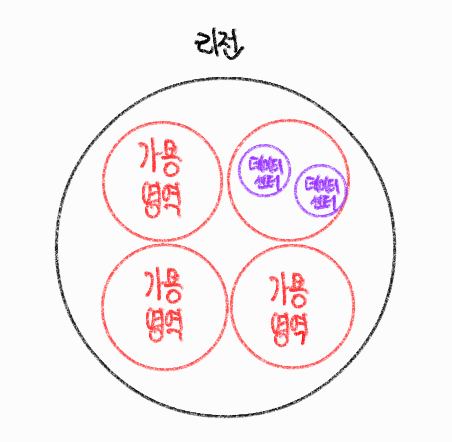
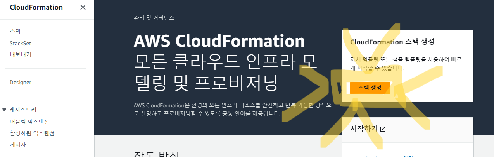
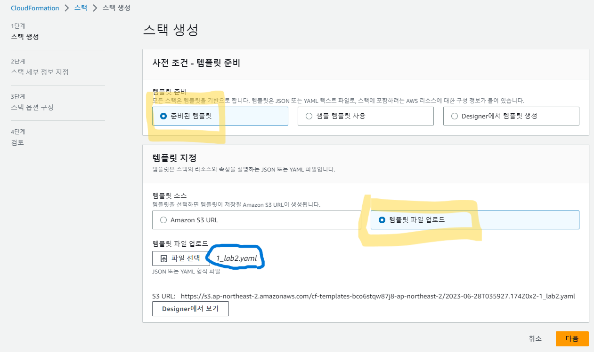
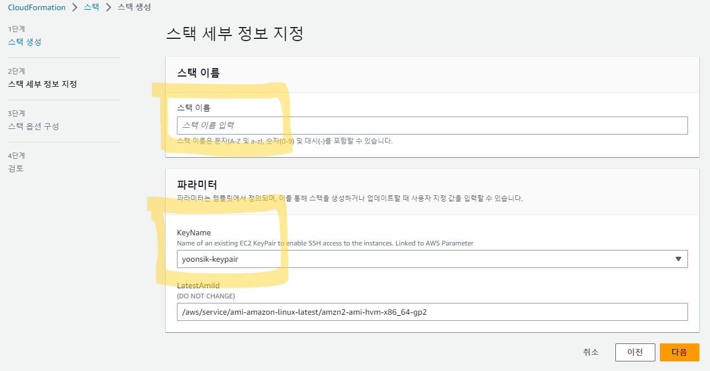
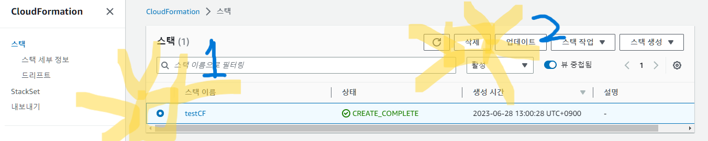
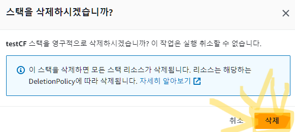

## 온프레미스

- 자체적인 공간과 자원으로 IT 환경을 구축 (On-Premises)
- 모든 것을 직접 구축
- 장점
  - 물리적 장비에 직접 접근이 가능하여 보안이 우수함
- 단점
  - 확장성을 고려한 설계가 필요함
  - 탄력적인 유지관리가 힘듬
  - 하드웨어의 감가상각이 있음

​    

## 클라우드 컴퓨팅

- 요구가 있을 때 즉시 IT 자원을 제공 (On-Demand)
- 사용한 만큼 비용을 지불 (Pay Per User)

### 서비스 유형

- 클라우드 공급자와 클라우드 사용자의 관리범위에 따라 클라우드 서비스 유형 분류

1. IaaS (Infrastructure-as-a-service)

- 클라우드 공급자가 인프라 영역까지 제공 (서버, DB, 스토리지)
- 나머지 영역은 클라우드 사용자가 직접 관리

2. PaaS (Platform-as-a-service)

- 클라우드 공급자가 하드웨어, 운영체제, 미들웨어, 런타임등을 정의해 플랫폼 형태로 제공
- 클라우드 사용자는 필요한 어플리케이션만 구성함

3. SaaS (Software-as-a-service)

- 클라우드 공급자가 IT자원의 모든 영역을 정의하고, SW형태로 제공함
- 클라우드 사용자는 별도의 작업없이 제공하는 SW 사용

​    

### 구축모델

- 클라우드 자원의 위치, 소유권, 주체에 따라 분류

1. 버블릭
   - 클라우드 자원의 주체가 클라우드 공급자에게 있음
   - 클라우드 사용자는 공급자에게 IT자원을 요구, 할당받고 사용한 만큼 비용 지불
2. 프라이빗
   - 온프레미스상에 구축되는 모델
3. 하이브리드 클라우드

​     

## AWS

### 인프라

- 리전에는 다수의 가용영역이 존재하여 장애, 자연재해등에 대비함
- 서로 초고속 네트워크 환경으로 구성됨

1. 리전 : 클라우드 자원이 모여있는 위치
2. 가용영역 : 리전내에 존재하는 데이터센터의 집합
3. 데이터센터 : 클라우드 자원을 보유하고 있는 가장 작은 단위

​    

### 클라우드 서비스

1. 컴퓨팅 서비스

- 클라우드 서버자원에서 가상서버를 생성하고 관리
- 종류 : EC2, ECS, EKS, Lambda, Ligthsail

2. 네트워킹/컨텐츠 전송

- 클라우드에서 생성한 다양한 자원들의 내/외부 통신을 위한 서비스
- 종류 : VPC, ELB, Route53, Transit Gateway, Global Accelerator, Direct Connect, VPC Peering, CloudFront, Site-to-Site VPN

3. 스토리지 서비스

- 클라우드에 안정적이고 확장성있는 데이터 스토어
- 종류 : S3, EBS, EFS

4. 데이터베이스 서비스

- 클라우드 상에서 완전관리되는 데이터베이스
- 종류 : Aurora, RDS, DynamoDB

​    

### 자원관리

1. AWS 관리콘솔 (Management Console)

- 웹 기반의 사용자 인터페이스를 제공

2. AWS CLI (Command Line Interface)

- shell 프로그램에서 명령어 기반으로 AWS 관리
- 오픈소스로 만들어진 awscli라는 도구를 사용하여 AWS와 상호작용함

3. AWS SDK (Software Development Kit)

- AWS자원을 프로그래밍에서 사용하기 위해 제공하는 라이브러리

​     

## EC2

- Elastic Compute Cloud
- AWS 클라우드 환경에서 확장 가능한 컴퓨팅 자원을 제공해 가상서버를 운영
- EC2 인스턴스라는 형태로 사용자에게 자원 임대

### EC2 인스턴스

- 가상의 컴퓨팅 환경 정의
- EC2 인스턴스 요소

1. 이름/태그
2. AMI(Amazon Machine Image) : 인스턴스의 운영체제, 소프트웨어 정의
3. 유형 : 가상의 CPU, Memory등과 같은 가상서버 스펙 정의
4. 키페어 : 자격증명을 위한 퍼블릭키/프라이빗키 설정
5. 네트워크 : VPC, 가용영역, 방화벽 설정
6. 스토리지 : 데이터 저장공간 정의 (스토리지유형, 디스크 용량)

​    

## CloudFormation

- AWS 클라우드 인프라를 특정 코드로 정의하고 선언하여 자원을 생성하거나 삭제하는 기능
- AWS에서 자체적으로 지원하는 IaC 서비스
- 템플릿을 구성하고 CloudFormation 스택을 생성하면 코드정의에 따라 클라우드 인프라 순차적으로 자동생성

> IaC(Infrastructure as Code) : 인프라를 코드로 정의
>
> 템플릿 : 코드로 인프라를 정의한 텍스트 파일 (JSON, YAML)
>
> 스택 : 다수의 AWS 클라우드 인프라들을 정의하는 단위

​    

### 생성

> 이후 설정할 것 없이 완료버튼 클릭

​    

### 삭제

- 생성된 자원을 일일히 삭제하는 것이 아닌 CloudFormation 스택 삭제만으로 모든 자원 순차적 자동삭제 가능

​     

​    

## VPC

- Virtual Private Cloud
- aws 클라우드 환경에서 독립된 가상의 프라이빗 네트워크를 구성하는 서비스
- 사용자만의 독립된 네트워크 환경을 구성할 수 있음

### 유형

|             | 기본 VPC (Default VPC) | 사용자 VPC (Custom VPC) |
| ----------- | ---------------------- | ----------------------- |
| 생성주체    | AWS                    | 사용자                  |
| 자원        | 정해진 자원 미리 생성  | 수동으로 자원 생성      |
| 리전별 수량 | 1개                    | 최대 5개                |

​    

### 서브넷

- vpc내에서도 서브넷을 통해 네트워크를 분리할 수 있음
- 서브넷의 IP CIDR는 VPC의 IP CIDR에 속해 있어야함
- 서브넷은 1개의 가용영역에 종속됨
- 서브넷 종류
  1. 퍼블릭 서브넷 : 외부 인터넷 구간과 직접적으로 통신할 수 있는 공공 네트워크
  2. 프라이빗 서브넷 : 외부 인터넷 구간과 직접적으로 통신할 수 없는 폐쇄적인 네트워크

​    

### 가상라우터 / 라우팅테이블

- VPC를 생성하면 자동으로 가상 라우터와 기본 라우팅 테이블을 생성됨
- 가상 라우터는 라우팅 테이블을 통해 라우팅을 수행
- 가상 라우터는 별도의 사용자 정의 라우팅 테이블을 생성하여 사용할 수 있음

