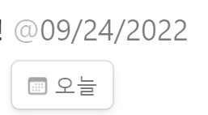

 Workspace : 업무 협업 공간

Page : 업무 묶음

Block : 상세 Task

## 페이지 만들기

- 페이지 추가 버튼시 빈 페이지 추가됨

- 빈페이지 설정값

  - 제목
    - 아이콘 추가
    - 커버 추가
    - 댓글 추가
  - 빈페이지, 아이콘 사용
  - 템플릿
  - 가져오기
  - 데이터 베이스
    1. 표: 간단한 스프레드 시트
    2. 보드 : Kanban 기반의 업무 프로세스 / To do 관리
    3. 타임라인 : 간트차트 스타일의 일정관리
    4. 캘린더 : 캘린더 기반의 일정 관리
    5. 갤러리 : 썸네일 기반의 정보 공유

  > ✔️ 아무것도 선택하지 않고 빈화면 클릭하면 이 페이지에 바로 글쓰기 가능

## 글 작성

- 글 작성 기본 상태 :  

- `/`입력시 나오는 창 :  

- `@` : 날짜, 사람, 페이지 멘션 가능

 

- 행 구역 나누기

- 점 6개 기능

- 텍스트 드래그시

- URL 가져오기
  - 일반적으로 북마크 사용

- 텍스트를 새로운 페이지로 이동하도록 변환하기

- 텍스트 > 체크박스 만들기
  - 점 6개 클릭 후 할 일 목록 선택

## 업무 관리

