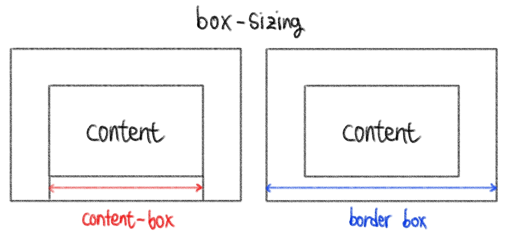

# CSS 정리_2

​    

## 1️⃣ 박스모델

- width : 너비
- height : 높이
- box-shaow : 그림자


### 1. Border  (테두리) 

- Border 특성

1. border-width : 테두리 굵기
2. border-color : 테두리 색상
3. border-style : 테두리 종류 (점선, 실선)

>  한번에 width / style / color 특성 사용

```css
border: witdh style color;
```

4. __box-sizing : border-box__ : 좌우 테두리를 기준으로 요소의 크기를 결정하게 만들어줌❗❗
5. border-radius : 모서리 곡률

​    

### 2. Padding (패딩)  -  초록색

- 콘텐츠 박스와 테두리 사이의 남는 공간

```css
padding: 10px;                      /* 4방향 모두 */
padding: vertical horizontal;       /* 상하 좌우 */
padding: top horizontal bottom;     /* 상 좌우 하 */
padding: top right bottom left;     /* 상 우 하 좌 (시계방향) */
```

​    

### 3. Margin (여백)  -  주황색

- 두 요소의 Border (테두리)간의 간격
- 몇몇 태그들은 기본적으로 마진이 설정되어있기도 함 (body, h1)

```css
margin: 10px;                      /* 4방향 모두 */
margin: vertical horizontal;       /* 상하 좌우 */
margin: top horizontal bottom;     /* 상 좌우 하 */
margin: top right bottom left;     /* 상 우 하 좌 (시계방향) */
```

​       

---

## 2️⃣ Display

display 특성

- 인라인 요소는 width, height 무시, padding, margin 좌우는 적용, 상하는 무시

1. Inline
   - 블록 요소를 인라인 요소로 만들어줌 
   - 줄 바꿈이 일어나지 않는 행의 일부 요소
   - content 너비만큼 가로 폭 차지
   - width, height, margin-top, margin-bottom을 지정할 수 없음
   - 상하 여백은 `line-height` 활용
   - `span / a / img / input, label / b, em, i , strong`
2. Block
   - 인라인 요소를 블록 요소로 만들어줌
   - 줄 바꿈이 일어나는 요소
   - 화면 크기 전체의 가로 폭을 차지
   - 너비를 가질 수 없다면 자동으로 마진 부여
   - `div / ul, ol, li / p / hr / form`
3. __Inline-Block__ : 인라인 요소처럼 작동하지만 width, height, padding, margin 적용가능❗❗
4. None : 안보이게 설정 (JS에서 활용)

```css
display: inline;   
display: block;           /* 한 행 전부 차지 */
display: inline-block;    /* 자신의 크기만큼 차지 */
display: none;
vertical-align: top;      /* 상하 정렬 (인라인 or 인라인블록만 적용)*/
```

​    

---

## 3️⃣ CSS 단위

### 상대적 단위 (Relavtive)

- em

  - 부모 요소의 배수
  - 요소에 맞춰 자동으로 바뀌는 경우에 사용 (연동)
  - 외부 여백 크기 (Padding, Margin)를 정할 때 자기 자신의 글자 크기를 기준으로 함 ❗❗
  - 단점 : 여러번 상속되면 값 증감이 누적됨

- rem

  - 부모 요소에 따라 바뀌지 않고 루트 HTML 요소의 글씨 크기에 따라 바뀜
  - `<html>` 태그의 글자 크기

- % 

  - 부모 요소의 상대적 크기를 지정할 때 사용
  - 너비, 높이, 여백, 글자 크기에도 사용가능
  - 가변적인 레이아웃에서 자주 사용

- Viewport 크기 단위

  - 웹페이지를 방문한 유저에게 바로 보이게 되는 웹 컨텐츠의 영역 (디바이스 화면)

  - 디바이스의 viewport를 기준으로 상대적인 사이즈가 결정됨
  - `vw` : 화면 크기에서 너비의 1/100 
  - `vh` : 화면 크기에서 높이의 1/100
  - 너비가 달라질 때는 글자 크기가 달라지지 않지만, 높이가 달라지면 글자 크기가 달라짐
  - `vmin` 
    - 뷰포트 높이와 너비 중 __작은쪽__의 1/100
    - 뷰포트 높이가 더 작은 경우, 1vmin = 뷰포트 높이의 1/100
    - 뷰포트 너비가 더 작은 경우, 1vmin = 뷰포트 높이의 1/100
  - `vmax`
    - 뷰포트 높이와 너비 중 __큰쪽__의 1/100
    - 뷰포트 높이가 더 큰 경우, 1vmax = 뷰포트 높이의 1/100
    - 뷰포트 너비가 더 큰 경우, 1vmax = 뷰포트 높이의 1/100

​    

### 절대적 단위 (Absolute)

- px
- cm
- in 
- mm

​    

---

## 4️⃣ 기타 유용한 속성들

- 알파채널

```css
rgba(red, green, blue, alpha)      /* alpha 0 ~ 1 */
```

- 불투명도

```css
opacity: 0.3;           /* opacity 0 ~ 1 */
```

​    

---

## 5️⃣ 전환 (transition)

- 전환효과시 적용할 수 있는 속성

```css
transition: property name | duration;
transition: property name | duration | delay;
transition: property name | duration | timing function | delay;

transition: margin-left 4s, color 1s;
transition: all 0.5s ease-out;

transition-property: all;  /* 적용될 css속성 */
transition-duration: 1s;   /* 전환 애니메이션이 완료되는데 걸리는 시간 설정 */
transition-timing-function: ease-in;  /* 전환 애니메이션의 진행속도 조절  */
transition-delay: 3s;      /* 전환효과가 일어나기 시작하기까지의 시간 지정 */
```

​    

---

## 6️⃣ 변형 (transform)

- 사물 회전, 원근 왜곡, 확대, 축소, 늘리기. 기울이기, 페이지를 가로질러 위아래로 이동

### 6-1. 회전

- 단위 : `deg`, `grad`, `rad`, `turn` 

```css
transform: rotate(45deg);
transform: rotateX(0);       /* x축 기준으로 회전 */
transform-origin: top left;  /* 회전 기준점 변경 */
```

### 6-2. 크기변형

```css
transform: scale(0.5);    /* 절반크기 */	
transform: scale(2);      /* 2배 */
transform: scale(2, 1);   /* 너비2배 높이 그대로 */
transform: scaleY(2);     /* y축 2배 */
```

### 6-3. Translate

- 요소를 움직이는 기능

```css
transform: translateX(2rem);   /* X축으로 2rem 움직임 */
transform: translateX(-100px, 100px);
```

### 6-4.  skew

- 요소를 2차원 평면상에서 기울이는 기능
- 단위 : `deg`, `grad`, `rad`, `turn` 

```css
transform: skew(30deg);
transform: skew(10deg, 5deg);
```

​    

> 여러 속성 한번에 사용하기

```css
transform: translateX(10px) rotate(10deg) translateY(5px);
```

​    

---

## 7️⃣ background-img

```scss
background-image: url(" ");   /* ..의 의미: 상위폴더로 이동 */

background-size: contain;     /* 비율을 유지하며 이미지 잘림없이 최대한 꽉 차게 표시*/
background-size: cover;       /* 비율을 유지하지만 이미지 잘림있음*/
background-size: auto;

background-repeat: no-repeat;

background-position: top;     /* 이미지의 상단을 기준으로 화면표현 */
```

```css
/* 속기법 (선언순서 상관없음) */
background: url(" ") no-repeat top/cover;

/*❗size속성은 position/size 형식으로 사용해야함❗*/
```
