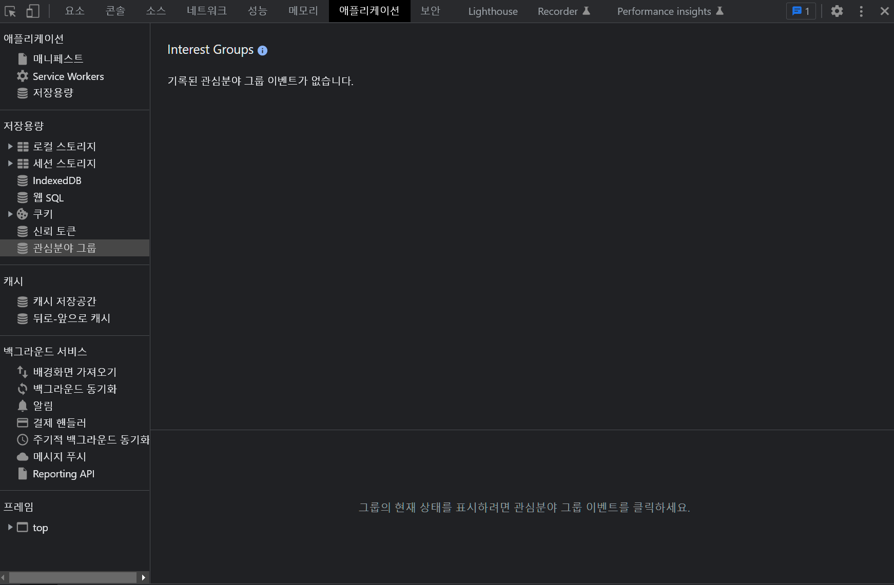

# JavaScript 정리 (9)

​    

## 1️⃣ 개발자 도구 어플리케이션탭

- 브라우저안에 데이터 저장 ✔️✔️



​    

### LocalStorage VS SessionStorage 

#### 공통점

- 이름:값 (key:value) 형태로 저장가능
- 저장용량 5mb
- 문자/ 숫자만 저장가능

​    

#### 차이점

- localStorage : 비휘발성, 사이트 재접속시에도 데이터 유지됨

```js
// 값 추가
localStorage.setItem('저장할 데이터명', '저장할 데이터값')

// 값 읽기
localStorage.getItem('읽어올 데이터명')

// 값 삭제
localStorage.removeItem('삭제할 데이터명')
```

​    

- sessionStorage : 휘발성, 페이지 나가면 데이터 삭제됨

```js
// 데이터 저장
sessionStorage.setItem('key','value')

// 데이터 출력
sessionStorage.getItem('key')

// 데이터 삭제
sessionStorage.removeItem('key')
```

​    

> array / object 다루기

- JSON으로 변환후 저장 및 읽기

```js
// 값 추가
localStorage.setItem('obj', JSON.stringify({ name: 'shin' })) // obj: "{"name": "shin"}"

// 값 읽기
let obj = localStorage.getItem('obj')
obj = JSON.parse(obj)
```

​    

---

## IndexedDB 

- 구조화된 대용량 데이터 저장시 사용

​    

---

## 2️⃣ data-*

- HTML에서 특정한 데이터를 DOM요소에 저장

```html
<input type="text" data-변수="값">
<input type="text" data-index-number="12">
```


- JS로 읽기 (dataset)

```js
var input = document.querySelector('input')
input.dataset.변수
>> 값
input.dataset.indexNumber  // HTML의 `-`는 없어지고 대문자형태로 전환
>> 12
```


- CSS로 읽기 (content)

```js
input {
  content: attr(data-변수);
}

input[data-변수='값'] {
  height: 50%;
}
```

