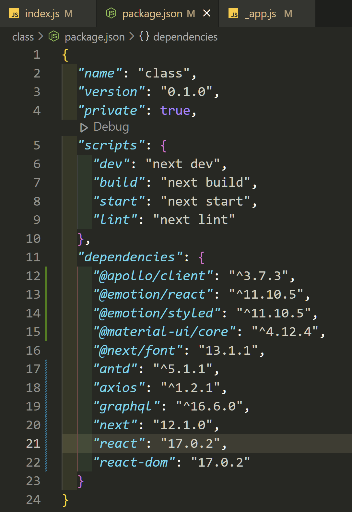

# 프론트엔드 


### next.js 설치

```bash
npx create-next-app
```


> 보일러 플레이트

- 초기 폴더구조를 의미
- 회사마다 다를수 있음


### 파일구조

- node_modules : 라이브러리 / 프레임워크 저장소
- pages : 프론트엔드 페이지 화면
- public : 사진, 아이콘
- styles : css파일
- package.json : 기본 매뉴얼
- yarn.lock  : 버전 잠금 파일


### 패키지 다시 설치하기

- package.json의 dependencies의 내용들은 설치했던 목록에 불과
- 실제 설치파일들은 node_modules에 저장됨
- package.json의 내용을 훑어보며 없는 내용 설치

```bash
# package.json이 있는곳에서 실행해야함
$ yarn install
```



### 서버열기

```bash
$ yarn dev
```


### 폴더 구조

- `pages` 폴더의 index.js는 기본 페이지 : https://localhost:3000/
- pages 폴더안에 `detail`폴더만들고 그 안에 index.js 생성시 : http://localhost:3000/detail/


> _app.js : 모든 페이지에 공통 적용되는 페이지 설정파일


### CSS-IN-JS

- 기존 CSS

```css
.title {
  width: 100px;
  height: 100px;
}

<div className={styles.title}>Hello World</div>
```

- styled-components || emotion

```js
const Title = styled.div`
	width: 100px;
  height: 100px;
`

<Title>Hello World</Title>
```

- 간결한 코드
- 태그에 의미 부여
- 코드 재사용성 증가

> `cntl + i` : vscode에서 불러올 수 있는 값 목록보여줌