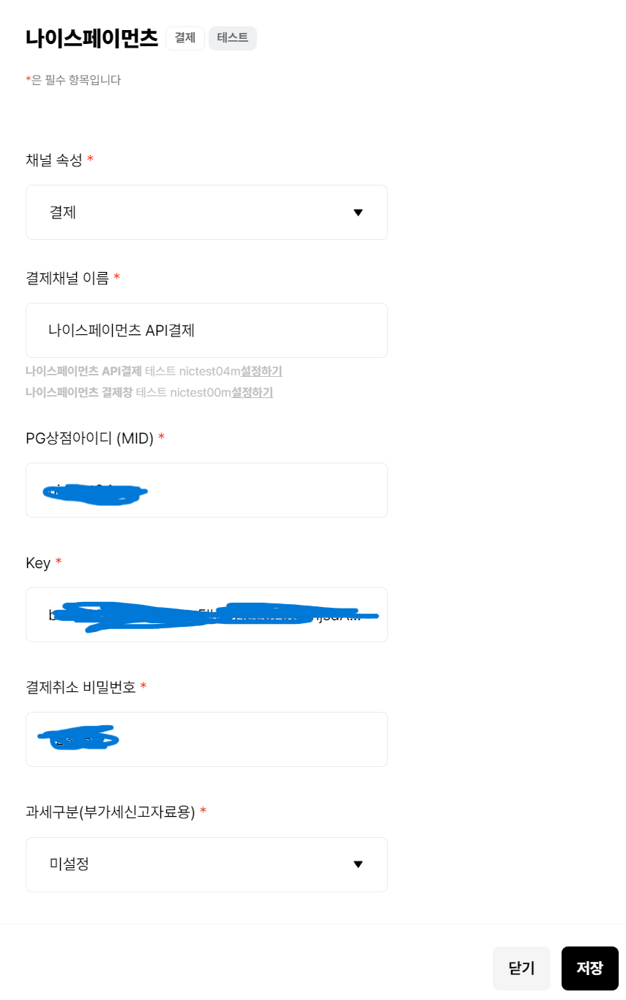
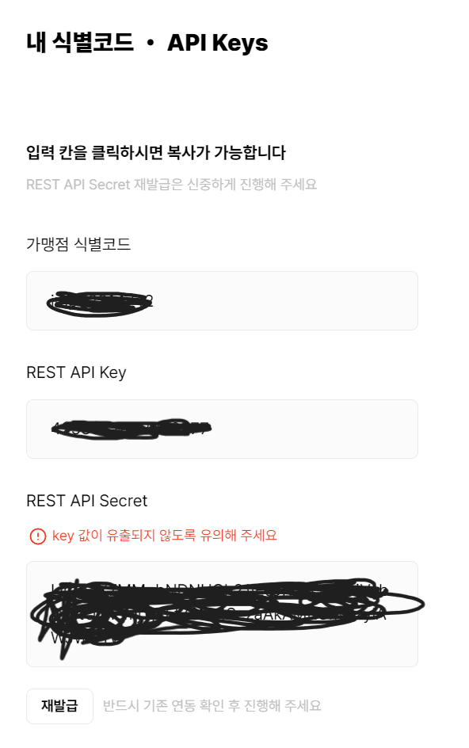

# React (10)

​    

## 1️⃣ 이미지 업로드

### 업로드 과정

.assets/이미지업로드.jpg)

1. 브라우저에서 `<input type="file" />` 태그에 `onChange`속성을 이용해 File객체을 업로드 받아 state에 저장
2. 저장한 File객체를 파일업로드 API요청에 포함하여 백엔드로 전송
3. 백엔드는 File객체를 클라우드 storage에 저장한 후 그 객체에 대한 URL을 백엔드에 반환해줌
4. 백엔드는 그 URL을 다시 브라우저에 반환해줌
5. 받은 URL을 state에 저장하여 게시판 작성등 다른 API요청에 포함하여 백엔드로 전송
6. 백엔드는 받은 정보(URL)를 DB에 저장

​    

> Blob (BinaryLargeObject)

- 파일 종류의 변하지 않고 가공되지 않은 데이터
- 텍스트, 이진 데이터 형태로 읽힘

​    

> 브라우저에서 업로드한 이미지를 API요청이 바로 브라우저에서 보이기

- 임시 URL을 생성하여 img태그에 활용하면 실제로 이미지가 저장되지 않아도 브라우저상에서 미리볼 수 있게됨

1. 내 브라우저에서만 접근 가능한 가짜 URL 활용 (`URL.createObjectURL`)

   - blob객체로 이미지가 생성되어 서버에 전송할 수 없음

   ```js
   const url = URL.createObjectURL(file)
   setImageUrl(url)
   ```

2. 다른 브라우저에서도 접근 가능한 진짜 URL 활용 (`FileReader`) ✔️✔️

   - __더 많이 활용됨__  
   - 안정성 더 높음

   ```js
   const fileReader = new FileReader()
   fileReader.readAsDataURL(file)  // file의 URL 추출
   fileReader.onload = (data) => {  // file 읽기 성공시 onload 실행
     if (typeof data.target?.result === 'string') {
       setImageUrl(data.target?.result)
     }
   }

​    

### graghql

#### Apollo 설정

- `apollo-upload-client`의 `createUploadLink`사용
- `ApolloClient`의 `link`에 연결

```bash
$ yarn add apollo-upload-client
$ yarn add @types/apollo-upload-client --dev
```

```tsx
// src > components > commons > apollo > index.tsx
import { ApolloProvider, ApolloClient, ApolloLink } from '@apollo/client'
import { createUploadLink } from 'apollo-upload-client'

interface IApolloSettingProps {
  children: JSX.Element
}

export default function ApolloSetting(props: IApolloSettingProps) {
  const uploadLink = createUploadLink( uri: '' })  ✔️✔️
  
  const client = new ApolloClient({
    link: ApolloLink.from([uploadLink])  ✔️✔️
  })
  
  return (
  	<ApolloProvider client={client}>
      {props.children}
    </ApolloProvider>
  )
}
```

​    

#### 업로드 페이지

```tsx
import { checkValidationFile } from "@/components/commons/lib/validationFile";

// 업로드 API 요청
const CREATE_BOARD = gql`
  mutation createBoard($url: Url!) {
    createBoard(url: $url) { _id }
  }
`;

const UPLOAD_FILE = gql`
  mutation uploadFile($file: Upload!) {
    uploadFile(file: $file) { url }
  }
`;

export default function ImageUploadPage() {  
 	const [imageUIrl, setImageUrl] = useState('')
  const [file, setFile] = useState<File>();
  
  const [uploadFile] = useMutation(UPLOAD_FILE)  // 업로드 API 요청
  const [createBoard] = useMutation(CREATE_BOARD)  // 게시글등록 API 요청
  
  // 브라우저에 단일 파일 업로드
  const onChangeFile = async (e: ChangeEvent<HTMLInputElement>) => {
  	const file = e.target.files?.[0];  
    if (!file) return; 
    
    // 파일 검증
    const isValid = checkValidationFile(file);
    if (!isValid) return;
    
    // 임시 URL 생성
    const fileReader = new FileReader();
    fileReader.readAsDataURL(file);
    fileReader.onloadend = (e) => {
      if (typeof e.target?.result === "string") {
        console.log(e.target?.result);
        setImageUrl(e.target?.result);
        setFile(file);
      }
    }
  }  
  
  // 이미지 url 포함한 게시글 생성 
  const onClickSubmit = async () => {
    // 업로드 API 요청하여 이미지 URL 받아옴
    const resultFile = await uploadFile({ variables: { file } });
    const url = resultFile.data?.uploadFile.url;

    const result = await createBoard({
      variables: { images: [url] } // 받아온 URL을 DB에 저장
    })
  }
  	
  // 가짜 이미지업로드 박스에 input 태그를 연결
  const fileRef = useRef<HTMLInputElement>(null)
  const onClickImage = () => {
    fileRef.current?.click()
  }
  
  return (
  	<>
    	<div onClick={onClickImage}>이미지선택</div>
    	{/* input 태그의 multiple 속성으로 여러개 드래그 가능 */}
      <input style={{ display: "none" }} type="file" onChange={onChangeFile} ref={fileRef} />
  		
  		<button onClick={onClickSubmit}>게시글 등록</button>
    </>
  )
}
```

​    

### rest-api

#### 업로드 페이지

- graphql처럼 따로 설정해줘야하는 부분 없음
- axios에 데이터로 File객체를 전송하려면 `FormDate`를 활용

```tsx
import { checkValidationFile } from "@/components/commons/lib/validationFile";
import FormData from "form-data";

export default function ProfileImageUpdatePage() {
  const fileRef = useRef<HTMLInputElement>(null)
  const [imageUrl, setImageUrl] = useState()
  const [imgUpdate, setImgUpdate] = useState(false) // 미리보기 이미지 업데이트 여부
  const formData = new FormData()
  const [data, setFormData] = useState<FormData>()

  const onChangeFile = (e: ChangeEvent<HTMLInputElement>) => {
    const file = e.target.files?.[0];
    if (!file) return;
		
    // 파일 검증
    const isValid = checkValidationFile(file);
    if (!isValid) return;
		
    // formData객체에 `"file": file` 값 넣기
    formData.append("file", file);
    setFormData(formData);  // 실제 백엔드로 보낼값
    
    // formData에 들어있는 값 확인하는 방법
    // for (let key of formData.keys()) { console.log(key, ":", formData.get(key)) }
    
    // 임시 URL 생성
    const reader = new FileReader();
    reader.readAsDataURL(file);
    reader.onloadend = () => {
      setImageUrl(reader.result);
    };
    setImgUpdate(true);
  };
  
  // 가짜 이미지업로드 박스에 input 태그를 연결
  const onClickImage = () => { fileRef.current?.click() }
	
  // 이미지 변경 API 요청
  const onClickSubmit = async () => {
    try {
      const result = await axios({
        method: "post",
        url: "",
        data,
        headers: { Authorization: `Bearer ${accessToken}` },
      })
    } catch (error) {
      alert("변경될 이미지를 선택하지 않았습니다.")
    }
  };

  return (
    <>
    	{imgUpdate ? <div>변경될 이미지</div> : <div>현재 이미지</div>}

    	// 브라우저에서 업로드시 미리 보여질 이미지
      
    
    	// input 대신 클릭될 부분
      <div onClick={onClickImage}>프로필 이미지 변경하기</div>
    
    	// 실제로 파일이 업로드 되는 input
      <input
        style={{ display: "none" }}
        type="file"
        onChange={onChangeFile}
        accept="image/*"
        ref={fileRef}
      />
    	
  	  // 이미지 변경 API 요청
      <button onClick={onClickSubmit}>변경하기</button>
    </>
  );
}

```

​    

### 파일 검증

```typescript
// src/commons/lib/validationFile.ts
export const checkValidationFile = (file?: File) => {
  if (!file?.size) {
    alert("파일이 없습니다!")
    return false
  }

  if (file.size > 5 * 1024 * 1024) {
    alert("파일 용량이 너무 큽니다. (제한: 5MB)")
    return false
  }

  if (
    !file.type.includes("jpg") &&
    !file.type.includes("jpeg") &&
    !file.type.includes("png")
  ) {
    alert("jpeg 파일 또는 png 파일만 업로드 가능합니다.")
    return false
  }

  return true
}
```

​    

### 다중이미지 업로드

- `Promise.all` 활용

​    

#### graphql

 ```tsx
 export default function ImageUploadPage() {
 	const [imageUrls, setImageUrls] = useState<string[]>(['', '', ''])  // 업로드할 파일 개수만큼
   const [files, setFiles] = useState<File[]>(['', '', ''])
   ...
   const onChangeFile = 
     (index) => async (e) => {
     	const file = e.target.files?.[0]
       if (!file) return;
     	
     	const fileReader = new FileReader()
       fileReader.readAsDataURL(file)
     	fileReader.onloadend = (e) => {
          // 임시로 보여줄 이미지들
 				const tempUrls = [...imageUrls]
          tempUrls[index] = e.target?.result
          setImageUrls(tempUrls)
 				
          // 전송할 이미지들
          const tempFiles = [...files]
          tempFiles[index] = file
          setFiles(files)
       }
   }
   
   const onClickSubmit = async () => {
     // 각각 따로 파일업로드 API 요청
     const results = await Promise.all([  
       files.map((el) => el && uploadFile({ variables: { file: el } }))  
     ])
     
     // 하나의 배열에 결과 받아옴
     const resultUrls = results.map((el) => el.data?.uploadFile.url : ""))
     
     // 게시판 생성
     const result = await createBoard({
       variables: { image: resultUrls }
     })
   }
       
   return (
     <>
       <input type="file" onChange={onChangeFile(0)} />
       <input type="file" onChange={onChangeFile(1)} />
       <input type="file" onChange={onChangeFile(2)} />
       
       
       
       <button onClick={onClickSubmit}>게시글 등록</button>
     </>
   );
 }      
 ```

​    

#### rest-api

```tsx
export default function ImageUploadPage() {
	const [imageUrls, setImageUrls] = useState<string[]>(['', '', ''])  // 업로드할 파일 개수만큼
  const [files, setFiles] = useState<File[]>([])

  const onChangeFile = 
    (index: number) => async (e: ChangeEvent<HTMLInputElement>) => {
      const file = e.target.files?.[0]
      if (!file) return
    
      const fileReader = new FileReader()
      fileReader.readAsDataURL(file)
    	fileReader.onloadend = (e) => {
         // 임시로 보여줄 이미지들
				const tempUrls = [...imageUrls]
         tempUrls[index] = e.target?.result
         setImageUrls(tempUrls)
				
         // 전송할 이미지들
         const tempFiles = [...files]
         tempFiles[index] = file
         setFiles(files)
      }
  }   
  
  const onClickSubmit = async () => {
    // 각각 따로 파일업로드 API 요청
    const results = await Promise.all(
      files.map((el) => {
        const formData = new FormData()
        formData.append("file", el);
        const result = authorizedAxios({
          method: "post",
          url: "/users/upload",
          data: formData,
          headers: { Authorization: `Bearer ${accessToken}` },
        })
        return result
      })
    )
    
		// 하나의 배열에 결과 받아옴
    const resultUrls = results.map((el) => el ? el.data.userProfileImg.profileImage : "" )
  	console.log(resultUrls)
  }
      
  return (
    <>
      <input type="file" onChange={onChangeFile(0)} />
      <input type="file" onChange={onChangeFile(1)} />
      <input type="file" onChange={onChangeFile(2)} />
      
      
      
      <button onClick={onClickSubmit}>게시글 등록</button>
    </>
  );
}      
```

​    

> 미리 받아온 파일이 있는 경우

```tsx
const [fileUrls, setFileUrls] = useState(['', '', 'old.jpg'])

useEffect(() => {
  if (data?.images.length) {
    setFileUrls([...data?.images])
  }
}, [data])
```

​    

---

## 2️⃣ 결제

### 결제 프로세스

### [아임포트 (포트원)](https://portone.io/korea/ko)

### [사용 매뉴얼](https://portone.gitbook.io/docs/)

### [API 문서](https://api.iamport.kr/)

.assets/image-20230406124325616.png)



​    

### 기본세팅

```tsx
declare const window: typeof globalThis & {
  IMP: any;
}

export default function PaymentPage() {
  onClickPayment = () => {
    const IMP = window.IMP; // 생략 가능
    IMP.init("가맹점 식별코드"); // 예: imp00000000a
		
    IMP.request_pay({ // param
      pg: "kcp.{상점ID}",
      pay_method: "card",  // card, vbank
      merchant_uid: "ORD20180131-0000011",  // 중복시 결제 안됨
      name: "노르웨이 회전 의자",
      amount: 64900,
      buyer_email: "gildong@gmail.com",
      buyer_name: "홍길동",
      buyer_tel: "010-4242-4242",
      buyer_addr: "서울특별시 강남구 신사동",
      buyer_postcode: "01181",
      // 모바일에서는 결제시, 아예 결제페이지로 사이트가 이동해서 다시 돌아올 페이지를 설정해줘야함
      m_redirect_url: "https://..."
    }, rsp => { // callback
      if (rsp.success) {
        // 결제 성공 시 로직
        // 백엔드에 결제관련 데이터 넘겨주기
      } else {
        // 결제 실패 시 로직
        alert("결제에 실패했습니다. 다시 시도해 주세요.");
      }
  }
  
  return (
    <Head>
  		<script src="https://cdn.iamport.kr/v1/iamport.js"></script>
    </Head>
   	<button onClick={onClickPayment}>결제하기</button>
  )
}
```
