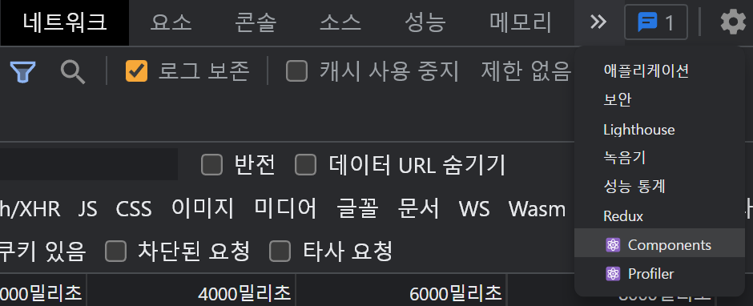
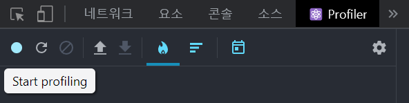
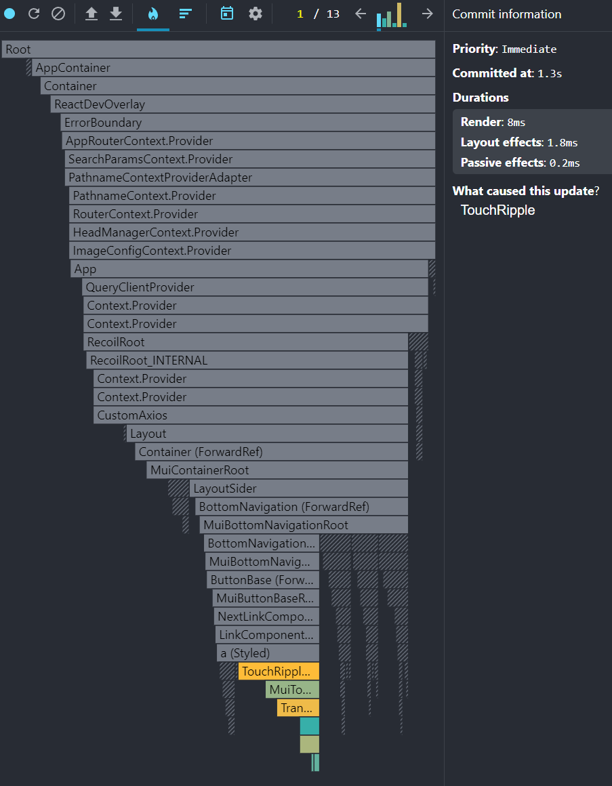

# React (11)


## 4️⃣ Memoization (재렌더링 이슈)

- 부모컴포넌트만 재렌더링될 때, 렌더링할 필요가 없는 자식도 같이 렌더링되어 성능 지연이 발생

​    

### memo

- 자식__컴포넌트__의 props가 변할 때만 재렌더링됨
- 기존 props와 신규 props를 매번 비교하므로 props가 복잡하면 비효율적

```jsx
// 자식 컴포넌트
import { memo } from 'react'

function Child() {
  return <div>자식컴포넌트</div>
});
export default memo(Child)

// 부모 컴포넌트
function Parent() {
  return (
  	<Child />
    <div>부모컴포넌트</div>
  )
}
```

​    

> memo와 map을 같이 사용할 경우 주의할 점

- key값에 uuid를 사용하게되면 memo를 사용해도 props가 계속 변화하여 리렌더링이 발생함

​    

### useMemo / useCallback

- 리렌더링을 줄여줄 때 사용
- `useMemo` : __변수__ 기억 / `useCallback` : __함수__ 기억
- useEffect와 사용법 유사 
- useEffect는 렌더링 후에 실행되지만, useMemo는 렌더링 되는 동안 실행됨
- `[]` 디펜던시 사용시 state, props가 변화할 때만 코드가 실행됨
- ❗의존성배열의 인자가 2개 이상될 경우 그냥 리렌더링하는 것이 유지보수에 더 좋음

```jsx
import { useMemo, useCallback } from 'react'

// 기본
export default function Detail() {
  const val = useMemo(() => 변수, [])
	const Func = useCallback(() => {}, [])  
}
```

​    

> useCallback 사용시 state 주의사항

```jsx
const onClickCountUp = useCallback(() => {
  setCountUp((prev) => prev + 3)
})
```


> useMemo로 커스텀 useCallback 만들기

```jsx
const onClickCustom = useMemo(() => (() => {
  
}), [])
```

​    

### automatic batch

- react 18버전 이상부터 생김
- state 변경함수들이 연달아 여러개 처리되야하면 다 처리 후 __마지막 한 번만 재렌더링됨__

```jsx
const [counter1, setCounter2] = useState(1)
const [counter2, setCounter2] = useState(2)

function AutomaticBatch() {
  setCounter(prev => prev + 1); // 리렌더링 안됨
  setCounter2(prev => prev + 2); // 리렌더링 안됨
  // 리렌더링 됨
}
```

​    

### flushSync 

- 리렌더링 강제하기
- 대부분의 경우 flushSync 사용하지 않을 수 있음
- flushSync를 마지막 수단으로 사용해야함

```jsx
import { flushSync } from 'react-dom';

const [counter1, setCounter2] = useState(1)
const [counter2, setCounter2] = useState(2)

function AutomaticBatch() {
  flushSync(() => {
  	setCounter(prev => prev + 1); 
	});
  // 리렌더링 됨
  
  flushSync(() => {
  	setCounter2(prev => prev + 2); // 리렌더링 안됨
	});
  // 리렌더링됨
}
```

​    

### useTransition

- __state변경함수__가 성능저하를 일으킬 때 사용
- `startTransition` : 실행시점을 뒤로 옮겨줌 (늦게처리)
- `isPending` : `startTransition`이 처리중일 때 `true`인 값

```jsx
import { useState, useTransition } from 'react'

const box = new Array(100000).fill(0)  // 10만개

function App() {
  const [name, setName] = useState('')
  const [isPending, startTransition] = useTransition()  ✔️✔️ 
  
  const onChangeVal = (e) => {
    startTransition(() => {  ✔️✔️
      setName(e.target.value)  // 성능저하를 일으키는 state변경함수를 삽입
    })
  } 
  
  return (
  	<input onChange={onChangeVal} />
    {
    	box.map(() => {
    		return <div>{name}</div> // 일반사용시 10만개 재렌더링
  		})
    }
  )
}
```

> 성능 저하 원인

- 브라우저는 single-thread 기반이므로 한번에 하나의 작업만 가능
- input에 값 입력시 `input 창에 입력값 보여주기`와 `div 10만개 만들기`를  작업하려고 하여 버벅임 발생
- `startTransition` 사용하면 input 창에 입력값 보여주고, 남는 시간에 div 10만개 만듬

​    

### useDeferredValue

- __state__, __변수__에 사용하고 값에 변동이 생겼을 때, 변경을 뒤로 미뤄줌
- useTransition과 비슷한 기능

```jsx
import { useState, useDeferredValue } from 'react'

const box = new Array(100000).fill(0)  // 10만개

function App() {
  const [name, setName] = useState('')
  let delayedName = useDeferredValue(name)  ✔️✔️
  
  const onChangeVal = (e) => {
      setName(e.target.value) 
  } 
  
  return (
  	<input onChange={onChangeVal} />
    {
    	box.map(() => {
    		return <div>{name}</div>
  		})
    }
  )
}
```

​    


## 7️⃣ DevTools

### 1. Chrome DevTools

#### Network (네트워크)

​    

#### Performance (성능)

- 브라우저 동작을 녹화하여 어떠한 동작이 어떻게 작동되는지 기록하여 보여줌

​    

#### Ligthhouse


​    

### 2. React Developer Tools

- 크롬 확장프로그램
- 설치시 개발자도구에 `Components`와 `Profiler` 탭이 생김

​    

#### Components

- 컴포넌트 레이어 확인 및 컴포넌트의 props, value 등을 확인가능




​    

#### Profiler

- 성능을 저하시키는 컴포넌트를 찾을 때 사용
- 녹화버튼을 누른 뒤, 페이지를 조작하면 행위들을 기록함



- 어떤 행위에 어떤 컴포넌트들이 렌더링 됐는지 확인가능



​    

### 3. Redux DevTools

- 크롬 확장프로그램
- redux의 state값이 변경된 내역을 보여줌

.assets/image-20230327211936168.png)

   

---


## 8️⃣ [Google PageSpeed Insights](https://pagespeed.web.dev/)

- 사이트 배포이후, 배포 페이지에서 개선할 점을 체크해주는 사이트 

​    