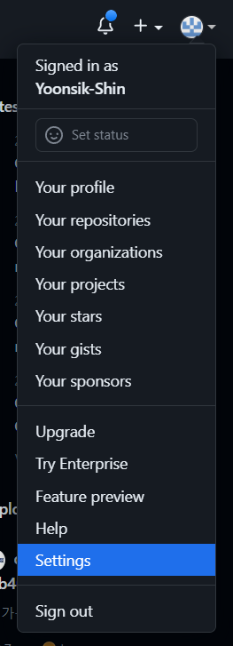

# React (13)

​    

## 0️⃣ 배포 개요

.assets/배포개요.jpg)

​    

---

## 1️⃣ 정적페이지 배포 (SSG)

### next.js

1. `package.json`에 스크립트 작성

```json
// package.json
{
  "scripts": {
    "build:ssg": "next build && next export"
  }
}
```

2. `next.config.js` 파일에 설정변경

```js
// next.config.js
const nextConfig = {
  ...
  trailingSlash: true ✔️✔️
}
```

3. 터미널에 명령 실행

- `out`이라는 폴더가 생성됨

```bash
$ yarn build:ssg
```

4. AWS S3에 `out`파일 업로드

- S3 버킷 생성

.assets/image-20230426170158570.png)

.assets/image-20230426170238026.png)

.assets/image-20230426170552178.png)

- `out` 폴더 안에 있는 내용 업로드후 __ACL을 사용하여 퍼블릭으로 설정__ 옵션 활성화

.assets/image-20230426170709823.png)

.assets/image-20230426170732461.png)

- 속성 - 정적 웹 사이트 호스팅 옵션 활성화

.assets/image-20230426170823720.png)

.assets/image-20230426170902868.png)

.assets/image-20230426170947029.png)

.assets/image-20230426170834514.png)

​    

---

## 2️⃣ 도메인 연결

### Route53

.assets/image-20230426204140308.png)

.assets/image-20230426204153673.png)

.assets/image-20230426204230358.png)

.assets/image-20230426204256080.png)

> 레코드 유형


### 가비아

가비아 - My 가비아 - 도메인 통합 관리툴

.assets/image-20230426210108009.png)

.assets/image-20230426210149557.png)

.assets/image-20230426210222623.png)

.assets/image-20230426210446227.png)

.assets/image-20230426210759883.png)

dig : domain infomation grouper

레코드 유형 : A

별

트래픽 라우팅 대상 : S3

.assets/image-20230426211306691.png)

​    

---

## 3️⃣ HTTPS 설정

- CDN에 인증


### SSL/TSL 인증서 발급

- AWS Certificate Manager (ACM) 활용
- ❗CDN에 적용하려면 리전을 `미국 동부 (버지니아 북부) us-east-1`로 선택해야함

.assets/image-20230426214119549.png)

.assets/image-20230426214252520.png)

.assets/image-20230426214321114.png)

.assets/image-20230426214431885.png)

.assets/image-20230426214536230.png)

.assets/image-20230426214821137.png)

.assets/image-20230426214948737.png)


### CloudFront

- 리전이 global임

.assets/image-20230426215155137.png)

.assets/image-20230426215311333.png)

.assets/image-20230426215332011.png)

.assets/image-20230426215416391.png)

.assets/image-20230426215458036.png)

.assets/image-20230426215934545.png)

​    

---

## 4️⃣ EC2 생성

.assets/image-20230426220315516.png)

.assets/image-20230426220348462.png)

.assets/image-20230426220523455.png)

.assets/image-20230426220542512.png)

- 아마존 리눅스 사용시 키페어 없이 인스턴스에 접속할 수 있음

.assets/image-20230426220642798.png)

.assets/image-20230426220700467.png)

.assets/image-20230426220738321.png)

- 프리티어로 30GB까지 가능


.assets/image-20230426220912123.png)

인스턴스 종료 === 인스턴스 삭제

.assets/image-20230426221000920.png)

.assets/image-20230426221021759.png)

.assets/image-20230426221123900.png)

- node.js 설치

```bash
# 다운로드 받을 것이라고 기록만 해놓는 것
$ curl -sL https://rpm.nodesource.com/setup_14.x | sudo bash 

# 실제로 다운받는 명령어
$ sudo yum install -y nodejs
```

.assets/image-20230426221407953.png)

.assets/image-20230426221425093.png)

- node.js 설치시 자동으로 npm도 설치됨

- yarn 설치

```bash
$ sudo npm install -g yarn
```

.assets/image-20230426221609662.png)

- git 설치

```bash
$ sudo yum install git
```

.assets/image-20230426221705299.png)

- 배포할 코드를 깃허브에서 clone하기

```bash
$ git clone https://github.com/~~/~~
```

> clone시도시 로그인 요구할 때




.assets/image-20230426222302786.png)


.assets/image-20230426222334630.png)

.assets/image-20230426222427477.png)

.assets/image-20230426222630232.png)

- 깃허브 토큰은 처음 발급받았을 때만 보여짐, 이후로는 값을 볼 수 없어서 지우고 새로 생성해야함

계정 : GitHub 닉네임

비밀번호 : Github 토큰


.assets/image-20230426223040679.png)

.assets/image-20230426223104391.png)

.assets/image-20230426223119282.png)

​    

---

## 5️⃣ 로드밸런서 연결

.assets/image-20230426223329811.png)

.assets/image-20230426223409141.png)

.assets/image-20230426223548492.png)


.assets/image-20230426223718549.png)

- Mappings 옵션은 최소 두 개를 선택해야함
- ❗하나는 무조건 사용할 EC2의 가용 영역이어야함

.assets/image-20230426223637427.png)

.assets/image-20230426224007011.png)

.assets/image-20230426224027772.png)

.assets/image-20230426224122745.png)

.assets/image-20230426224135580.png)

.assets/image-20230426224202689.png)

.assets/image-20230426224224846.png)


- 로드밸런서 방화벽 해제

.assets/image-20230426224326470.png)

.assets/image-20230426224341797.png)

.assets/image-20230426224404332.png)

​    

---

## 6️⃣ 페이지 분기

- CloudFront에서 설정해줌

.assets/image-20230426232012720.png)

.assets/image-20230426232417373.png)

.assets/image-20230426232438074.png)

.assets/image-20230426232522637.png)

.assets/image-20230426232547985.png)

.assets/image-20230426232819128.png)


> 캐시무효화

- 배포 전에는 무효화하고 작업하는게 좋음

.assets/image-20230426232921702.png)

.assets/image-20230426232935648.png)

​    

코드 빌드 할 때 마다 빌드ID가 계속 바뀜

스토리지와 로드밸런서의 인스턴스에 같은 빌드폴더를 가져야함

`next.config.js` 파일에서 빌드ID를 고정됨

```js
const nextConfig = {
  generatedBuildId: () => "폴더명"
}
```

​    

서버사이드 렌더링시에는 `out` 폴더를 생성할 수 없음

`next.config.js` 파일에서 설정 추가하여 SSR이 적용되는 페이지 제외시키고 빌드진행

```js
const nextConfig = {
  // SSR 페이지를 제외한 나머지만 out폴더 생성
  exportPathMap: () => ({
      "/": { page: "/" },
      "/boards" : { page: "/boards"},
      "/404" : { page: "/404" }
    })
}
```


