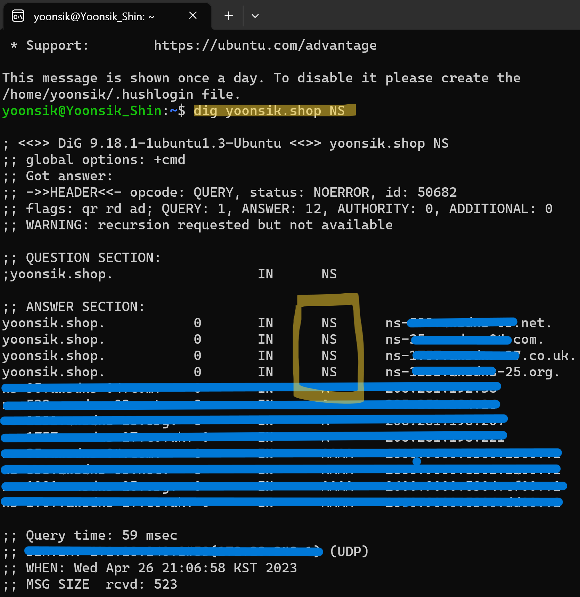
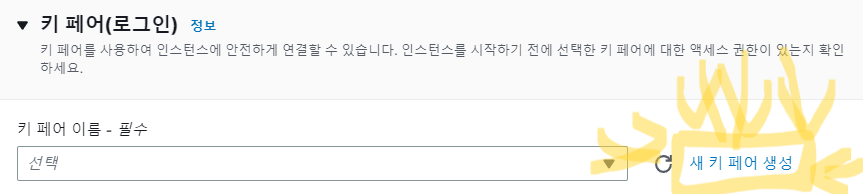
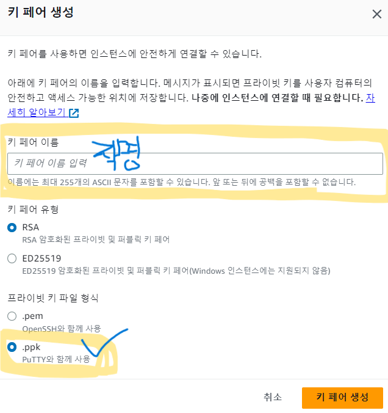
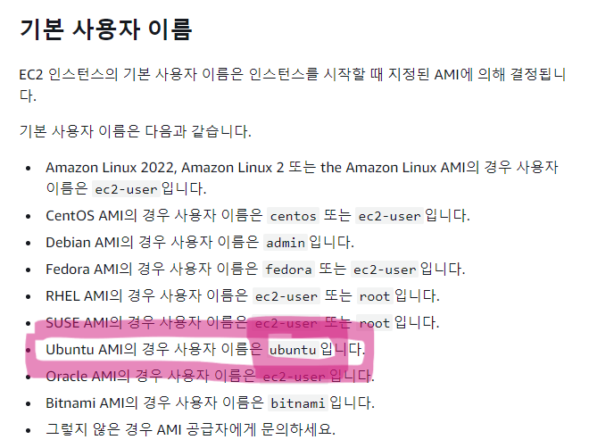
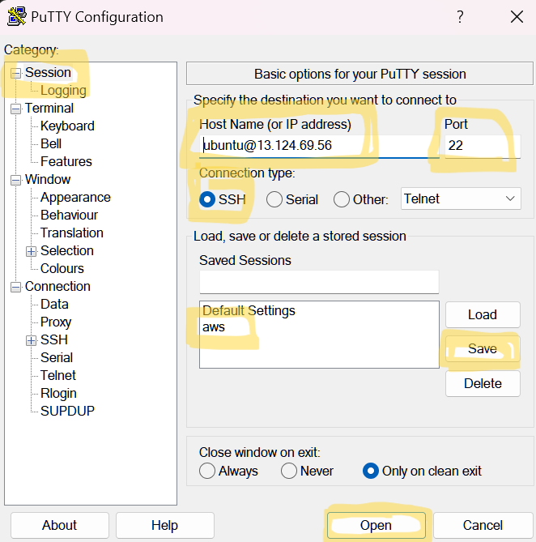
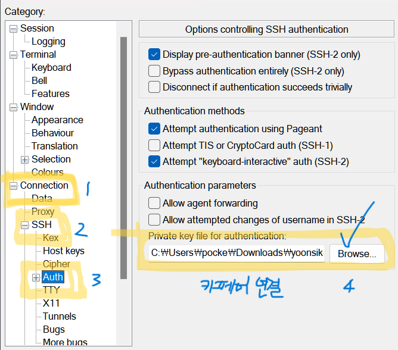
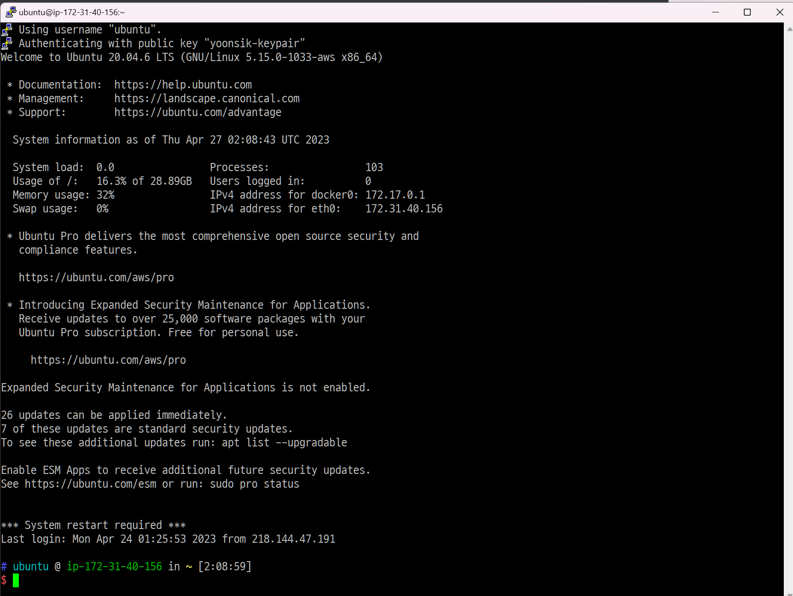
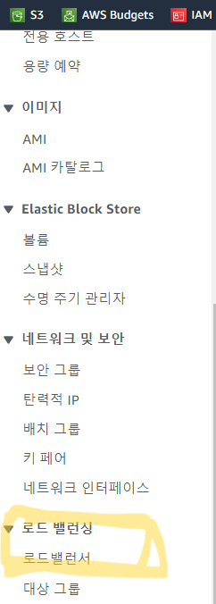
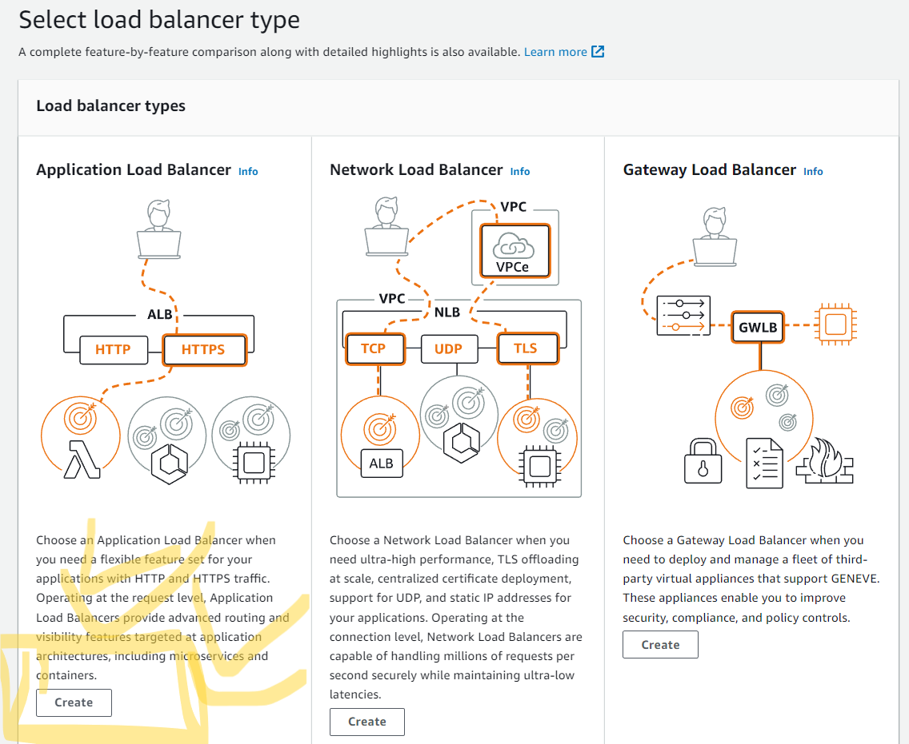
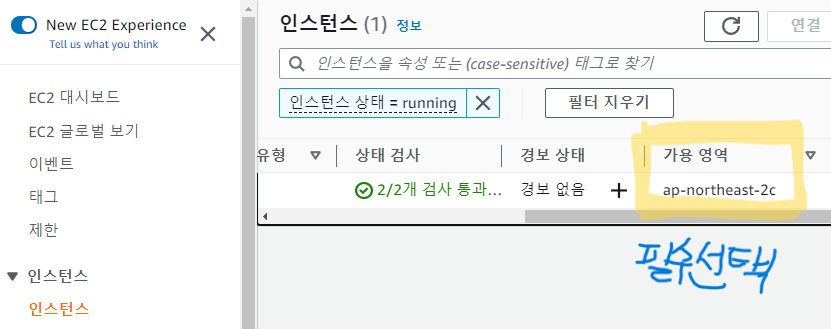

# React (13)

## 0️⃣ 배포 개요

.assets/배포개요.jpg)

- 배포 방식

1. SSG Only
   - Route53 + CloudFront + S3
   - CDN을 이용하여 캐싱된 파일을 제공하여 퍼포먼스적으로 유리
   - 개발단계에서는 캐시가 불편

2. SSR Only
   - Route53 + CloudFront + Load Balancer + EC2
   - 정적스토리지를 사용하지 않고 EC2로만 배포
   - 최신상태를 유지해야하는 서비스를 제공할 때 주로 사용
3. SSG + SSR
   - 정적인 파일들은 SSG방식으로, 나머지는 SSR 방식으로 배포하여 부하를 분산할 수 있음

   

---

## 1️⃣ 정적페이지 배포 (SSG)

### React

1. 터미널에 `build` 명령 실행

```bash
$ npm run build
$ yarn build
```

```json
// package.json
{
  // (1) CRA 이용시 바로 react-scripts 활용
  scripts: {
    "start": "react-scripts start",
  	"build": "react-scripts build"
  }
  
  // (2) CRA 이용시 js파일 속에서 react-scripts 실행
  scripts: {
  	"start": "node scripts/start.js",
    "build": "node scripts/build.js",
	}

	// (3) 직접 배포환경 구현 - webpack으로 배포파일 생성
	"scripts": {
  	"build": "node 내가만든배포파일.js"
	}
}
```

2. AWS S3에 `build`파일 업로드

​    

### next.js

1. `package.json`에 스크립트 작성

```json
// package.json
{
  "scripts": {
    "build:ssg": "next build && next export"
  }
}
```

2. `next.config.js` 파일에 설정변경

```js
// next.config.js
const nextConfig = {
  ...
  trailingSlash: true ✔️✔️
}
```

3. 터미널에 명령 실행

- `out`이라는 폴더가 생성됨

```bash
$ yarn build:ssg
```

4. AWS S3에 `out`파일 업로드

​    

### S3 버킷 생성

.assets/image-20230426170158570.png)

.assets/image-20230426170238026.png)

.assets/image-20230426170552178.png)

- `out` 폴더 안에 있는 내용 업로드후 __ACL을 사용하여 퍼블릭으로 설정__ 옵션 활성화

.assets/image-20230426170709823.png)

.assets/image-20230426170732461.png)

- 속성 - 정적 웹 사이트 호스팅 옵션 활성화

.assets/image-20230426170823720.png)

.assets/image-20230426170902868.png)

.assets/image-20230426170947029.png)

.assets/image-20230426170834514.png)

​    

---

## 2️⃣ 도메인 연결

### Route53

.assets/image-20230426204140308.png)

.assets/image-20230426204153673.png)

.assets/image-20230426204230358.png)

.assets/image-20230426204256080.png)

​    

### 가비아

- 도메인 주소를 구매할 수 있는 사이트
- 가비아 - My 가비아 - 도메인 통합 관리툴

.assets/image-20230426210108009.png)

.assets/image-20230426210149557.png)

​    

- 네임서버의 설정을 AWS에 있는 NS값으로 변경

.assets/image-20230426210222623.png)

.assets/image-20230426210446227.png)

​     

- dig 명령어로 등록여부 확인



>  dig : domain infomation grouper

​    

- 새로운 레코드 생성

.assets/image-20230426211306691.png)

​    

---

## 3️⃣ HTTPS 설정

- CDN에 인증서 설정

​     

### SSL/TLS 인증서 발급

- AWS Certificate Manager (ACM) 활용
- ❗CDN에 적용하려면 리전을 `미국 동부 (버지니아 북부) us-east-1`로 선택해야함

.assets/image-20230426214119549.png)

.assets/image-20230426214252520.png)

.assets/image-20230426214321114.png)

.assets/image-20230426214431885.png)

.assets/image-20230426214536230.png)

.assets/image-20230426214821137.png)

.assets/image-20230426214948737.png)

​     

### CDN 설정 (CloudFront)

- 리전이 global임

.assets/image-20230426215155137.png)

.assets/image-20230426215311333.png)

.assets/image-20230426215332011.png)

.assets/image-20230426215416391.png)

.assets/image-20230426215458036.png)

.assets/image-20230426215934545.png)

​    

---

## 4️⃣ EC2 생성

### 아마존 리눅스 (Amazon Linux)

.assets/image-20230426220315516.png)

.assets/image-20230426220348462.png)

.assets/image-20230426220523455.png)

.assets/image-20230426220542512.png)

- 아마존 리눅스 사용시 키페어 없이 인스턴스에 접속할 수 있음

.assets/image-20230426220642798.png)

.assets/image-20230426220700467.png)

- 프리티어로 30GB까지 가능

.assets/image-20230426220738321.png)

- 인스턴스 종료는 인스턴스 삭제를 의미

.assets/image-20230426220912123.png)


> Amazon Linux로 EC2 접속하기

.assets/image-20230426221000920.png)

.assets/image-20230426221021759.png)

.assets/image-20230426221123900.png)

​    

### Linux  (Window)

- [aws 공식가이드](https://docs.aws.amazon.com/ko_kr/AWSEC2/latest/UserGuide/putty.html)

​     

#### 1. 키 페어 생성






#### 2. [putty](https://www.chiark.greenend.org.uk/~sgtatham/putty/latest.html)

- Window에서 EC2 터미널에 접속하기 : `putty` 프로그램을 활용

- Host Name : `instance-user-name`@`instance-public-dns-name`

  .assets/image-20230427112256787.png)

​    

### 기본 설정

- node.js 설치

```bash
# 다운로드 받을 것이라고 기록만 해놓는 것
$ curl -sL https://rpm.nodesource.com/setup_14.x | sudo bash 

# 실제로 다운받는 명령어
# node.js 설치시 자동으로 npm도 설치됨
# 아마존 리눅스
$ sudo yum install -y nodejs  

# putty
$ sudo apt-get update
$ sudo apt-get install -y nodejs  

# yarn 설치
$ sudo npm install -g yarn
```

.assets/image-20230426221407953.png)

.assets/image-20230426221425093.png)

.assets/image-20230426221609662.png)

- git 설치

```bash
$ sudo yum install git  # 아마존 리눅스
$ sudo apt-get install -y git  # putty
```

.assets/image-20230426221705299.png)

- 배포할 코드를 깃허브에서 clone하기

```bash
$ git clone https://github.com/~~/~~
```

> clone시도시 로그인 요구할 때

.assets/image-20230426222302786.png)

.assets/image-20230426222334630.png)

.assets/image-20230426222427477.png)

.assets/image-20230426222630232.png)

- 깃허브 토큰은 처음 발급받았을 때만 보여짐, 이후로는 값을 볼 수 없어서 지우고 새로 생성해야함

```bash
$ 계정 : GitHub 닉네임
$ 비밀번호 : Github 토큰
```

​     

>  방화벽 해제

.assets/image-20230426223040679.png)

.assets/image-20230426223104391.png)

.assets/image-20230426223119282.png)

​    

### docker

> 설치

```bash
# 아마존 리눅스
$ sudo yum update -y
$ sudo amazon-linux-extras install docker
$ sudo service docker start
$ sudo usermod -a -G docker ec2-user

# ubuntu
$ sudo apt install curl
$ sudo -fsSL https://download.docker.com/linux/ubuntu/gpg | sudo apt-key add -
$ sudo add-apt-repository "deb [arch=amd64] https://download.docker.com/linux/ubuntu $(lsb_release -cs) stable"
$ sudo apt update
$ sudo apt-get install docker.io
```

​    

> docker 상태 확인 및 활성화

```bash
# 도커 활성화
$ sudo systemctl start docker 

# 도커 상태확인
$ sudo systemctl status docker
```

.assets/image-20230427014401004.png)

​    

> Dockerfile 파일 작성

```dockerfile
FROM node:14

COPY ./package.json /배포폴더명/
COPY ./yarn.lock /배포폴더명/
RUN yarn install

COPY . /배포폴더명/
WORKDIR /배포폴더명/  

RUN yarn build
CMD yarn start
```

​     

### docker-compose

> 설치

```bash
# docker-compose 다운
$ sudo curl -L "https://github.com/docker/compose/releases/download/{버전}/docker-compose-$(uname -s)-$(uname -m)" -o /usr/local/bin/docker-compose

# 권한부여
$ sudo chmod +x usr/local/bin/docker-compose 

# 실제 설치
$ sudo apt-get install docker-compose
```

​    

>  docker-compose.yaml 파일 작성

```yaml
version: "3.7"

services:
	서비스이름:
		build:
			context: .
			dockerfile: Dockerfile
		ports:
			- 3000:3000
```

​    

### 서버실행

```bash
# 도커 이미지 생성
$ docker-compose build

# 도커 실행 (detached 모드)
$ sudo docker-compose up -d 

# 도커 로그보기
# Ctrl + C로 로그보기 꺼도 서버가 다운되지는 않음
$ sudo docker-compose logs -f
```

​    

---

## 5️⃣ 로드밸런서 연결



​    

> Internet-facing VS Internal

- Internet-facing : 외부에서 내부로 분산시킬때 이용
- Internal : 내부끼리 분산시킬때 이용

.assets/image-20230426223548492.png)

​     

>  네트워크 매핑

- Mappings 옵션은 최소 두 개를 선택해야함
- ❗하나는 무조건 사용할 EC2의 가용 영역이어야함

.assets/image-20230426223718549.png)



​     

>  TargetGroup 생성

.assets/image-20230426224007011.png)

.assets/image-20230426224027772.png)

.assets/image-20230426224122745.png)

.assets/image-20230426224135580.png)

.assets/image-20230426224202689.png)

.assets/image-20230426224224846.png)

​    

>  로드밸런서 방화벽 해제

.assets/image-20230426224326470.png)

.assets/image-20230426224341797.png)

.assets/image-20230426224404332.png)

​    

---

## 6️⃣ 페이지 분기

### CloudFront 설정

- 원본 : s3, LB등 분기의 종착점
- 동작 : 어떤 경로에서 어떤 원본으로 이어줄 건지 설정

.assets/image-20230426232012720.png)

​    

#### 1. 원본 생성

.assets/image-20230426232417373.png)

.assets/image-20230426232438074.png)

.assets/image-20230426232522637.png)

​    

#### 2. 동작 생성

.assets/image-20230426232547985.png)

.assets/image-20230426232819128.png)

- 경로 패턴에 따라 어떠한 원본으로 연결해줄 것인지를 설정해줄 수 있음
- 동적페이지를 보여주기 위해 LB와 연결
- 실제 배포시에는 `CachingOptimized` 옵션이 유용하지만, 개발 단계일 때는 `CachingDisabled` 옵션이 편함

​    

> 캐시무효화

- 배포 전에는 무효화하고 작업하는게 좋음

.assets/image-20230426232921702.png)

.assets/image-20230426232935648.png)

​    

### 파일 다운로드 이슈

- 코드를 빌드할 때 마다 빌드ID가 계속 바뀜 (out 폴더안의 폴더명 바뀜)
- 이 때문에 파일을 못 불러오는 현상이 발생
- 스토리지와 로드밸런서의 인스턴스에 같은 빌드폴더를 가져야함
- `next.config.js` 파일에서 빌드ID를 고정하여 해결

```js
const nextConfig = {
  generatedBuildId: () => "폴더명"
}
```

​    

### SSR 관련이슈

- 서버사이드 렌더링시에는 `out` 폴더를 생성할 수 없음
- `next.config.js` 파일에서 설정 추가하여 SSR이 적용되는 페이지 제외시키고 빌드진행

```js
const nextConfig = {
  // SSR 페이지를 제외한 나머지만 out폴더 생성
  exportPathMap: () => ({
      "/": { page: "/" },
      "/boards" : { page: "/boards"},
      "/404" : { page: "/404" }
    })
}
```

​    

---

## Vercel 배포

1. vercel 사이트 접속 [https://vercel.com/new]

.assets/image-20230724230018950.png)

2. 계정연동

.assets/image-20230724230702658.png)

3. 배포할 레포지토리 import 버튼 눌러서 들어가기

.assets/image-20230724231108583.png)
