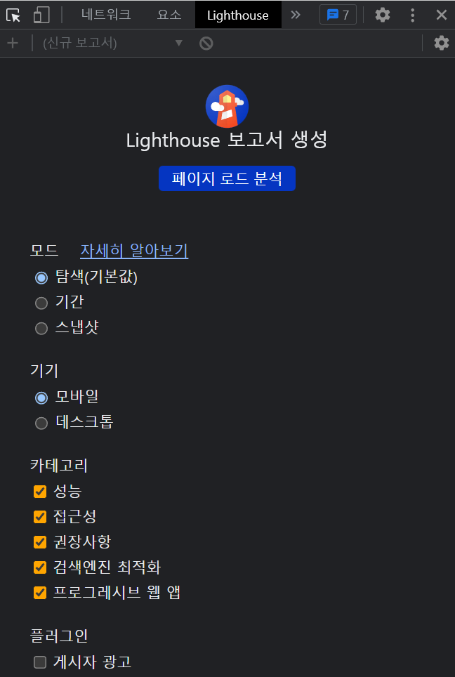

# React (4)


## 0️⃣ 성능최적화 개념

### 1. 로딩 최적화

- 이미지 사이즈 최적화
- Code Split (컴포넌트 Lazy Loading)
- 텍스트압축
- Preloading

​    

### 2. 렌더링 최적화

- Bottleneck 코드 최적화
- 애니메이션 최적화 (Reflow/Layout, Repaint/paint)

​    

---

## 1️⃣ Prefetch / Preload

### prefetch

- 곧 사용할 될 __페이지, 데이터__를 미리 받아오는 것
- 현재 페이지를 모두 받아온 이후 제일 나중에 다운로드해옴
- 미리 받아온 리소소는 캐시에 저장되어 페이지 이동시 바로 보여짐

```html
<!-- 첫페이지 -->
<html>
  <head>
    <link rel="prefetch" href="미리 받아올 페이지" />
  </head>
  <body>
    <a href="미리 받아올 페이지"></a>
  </body>
</html>
```

- 해당글에 마우스 올리면 그 글에 필요한 데이터 미리 받아옴

```jsx
export default Page() {
  const prefetchBoard = () => {
    // 데이터 받아오기
  }
  
  return (
    <>
      {data?.map((el) => (
        <div onMouseOver={prefetchBoard(el.id)} onClick={글로이동}>글제목</div>
      ))}
		</>
  )
}
```

- debouncing과 함께 사용하면 불필요한 요청을 줄일 수 있음

```jsx
import { debounce } from 'lodash'

export default Page() {
  	const prefetchBoard = _.debounce((value) => {
       // api요청
    }, 400)
  
    return (
    <>
      {data?.map((el) => (
        <div onMouseOver={prefetchBoard(el.id)} onClick={글로이동}>글제목</div>
      ))}
		</>
  )
}
```

​    

### preload

- 현재 페이지에서 이용할 __이미지__나 컴포넌트를 미리 다운받아 놓는 것
- index.html을 받아올 때, preload는 css, js 보다 이미지를 먼저 받아옴
- 파일은 한번에 6개씩만 다운로드 받아올 수 있음
- 따라서, 이미지 다운로드전에 다운로드 받아와야할 요소들이 많다면, 이미지가 늦게 뜰 수 있음
- 이를 해결하기 위해, 이미지를 먼저 다운로드 받아오게 설정하면 됨
- 보여져야할 이미지가 많다면 처음 페이지에 보여질 이미지만 먼저 preload 적용

```html
<html>
  <head>
    <link rel="preload" href="미리 받아올 이미지" />  ✔️✔️ <!-- css, js 파일보다 먼저 다운로드됨 -->
    <link rel"stylesheet" href="" />
    <script src="1"></script>
    <script src="2"></script>
    <script src="3"></script>
    <script src="4"></script>
    <script src="5"></script>
    <script src="6"></script>
  </head>
  <body>
    
  </body>
</html>
```


​    

---

## 2️⃣ lazy import

### lazy

- SPA는 처음 사이트에 접속할 때 모든 페이지를 하나로 합쳐 로딩하여 시간이 많이 걸림
- 메인페이지를 로드할 때 필요없는 컴포넌트를 필요해질 때 불러올 수 있게 해주는 기능
- lazy 키워드를 사용하면 사이트 발행시 별도의 js 파일로 분리됨

```jsx
import { lazy } from 'react';

const 필요할때import할컴포넌트 = lazy(() => import('./routes/컴포넌트.js'))
const Detail = lazy(() => import('./routes/Detail.js'))
```

​    

### LazyLoad 

- 처음 페이지가 사용자에게 보여지는 시점에 보여지지 않는 리소스들을 필요로할 때 로드하는 것
- 보통 스크롤을 내릴 때 로드가 진행되는 식으로 구현
- preload는 이미 리소스를 다 다운받아 캐시에 저장해놓은 것이고, lazyload는 필요할 때마다 리소스를 다운 받는 방식
- [react-lazyload](https://www.npmjs.com/package/react-lazyload) 라이브러리 활용 가능

```bash
$ npm install react-lazyload
$ yarn add react-lazyload
```

```tsx
import LazyLoad from 'react-lazyload';

export default MyApp() {
  // 이미지
	<LazyLoad height={200}>
    
  </LazyLoad>  
  
  // 컴포넌트
  <LazyLoad height={200}>
    <MyComponent />
  </LazyLoad>  
}
```

> option

```jsx
<LazyLoad height={200}>  <!-- 높이지정 -->
<LazyLoad once={true}>   <!-- 한번 로드되면 더 이상 신경x -->
<LazyLoad offset={200}>  <!-- 뷰포트 기준으로 200px 이상이면 로드됨 -->
```

​    

---

## 3️⃣ 이미지 최적화

- `lazyload`, `preload`, `webp확장자`, `CDN`를 활용하여 최적화한다.

​    

### PreLoad

```tsx
// 미리 이미지를 업로드할 페이지
import { useEffect } from 'react'
import { preloadImage } from '../../src/commons/lib/preloadImage'

const PRELOAD_IMAGES = ["https://~~"]

export default function ImagePreloadingPage() {
  useEffect(() => { preloadImage(PRELOAD_IMAGES) }, [])  ✔️✔️
  
  return ()
}
```

```tsx
// src/commons/lib/preloadImage.ts
export const PRELOADED_IMAGES: HTMLImageElement[] = []

export const preloadImage = (images: string[]) => {
  images.forEach((el) => {
    const img = new Image()
    img.src = el
    img.onload = () => PRELOADED_IMAGES.push(img)
  })
}
```

​    

### Webp 확장자

- 구글에서 만든 이미지 포맷 
- gif, png, jpeg 확장자를 모두 대체 가능
- 기존 파일보다 약 30%의 용량을 줄일 수 있음

> [Webp로 변환시켜주는 사이트](https://cloudconvert.com/)

​    

### CDN

- imgix 사이트 활용


### unsplash API 활용

```jsx
function getParam
```


​    

---

## 4️⃣ Memoization (재렌더링 이슈)

- 부모컴포넌트만 재렌더링될 때, 렌더링할 필요가 없는 자식도 같이 렌더링되어 성능 지연이 발생

​    

### memo

- 자식__컴포넌트__의 props가 변할 때만 재렌더링됨
- 기존 props와 신규 props를 매번 비교하므로 props가 복잡하면 비효율적

```jsx
// 자식 컴포넌트
import { memo } from 'react'

function Child() {
  return <div>자식컴포넌트</div>
});
export default memo(Child)

// 부모 컴포넌트
function Parent() {
  return (
  	<Child />
    <div>부모컴포넌트</div>
  )
}
```

​    

> memo와 map을 같이 사용할 경우 주의할 점

- key값에 uuid를 사용하게되면 memo를 사용해도 props가 계속 변화하여 리렌더링이 발생함

​    

### useMemo / useCallback

- 리렌더링을 줄여줄 때 사용
- `useMemo` : __변수__ 기억 / `useCallback` : __함수__ 기억
- useEffect와 사용법 유사 
- useEffect는 렌더링 후에 실행되지만, useMemo는 렌더링 되는 동안 실행됨
- `[]` 디펜던시 사용시 state, props가 변화할 때만 코드가 실행됨
- ❗의존성배열의 인자가 2개 이상될 경우 그냥 리렌더링하는 것이 유지보수에 더 좋음

```jsx
import { useMemo, useCallback } from 'react'

// 기본
export default function Detail() {
  const val = useMemo(() => 변수, [])
	const Func = useCallback(() => {}, [])  
}
```

​    

> useCallback 사용시 state 주의사항

```jsx
const onClickCountUp = useCallback(() => {
  setCountUp((prev) => prev + 3)
})
```


> useMemo로 커스텀 useCallback 만들기

```jsx
const onClickCustom = useMemo(() => (() => {
  
}), [])
```

​    

### automatic batch

- react 18버전 이상부터 생김
- state 변경함수들이 연달아 여러개 처리되야하면 다 처리 후 __마지막 한 번만 재렌더링됨__

```jsx
const [counter1, setCounter2] = useState(1)
const [counter2, setCounter2] = useState(2)

function AutomaticBatch() {
  setCounter(prev => prev + 1); // 리렌더링 안됨
  setCounter2(prev => prev + 2); // 리렌더링 안됨
  // 리렌더링 됨
}
```

​    

### flushSync 

- 리렌더링 강제하기
- 대부분의 경우 flushSync 사용하지 않을 수 있음
- flushSync를 마지막 수단으로 사용해야함

```jsx
import { flushSync } from 'react-dom';

const [counter1, setCounter2] = useState(1)
const [counter2, setCounter2] = useState(2)

function AutomaticBatch() {
  flushSync(() => {
  	setCounter(prev => prev + 1); 
	});
  // 리렌더링 됨
  
  flushSync(() => {
  	setCounter2(prev => prev + 2); // 리렌더링 안됨
	});
  // 리렌더링됨
}
```

​    

### useTransition

- __state변경함수__가 성능저하를 일으킬 때 사용
- `startTransition` : 실행시점을 뒤로 옮겨줌 (늦게처리)
- `isPending` : `startTransition`이 처리중일 때 `true`인 값

```jsx
import { useState, useTransition } from 'react'

const box = new Array(100000).fill(0)  // 10만개

function App() {
  const [name, setName] = useState('')
  const [isPending, startTransition] = useTransition()  ✔️✔️ 
  
  const onChangeVal = (e) => {
    startTransition(() => {  ✔️✔️
      setName(e.target.value)  // 성능저하를 일으키는 state변경함수를 삽입
    })
  } 
  
  return (
  	<input onChange={onChangeVal} />
    {
    	box.map(() => {
    		return <div>{name}</div> // 일반사용시 10만개 재렌더링
  		})
    }
  )
}
```

> 성능 저하 원인

- 브라우저는 single-thread 기반이므로 한번에 하나의 작업만 가능
- input에 값 입력시 `input 창에 입력값 보여주기`와 `div 10만개 만들기`를  작업하려고 하여 버벅임 발생
- `startTransition` 사용하면 input 창에 입력값 보여주고, 남는 시간에 div 10만개 만듬

​    

### useDeferredValue

- __state__, __변수__에 사용하고 값에 변동이 생겼을 때, 변경을 뒤로 미뤄줌
- useTransition과 비슷한 기능

```jsx
import { useState, useDeferredValue } from 'react'

const box = new Array(100000).fill(0)  // 10만개

function App() {
  const [name, setName] = useState('')
  let delayedName = useDeferredValue(name)  ✔️✔️
  
  const onChangeVal = (e) => {
      setName(e.target.value) 
  } 
  
  return (
  	<input onChange={onChangeVal} />
    {
    	box.map(() => {
    		return <div>{name}</div>
  		})
    }
  )
}
```

​    

---

## 5️⃣ Selective Hydration

- Suspense를 사용한 컴포넌트는 자동으로 다른 번들로 코드 분할이 됨
- http streaming이 될 때 알아서 제외하고 보내서 파일 size가 작아짐

​     

### Suspense

- lazy import한 컴포넌트 사용시 약간의 지연시간 발생
- 그 지연시간동안 보여줄 컴포넌트 지정가능

```jsx
import { Suspense } from 'react'

// 한 컴포넌트만 감싸기
<Route path='/detail/:id' element={
   <Suspense fallback={'로딩중에 보여줄 페이지'}>
    <Detail />  <!--  -->
  </Suspense>
} />

// Route 전체에 감싸기  
<Suspense fallback={'로딩중에 보여줄 페이지'}>
<Routes>
	...
</Routes>
</Suspense>
```

​    

---

## 6️⃣ 코드분할

### [webpack-bundle-analyzer](https://www.npmjs.com/package/webpack-bundle-analyzer)

- 직접 Webpack을 조작하는 경우

```bash
$ npm install -D webpack-bundle-analyzer
$ yarn add -D webpack-bundle-analyzer
```

- config 파일 뽑아내 설정하기

```bash
$ yarn eject
```

.assets/image-20230417143348423.png)

```js
// config/webpack.config.js
const BundleAnalyzerPlugin = require('webpack-bundle-analyzer').BundleAnalyzerPlugin;

module.exports = {
  ...
  return {
  	...
  	plugins: [
    	new BundleAnalyzerPlugin()
  	]
    ...
	}
  ...
}
```

.assets/image-20230417143557659.png)

- package.json 파일에 스크립트 추가

```json
// package.json
{
  "scripts": {
    "analyze": "webpack-bundle-analyzer ./build/bundle-report.json --default-sizes gzip",
  }
}
```

- 실행하기

```bash
$ yarn analyze
```

​    

###  [cra-bundle-analyzer](https://www.npmjs.com/package/cra-bundle-analyzer)

- CRA로 프로젝트를 시작했을 경우

```bash
$ npm install -D cra-bundle-analyzer
$ yarn add -D cra-bundle-analyzer
```

​    

### Route-based

- lazy import와 Suspense 활용

```jsx
import { Suspense, lazy } from 'react'

const Component1 = lazy(() => import('./routes/1'))
const Component2 = lazy(() => import('./routes/2'))

export default function App() {
  <Router>
  	<Suspense fallback={로딩중에 보여줄 페이지}>
      <Route path='/1' element={Component1} />
      <Route path='/2' eleemnt={Component2} />
    </Suspense>
  </Router>
}
```

​    

---

## 7️⃣ DevTools

### 1. Chrome DevTools

#### Network (네트워크)

​    

#### Performance (성능)

- 브라우저 동작을 녹화하여 어떠한 동작이 어떻게 작동되는지 기록하여 보여줌
- 

​    

#### Ligthhouse



​    

### 2. React Developer Tools

- 크롬 확장프로그램
- 설치시 개발자도구에 `Components`와 `Profiler` 탭이 생김

​    

#### Components

- 컴포넌트 레이어 확인 및 컴포넌트의 props, value 등을 확인가능


​    

#### Profiler

- 성능을 저하시키는 컴포넌트를 찾을 때 사용
- 녹화버튼을 누른 뒤, 페이지를 조작하면 행위들을 기록함


- 어떤 행위에 어떤 컴포넌트들이 렌더링 됐는지 확인가능


​    

### 3. Redux DevTools

- 크롬 확장프로그램
- redux의 state값이 변경된 내역을 보여줌

.assets/image-20230327211936168.png)

   

---

## 8️⃣ [Google PageSpeed Insights](https://pagespeed.web.dev/)

- 사이트 배포이후, 배포 페이지에서 개선할 점을 체크해주는 사이트 

​    

---

## 애니메이션 최적화

### jank  (쟁크)

- 주사율이 일정하지 못하고 요동치는 현상
- 쟁크가 발생하면 렉이 걸린다는 느낌을 받음

​    

### Reflow, Repaint 모두 피하기

- GPU의 도움을 받는 속성 사용
- `transform`, `opacity`
