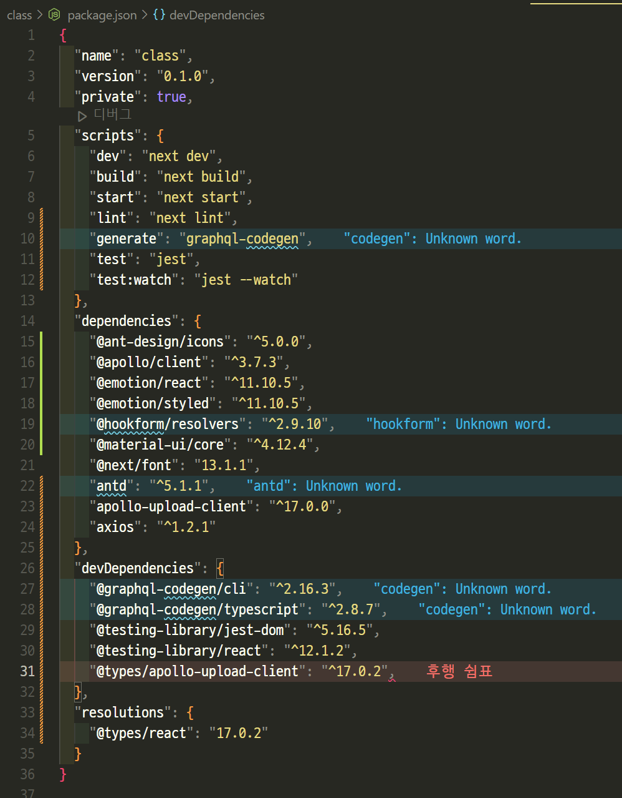
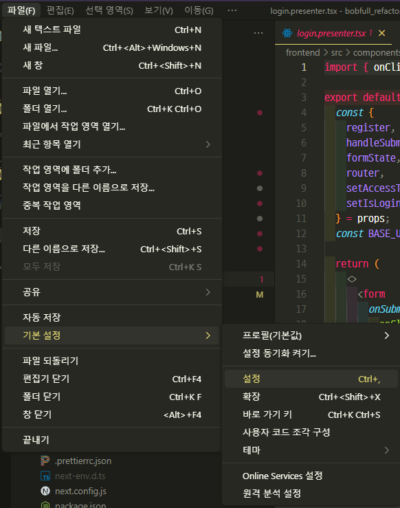
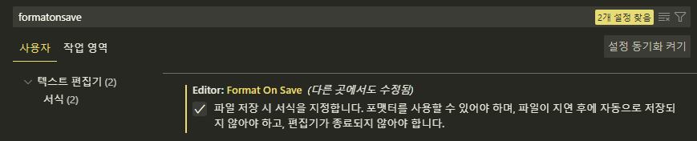

# React (4) 

​    

## 1️⃣ Next.js

- React 기반의 프레임워크

​    

### 설치

```bash
$ npx create-next-app
```

​    

### 보일러 플레이트

```bash
프로젝트파일명
├── node_modules   # 라이브러리 / 프레임워크 저장소
├── pages          # 페이지 화면
├── public         # 사진, 아이콘, 폰트
├── styles         # css파일
├── .gitignore     # git에서 제외할 파일
├── package.json   # 기본 메뉴얼
├── README.md      # 상세 설명서
└── yarn.lock      # 버전 잠금 파일
```

​    

> package.json

- `devDependencies`에 있는 라이브러리들은 배포시에는 제외됨
- `resolution`은 라이브러리 하위 모듈 버전을 고정해줌
- 실제 설치된 파일들은 node_modules안에 있음
- package.json은 설치파일 목록만 보여줌, 설치가 안돼있는 파일도 있을 수 있음



​    

### 서버실행

```bash
$ yarn dev

# 3000번 포트가 사용중일 경우
$ yarn dev -p 다른포트번호
```

​    

### node_modules 재설치

- 기존 node_modules 삭제 후 

```bash
$ yarn install
```

​    

### 페이지 렌더링

- `pages`폴더안에 __주소로 사용할 이름으로 폴더 작성__후 그 폴더안에 `index.js (ts/tsx)` 파일 작성

.assets/image-20230329090457249.png)

.assets/image-20230329090444114.png)

​    

### 페이지 라우팅

- 순수 React에서는 `react-router-dom`을 사용
- Next.js에서는 next에서 제공해주는 `Router` 사용

​    

#### 정적페이지 라우팅 (Static)

- 언제 누구가 접속하든 항상 같은 페이지를 보여주는 페이지로 이동할 때 

```jsx
import { useRouter } from 'next/router'

export default function StaticRoutingPage() {
  const router = useRouter()  ✔️✔️
  const onClickMove = () => { router.push('/이동할url') }
  
  return <button onClick={onClickMove}>페이지이동</button>
}
```

​    

#### 동적페이지 라우팅 (Dynamic)

- Next.js에서의 동적라우팅
- 폴더이름에 대괄호(`[]`) 감싸주기
- 대괄호로 감싸준 값을 index.js 페이지에서 활용할 수 있음
- `/05-08-dynamic-routed-board-query/[article_id]`

.assets/image-20230329145548375.png)

- `/05-08-dynamic-routed-board-query/3`으로 요청시

```jsx
import { useRouter } from 'next/router'

const router = useRouter()
console.log(router.query)  // { article_id: 3 }  ✔️✔️
```

​    

#### Router 객체 

```jsx
import Router from 'next/router'

export default function Routing() {
  const handleClickPathname = () => {
    const pathname = Router.pathname  // 현재 경로 
    alert(pathname)
  }
  const handleClickAsPath = () => {
    const asPath = Router.asPath  // 쿼리를 포함한 경로
    const query = Router.query  // object로 파싱한 쿼리스트링
    alert(asPath)
  }
  const handleClickBack = () => { Router.back() }  // 뒤로가기
  const handleClickReload = () => { Router.reload() }  // 새로고침
  const handleClickReplace = () => { Router.replace('/') }

  return (
    <>
      <button onClick={handleClickPathname}>현재 경로</button>
      <button onClick={handleClickAsPath}>쿼리를 포함한 경로</button>
      <button onClick={handleClickBack}>뒤로가기</button>
      <button onClick={handleClickReload}>새로고침</button><br/>
      <button onClick={handleClickReplace}>현재 페이지 삭제 후 다른 페이지로 이동</button>
    </>
    )
  }
}
```

​    

> `pathname` VS  `asPath`

- `Router.query` : object로 파싱한 쿼리스트링 (`{boardId: 'a7h34vcdr'}`)
- `pathname` : 폴더주소, 쿼리가 해석되지 않은 상태로 경로를 알려줌 (`/boards/[boardId]`)
- `asPath` : 실제주소, 쿼리를 해석한 후 그 값을 포함해서 경로를 알려줌 (`/boards/a7h34vcdr`)

​    

> `push`  VS `replace`

- push로 페이지를 이동하고, 뒤로가기하면 바로 전 페이지로 이동함
- 이러한 특성때문에 로그인 직후에 뒤로가기를 누르면 로그인 페이지로 돌아가질 수 있음
- 이 때, replace를 사용하면 뒤로가기할 페이지에 대한 히스토리를 지울 수 있어 이를 방지할 수 있음

​    

### public 속 이미지

- public 폴더는 `/`로 대체됨

```jsx

```

​    

---

## 2️⃣ 폴더구조

### Container / Presentation 패턴

- 소스코드를 JS부분(기능)과 JSX부분(UI)으로 나누는 방법
- 파일은 나눠져 있지만 실행은 하나로 합쳐서 실행됨

```bash
프로젝트파일명
├── pages
│     ├── 페이지파일1
│     │      └── index.ts
│     └── 페이지파일2
│            └── index.ts
└── src  # 따로 생성해줘야함
     ├── commons  # 공통적으로 사용되는 파일들
     │      ├── lib   # 공통 자체 라이브러리
     │      ├── util  # 공통 함수
     │      └── styles  # 공통 CSS
     └── components
             ├── commons  # 두번 이상 쓰이는 컴포넌트
             │      └── layout  # 레이아웃 컴포넌트
             │						├── banner
             │						├── footer
             │						├── header
             │						├── navigation
             │						├── sidebar
             │						└── index.js  # 모든 레이아웃들을 합쳐주는 파일
             └── units    # 단위컴포넌트 (한번만 사용)
             			├── 기능1 
             			│     ├── 동작1
             			│     │      ├── 기능동작.container.tsx
             			│     │      ├── 기능동작.presenter.tsx
             			│     │      ├── 기능동작.queries.ts
             			│     │      ├── 기능동작.styles.ts
             			│     │      └── 기능동작.types.ts
             			│     └── 동작2
             			└── board
             			      ├── write
             			      │      ├── BoardWrite.container.tsx
             			      │      ├── BoardWrite.presenter.tsx
             			      │      ├── BoardWrite.queries.ts
             			      │      ├── BoardWrite.styles.ts
             			      │      └── BoardWrite.types.ts
             			      └── detail
```

​    

- 실행순서 (부모-자식 관계)

1. _app.js (최상단)
2. page/페이지파일/index.js 

```jsx
import BoardWrite from '../../components/units/board/write/BoardWrite.container.js'

export default function BoardWritePage() {
  return <BoardWrite />
}
```

​    

3. src/components/units/기능/동작/기능동작.container.js

```jsx
import { useState } from 'react'
import { useMutation } from '@apollo/client'
import BoardWriteUI from './BoardWrite.presenter.js'
import CREATE_BOARD from './BoardWrite.queries.js'

export default function BoardWrite() {
  const [value, setValue] = useState('')
  const [createBoard] = useMutation(CREATE_BOARD)
 
  const onClickSumbit = async () => {
    const result = await createBoard({ variables: {} })
  }
  const onChangeValue = (e) => { setValue(e.targe.value) }
  
  return 
  	<BoardWriteUI 
    	onClickSumbit={onClickSumbit} 
    	onChangeValue={onChangeValue} 
    />
}
```

> 3-1. graphql 요청파일 분리

```js
import { gql } from '@apollo/client'

export const CREATE_BOARD = gql`
	mutation createBoard($value: String) {
		createBoard(value: $value) {
	  	_id
	  	value
			message
		}
	}
`
```

​     

4. src/components/units/기능/동작/기능동작.presenter.js

```jsx
import { ValueInput, SendButton } from './BoardWrite.styles.js'

export default function BoardWriteUI(props) {
  const { onClickSumbit, onChangeValue } = props
  
  return (
    <>
    	<ValueInput type="text" onChange={onChangeValue} />
    	<SendButton onClick={onClickSubmit}>요청</SendButton>
    </>
  )
}
```

​    

5. css-in-js 파일

```js
import styled from '@emotion/styled'

export const ValueInput = styled.input`
	border-coler: red;
`
export const SendButton = styled.button`
	background-color: black;
`
```

​     

> utils 폴더

- 폴더경로`/src/commons/utils `
- 공통적으로 쓰이는 함수를 저장하는 폴더

```js
// getDate.js
// 날짜를 다루는 함수
export const getDate = (date) => {
  const curDate = new Date(date)
  const year = curDate.getFullYear()
  const month = curDate.getMonth() + 1
  const day = curDate.getDate()
  
  return `${year}-${month}-${day}`
}
```

​    

### atomic 패턴

- 컴포넌트의 중복을 최소화하기 위해 소스코드를 아주 작은 컴포넌트 단위로 쪼개는 방식
- 재사용성이 좋으나, 상위 코드 수정시 수정해야할 부분이 많아짐
- 총 5개의 폴더구조로 이루어짐
  1. Atoms
     - 버튼, 제목, 텍스트 입력 필드와 같은 가장 작은 구성 컴포넌트
     - 모든 컴포넌트들의 기초가 되는 블록
     - 더 이상 분해 될 수 없는 필수 요소
  2. Molecules : 2개 이상의 원자로 구성
  3. Organisms : Molecules의 모음
  4. Templates : Organisms을 모아 템플릿 생성
  5. Pages : 실제 페이지를 구성하는 단위

​    

---

## 3️⃣ 레이아웃 컴포넌트

.assets/image-20230330152806087.png)

```jsx
// src/components/commons/layout/header/index.tsx
import styled from "@emotion/styled";

const Wrapper = styled.div`
  height: 50px;
  background-color: lightcoral;
`;

export default function LayoutHeader() {
  return <Wrapper>여기는 헤더입니다.</Wrapper>;
}
```

```jsx
// src/components/commons/layout/index.tsx
export default function Layout(props) {
  return (
  	<>
    	<LayoutHeader />
      <LayoutBanner />
      <LayoutNavigation />
    	<LayoutBodyWrapper>
    		<LayoutSidebar />
      	<LayoutBody>{props.children}</LayoutBody>
    	</LayoutBodyWrapper>
    	<LayoutFooter />
    </>
  )
}
```

```jsx
// _app.js
export default function App({ Component, pageProps }) {
  return (
  	<Layout>
      <Component {...pageProps} />
    </Layout>
  )
}
```

​    

### 레이아웃 미적용 영역설정

- 특정 페이지에는 특정 레이아웃이 보이지 않았으면 할 때
- `include`메서드로 배열내 값과 현재페이지의 asPath값을 비교하여 동일하면 레이아웃 제외

```js
// src/components/commons/layout/index.tsx
const HIDDEN_HEADERS = [
  '/레이아웃 제외 페이지주소',
  '/login'
]  ✔️✔️

export default function Layout(props) {
  const router = useRouter()
  const isHiddenHeader = HIDDEN_HEADERS.includes(router.asPath)  ✔️✔️
  
  return (
  	{!isHiddenHeader && <Header />}  // 해당 페이지에서 제외할 레이아웃
  )
}
```

​    

---

## 4️⃣ 글로벌 스타일 적용

- 모든 컴포넌트에 기본적으로 적용시켜주는 스타일
- `_app.tsx`에 적용해줘야함

```jsx
// _app.tsx
import { Global } from '@emotion/react'
import { globalStyles } from "../src/commons/styles/globalStyles";

export default function App({ Component, pageProps }) {
  return (
    <Global styles={globalStyles} />
    <Layout>
      <Component {...pageProps} />
    </Layout>
  )
}
```

.assets/image-20230330193448275.png)

```js
// global css 적용파일
import { css } from '@emotion/react'

export const globalStyles = css`
	* {
		margin: 0;
		box-sizing: 0px;
		font-family: myfont;  ✔️✔️
	}
	
	@font-face {
		font-family: "myfont";  ✔️✔️
		src: url("/fonts/폰트파일")  
	}
`
```

​    

### 폰트 적용

.assets/image-20230331004717224.png)

- `@font-face` 선택자를 이용해 폰트 호출 이름과 경로를 선언
- `font-family` : 폰트를 호출할 이름을 정의해주는 속성
- `src` : 폰타파일의 경로
- font를 적용할 css에 `font-family`
- 압축률이 가장 높은 폰트 확장자 : `woff2`

​    

>FOIT (Flash of Invisible Text)

- 브라우저가 웹 폰트를 다운로드하기 전에 텍스트가 보이지 않는 현상
- 대부분의 웹사이트는 FOIT 현상이 기본값

​    

> FOUT (Flash of Unstyled Text)

- 브라우저가 웹 폰트를 다운로드하기 전에 텍스트가 대체 글꼴로 렌더링되는 현상

​    

---

## 5️⃣ 코드 작성 규칙

### 1. 코드 린터

- 에러는 아니지만 에러로 약속하자는 규칙을 정하는 것을 의미
- vscode상에는 오류로 표기되지만 실행에는 영향없음
- `eslint`를 사용
- next.js에는 이미 설치 되어있어 이를 활성화만 해주면됨

​    

#### 설치

- 설치가 완료되면 `.eslintrc.js` 파일이 생성됨

```bash
$ npx eslint --lint
```

```bash
# eslint를 어떤식으로 사용할지에 대한 질문
How would you like to use ESlint ? => syntax, problems, ✔️[code style]

# Javascript modules VS CommonJS
Waht type of modiles does your project use? => Javascript modules (import/export)

# 프레임워크 선택
Which framework does your project use? => react

# 타입스크립트 사용여부
Does your project use TypeScript? => Yes

# 어디서 실행하는지 확인 (Browser, Node)
Where does your code run? => Browser

# 인기있는 가이드를 할지, 커스텀을 할 지 선택
How would you like to define a style for your project? => Use a popular style guide
Which style guide do you want to follow? => standard

# 설정파일을 뭘로 만들지 물어보는 질문 (JavaScript, YAML, JSON)
What format do you want your config file to be in? => Javascript

# 어떤 패키지 매니저로 설치할지 묻는 질문 
Which package manager do you want to use? => yarn 
```

​     

#### ESLint  규칙 제외

- `.eslintrc.js` 파일의 `rules`에서 불편한 규칙 적용을 제외시킬 수 있음

```js
// .eslintrc.js
module.exports = {
	...
  rules: {  // 제외할 규칙
    "@typescript-eslint/interface-name-prefix": "off",
    "@typescript-eslint/explicit-function-return-type": "off",
    "@typescript-eslint/explicit-module-boundary-types": "off",
    "@typescript-eslint/no-explicit-any": "off",
    "prettier/prettier": ["error", { endOfLine: "auto" }]
  }
}
```

​    

> ESLint 한번에 확인하기

```bash
# 모든 파일을 검사하여 규칙에 어긋나는 부분을 찾아줌
$ npx eslint .

# 위 명령어가 잘 안될 경우
$ npx eslint "**/*.{ts,tsx}"
```

   

### 2. 코드 포멧터

- 코드를 보기 좋게 만들어주는 역할
- `prettier`를 사용

​    

#### 설치

```bash
$ yarn add --dev --exact prettier
```

​    

#### 설정

1. `.prettierrc.json` 설정파일 생성

```json
{
  "tabWidth": 2
}
```

.assets/image-20230330132811872.png)

​    

2. vscode 설정





​     

3. vscode 설정파일로 관리하기

- 최상위 폴더에 `.vscode` 폴더 만들고 그안에 `setting.json` 파일 생성

.assets/image-20230330130413439.png)

```json
// setting.json
{
  "editor.formatOnSave": true,
  "editor.defaultFormatter": "esbenp.prettier-vscode" 
}
```

​    

### ESLint Prettier 연결

```bash
$ npm install --save-dev eslint-config-prettier
$ yarn add eslint-config-prettier --dev
```

```js
// .eslintrc.js
module.exports = {
  env: {
    browser: true,
    es2021: true
  },
  "extends": [
    "plugin:react/recommended", 
    "standard-with-typescript", 
    "prettier"  ✔️✔️
  ],
  override: [],
  parserOptions: {
    project: '**/tsconfig.json',  ✔️✔️
    ecmaVersion: 'latest',
    sourceType: 'module'
  },
  plugins: ['react'],
  rules: {}
}
```

```json
// .eslintrc.json
{
  "extends": ["next/babel", "next/core-web-vitals"]
}
```

​      
