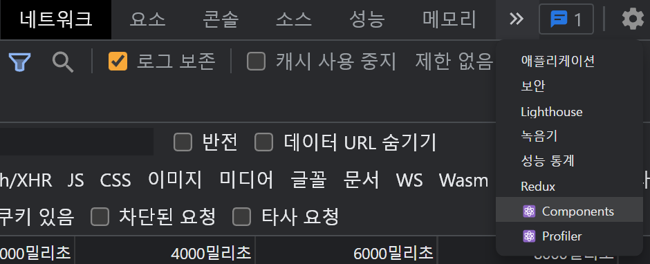
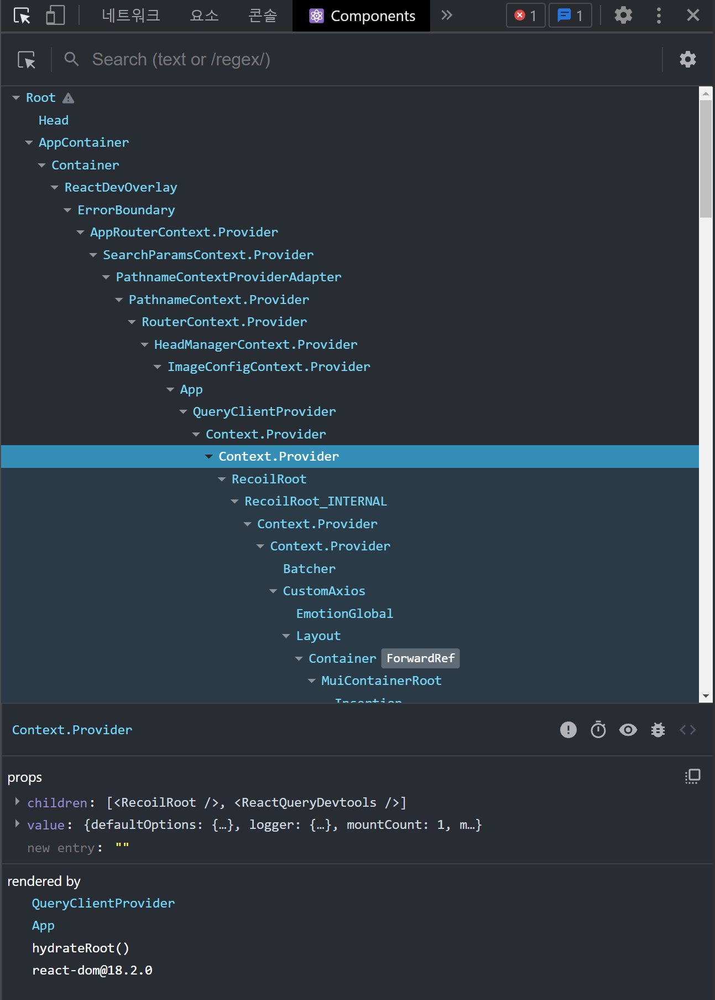
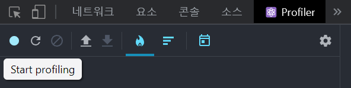
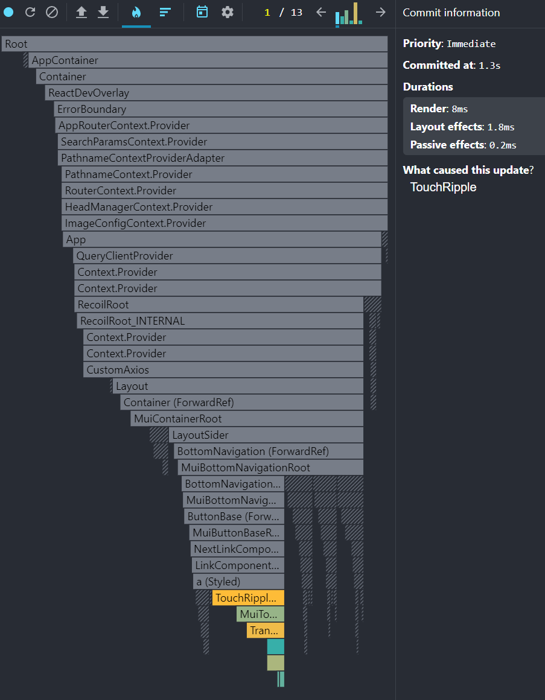

# React (4)

​    

## 1️⃣ React Developer Tools

- 크롬 확장프로그램
- 설치시 개발자도구에 `Components`와 `Profiler` 탭이 생김

​    

### Components

- 컴포넌트 레이어 확인 및 컴포넌트의 props, value 등을 확인가능





​    

### Profiler

- 성능을 저하시키는 컴포넌트를 찾을 때 사용
- 녹화버튼을 누른 뒤, 페이지를 조작하면 행위들을 기록함



- 어떤 행위에 어떤 컴포넌트들이 렌더링 됐는지 확인가능



​    

---

## 2️⃣ Redux DevTools

- 크롬 확장프로그램
- redux의 state값이 변경된 내역을 보여줌

.assets/image-20230327211936168.png)

   

---

## 3️⃣ lazy import

### lazy

- SPA는 처음 사이트에 접속할 때 모든 페이지를 하나로 합쳐 로딩하여 시간이 많이 걸림
- 메인페이지를 로드할 때 필요없는 컴포넌트를 필요해질 때 불러올 수 있게 해주는 기능
- lazy 키워드를 사용하면 사이트 발행시 별도의 js 파일로 분리됨

```jsx
import { lazy } from 'react';

const 필요할때import할컴포넌트 = lazy(() => import('./routes/컴포넌트.js'))
const Detail = lazy(() => import('./routes/Detail.js'))
```

​    

---

## 4️⃣ Selective Hydration

- Suspense를 사용한 컴포넌트는 자동으로 다른 번들로 코드 분할이 됨
- http streaming이 될 때 알아서 제외하고 보내서 파일 size가 작아짐

​     

### Suspense

- lazy import한 컴포넌트 사용시 약간의 지연시간 발생
- 그 지연시간동안 보여줄 컴포넌트 지정가능

```jsx
import { Suspense } from 'react'

// 한 컴포넌트만 감싸기
<Route path='/detail/:id' element={
   <Suspense fallback={'로딩중에 보여줄 페이지'}>
    <Detail />  <!--  -->
  </Suspense>
} />

// Route 전체에 감싸기  
<Suspense fallback={'로딩중에 보여줄 페이지'}>
<Routes>
	...
</Routes>
</Suspense>
```

​    

---

## 5️⃣  재렌더링

- 부모컴포넌트만 재렌더링될 때, 렌더링할 필요가 없는 자식도 같이 렌더링되어 성능 지연이 발생

​    

### memo

- 자식컴포넌트의 props가 변할 때만 재렌더링됨
- 기존 props와 신규 props를 매번 비교하므로 props가 복잡하면 비효율적

```jsx
import { memo } from 'react'

const Child = memo(() => {
  return <div>자식컴포넌트</div>
});

function Parent() {
  return (
  	<Child />
    <div>부모컴포넌트</div>
  )
}
```

​    

### useMemo

- 컴포넌트 렌더링시에만 1회 실행하도록 해주는 함수
- useEffect와 사용법 유사 
- useEffect는 렌더링 후에 실행되지만, useMemo는 렌더링 되는 동안에 함수가 실행됨
- `[]` 디펜던시 사용시 state, props가 변화할 때만 코드가 실행됨

```jsx
import { useMemo } from 'react'

function Func() {
  return 시간이 오래걸리는 결과
}

// 기본
function Detail() {
  useMemo(() => {
    return Func()
  })
}

// 디펜던시 사용
function Main() {
  useMemo(() => { 
    return Func()  // state, props 변화시 다시 실행됨
  }, [state, props])  
}
```

​    

### automatic batch

- react 18버전 이상부터 생김
- state 변경함수들이 연달아 여러개 처리되야하면 다 처리 후 __마지막 한 번만 재렌더링됨__

```jsx
const [counter1, setCounter2] = useState(1)
const [counter2, setCounter2] = useState(2)

function AutomaticBatch() {
  setCounter(prev => prev + 1); // 리렌더링 안됨
  setCounter2(prev => prev + 2); // 리렌더링 안됨
  // 리렌더링 됨
}
```

​    

### flushSync 

- 리렌더링 강제하기
- 대부분의 경우 flushSync 사용하지 않을 수 있음
- flushSync를 마지막 수단으로 사용해야함

```jsx
import { flushSync } from 'react-dom';

const [counter1, setCounter2] = useState(1)
const [counter2, setCounter2] = useState(2)

function AutomaticBatch() {
  flushSync(() => {
  	setCounter(prev => prev + 1); 
	});
  // 리렌더링 됨
  
  flushSync(() => {
  	setCounter2(prev => prev + 2); // 리렌더링 안됨
	});
  // 리렌더링됨
}
```

