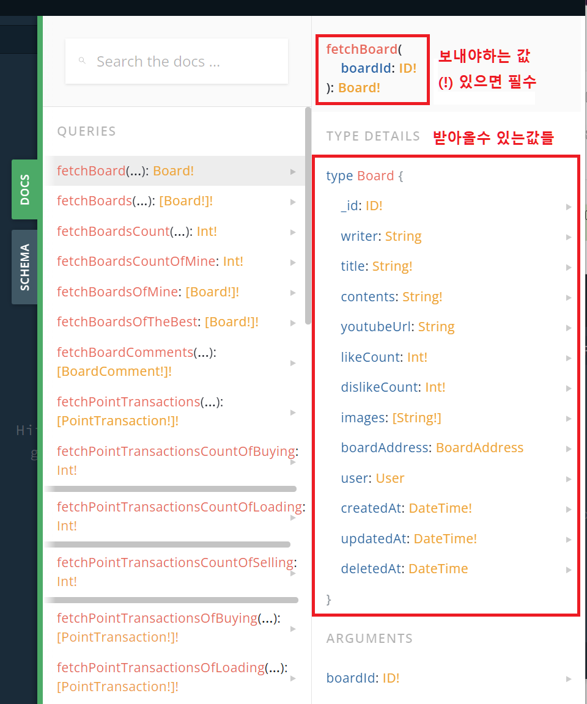

# React (5) 

​    

## 1️⃣ Next.js

- React 기반의 프레임워크


### 설치

```bash
$ npx create-next-app
```


### 보일러 플레이트

```bash
프로젝트파일명
├── node_modules   # 라이브러리 / 프레임워크 저장소
├── pages          # 페이지 화면
├── public         # 사진, 아이콘, 폰트
├── styles         # css파일
├── .gitignore     # git에서 제외할 파일
├── package.json   # 기본 메뉴얼
├── README.md      # 상세 설명서
└── yarn.lock      # 버전 잠금 파일
```

​    

> package.json

- `devDependencies`에 있는 라이브러리들은 배포시에는 제외됨
- `resolution`은 라이브러리 하위 모듈 버전을 고정해줌
- 실제 설치된 파일들은 node_modules안에 있음
- package.json은 설치파일 목록만 보여줌, 설치가 안돼있는 파일도 있을 수 있음


​    

### 서버실행

```bash
$ yarn dev

# 3000번 포트가 사용중일 경우
$ yarn dev -p 다른포트번호
```

​    

### node_modules 재설치

- 기존 node_modules 삭제 후 

```bash
$ yarn install
```

​    

### 페이지 렌더링

- `pages`폴더안에 __주소로 사용할 이름으로 폴더 작성__후 그 폴더안에 `index.js (ts/tsx)` 파일 작성

.assets/image-20230329090457249.png)

.assets/image-20230329090444114.png)

​    

### 페이지 라우팅

- 순수 React에서는 `react-router-dom`을 사용
- Next.js에서는 next에서 제공해주는 `Router` 사용

​    

#### 정적페이지 라우팅 (Static)

- 언제 누구가 접속하든 항상 같은 페이지를 보여주는 페이지로 이동할 때 

```jsx
import { useRouter } from 'next/router'

export default function StaticRoutingPage() {
  const router = useRouter()  ✔️✔️
  const onClickMove = () => { router.push('/이동할url') }
  
  return <button onClick={onClickMove}>페이지이동</button>
}
```

​    

#### 동적페이지 라우팅 (Dynamic)

- Next.js에서의 동적라우팅
- 폴더이름에 대괄호(`[]`) 감싸주기
- 대괄호로 감싸준 값을 index.js 페이지에서 활용할 수 있음
- `/05-08-dynamic-routed-board-query/[article_id]`

.assets/image-20230329145548375.png)

- `/05-08-dynamic-routed-board-query/3`으로 요청시

```jsx
import { useRouter } from 'next/router'

const router = useRouter()
console.log(router.query)  // { article_id: 3 }  ✔️✔️
```

​    

#### Router 객체 

```jsx
import Router from 'next/router'

export default function Routing() {
  const handleClickPathname = () => {
    const pathname = Router.pathname  // 현재 경로 
    alert(pathname)
  }
  const handleClickAsPath = () => {
    const asPath = Router.asPath  // 쿼리를 포함한 경로
    const query = Router.query  // object로 파싱한 쿼리스트링
    alert(asPath)
  }
  const handleClickBack = () => { Router.back() }  // 뒤로가기
  const handleClickReload = () => { Router.reload() }  // 새로고침
  const handleClickReplace = () => { Router.replace('/') }

  return (
    <>
      <button onClick={handleClickPathname}>현재 경로</button>
      <button onClick={handleClickAsPath}>쿼리를 포함한 경로</button>
      <button onClick={handleClickBack}>뒤로가기</button>
      <button onClick={handleClickReload}>새로고침</button><br/>
      <button onClick={handleClickReplace}>현재 페이지 삭제 후 다른 페이지로 이동</button>
    </>
    )
  }
}
```

​    

> `pathname` VS  `asPath`

- `Router.query` : object로 파싱한 쿼리스트링 (`{boardId: 'a7h34vcdr'}`)
- `pathname` : 폴더주소, 쿼리가 해석되지 않은 상태로 경로를 알려줌 (`/boards/[boardId]`)
- `asPath` : 실제주소, 쿼리를 해석한 후 그 값을 포함해서 경로를 알려줌 (`/boards/a7h34vcdr`)

​    

> `push`  VS `replace`

- push로 페이지를 이동하고, 뒤로가기하면 바로 전 페이지로 이동함
- 이러한 특성때문에 로그인 직후에 뒤로가기를 누르면 로그인 페이지로 돌아가질 수 있음
- 이 때, replace를 사용하면 뒤로가기할 페이지에 대한 히스토리를 지울 수 있어 이를 방지할 수 있음

​    

### public 속 이미지

- public 폴더는 `/`로 대체됨

```jsx

```


---

## 2️⃣ CSS-IN-JS

- CSS를 JS 상수에 저장하여 사용하는 방법

```js
// styles/emotion.js
import styled from '@emotion/styled'

export const Box = styled.div`
	width: 100px;
	height: 200px;
`
```

- HTML 태그처럼 사용할 수 있음
- 태그에 의미를 부여할 수 있어 결과물을 예상할 수 있음
- 코드의 길이가 짧아져 읽기 쉬워지고, 코드 재사용성이 좋아짐

```jsx
// 화면페이지
import { Box } from '../../styles/emotion.js'

export default function EmotionPage() {
  
  return(
  	// 너비 100px, 높이 200px을 가진 div 태그
		<Box>박스</Box>  
  )
}
```

- 라이브러리로는 `emotion`과 `styled-components`를 많이 씀

```bash
$ yarn add @emotion/react
$ yarn add @emotion/styled
```


### emotion의 props

- emotion으로 만들어진 태그에도 props 전달가능
- 특정 태그에 동작이 행해지면, props를 활용하여 css 변경 가능

```jsx
import * as S from './Board.styles.js'

export default function BoardUI(props) {
  return (
  	<>
    	<BlackButton
      	color="black"  ✔️✔️
        fontSize="16"
        
      >
    		버튼
    	</BlackButton>
    </>
  )
}
```

```js
export const BlackButton = styled.button`
	background: ${props => props.color}; 
	font-size: ${props => props.fontSize + "px"};
`
```

​    

---

## 3️⃣ 동기 vs 비동기

### 비동기

- 서버에 요청(등록, 수정, 삭제 등)이 저장될 때까지 기다리지 않고 다른 작업을 진행
- 요청들 사이에 서로 기다려 줄 필요가 없을 경우, 여러 가지 요청을 동시에 처리해 줄 때에 사용
- 외부 라이브러리들은 대부분 비동기 방식으로 작동함

```js
// axios
const FetchDate = () => {
  const result = axios({
    method: '',
    url: '',
  })  // result = Promise 객체로 반환
}
```

​    

> Promise 객체

- js에서 비동기 처리에 사용되는 객체
- 서버에서 데이터를 받아오기 전에 화면에 표시하려고 하면 발생하는 문제를 해결하기 위해 사용
- 3가지 상태
  1. Pending (대기) : 비동기 처리 로직이 아직 완료되지 않음
  2. Fulfilled (이행) : 비동기 처리가 완료되어 프로미스가 결과값을 반환해준 상태
  3. Rejected (실패) : 비동기 처리가 실패하거나 오류가 발생

​    

### 동기

- 서버의 작업이 끝날 때까지 기다린 후에 다음 작업을 실행
- JS는 기본적으로 동기처리 방식을 사용

```js
// axios
const FetchDate = async () => {
  const result = await axios({
    method: '',
    url: '',
  }) // result = { 요청한 데이터 값 }
}
```

​    

---

## 4️⃣ Graphql API

- facebook에서 대용량 데이터를 처리하기 위해 개발

​    

### 1. restAPI와의 차이

|             | Graphql                           | REST                               |
| ----------- | --------------------------------- | ---------------------------------- |
| 함수이름    | 일반함수와 같은 이름 (board(1))   | 주소 (https://naver.com/board/1)   |
| 응답 결과물 | 필요한 데이터만 골라 받을 수 있음 | 보내주는 모든 데이터               |
| 요청담당자  | apollo-client                     | axios                              |
| CRUD        | MUTATION (CUD), QUERY (R)         | POST(C), PUT(U), DELETE(D), GET(R) |
| API 명세서  | 플레이그라운드 (Playground)       | 스웨거 (Swagger)                   |

​    

> UnderFetching

- 하나의 endpoint로 필요한 모든 데이터 요청을 처리하지 못하는 것을 의미
- 여러번의 API 호출이 필요해, 서버에 과부하를 줄 수 있음

​    

> OverFetching

- 응답받은 정보에 사용하지 않는 데이터들도 담고있는 것을 의미
- 네트워크가 낭비됨 

​    

### 2. Playground에서 활용


​    

#### Playground docs

- `!`는 무조건 보내줘야하는 필수값



​    

#### Query

```json
// 형식
query {
	함수(보낼값들) {
		받아올 값들
	}
}

// 예시
query {
	fetchData(page: 1) {
		name
		age
		address
	}
}
```

​    

#### Mutation

```json
// 형식
mutation {
  함수(보낼값들) {
    받아올 값들
  }
}

// 예시
mutation {
  createBoard(
  	writer: "writer",
   	title: "title",
    contents: "contents"
  ) {
      _id
      number
      message
    }
}
```


#### 여러 API 한번에 요청

```json
mutation {
  createBoard() {}
  createProfile() {}
	deleteProfile() {}
}

// 결과
{
  "data": {
    "createBoard": {},
    "createProfile": {},
    "deleteProfile": {}
  }
}
```

​    

### 3. vscode에서 활용

#### 설치

```bash
$ yarn add @apollo/client graphql
```

​    

#### 세팅

```jsx
// _app.js
import { ApolloProvider, ApolloClient, InMemoryCache } from '@apollo/client'

function MyApp({ Component, pageProps }) {
  const client = new ApolloClient({  ✔️✔️
    uri: "https://~~",               ✔️✔️ 
    cache: new InMemoryCache()       ✔️✔️
  })
  
  return (
    <ApolloProvider client={client}>  ✔️✔️
    	<Component {...pageProps} />
    </ApolloProvider> ✔️✔️
  )
}

export default MyApp
```


> app.js 작동원리

- `<Component />`에 `index.js`들의 내용들이 들어와 `_app.js`와 합쳐져서 실행됨

​    

#### Mutation 요청

1. graphql 코드작성 (`gql`)
2. 컴포넌트 내에 mutation 코드작성 (`useMutation`)
3. 요청함수 코드 생성 (`async, await, variables`)

```jsx
import { useMutation, gql } from '@apollo/client'
import { useState } from 'react'

// graphql 코드 생성 
const CREATE_BOARD = gql`
	mutation createBoard($writer: String, $title: String){  # 타입적는곳  ✔️✔️
		createBoard(writer: $writer, title: $title) {         # 실제 우리가 전달할 변수 적는 곳  ✔️✔️
			_id
			message
		}
	}
`

export default function GraphqlMutationPage() {
  const router = useRouter()
  const [writer, setWriter] = useState('')
  const [title, setTitle] = useState('')
  
  // mutation 코드 생성
	const [createBoard] = useMutation(CREATE_BOARD)  ✔️✔️
  
  // 요청함수 코드 생성
	const onClickSubmit = async () => {  ✔️✔️
  	// 요청에 실패할 수도 있으므로 `try-catch`문 사용
  	try { 
      const result = await createBoard({
    		variables: {  // variables가 $ 역할을 해줌
      		writer: writer,
      		title: title
    		}
  		})
    	// 생성된 게시글로 이동
    	router.push(`/board/${result.data.createBoard.number}`)
    } catch(error) {
      // try에 있는 내용을 시도하다가 실패하면, 아래 코드 모두 무시하고 catch가 실행됨
      alert(error.message)
    }

	}
  
  const onChangeWriter = (e) => { setWriter(e.target.value) }
  const onChangeTitle = (e) => { setTitle(e.target.value) }
  
  return (
    <input type="text" onChange={onChangeWriter} />
    <input type="text" onChange={onChangeTitle} />
  	<button onClick={onClickSubmit}>Graphql 요청보내기</button>
  )
}
```

- 

​    

#### Query 요청

- ❗ useQuery는 페이지에 접속시 자동으로 요청됨
- ❗ useQuery는 async, await 사용불가

```jsx
import { useQuery, gql } from '@apollo/client'
import { useRouter } from 'next/router'

const FETCH_BOARD = gql`
	query fetchBoard($number: Int) {
		fetchBoard(number: $number) {
			writer
			title
		}
	}
`

export default function DynamicRoutedPage() {
	const router = useRouter()
  const { data } = useQuery(FETCH_BOARD, {
    variables: { number: Number(router.query.boardId) }
  })
  
  return (
    <>
    	// 비동기적으로 처리되기 때문에 undefined에 대한 처리 해줘야함
      <div>{data && data.fetchBoard.writer}</div>  ✔️✔️  // Nullish coalescing
    	<div>{data ? data.fetchBoard.writer : "로딩중"}</div>  ✔️✔️  // 삼항연산자
      <div>{data?.fetchBoard.title}</div>  ✔️✔️  // 옵셔널 체이닝
    </>
  )
}
```

