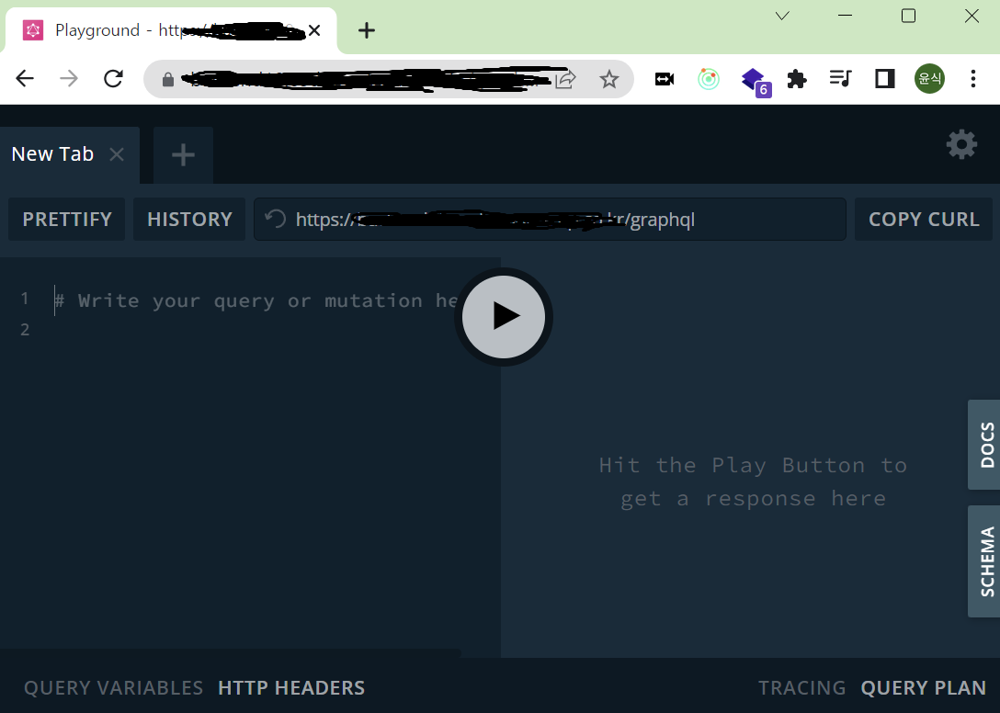
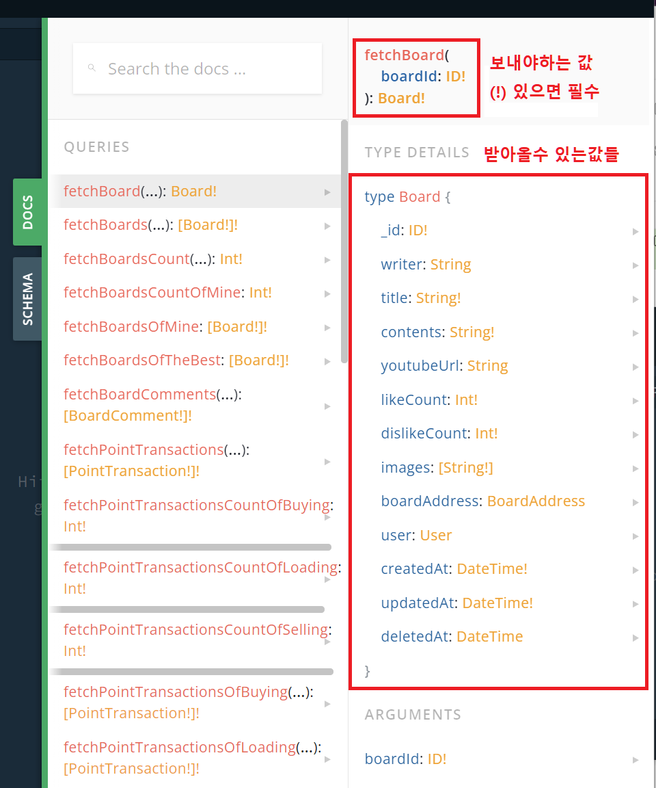

# React (6)

​    

## 1️⃣ Graphql API

- facebook에서 대용량 데이터를 처리하기 위해 개발

​    

### 1. restAPI와의 차이

|             | Graphql                           | REST                               |
| ----------- | --------------------------------- | ---------------------------------- |
| 함수이름    | 일반함수와 같은 이름 (board(1))   | 주소 (https://naver.com/board/1)   |
| 응답 결과물 | 필요한 데이터만 골라 받을 수 있음 | 보내주는 모든 데이터               |
| 요청담당자  | apollo-client                     | axios                              |
| CRUD        | MUTATION (CUD), QUERY (R)         | POST(C), PUT(U), DELETE(D), GET(R) |
| API 명세서  | 플레이그라운드 (Playground)       | 스웨거 (Swagger)                   |

​    

> UnderFetching

- 하나의 endpoint로 필요한 모든 데이터 요청을 처리하지 못하는 것을 의미
- 여러번의 API 호출이 필요해, 서버에 과부하를 줄 수 있음

​    

> OverFetching

- 응답받은 정보에 사용하지 않는 데이터들도 담고있는 것을 의미
- 네트워크가 낭비됨 

​    

### 2. Playground에서 활용



​    

#### Playground docs

- `!`는 무조건 보내줘야하는 필수값



​    

#### Query

```json
// 형식
query {
	함수(보낼값들) {
		받아올 값들
	}
}

// 예시
query {
	fetchData(page: 1) {
		name
		age
		address
	}
}
```

​    

#### Mutation

```json
// 형식
mutation {
  함수(보낼값들) {
    받아올 값들
  }
}

// 예시
mutation {
  createBoard(
  	writer: "writer",
   	title: "title",
    contents: "contents"
  ) {
      _id
      number
      message
    }
}
```


#### 여러 API 한번에 요청

```json
mutation {
  createBoard() {}
  createProfile() {}
	deleteProfile() {}
}

// 결과
{
  "data": {
    "createBoard": {},
    "createProfile": {},
    "deleteProfile": {}
  }
}
```

​    

### 3. vscode에서 활용

#### 설치

```bash
$ yarn add @apollo/client graphql
```

​    

#### 세팅

```jsx
// _app.js
import { ApolloProvider, ApolloClient, InMemoryCache } from '@apollo/client'

function MyApp({ Component, pageProps }) {
  const client = new ApolloClient({  ✔️✔️
    uri: "https://~~",               ✔️✔️ 
    cache: new InMemoryCache()       ✔️✔️
  })
  
  return (
    <ApolloProvider client={client}>  ✔️✔️
    	<Component {...pageProps} />
    </ApolloProvider> ✔️✔️
  )
}

export default MyApp
```


> app.js 작동원리

- `<Component />`에 `index.js`들의 내용들이 들어와 `_app.js`와 합쳐져서 실행됨

​    

#### Mutation 요청

1. graphql 코드작성 (`gql`)
2. 컴포넌트 내에 mutation 코드작성 (`useMutation`)
3. 요청함수 코드 생성 (`async, await, variables`)

```jsx
import { useMutation, gql } from '@apollo/client'
import { useState } from 'react'

// graphql 코드 생성 
const CREATE_BOARD = gql`
	mutation createBoard($writer: String, $title: String){  # 타입적는곳  ✔️✔️
		createBoard(writer: $writer, title: $title) {         # 실제 우리가 전달할 변수 적는 곳  ✔️✔️
			_id
			message
		}
	}
`

export default function GraphqlMutationPage() {
  const router = useRouter()
  const [writer, setWriter] = useState('')
  const [title, setTitle] = useState('')
  
  // mutation 코드 생성
	const [createBoard] = useMutation(CREATE_BOARD)  ✔️✔️
  
  // 요청함수 코드 생성
	const onClickSubmit = async () => {  ✔️✔️
  	// 요청에 실패할 수도 있으므로 `try-catch`문 사용
  	try { 
      const result = await createBoard({
    		variables: {  // variables가 $ 역할을 해줌
      		writer: writer,
      		title: title
    		}
  		})
    	// 생성된 게시글로 이동
    	router.push(`/board/${result.data.createBoard.number}`)
    } catch(error) {
      // try에 있는 내용을 시도하다가 실패하면, 아래 코드 모두 무시하고 catch가 실행됨
      alert(error.message)
    }

	}
  
  const onChangeWriter = (e) => { setWriter(e.target.value) }
  const onChangeTitle = (e) => { setTitle(e.target.value) }
  
  return (
    <input type="text" onChange={onChangeWriter} />
    <input type="text" onChange={onChangeTitle} />
  	<button onClick={onClickSubmit}>Graphql 요청보내기</button>
  )
}
```

​     

#### Query 요청

- ❗ useQuery는 페이지에 접속시 자동으로 요청됨
- ❗ useQuery는 async, await 사용불가

```jsx
import { useQuery, gql } from '@apollo/client'
import { useRouter } from 'next/router'

const FETCH_BOARD = gql`
	query fetchBoard($number: Int) {
		fetchBoard(number: $number) {
			writer
			title
		}
	}
`

export default function DynamicRoutedPage() {
	const router = useRouter()
  const { data } = useQuery(FETCH_BOARD, {
    variables: { number: Number(router.query.boardId) }
  })
  
  return (
    <>
    	// 비동기적으로 처리되기 때문에 undefined에 대한 처리 해줘야함
      <div>{data && data.fetchBoard.writer}</div>  ✔️✔️  // Nullish coalescing
    	<div>{data ? data.fetchBoard.writer : "로딩중"}</div>  ✔️✔️  // 삼항연산자
      <div>{data?.fetchBoard.title}</div>  ✔️✔️  // 옵셔널 체이닝
    </>
  )
}
```


---

## 2️⃣ [graphql-codegen](https://www.graphql-code-generator.com/)

- graphql API에서 docs를 기준으로 타입파일을 자동으로 추출해줌

​    

### 설치

```bash
$ yarn add -D @graphql-codegen/cli
$ yarn add -D @graphql-codegen/typescript 
```

​    

### 설정

- `schema` : graphql url주소를 넣어줌 (_app.tsx의 주소와 동일)

```yaml
# codegen.yaml
schema: 백엔드주소
generates:
	./src/commons/types/generated/types.ts:
		plugins:
			- typescript
		config:
			typesPrefix: I
```


### 실행

- graphql-API에서 데이터를 받아 자동으로 TS파일을 `./src/commons/types/generated/types.ts` 위치에 만들어줌

```json
// package.json
"scripts": {
	"generate": "graphql-codegen"
}
```

```bash
$ yarn generate
```

​    

### 적용

#### Mutation

```typescript
const [함수] = useMutation<응답타입, variables타입>()
const [createBoard] = useMutation<Pick<Mutation,"createBoard">,MutationCreateBoardArgs>(CREATE_BOARD)
```

​    

#### Query

```typescript
const { data } = useQuery<Pick<Query,"fetchBoard">,QueryFetchBoardArgs>(FETCH_BOARD, {
  variables: { number: Number(router.query.number )}
})
```

​    

---

## 3️⃣ refetchQueries

- 기존 데이터가 변경되었을 때 최신 데이터로 다시 fetch 해주기 위해 사용됨
- Apollo에서 제공하는 기본 기능
- 배열로 시작

```jsx
// 글 삭제하고 데이터 다시받아오기
export default function Page() {
  const [deleteBoard] = useMutation(DELETE_BOARD)
  const { data } = useQuery(FETCH_BOARDS)
  
  const onClickDelete = async () => {
    try {
      const result = await deleteBoard({ 
        variables: { number: Number(e.target.id) },
        refetchQueries: [{ 
          query: FETCH_BOARDS,
          variables: { 기존 fetch때 보낸내용 }  // 기존 fetch에 variables가 있었다면 작성
        }]
      }),
    } catch (error) {}
	}
    
  return (
   <>
    {data?.fetchBoards.map(el => (
    	<Fragment key={el.number}>
    		<div>{el.number}</div>
  			<button id={el.number} onClick={onClickDelete}>삭제</button>
  		</Fragment>	
  	))}
   </>
  )
}
```

​    
