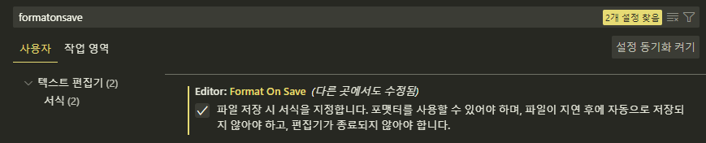

# React (7)

​    

## 1️⃣ 이벤트 전파

### 이벤트 버블링

- 특정화면요소에 이벤트가 발생했을 때, 이벤트가 더 상위 요소들에게도 영향을 주는 특성
- 자식에서 부모로 이벤트 전파

```html
<!-- p태그 클릭시 `p > div > form` 순으로 총 3개의 경고창 발생 -->
<form onclick="alert(form)">
	<div onclick="alert(div)">
		<p onclick="alert(p)">P</p>
	</div>
</form>
```

```jsx
// div태그(자식)를 클릭하면 S.Wrapper태그(부로)로 이벤트 전파(버블링) 됨
export default function CommentUI(props) {
	const onClickEvent = (e) => { alert(e.currentTarget) }
  
  return (
  	{props.data.map((el) => (
  		<S.Wrapper id={el._id} onClick={onClickEvent}>
      	<div>A</div>
      	<div>B</div>
      	<div>C</div>
    	</S.Wrapper>
  	))}
  )
}
```

- ` event.target` : 이벤트가 발생한 주체 (클릭된 주체 : `div`)
- `event.currentTarget` : 이벤트 버블링에 의해 이벤트가 발생한 주체


> event.stopPropagation

- 이벤트 버블링을 막아줌

```jsx
const onClickTop = (e) => {}
const onClickBottom = (e) => {
  event.stopPropagation()  // onClickTop까지 이벤트 버블링되는 것을 막아줌
}

<div onClick={onClickTop}>
	<div onClick={onClickBottom}>
    <div>여기를 클릭</div>
  </div>
</div>
```

​        

### 이벤트 캡처링

- 상위요소에서 하위요소로 이벤트가 전파되는 경우
- 부모에서 자식으로 이벤트 전파

​    

---

## 2️⃣ 코드 작성 규칙

### 코드 린터

- 에러는 아니지만 에러로 약속하자는 규칙을 정하는 것을 의미
- vscode상에는 오류로 표기되지만 실행에는 영향없음
- `eslint`를 사용
- next.js에는 이미 설치 되어있어 이를 활성화만 해주면됨

​    

#### 설치

- 설치가 완료되면 `.eslintrc.js` 파일이 생성됨

```bash
$ npx eslint --lint
```

```bash
# eslint를 어떤식으로 사용할지에 대한 질문
How would you like to use ESlint ? => syntax, problems, ✔️[code style]

# Javascript modules VS CommonJS
Waht type of modiles does your project use? => Javascript modules (import/export)

# 프레임워크 선택
Which framework does your project use? => react

# 타입스크립트 사용여부
Does your project use TypeScript? => Yes

# 어디서 실행하는지 확인 (Browser, Node)
Where does your code run? => Browser

# 인기있는 가이드를 할지, 커스텀을 할 지 선택
How would you like to define a style for your project? => Use a popular style guide
Which style guide do you want to follow? => standard

# 설정파일을 뭘로 만들지 물어보는 질문 (JavaScript, YAML, JSON)
What format do you want your config file to be in? => Javascript

# 어떤 패키지 매니저로 설치할지 묻는 질문 
Which package manager do you want to use? => yarn 
```

​     

#### ESLint  규칙 제외

- `.eslintrc.js` 파일의 `rules`에서 불편한 규칙 적용을 제외시킬 수 있음

```js
// .eslintrc.js
module.exports = {
	...
  rules: {  // 제외할 규칙
    "@typescript-eslint/interface-name-prefix": "off",
    "@typescript-eslint/explicit-function-return-type": "off",
    "@typescript-eslint/explicit-module-boundary-types": "off",
    "@typescript-eslint/no-explicit-any": "off",
    "prettier/prettier": ["error", { endOfLine: "auto" }]
  }
}
```

​    

> ESLint 한번에 확인하기

```bash
# 모든 파일을 검사하여 규칙에 어긋나는 부분을 찾아줌
$ npx eslint .

# 위 명령어가 잘 안될 경우
$ npx eslint "**/*.{ts,tsx}"
```

   

### 코드 포멧터

- 코드를 보기 좋게 만들어주는 역할
- `prettier`를 사용

​    

#### 설치

```bash
$ yarn add --dev --exact prettier
```

​    

#### 설정

1. `.prettierrc.json` 설정파일 생성

```json
{
  "tabWidth": 2
}
```

.assets/image-20230330132811872.png)

​    

2. vscode 설정




​     

3. vscode 설정파일로 관리하기

- 최상위 폴더에 `.vscode` 폴더 만들고 그안에 `setting.json` 파일 생성

.assets/image-20230330130413439.png)

```json
// setting.json
{
  "editor.formatOnSave": true,
  "editor.defaultFormatter": "esbenp.prettier-vscode" 
}
```

​    

### ESLint Prettier 연결

```bash
$ npm install --save-dev eslint-config-prettier
$ yarn add eslint-config-prettier --dev
```

```js
// .eslintrc.js
module.exports = {
  env: {
    browser: true,
    es2021: true
  },
  "extends": [
    "plugin:react/recommended", 
    "standard-with-typescript", 
    "prettier"  ✔️✔️
  ],
  override: [],
  parserOptions: {
    project: '**/tsconfig.json',  ✔️✔️
    ecmaVersion: 'latest',
    sourceType: 'module'
  },
  plugins: ['react'],
  rules: {}
}
```

```json
// .eslintrc.json
{
  "extends": ["next/babel", "next/core-web-vitals"]
}
```

​    

---

## 3️⃣ 라이브러리 / 프레임워크

- 라이브러리 : 특정기능, 도구 1개, React
- 프레임워크 : 도구모음, Next


### 컴포넌트 디자인 라이브러리

#### Ant-Design

#### Material-UI


### 주소/우편번호 라이브러리

#### [React-daum-postcode](https://www.npmjs.com/package/react-daum-postcode)

- 주소 검색시 우편번호, 번지수, 도로명주소를 알려주는 라이브러리
- 국내용

```bash
$ yarn add react-daum-postcode
```

