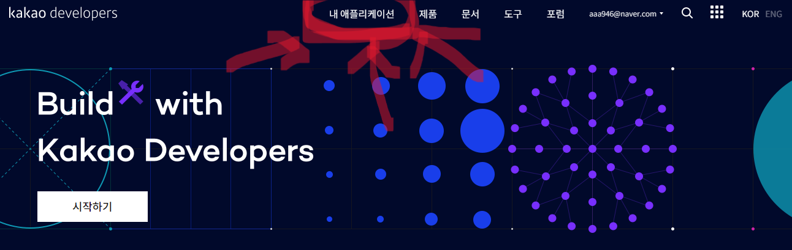
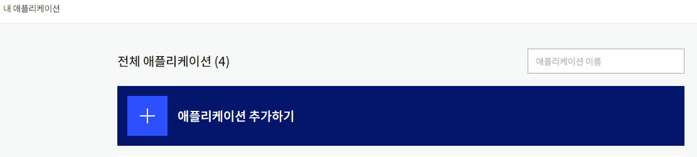
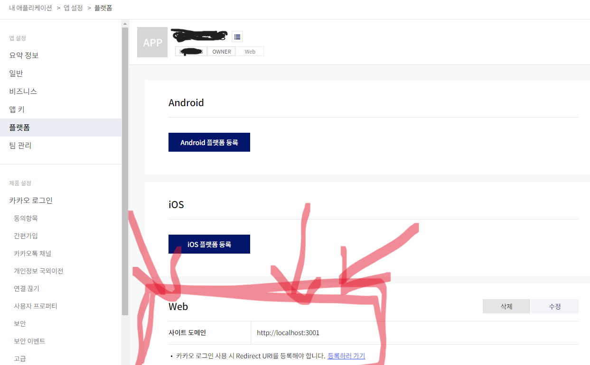
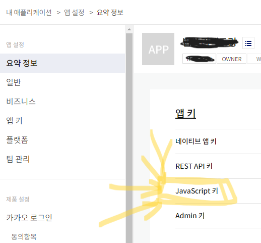

# React (9)

​    

## 댓글 수정


## 페이지네이션

- 페이지 번호를 클랙해서 이동하는 방식의 페이지 처리 방법


```jsx

```


##  무한스크롤

react-ininite-scroller


## 검색

### 디바운싱 (Debouncing)

- 마지막 입력을 기준으로, 특정 시간 이내에 추가 입력이 없으면 1번 실행하는 것
- 반복적인 동작을 강제적으로 대기하는 것을 의미
- 마지막 한번 요청
- 검색시 엔터를 치지 않아도 사용자 입력이 멈추고 일정시간이 지났을 때 자동으로 함수를 실행시켜 결과를 보여줌

> `lodash`라이브러리의 `debounce()` 함수 사용

```js
_.debounce(() => {
  실행될 이벤트
}, 시간) // 이 시간동안 아무일도 일어나지 않으면 위에 이벤트 실행
```

```js
import { debounce } from 'lodash'

export default function Page() {
  const getDebounce = _.debounce((value) => {
    // refecth 요청
    void refetch({ search: value, page: 1 })  // graphql
  }, 400)
  
  const onChangeSearch = (e: ChangeEvent<HTMLInputElement>) => {
    getDebounce(e.target.value)
  }
}
```

​    

### 검색 키워드 강조

```jsx
const [keyword, setKeyword] = useState('')

const getDebounce = _.debounce((value) => {
    // refecth 요청
    void refetch({ search: value, page: 1 }
  	setKeyword(value)  ✔️✔️
  }, 400)

const onChangeSearch = (e: ChangeEvent<HTMLInputElement>) => {
    getDebounce(e.target.value)
}

return (
	<>
  	<input type="text" onChange={onChangeSearch} />
  	{result.data.map((el) => (
			<div key={el.id}>
  			<span>{el.내용1}</span>
 				<!-- 검색 키워드 강조 시작 -->
		    <span>
          {el.내용2
          	.replaceAll(keyword, `%$#@!${keyword}%$#@!`)
           	.split('%$#@!')
           	.map((el) => (
            	<span key={uuid4()}>{el}</span>
          	))}
        </span>
    		<!-- 검색 키워드 강조 끝 -->
  		</div>	
		))}
  </>
)
```

​    

### 쓰로틀링 (Throttle)

- 최초 입력을 기준으로, 특정 시간 이내에 발생한 추가 입력을 무시하는 것
- 먼저 한번 요청
- 무한스크롤


## 지도

### 카카오지도 연동하기

[카카오개발자사이트](https://developers.kakao.com/)

애플리케이션등록









[지도Docs](https://apis.map.kakao.com/web/)


- Next에서 사용

```tsx
import Head from 'next/head'
import { useEffect } from 'react'

declare const window: typeof globalThis & {
  kakao: any;
}

export default function KakaoMapPage() {
  useEffect(() => {
    const container = document.getElementById("map"); // 지도를 담을 영역의 DOM 레퍼런스
    const options = {
      // 지도를 생성할 때 필요한 기본 옵션
      center: new window.kakao.maps.LatLng(33.450701, 126.570667), // 지도의 중심좌표.
      level: 3, // 지도의 레벨(확대, 축소 정도)
    };
    const map = new window.kakao.maps.Map(container, options); // 지도 생성 및 객체 리턴
  })
  
  return (
  	<Head>
      <script
        type="text/javascript"
        src="//dapi.kakao.com/v2/maps/sdk.js?appkey=발급받은APP키"
      ></script>
    </Head>
    <div id="map" style={{ width: "500px", height: "400px" }}></div>
  )
}
```


> 버튼클릭하여 페이지를 이동했을 때, 지도가 안나오는 현상

```tsx
import { useRouter } from "next/router";
import Link from "next/link";

export default function KakaoMapPage() {
  const router = useRouter();

  const onClickMoveToMap = () => {
    void router.push("/kakaoMap");
  };

  return (
    <>
    	// SPA 방식으로 이동
      <button onClick={onClickMoveToMap}>맵으로 이동</button>
    
    	// MPA 방식으로 이동 (잘 안씀) - CSR가 안됨
    	<a href="/kakaoMap">맵으로 이동(a태그)</a>
    
    	// SPA 방식으로 이동 - CSR가 적용됨 ✔️✔️
      <Link href="/kakaoMap">맵으로 이동(Link)</Link>
    </>
  );
}
```

- SPA의 특징을 이해해야함
- `<Link>` 대신 `router.push`를 쓰는 경우
  1. 버튼 클릭으로 이동하는 경우가 아닐 때
  2. 클릭시 추가 로직을 실행시키고 싶은 경우