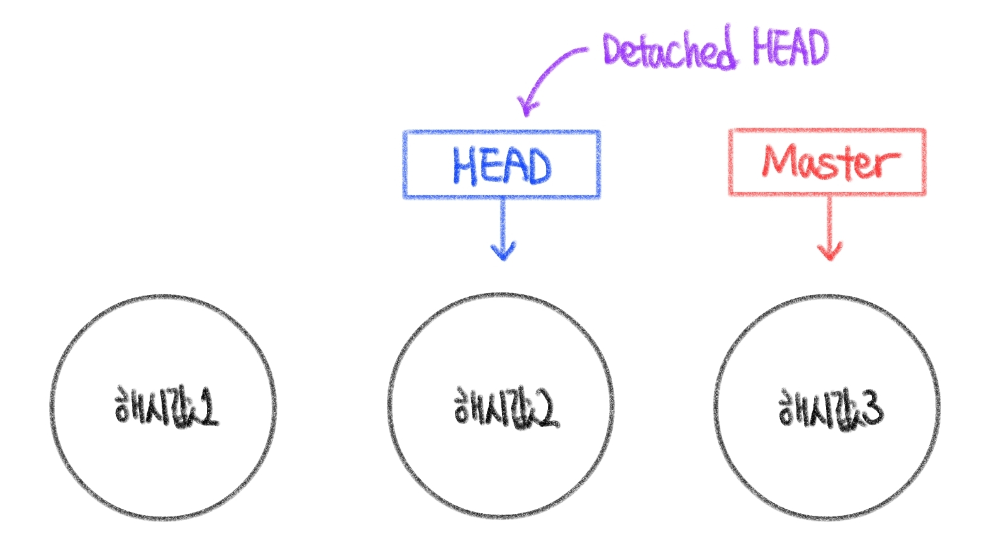
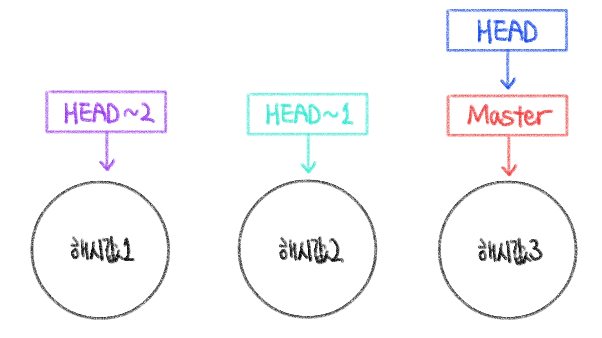
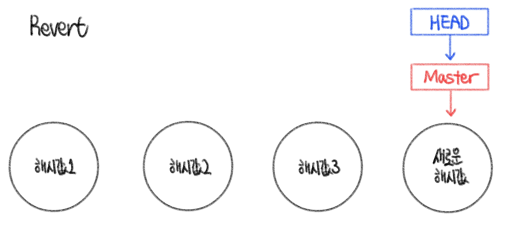

# Git 정리 (5) 

​    

## 1️⃣ Git checkout

### 1. 이전 커밋 확인 (해시값 기반)

### 

```bash
$ git checkout 해시값
```

- 해당 해시값의 커밋이전으로 돌아감
- 아직 이후의 커밋들이 살아진 상태는 아님 (정찰 개념)
- HEAD가 해당 커밋을 가리키는 상태 (`Detached HEAD`)

​    

> 다시 Master로 돌아오기

```bash
$ git switch master
```

​    

> 해시값 이전으로 돌아가서 다른 브랜치 만들고 복귀하기

```bash
$ git checkout 해시값
$ git switch -c 새브랜치명
# 새 브랜치에서 작업 후 복귀
$ git switch master
```

​    

### 2. 이전 커밋 확인 (헤드 기반)

### 

```bash
$ git checkout HEAD~1  # 헤드에서 1개 이전의 커밋 참조
$ git switch -  # 가장 최근에 있었던 브랜치로 돌아감
```

​    

### 3. 변경사항 폐기

- 파일의 변경 사항 취소하기
- 마지막 커밋에서의 내용으로 재설정
- 마지막 커밋했을 때 모습으로 되돌림

```bash
$ git checkout HEAD 파일명  # 1번 방법
$ git checkout -- 파일명    # 2번 방법
```

​    

---

## 2️⃣ Git restore

1. 파일 수정 취소
2. 파일 스테이징 취소

​    

### 1. 저장소 변경사항 삭제

- 마지막 커밋 이후의 저장소 변경사항 삭제

```bash
$ git restore 파일명
```

​    

### 2. 특정 커밋 복원

- 헤드의 이동 x, 특정 커밋만 복구됨

```bash
$ git restore --source HEAD~1 파일명
```

​    

### 3. 스테이징 취소

- `add`한 파일을 취소하고 싶을 때 사용

```bash
$ git restore --staged 파일명
```

​    

---

## 3️⃣ Git reset

.assets/reset.jpg)

- 저장소를 특정 커밋으로 재설정
- 커밋을 완전히 제거하고 브랜치 포인터를 뒤로 이동 (해당 커밋이 처음부터 존재하지 않은 것처럼 만듬)

​    

- 일반 재설정

```bash
$ git reset 해시값   # 커밋만 제거됨, 워킹 디렉토리에 이전 내용 남아있음, 다른 브랜치에 저장가  능
```

- 하드 재설정

```bash
$ git reset --hard 해시값   # 아예 이전 상태로 되돌려버림
```

​    

---

## 4️⃣ Git revert



- 이전 커밋의 변경사항을 취소하고 완전히 새로운 커밋 만듬
- 협업해야하는 상황에서 많이 쓰임

```bash
$ git revert 해시값
```


