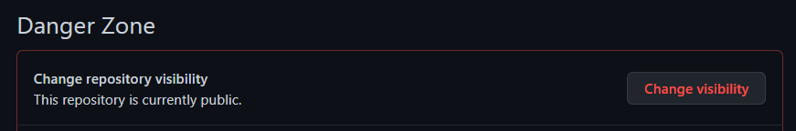

# Git 정리 (7) 

​    

## 1️⃣ Github Repository 비공개하기

- 저장소 주인만 설정가능

.assets/비공개3.png)



.assets/비공개2.png)

​    

---

## 2️⃣ 공동작업자 추가하기

.assets/image-20220928004952707.png)

>  공동작업자

- 저장소 공개 / 비공개 여부 상관없음
- 변경사항 클론하고 푸시 가능
- 설정에는 접근 불가 (저장소 소유자만 가능)

​    

---

## 3️⃣ Gist

- 간단한 코드공유시 사용

.assets/image-20220928002325692.png)

​    

## 4️⃣ github page

> https://pages.github.com/

- 정적 페이지만 가능

​    

### User Sites

```http
username.github.io
```

- 깃허브 계정당 한개

​    

### Project Sites

```http
username.github.io/repo-name
```

- 모든 저장소, 프로젝트의 웹사이트를 만들 수 있음
- 프로젝트당 1개
