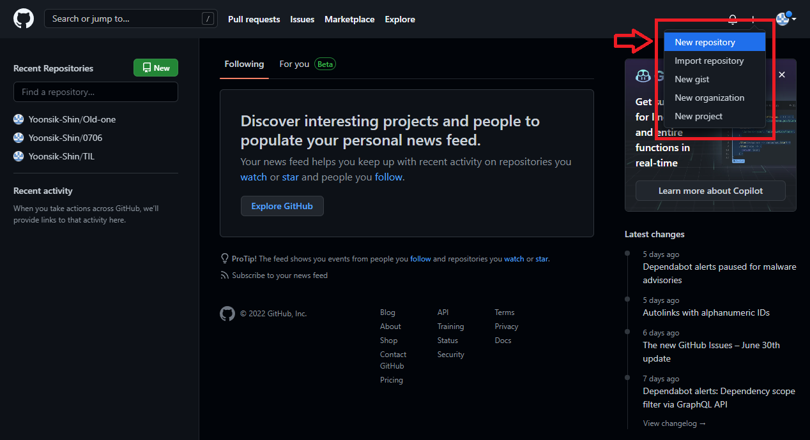
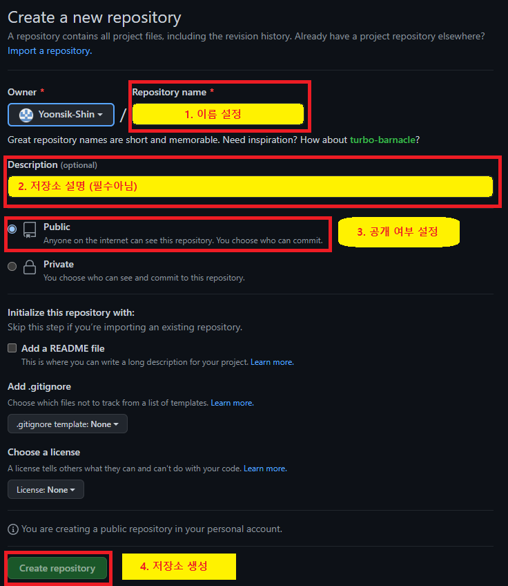
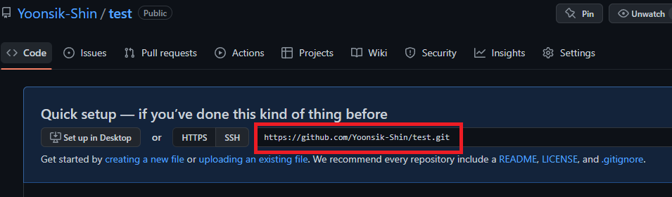
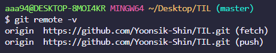
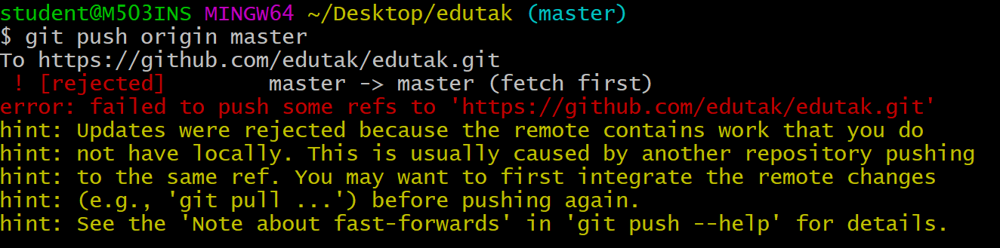

# 👻오늘 배운것 (22.07.06(수))


### 🔒원격저장소 (Remote Repository) 

- 네트워크를 활용한 저장소 

  - GitHub

  - GitLab

  - Bitbucket
  
    

- 원격저장소 기본흐름

  - 로컬 저장소 버전 <<  >> 원격 저장소

    

---


#### 1. GitHub에 원격 저장소 만들기

1.  깃허브 페이지에서 New Repository 생성



2. 저장소 환경설정




3. 저장소 url 확인

```markdown
https://github.com/**GitHub Username**/**저장소이름**.git
```




#### 2. 원격저장소 경로설정

- 원격 저장소 정보를 로컬 저장소에 추가해주는 작업

- 로컬 저장소에는 한번만 설정해주면 됨

```bash	
# 원격저장소 추가 (원격저장소는 일반적으로 <origin>)
$ git remote add <원격저장소> <https://github.com/GitHub Username/저장소이름.git>

# 원격저장소 삭제
$ git remote rm <원격저장소>
```

😂 암기법

> 깃아 원격저장소에 추가해 origin으로


- 설정 여부 확인

```bash
$ git remote -v 
```




#### 3. 원격저장소로 Push

```bash	
$ git push origin master #git push <원격저장소이름><브랜치이름>
```

>  ⛔ 주의사항 : push시 인증정보 필수


#### ❗Push 실패

- 협업시 발생할 수 있는 메시지



> 로컬 저장소와 원격 저장소의 커밋 이력이 다른 경우 발생한다.


❓해결방법❓

1. 원격 저장소의 커밋을 로컬 저장소로 가져오기 (pull)
2. 로컬에서 두 커밋 병합 > Merge된 추가 커밋 생성
3. 다시 GitHub로 push


### Git 파일관리 심화

```bash
# 버전관리와 상관없는 파일 관리
$ touch .gitignore
```

⛔ 주의사항

> 커밋전에 넣어야하며 이미 커밋된 파일은 반드시 삭제해야 적용
>
> 따라서, 프로젝트 시작전에 미리 설정 해놓기!

#️⃣ gitignore관련 사이트 > [.gitignore.io](https://www.toptal.com/developers/gitignore/) #️⃣

