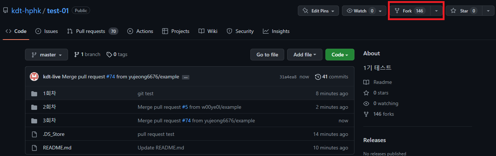
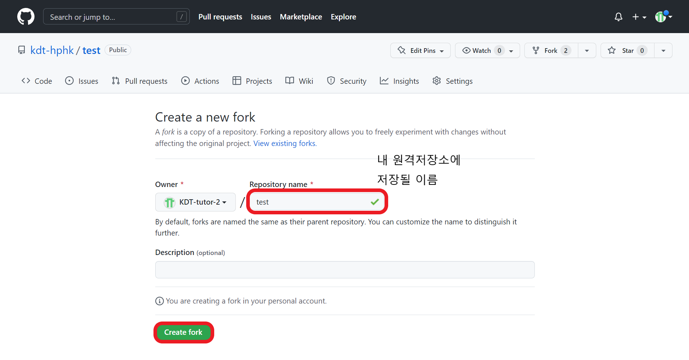
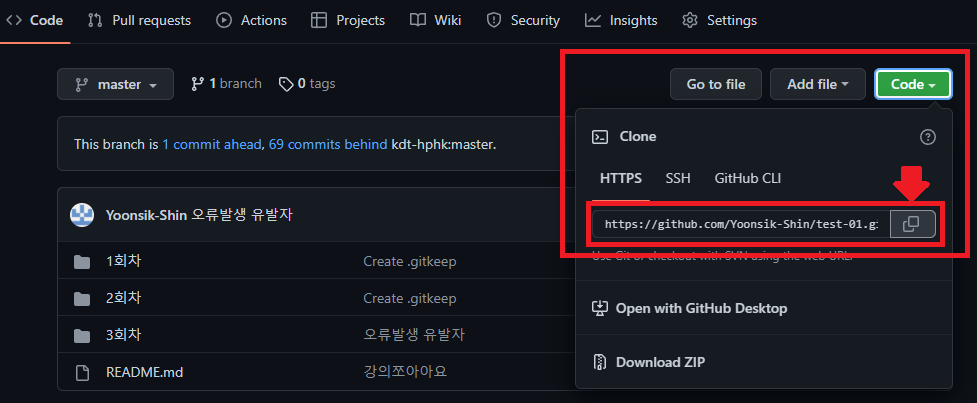
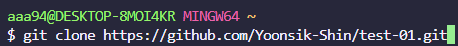
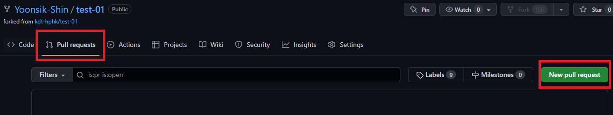
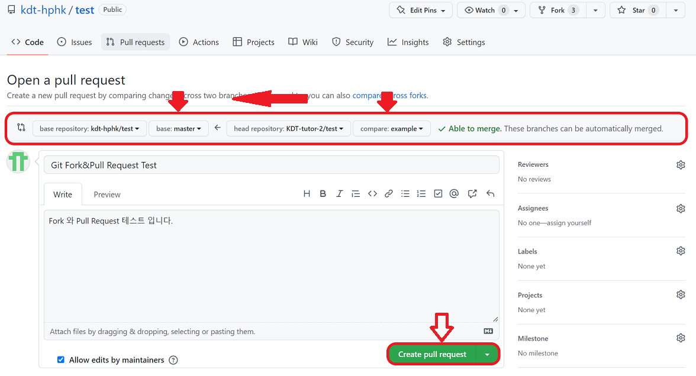

# 😁오늘 배운것 (22.07.07(목))

​    

## 1️⃣ Git clone

- 원격저장소를 복제하여 모든 버전을 가져옴
- 바탕화면에 복제하는게 좋음

```bash
$ git clone <깃허브 주소>
```

​    

## 2️⃣ Git pull

- 원격 저장소로부터 변경된 내역을 받아와서 이력을 병합

```bash
$ git pull origin master  # git pull <원격저장소이름><브랜치이름>
```

​    

❓ Clone vs pull❓

> Clone : 원격저장소 복제 (원격에 있는 프로젝트 시작)
>
> Pull : 원격저장소 커밋 가져오기 (프로젝트 개방 중 다른사람 커밋 받아오기)

​    

___

## 3️⃣ Git branch

> HEAD

- 저장소에서 현재 우리 위치를 가리키는 포인터
- 브랜치 레퍼런스를 가리킴 (브랜치 = 책의 책갈 피)
- 브랜치에서 가장 최근에 커밋한 브랜치를 가리킴

​    

### 1. branch 관련 명령어 

```bash
$ git branch                  # 브랜치 목록 확인
$ git branch <브랜치명>        # 브랜치 생성
$ git checkout <브랜치명>      # 해당 브랜치로 이동 (Old school)
$ git ckeckout -b <브랜치명>   # 브랜치 생성 후 이동까지 (Old school) 
$ git switch <브랜치명>        # 해당 브랜치로 이동 (New one!) ✔️✔️
$ git switch -c <브랜치명>     # 브랜치 생성 후 이동까지 (New one!) ✔️✔️
$ git branch -d <브랜치명>     # 해당 브랜치 삭제
$ git merge <브랜치명>         # 브랜치 병합 (master와 브랜치명) // 이미 병합된 브랜치는 삭제한다
```

​    

> 브랜치 이름 변경

- 이름을 변경하려는 브랜치로 이동 후 명령어 작성

```bash
(<변경하려는 브랜치명>) $ git branch -m <새로운 브랜치명>
```

​    

### 2. branch 병합시나리오

#### 1. fast-forward 상황 (빨리감기)

- 새로운 브랜치가 생성된 이후 master 브랜치에 변경사항이 없는 상황


1. `<브랜치명>` 생성 및 이동

```bash
(master) $ git checkout -b <브랜치명>  
# or
(master) $ git switch -c <브랜치명>
```

2. 새 브랜치에서 작업완료 후 commit

```bash
(<브랜치명>) $ touch a.txt
(<브랜치명>) $ git add .
(<브랜치명>) $ git commit -m '<커밋메시지2>'
(<브랜치명>) $ git log --oneline 
```

```bash
# 로그 메시지
b534a34 (HEAD -> <브랜치명>) <커밋메시지2>
e89616a (master) <커밋메시지1>
```

3. master로 이동

```bash
(<브랜치명>) $ git checkout master
```

4. master에 병합

```bash
(master) $ git merge <브랜치명>
```

```bash
# 메시지
Updating e89616a..b534a34
Fast-forward
 a.txt | 0
 1 file changed, 0 insertions(+), 0 deletions(-)
 create mode 100644 a.txt
```

5. 결과 [fast-forward]

```bash
(master) $ git log --oneline
```

```bash
# 메시지
b534a34 (HEAD -> master, <브랜치명>) <커밋메시지2>
e89616a (master) <커밋메시지1>
```

6. 병합된 브랜치 삭제

```bash
(master) $ git branch -d <브랜치명>
```

​      

#### 2. merge commit 상황 (병합)

- 서로 다른 이력(commit)을 병합(merge)하는 과정에서 __다른파일이 수정__되어 있는 상황

- Git이 자동으로 merging을 진행하고, commit 발생


1. `<브랜치명>` 생성 및 이동

```bash
(master) $ git checkout -b <브랜치명>
```

2. 작업완료 후 commit

```bash
(<브랜치명>) $ touch a.txt
(<브랜치명>) $ git add .
(<브랜치명>) $ git commit -m '<커밋메시지3>'
(<브랜치명>) $ git log --oneline
```

```bash
# 로그 메시지
t3da353 (HEAD -> <브랜치명>) <커밋메시지3>
b534a34 (master) <커밋메시지2>
e89616a <커밋메시지1>
```

3. master로 이동

```bash
(<브랜치명>) $ git checkout master
```

4. master에 추가 commit 생성 (파일 수정 or 생성) ✔️✔️

```bash
(master) $ touch master.txt
(master) $ git add .
(master) $ git commit -m '<커밋메시지4>'
(master) $ git log --oneline
```

```bash
# 로그 메시지
98c5528 (HEAD -> master) <커밋메시지4>
b534a34 <커밋메시지2>
e89616a <커밋메시지1>
```

5. master에 병합

```bash
x (master) $ git merge <브랜치명>
```

6. 결과 (자동으로 *merge commit 발생*)

7. 커밋 및 그래프 확인

```bash
$ git log --oneline --graph
```

```bash
# 로그 메시지
*   582902d (HEAD -> master) Merge branch '<브랜치명>'
|\
| * t3da353 <커밋메시지3>
* | 98c5528 <커밋메시지4>
|/
* b534a34 <커밋메시지2>
* e89616a <커밋메시지1>
```

8. 병합된 브랜치 삭제

```bash
(master) $ git branch -d <브랜치명>
```

​    

#### 3. merge commit 충돌 상황 (병합충돌)

- 서로 다른 이력(commit)을 병합(merge)하는 과정에서 __같은 파일의 동일 부분이 수정__되어 있는 상황
- Git에서 auto merging하지 못하고 충돌메시지가 나옴

> 해결방법 : 원하는 형태의 코드로 직접 수정하고 직접 commit을 해야함

1. `<브랜치명>` 생성 및 이동

```bash
(master) $ git checkout -b <브랜치명>
```

2. 작업완료 후 commit ✔️✔️

```bash
# README.md 파일 수정
(<브랜치명>) $ touch a.txt
(<브랜치명>) $ git add .
(<브랜치명>) $ git commit -m '<커밋메시지5>'
(<브랜치명>) $ git log --oneline
```

```bash	
# 로그 메시지
95fad1c (HEAD -> <새브랜치명>) <커밋메시지5>
582902d (master) Merge branch '<브랜치명>'
98c5528 <커밋메시지4>
b534a34 <커밋메시지2>
e89616a <커밋메시지1>
```

3. master로 이동

```bash
$ git checkout master
```

4. master에 추가 commit 생성 (동일 파일 수정 or 생성) ✔️✔️

```bash
# README.md 파일 열어서 수정
(master) $ git add README.md
(master) $ git commit -m '<커밋메시지6>'
```

5. master에 병합

```bash
(master) $ git merge <새브랜치명>
```

```bash
# 메시지
Auto-merging README.md
CONFLICT (content): Merge conflict in README.md
Automatic merge failed; fix conflicts and then commit the result.
```

6. 결과  (*merge conflict발생*)

- git status로 충돌 파일 확인가능

```bash
(master|MERGING) $ git status
```

```bash
On branch master
You have unmerged paths.
  (fix conflicts and run "git commit")        
  (use "git merge --abort" to abort the merge)

Changes to be committed:
        new file:   test-1.txt
        new file:   test-2.txt
        new file:   test.txt

Unmerged paths:
  (use "git add <file>..." to mark resolution)
        both modified:   README.md
```

7. 충돌 확인 및 해결 (직접 수정하고 커밋해야함) ✔️✔️✔️

```bash
<<<<<<< HEAD
# 마스터에서 작업함...
=======
# 테스트에서 작성
>>>>>>> <새브랜치명>
```

8. merge commit 진행

```bash
(master|MERGING) $ git add .
(master|MERGING) $ git commit
```

​    

> ❗ vim 편집기(기본)

1. 자동으로 작성된 commit 메시지 확인
2. `esc` 입력
3. ``:wq` 입력

> ♾️ vs code로 에디터 변경하기

```bash
$ git config --global core.editor "code --wait"
```

​    

9. commit 및 확인

```bash
(master) $ git log --oneline --graph
```

```bash
*   bc1c0cd (HEAD -> master) Merge branch '<새브랜치명>'
|\  
| * 95fad1c <커밋메시지6>
* | 2ecad28 <커밋메시지5>
|/  
*   582902d Merge branch '<브랜치명>'
|\
| * t3da353 <커밋메시지3>
* | 98c5528 <커밋메시지4>
|/
* b534a34 <커밋메시지2>
* e89616a <커밋메시지1>
```

10. 병합된 브랜치 삭제

```bash
(master) $ git branch -d <새브랜치명>
```

​    

---

## 4️⃣ GitHub Fork & Pull Request

### 1. Fork

1. Fork할 저장소에서 Fork버튼 누르기



2.  자신의 원격저장소에 저장될 이름 작성하고 Create fork



3. 원격저장소 확인


​    

### 2. Clone & Branch 생성

1. Fork 받아온 저장소를 로컬로 clone 생성



⛔주의사항

> Clone URL 반드시 확인 >  본인의 저장소여야 함

```bash
$ git clone https://github.com/Yoonsik-Shin/test-01.git
```



2. branch 생성 및 이동

```bash
$ git checkout -b <브랜치이름>
```

3. 작업 완료후 변경사항 반영

```bash
(브랜치이름) $ git add .
(브랜치이름) $ git commit -m '메시지'
(브랜치이름) $ git push origin <브랜치이름>
```

​    

### 3. Pull Request 

1.  Github에서 `New pull request` 클릭



2. `pull request` 내용작성 후 `create pull request`



​    

⛔ 주의사항

> - head repository, base repository 확인해야함
>
> - head >>> base 방향으로 merge됨

​    

---

## 💯오늘의 교훈

- 메시지 잘 읽기 : 힌트 많음

  

- .gitkeep : 빈 폴더를 만드는 버전을 만들기 위해서 

  - git은 효율을 위해 파일을 기준으로 관리

  - 빈 폴더는 의미x

    

- .gitignore : git으로 추적하지 않는 파일 관리

  - git은 모든 하위디렉토리 파일 추적