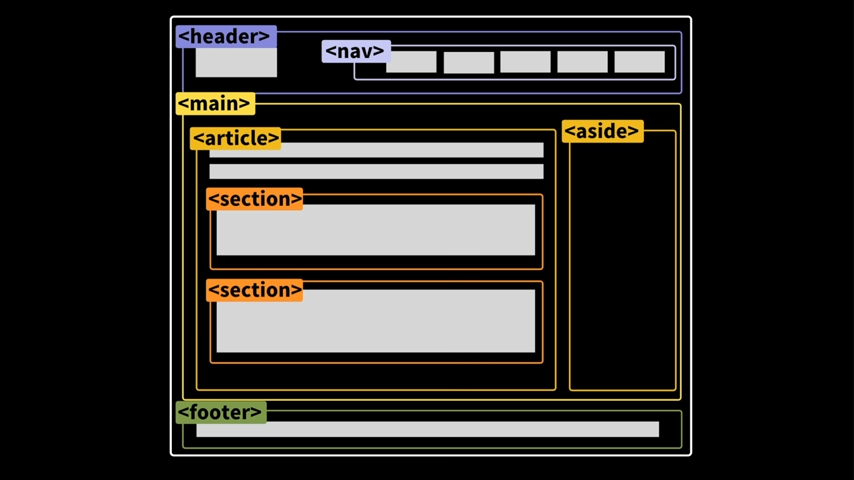

# HTML5 정리


> [모질라 웹기술 공식문서](https://developer.mozilla.org/ko/docs/Web)

##     

## 0️⃣ HTML이란?

- 프로그래밍 언어 x, 컨텐츠 구조를 정의하는 마크업 언어

​    

## 1️⃣ HTML 문서 구조

```html
<!DOCTYPE html> 
<html>
  <head>
    <meta charset="utf-8">
    <title>웹페이지 제목</title>
    <scripts></scripts>
    <link rel="stylesheet" href=" ">  <!-- css파일 -->
    <style></style>
  </head>
  <body>
    
  </body>
</html>
```

- `<!DOCTYPE html>` : 현재는 의미x
- `<html></html>` : 루트요소
- `<head></head>` : 페이지에 조회되지않는 정보들을 넣음
- `<body></body>`: 페이지에서 보여주고 싶은 모든것을 담음
- `<meta charset="utf-8">` : 문자집합 선언
- `<title></title>` : 웹페이지 제목 설정
- `<link>` : 외부 리소스 연결 요소 (css파일, favicon)
- `<scripts></scripts>`: 스크립트 요소 (JavaScript 파일 / 코드)
- `<style></style>` : CSS 직접작성

​    

> 웹사이트 폴더 관리

| test-site 폴더                  |                               |                            |                                    |
| ------------------------------- | ----------------------------- | -------------------------- | ---------------------------------- |
| index.html : 홈페이지 메인 내용 | images 폴더 : 이미지파일 저장 | styles 폴더 : CSS파일 저장 | scripts 폴더 : JavaScript코드 저장 |


## 2️⃣ 요소 (element)

```html
<여는태그/시작태그 속성> 내용(contents) </닫는태그/종료태그>
```

- 닫는 태그가 없는 태그도 존재 (`br, hr, img, input, link, meta`)
- 중첩 가능

> 속성 (attribute)

```html
<태그 속성명="속성값"></태그>
```

- 공백 중요, 형식에 맞게 써야함
- 쌍따옴표 (`""`) 사용해야함

​    

---

## 3️⃣ 태그 기본 속성

- 태그 열고 안닫으면 연문장 뒤 모든 문장에 적용
- 종료태그를 사용하지 않는 태그도 존재 
- 기본문법

```html	
<태그이름 속성이름 = "속성값"> 내용 </태그이름>

ex) <p class = "para"> contents </p>
```

- 주석 태그

```html
<!-- 내용 -- >
```

- 엔티티 코드

  - `&`로 시작, `;`로 종료

  - 적용 방법 2가지

    1. &<영어>;

    2. &#<숫자>;

```html
구글 검색 키워드 
>> HTML 엔티티 <검색할 문자>
```

| 자주 사용하는 코드 | 특수문자 | 설명       |
| ------------------ | -------- | ---------- |
| `&nbsp;`           |          | 공백       |
| `&amp;`            | &        | and        |
| `&quot;`           | "        | 큰따옴표   |
| `&lt;`             | <        | ~보다 작음 |
| `&gt;`             | >        | ~보다 큼   |

​    

---

## 4️⃣ 기본 태그 정리

### 1. p 태그  (paragraph)

- 하나의 문단을 나타냄
- 블록 레벨 요소

```html
<!-- 예제 -->
<p>첫 번째 문단입니다
	첫 번째 문단입니다.
  첫 번째 문단입니다.
</p>

<p>두 번째 문단입니다.
  두 번째 문단입니다.
  두 번째 문단입니다.
</p>

<!-- 결과 -->
첫 번째 문단입니다. 첫 번째 문단입니다. 첫 번째 문단입니다.
두 번째 문단입니다. 두 번째 문단입니다. 두 번째 문단입니다.
```


### 2. 제목 태그 (h1)

- ❗크기를 구분하려고 제목 태그를 사용해서는 안됨
- ❗h1 태그는 한 페이지에 무조건 1개 있어야함

```html 
<h1> 가장 큰 제목 </h1>
<h2> 큰제목 </h2>
<h3> 중간 제목</h3>
<h4> 작은 제목</h4>
<h5> 더 작은 제목</h5>
<h6> 엄청 작은 제목 </h6>
```


### 3. 앵커 태그  (a : Anchor)

- 인라인 태그
- 문서 <> 문서, 문서 <> URL간에 하이퍼링크
- URL뿐만아니라 문서끼리도 작동

```html
<a href="URL or 문서">설명</a>
```


### 4.이미지 태그

- 로컬이미지말고 웹에있는 이미지도 삽입
- 이미지에서 복사한 파일명 넣어주기

```html

<!-- src(source) = 주소, alt = 이미지오류시 보여줄 글자 -->
```

> ❗경로설정시 주의사항❗

- 대소문자 구분
- 공백 구분 (%20으로 인식되서 오류발생)
- 하이픈(`-`) 사용 지향, 밑줄문자(`_`) 사용 지양

```html
<!-- 호출하는 HTML파일과 같은 디렉토리에 있는 파일 연결시 __파일이름만__ 사용 -->


<!-- 하위 폴더에 위치한 파일 참조 : /(슬래시) 활용 -->


<!-- 상위 디렉토리 파일 참조 : . 활용 -->
`

```html
<ul>
  <li>1</li>
  <li>2</li>
  <li>3                  <!-- 서브 리스트 -->
    <ul>                 <!-- 서브 리스트 --> 
      <li>4</li>         <!-- 서브 리스트 -->
    </ul>                <!-- 서브 리스트 -->
  </li>
</ul>

>> ◾1
>> ◾2
>> ◾3
>>   ◾4
```

#### 5-2. ordered list  `<ol>`

```html
<ol>
	<li>1</li>
  <li>2</li>
</ol>

>> 1.1
>> 2.2
```


### 6. 서식 태그

| 여닫는 태그                 | 서식                         |
| --------------------------- | ---------------------------- |
| `<b></b>`                   | 굵게                         |
| `<strong></strong>`         | 강조효과 (소리내기에서 차이) |
| `<mark></mark>`             | 하이라이팅                   |
| `<del></del>`               | 삭제효과                     |
| `<ins></ins>`               | 삽입효과                     |
| `<i></i>`                   | 기울림꼴                     |
| `<em></em>`                 | 강조효과 (기울림 글씨 요소)  |
| `<blockquote></blockquote>` | 인용 블록 요소               |

| 여닫지않는 태그 | 서식                     |
| --------------- | ------------------------ |
| `<hr>`          | 가로줄                   |
| `<sup>`         | 위첨자                   |
| `<sub>`         | 아래첨자                 |
| `<br>`          | 텍스트 내에 줄 바꿈 생성 |

​    

> 제너릭 컨테이너 (인라인 vs 블록)

◾인라인 요소

- 콘텐츠의 흐름을 끊지 안고, 요소를 구성하는 태그에 할당된 공간만 차지
- `span`태그 : 한 블록에 존재하는 인라인 요소들을 구분해줄 수 있음 (클래스 선언)
- [인라인 요소 정리 mdn](https://developer.mozilla.org/ko/docs/Web/HTML/Inline_elements)

```html
<style>
	.highlight {
  background-color: #ee3;
}
</style>

<div>다음 span은 <span class="highlight">인라인 요소</span>로,
영향 범위의 시작과 끝을 알 수 있도록 배경색을 지정했습니다.</div>
```

◾블록 요소

- 일반적으로 블록 요소 앞,뒤를 개행
- `div`태그 : 텍스트를 가지는 블록 레벨 요소

```html
<style> .block { background-color: #8ABB55; } </style>

<p class="block">이 문단은 블록 레벨 요소입니다. 부모 요소와 구분할 수 있도록 배경 색을 입혔습니다.</p>
```

​    

----

## 5️⃣ 시맨틱 마크업

- 시맨틱 = 의미와 관련된
- div와 기능은 같지만 의미를 넣어놓은것 
- 크롤링 용이, 가독성 증가



| 태그                                                         | 특징                                                         |
| ------------------------------------------------------------ | ------------------------------------------------------------ |
| `<main></main>`                                              | 메인 컨텐츠 전체                                             |
| `<section></section>`                                        | 메인 컨텐츠 부분                                             |
| `<article></article>`                                        | 독립적인 컨텐츠                                              |
| `<nav></nav>`                                                | 네비게이션바 (링크)                                          |
| `<aside></aside>`                                            | 사이드바, 말풍선                                             |
| `<header></header>`                                          | 머리말                                                       |
| `<footer></footer>`                                          | 꼬리말                                                       |
| `<time datetime=""></time>`                                  | [인라인 요소] 시간표시                                       |
| `<figure>`<br />   `<figcaption>`설명글 `</figcaption>` <br />`</figure>` | `<figure>`는 조그마한 독립적인 컨텐츠<br />` <figcaption>`은 그 컨텐츠의 설명글 |

​    

---

## 6️⃣ 테이블

```html
<body>
  <table>
    <thead>
      <tr>
        <th>컬럼명1</th>
        <th>컬럼명2</th>
      </tr>
    </thead>
    <tbody>
      <tr>            <!-- 1행 시작 -->
        <td></td>     <!-- 1행 1열 --> 
        <td></td>     <!-- 1행 2열 -->
      </tr>           <!-- 1행 끝 -->
      <tr>            <!-- 2행 시작 -->
        <td></td>     <!-- 2행 1열 -->
        <td></td>     <!-- 2행 2열 -->
      </tr>           <!-- 2행 끝 -->
    </tbody>  
  </table>
</body>
```

| 기본 태그   | 특징                   |
| ----------- | ---------------------- |
| `<td></td>` | 단일셀                 |
| `<tr></tr>` | 행을 나눠줌            |
| `<th></th>` | 테이블의 헤더 (컬럼명) |

| 시맨틱 태그           | 특징                        |
| --------------------- | --------------------------- |
| `<thead></thead>`     | 표 머릿글 요소              |
| `<tbody></tbody>`     | 표 본문 요소                |
| `<tfoot></tfoot>`     | 표 바닥글 요소 (총계, 총합) |
| `<caption></caption>` | 표 설명 요소                |

| 정적 테이블 합치기      | 설명        |            |
| ----------------------- | ----------- | ---------- |
| `<td colspan="2"></td>` | 가로 합침 🟢 | 가로합침 🟢 |
| `<td rowspan="2"></td>` | 세로 합침 🟡 |            |
|                         | 세로 합침 🟡 |            |

​    

---

## 7️⃣ form 컨테이너

- 입력내용을 그룹화한 뒤 작은 배송 라벨을 붙여 어떤 지정된 목적지로 함께 제출

```html
<form action="" method="HTTP메서드">
```

​	

### 7-1. input

- 닫는 태그 없음
- input type 종류는 엄청 많음, 문서 참조 필수
- `placeholder` : 입력란의 임시 텍스트를 지정하는 속성 (default값)

```html
<input type="text" placeholder="">
<input type="password">
<input type="color">
```


### 7-2. label

- `input`태그의 설명
- `Label`과 `input` 연결방법

```html
<!-- 방법1 -->
<label for="name">Name</label>
<input type="text" id="name">

<!-- 방법2 -->
<label>
	<input type=" ">
</label>
```


### 7-3. button

- `<form>` 태그 안에 있으면 버튼을 눌렀을 때 해당 폼으로 제출, 기본 type값이 submit임
- `name` 속성 : `form`데이터랑 사용, 데이터를 보낼때 name속성 값 추가되서 보내짐

```html
<!-- 기본형 -->
<button></button>

<!-- 자주 사용되는 속성 -->
<button type="submit" name="">
 
<!-- 응용 -->
<form action = "/taco">
  <input id = "username" type = "text" placeholder = "username" name="user"
</form>

>> file:///taco?username=<적은내용>
```

> reddit 검색창 만들기

```html
<form action = "https://www.reddit.com/search">
  <input type = "text" name = "q">
  <button>Search Reddit</button>
</form>
```

> 유튜브 검색창 만들기

```html
<form action = "https://www.youtube.com/results">
  <input type = "text" name = "search_query">
  <button>Search Youtube</button>
</form>
```


### 7-4. 체크박스

- 여러개 선택 가능

```html
<form action="">
  <input type="checbox" name="agree_tos" id="agree">
  <label for = "agree">I agree to everything</label>
  <button>Submit</button>
</form>
```


### 7-5. 라디오버튼 

- 하나만 선택가능

```html
<form action="">
  <label for = "xs">XS:</label>
  <input type = "radio" name = "size" id = "xs" value = "xs">
  <label for = "m">M:</label>
  <input type = "radio" name = "size" id = "m" value = "m">
</form>
```


### 7-6. 드롭다운

```html
<label for = "a">  </label>

<select name=" " id="a">
  <option value = " " selected></option>
  <option value = " "></option>
  <option value = " "></option>
  <option value = " "></option>
</select>
```


### 7-7. range

- 볼륨조절같은 기능

```html
<input type="range" id="" min="" max="" step="" name="" value="초기값">
```

​    

>  내장 유효성 검사

- `required` : 빈값 제출 x

```html
<input type="text" required>
```

- `minlength` : 최소 단어수

- `maxlength` : 최대 단어수

```html
<input type="password" minlength="6" maxlength="12">
```

​    

> 기타 속성

- `disabled` : 제출불가

```html
<input type="text" disabled>
```

- `autofocus` : 자동으로 포커스

```html
<input type="text" autofocus>
```
