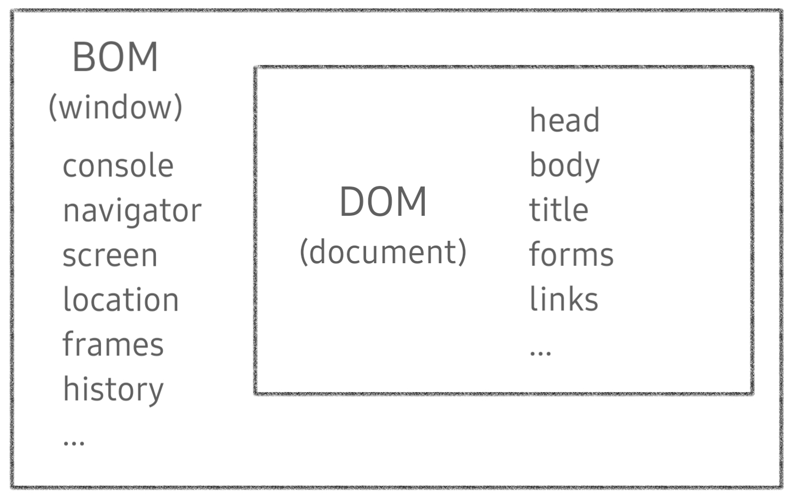
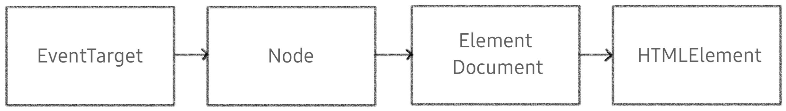

# JavaScript 정리(4)

​    

## 0️⃣ DOM



- Document Object Model : 문서 객체 모델
- 웹페이지를 구성하는 JavaScript 객체들의 집합
- HTML (문서) 조작
- 주요 객체
  - `window` : DOM을 표현하는 창, 가장 최상위 객체, 작성시 생략가능
  - `document`
  - `navigator, location, history, screen`

- 파싱 (Parsing)
  - 구문분석, 해석
  - 브라우저가 문자열을 해석하여 DOM Tree로 만드는 과정


​    

> BOM (Browser Object Model)

- navigator, screen, location, frames, history, XHR
- JS가 브라우저와 소통하기 위한 모델
- 브라우저의 창이나 프레임을 추상화하여 프로그래밍적으로 제어할 수 있도록 제공하는 수단
- window객체는 모든 브라우저로부터 지원받음, 브라우저의 창 지칭

```javascript
// 탭 창
window.open()

// 인쇄 창
window.print()

// 메시지 및 확인, 취소 버튼이 있는 대화상자창
window.confirm()

// document도 브라우저 내에 종속되어 있기 때문에 window 전역 객체에 포함
window.document
```


> ECMAScript

- Data Structure(Object, Array), Conditional Expression, Iteration
- JS Core : 프로그래밍 언어

​    

> DOM객체의 상속 구조



1. EventTarget 
   - Event Listener를 가질 수 있는 객체가 구현하는 DOM 인터페이스

2. Node
   - 여러가지 DOM타입들이 상속하는 인터페이스

3. Element
   - Document안의 모든 객체가 상속하는 가장 범용적인 인터페이스
   - 부모인 `Node`와 그 부모인 `EventTarget`의 속성을 상속

4. Document
   - 브라우저가 불러온 웹페이지
   - DOM트리의 진입점(entry point) 역할을 수행

5. HTMLElement
   - 모든 종류의 HTML요소
   - 부모 `Element`의 속성 상속

​    

> DOM 조작 순서

1. 요소선택(Select)
2. 조작(Manipulate)

​    

---

## 1️⃣ 선택 메소드 (Selecting method)

```markdown
1. 단일요소 반환
 - getElementById()
 - querySelector()  ✔️✔️
 
2. HTMLColleciton
 - getElementsByTagName()
 - getElementsByClassName()

3. NodeList
 - querySelectorAll()  ✔️✔️
```

​    

### 1-1. getElementById

- id가 일치하는 요소를 찾음, 없으면 `null` 반환

```javascript
const 변수 = document.getElementById('ID')
```

​    

### 1-2. getElementsByTagName

- 태그가 일치하는 요소 찾음
- `HTMLCollection` 형태로 반환됨
- `.length`, `for-of` 사용가능

```javascript
const 변수 = document.getElementsByTagName('태그이름');

// 문서 내 모든 이미지 태그 같은 소스로 변경
const allImages = document.getElementsByTagName('img');

for (let img of allImages) {
  img.src = "새로운 사진";
}
```

​    

### 1-3. getElementsByClassName

- 클래스가 일치하는 요소 찾음
- `HTMLCollection` 형태로 반환됨

```javascript
// 문서 내 클래스가 같은 요소 찾아 반환
const ImageClass = document.getElementsByClassName('img');

for (let img of ImageClass) {
  img.src = "새로운 사진";
}
```

​    

### 1-4. QuerySelector ✔️✔️

- 무엇이든 선택가능
- 첫 번째로 일치하는 값 반환
- 일치하는 객체가 없다면 `null`반환

```javascript
document.querySelector(selector)
```

```javascript
document.qureySelector('p')
document.qureySelector('#banner')
document.qureySelector('.square')
document.qureySelector('img:nth-of-type(2)')
document.qureySelector('a[title="Java"]')
```

​     

### 1-5. QuerySelectorAll ✔️✔️

- 무엇이든 선택가능
- 일치하는 모든 요소 반환
- 지정된 `selector`에 일치하는 `NodeList`를 반환

```javascript
document.querySelectorAll(selector)
```

```javascript
const links = document.qureySelectorAll('p a');

for (let link of links) {
  console.log(link.href);
}
```

​    

---

## 2️⃣ 조작 메소드 (Manipulating method)

### 2-1. innerText 

- 여는 태그와 닫는 태그 사이의 내용을 텍스트로 반환
- 태그는 모두 무시하고 숨겨진 항목은 무시

```javascript
Node.innerText = ''
```

```javascript
document.querySelector('').innerText
document.querySelector('h1').innerText = '<i> title </i>'
>> '<i> title </i>'  // 태그가 무시되고 문자열 같이 취급됨
```

​    

### 2- 2. textContent

- innerText와 비슷하지만 현재 나타난 내용이나 사용자에게 보이는 내용은 신경 안씀
- 저장한 방식에 따라 표기됨
- 숨겨놓은 것들도 모두 나오게함

```javascript
document.querySelector('').textContent
```

​    

### 2-3. innerHTML

- 태그 이름을 포함한 전체 콘텐츠 검색
- 요소를 다른 요소 안에 추가할 때 사용가능
- 요소내에 포함된 HTML 마크업 반환
- XSS 공격에 취약

```javascript
Element.innerHTML = ''
```

```javascript
document.querySelector('').innerHTML
document.querySelector('p').innerHTML = '<b> bold </b>'
>> bold // 글꼴 굵게 설정됨
```

​    

---

## 3️⃣ 속성 (Attributes) 

### 3-1. setAttribute

- 지정된 요소의 값 설정
- 속성이 이미 존재하면 값을 갱신, 존재하지 않으면 지정된 이름과 값으로 새 속성을 추가

```javascript
Element.setAttribute(name, value)
```

​    

### 3-2. getAttribute

- 해당 요소의 지정된 값(문자열) 반환
- 인자(attributeName)는 값을 얻고자 하는 속성의 이름

```javascript
Element.getAttribute(attributeName)
```

​    

> 활용

```javascript
document.querySelector('').태그속성

// 속성에 바로 접근
document.querySelector('a').href  
>> "file://https://go~~"

// getAttribute 메서드
const firstLink = document.querySelector('a')
firstLink.getAttribute('href')
>> "https://go~~"

// setAttribute 메서드
firstLink.setAttribute('href', '바꿀 속성의 값')
```

​    

---

## 4️⃣ 스타일

```javascript
// 인라인 스타일로 적용됨
h1.style.color = 'green'
h1.style.fontSize = '3em'
h1.style.border = '2px solid pink'

>> <h1 style="color: green; font-size: 3em; border: 2px solid pink"></h1>
```

> 실제 스타일 알아내기

```javascript
const h1 = document.querySelector('h1')
window.getComputedStyle(h1)  // >> CSSStyleDeclartion로 반환
window.getComputedStyle(h1).color  // 적용되어있는 color값 반환
window.getComputedStyle(h1).fontSize  // 적용되어있는 font-size값 반환
```

​    

---

## 5️⃣ 클래스 적용

### 5-1. classList

- classList에는 내장된 메서드들이 존재
- 클래스를 적용하는 방법

```javascript
// 방법2 : classList 활용
const h2 = document.querySelector('h2')
h2.classList.add('purple')   // 클래스에 purple 추가 >> <h2 class='purple'>
h2.classList.add('border')   // 클래스에 border 추가 >> <h2 class='purple border'>

h2.classList.remove('border')  // 클래스에서 border 제거

h2.classList.contians('border')  // 클래스에 border가 존재하는지 여부 반환 >> false
h2.classList.contians('purple')  // 클래스에 purple이 존재하는지 여부 반환 >> True

h2.classList.toggle('purple') // 클래스에 purple이 존재하면 삭제하고, 없으면 추가 ❗❗
```

​    

---

## 6️⃣ 계층이동

### 6-1. 부모

```html
<body>
  <p>
    <b></b>
  </p>
</body>
```

​    

#### 6-1-1.parentElement 

- 한 단계 위의 부모요소를 반환
- 버튼을 클릭했을 때 버튼의 부모 요소나 자식 요소상에 변경을 가하게 할 수 있음

```javascript
const firstBold = document.querySelector('b')
firstBold  //  <b></b>
firstBold.parentElement  //  <p></p>
firstBold.parentElement.parentElement  //  <body></body>
```

​    

### 6-2. 자식

```html
<body>
  <p>
    <b></b>
  </p>
</body>
```

​    

#### 6-2-1. children

- 배열처럼 생긴 HTMLCollection 반환
- 반복 가능

```javascript
const firstBold = document.querySelector('b')
const paragraph = firstBold.parentElement

paragraph.children
>> HTMLCollection(3) [a, a, b]

paragraph.children[0]
>> <a></a>
```

​    

#### 6-2-2.  childElementCount

- 자식 요소의 개수 알려줌

​    

### 6-3.  형제

#### 6-3-1. previousSibling / nextSibling

- 요소가 아닌 노드를 출력
- 잘 안씀

#### 6-3-2. previousElementSibling / nextElementSibling ✔️✔️

- 실제 형제 요소를 반환

​    

---

## 7️⃣ 새 요소 만들기

### 7-1. createElement ✔️✔️ / appendChild 

- `createElement`: 작성한 태그명의 HTML 요소를 생성

```javascript
document.createElement()
```

- `node.appendChild()`
  - 한 노드를 특정 부모 노드의 자식 노드 리스트 중 마지막 자식으로 붙임
  - 한번에 오직 하나의 Node만 추가가능
  - 노드가 문서상의 두 지점에 동시에 존재할 수 없다는 것을 의미

```javascript
const newImg = document.createElement('img')  // 새 이미지 태그 만들기
newImg.src = ""  // 이미지 소스 추가하기
document.body.appendChild(newImg)  // 페이지에 추가하기
newImg.classList.add('square')  // 클래스 추가
```

```javascript
const newH3 = document.createElement('h3')  // h3 태그 생성
newH3.innerText = 'I am new!'  // 태그에 내용 추가
document.body.appendChild(newH3)  // 페이지에 추가
```

​    

### 7-2. append ✔️✔️

- 어떤 항목의 요소의 마지막 자식으로 삽입
- 여러개의 Node객체, DOMString 추가 가능 
- 반환값이 없음

```javascript
const p = document.querySelector('p')
p.append('hello', 'bye')
// appendChild는 불가능
```

​    

> append vs appendChild

| append                     | appendChild            |
| -------------------------- | ---------------------- |
| DOMString, Node            | Only Node              |
| 반환값 o                   | 반환값 x               |
| 여러 객체, 문자열 추가가능 | 하나의 노드만 추가가능 |

​    

### 7-3. prepend

- 어떤 항목을 요소의 첫 번째 자녀로 삽입

```javascript
const p = document.querySelector('p')
const newB = document.createElement('b')
newB.append('hi')
p.prepend(newB)
```

​    

### 7-4. insertAdjacentElement (position, element)

- position
  - `beforebegin` : 특정 요소의 앞
  - `afterbegin` :  특정 요소내에서 첫번째 자식
  - `beforeend` : 특정 요소내에서 마지막 자식
  - `afterend` : 특정 요소의 뒤

```javascript
const h2 = document.creatElement('h2')
h2.append('go to bed')
const h1 = document.querySelector('h1')
h1.insertAdjacentElement('afterend', h2)
```

​    

### 7-5. after

- 다른 요소 바로 다음에 삽입

```javascript
const h3 = document.createElement('h3')
h3.innerText = 'I am h3';
h1.after(h3) ✔️
```

​    

### 7-6. before

- 다른요소 바로 전에 삽입

​    

---

## 8️⃣ 요소 제거 

### 8-1. remove

- Node가 속한 트리에서 해당 Node 제거

```javascript
ChildeNode.remove()
```

```javascript
const img = document.querySelector('img')
img.remove()
```

​    

### 8-2. removeChild

- 선택한 요소의 자식을 제거
- 잘 안쓰임
- 제거하려는 요소의 부모를 호출해야함
