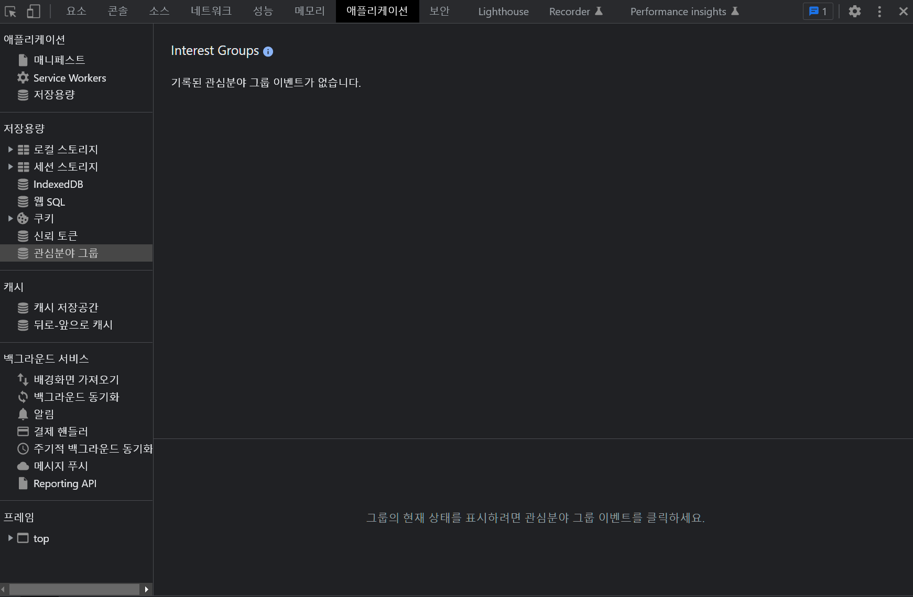

# 개발자 도구 어플리케이션탭



- 브라우저안에 데이터 저장 ✔️✔️

​    

##  1️⃣ LocalStorage VS SessionStorage 

### 공통점

- 이름:값 (key:value) 형태로 저장가능
- 저장용량 5mb
- 문자/ 숫자만 저장가능

​    

### 차이점

- localStorage : 비휘발성, 사이트 재접속시에도 데이터 유지됨
- sessionStorage : 휘발성, 페이지 나가면 데이터 삭제됨

```js
// 데이터 저장
localStorage.setItem('Key','Value')
sessionStorage.setItem('Key','Value')

// 데이터 출력
localStorage.getItem('Key')
sessionStorage.getItem('Key')

// 데이터 삭제
localStorage.removeItem('Key')
sessionStorage.removeItem('Key')
```

​    

- array나 object 저장 및 활용하기 : JSON으로 변환하여 저장

```javascript
var arr = [1, 2, 3]
var newArr = JSON.stringify(arr);

localStorage.setItem('num', newArr)
```

```js
var print = localStorage.getItem('num')
JSON.parse(print)
```


---

## 2️⃣ IndexedDB 

- 구조화된 대용량 데이터 저장시 사용