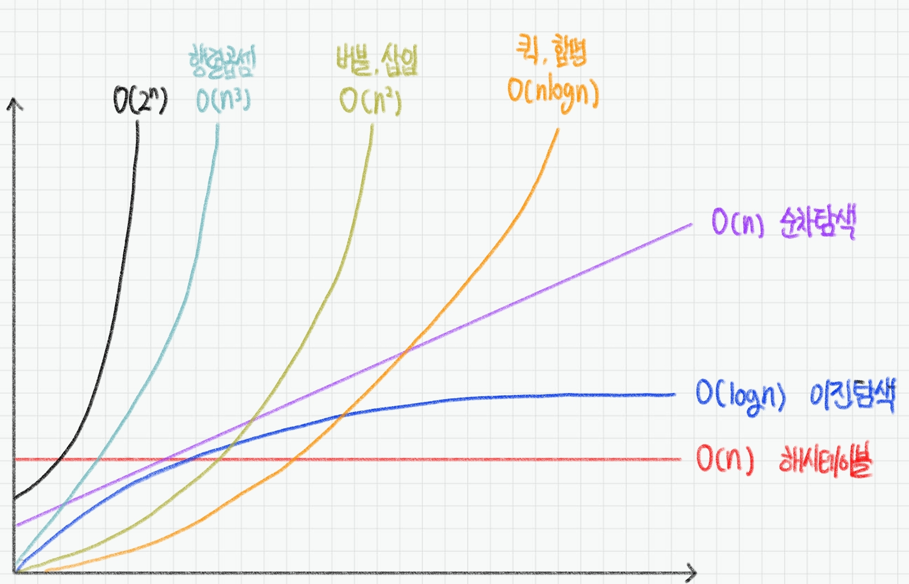

# 🎖️시간복잡도

   

## 0️⃣ 시간복잡도 개념 

### 1. 시간복잡도 (Time Complexity)

- 좋은 알고리즘이란? 
  - == Input을 넣은 후 Output이 나오는 시간이 짧은 알고리즘

- 알고리즘 소요 시간 측정하기
  - 기본연산의 총 횟수 == 알고리즘 소요시간
  - 최악의 입력 n개가 들어온다고 가정하고 시간 계산

- 알고리즘 성능 비교
  - `6n + 4` vs `3n + 2`  : 선형 증가, n이 무한대라면 차이 x
  - `3n + 2` vs `3n**2 + 6n + 1` : 제곱으로 증가, n이 무한대라면 엄청난 차이가 발생

​    

### 2. 빅오 (Big - O) 표기법

- 입력 n이 무한대로 커진다고 가정하고 시간 복잡도를 간단하게 표시하는 것
- 최고차항만 남기고 계수와 상수는 배제

```bash
6n + 4 	       >> O(n)
3n + 2 	       >> O(n)
3n**2 + 6n + 1 >> O(n**2)
```

- 다양한 시간 복잡도 종류



```bash
O(1) : 단순 산술 계산 (+, -, *, /)
O(logN) : 리스트를 반절씩 순회 / 탐색 >> 이진탐색 (Binary Search), 분할정복 (Divide & Conquer)
O(N) : 리스트 순회 >> 1중 for문
O(NlogN) : 리스트를 반절씩 탐색 + 순회 >> 높은 성능의 정렬 (Merge, Quick, Heap)
O(N**2) : 2중 리스트 순회
O(2**n) : 집합의 부분 집합
O(N!) : 리스트의 순열
```

- 실제 문제에 어떻게 적용될까?
  - 보통 1초에 1억번 연산
  - 1초가 걸리는 입력의 크기
    - O(N) : 1억 
    - O(NlogN) : 500만 (x 20)
    - O(N**2) : 1만 (x 10,000)
    - O(N**3) : 500 (x 20만)

​    

- 내장함수, 메서드의 시간복잡도도 확인할 필요가 있음
  - for문안에서 내장함수를 사용하면 사실상 2중 for문과 다름없음


​    

## 1️⃣ 리스트

### 1. 배열 vs 연결리스트

1. 배열 (Array)

- 여러 데이터들이 연속된 메모리 공간에 저장되어 있는 자료구조
  - 인덱스를 통해 데이터에 빠르게 접근가능
  - 배열길이 변경불가 >> 변경하고 싶다면 새로 생성해야함
  - 데이터 타입은 고정

2. 연결 리스트 (Linked List)

- 데이터가 담긴 여러 노드들이 순차적으로 연결된 형태의 자료구조
  - 맨 처음 노드부터 순차적으로 탐색
  - 길이 변경 자유로움 >> 삽입, 삭제 편리
  - 다양한 데이터 타입 저장 가능
  - 데이터가 메모리에 연속적으로 저장되지않음

​      

### 2. 리스트 시간복잡도

- 파이썬의 리스트는 배열의 인덱스 접근과 연결리스트의 가변 길이를 모두 활용


> 리스트 메소드의 시간복잡도 정리

| 메소드        | 시간복잡도 |
| ------------- | ---------- |
| .append()     | O(1)       |
| .pop()        | O(1)       |
| .pop( i )     | O(n)       |
| .count()      | O(n)       |
| .index()      | O(n)       |
| .sort()       | O(nlogn)   |
| .reverse()    | O(n)       |
| .clear()      | O(1)       |
| .extend(x)    | O(n)       |
| .insert(i, v) | O(n)       |
| .remove()     | O(n)       |
| .copy()       | O(n)       |

​    

> 리스트 내장함수의 시간복잡도 정리

| 내장함수        | 시간복잡도 |
| --------------- | ---------- |
| list( x )       | O(n)       |
| len( )          | O(1)       |
| sum( x )        | O(n)       |
| max( ) / min( ) | O(n)       |
| sorted( )       | O(nlogn)   |
| reversed( )     | O(n)       |

​    

> 리스트 기타 시간복잡도 정리

| 작동     | 예시                       | 시간복잡도 |
| -------- | -------------------------- | ---------- |
| 인덱싱   | a[i]                       | O(1)       |
| 값 저장  | a[i] = 1                   | O(1)       |
| 슬라이싱 | a[n:m]                     | O(m-n)     |
| 슬라이싱 | a[ : ]                     | O(n)       |
| 값 비교  | ==<br />!=                 | O(n)       |
| 삭제     | del a[i]                   | O(n)       |
| 검색     | x in lst<br />x not in lst | O(n)       |
| 반복     | for i in lst               | O(n)       |
| 곱하기   | K * lst                    | O(kN)      |

​    

---

## 2️⃣ 딕셔너리

### 1. 해시 테이블

- Non-seqence + Key - Value
- 딕셔너리는 해시 테이블 (Hash Table)을 이용하여 Key : Value를 저장
  - 해시함수 : 임의 길이의 데이터를 고정길이 데이터로 매핑하는 함수
  - 해시 : 해시 함수를 통해 얻어진 값
- 파이썬에는 딕셔너리 자료구조가 내장되어 있음

- 파이썬의 딕셔너리는 CRUD 연산속도가 리스트보다 빠름

​    

### 2. 딕셔너리 시간복잡도

| 연산         | 예시              | 시간복잡도 |
| ------------ | ----------------- | ---------- |
| 길이         | .len()            | O(1)       |
| 인덱싱       | dict[key]         | O(1)       |
| 저장         | dict[key] = value | O(1)       |
| 검색         | key in dict       | O(1)       |
| 지우기       | del dict[key]     | O(1)       |
| 뽑아내기     | .pop()            | O(1)       |
| 키 보기      | .keys()           | O(1)       |
| 값 보기      | .values()         | O(1)       |
| 키 - 값 보기 | .items()          | O(1)       |

​    

---

## 3️⃣ 세트

- 집합 자료형, 해쉬 자료형

| 연산                              | 예시       | 시간복잡도 |
| --------------------------------- | ---------- | ---------- |
| 길이                              | len ( )    | O(1)       |
| 특정값 탐색                       | x in set   | O(1)       |
| 값 넣어주기 / 덮어쓰기            | .add()     | O(1)       |
| 값 삭제 (값 없으면 에러)          | .remove()  | O(1)       |
| 값 삭제 (값이 없어도 에러 반환 x) | .discard() | O(1)       |
| 합집합                            | s1 \| s2   | O(n)       |
| 교집합                            | s1 & s2    | O(n)       |
| 차집합                            | s1 - s2    | O(n)       |

