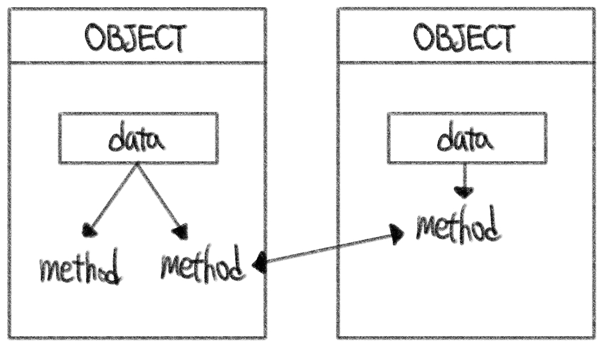

# ❓객체지향 프로그램 (1)

- 프로그램을 여러 개의 독립된 객체들과 그 객체들 간의 상호작용으로 파악하는 프로그래밍 방법

​    

## 1️⃣ 객체(object)

- 파이썬은 모두 _객체(object)_로 이뤄져 있다.

- 특정 타입의 인스턴스(instance)

```bash
123, 900, 5는 모두 int의 인스턴스
'hello', 'bye'는 모두 string의 인스턴스
[232, 79], []은 모두 list의 인스턴스
```

- 타입 (type) : 어떤 연산자(operator)와 조작(method)이 가능한가?
- 속성 (attribute) : 어떤 상태(데이터)를 가지는가?
- 조작법 (method) : 어떤 행위(함수)를 할 수 있는가?

​    

> 절차지향 프로그래밍 vs 객체지향 프로그래밍

- 절차지향 프로그래밍 : 데이터와 함수로 인한 변화

- 객체지향 프로그래밍 : 데이터와 기능(메소드) 분리, 추상화된 구조(인터페이스)



​    

- 예시 - 사각형 넓이 구하기 코드

```python
# 절차지향 프로그래밍_1
a = 10
b = 30
square1_area = a * b
square1_circumference = 2 * (a + b)

c = 300
d = 20
square2_area = c * d
square2_circumference = 2 * (c + d)

# 절차지향 프로그래밍_2
def area(x, y):
    return x * y

def circumference(x, y):
    return 2 * (x + y)

a = 10
b = 30
c = 300
d = 20
square1_area = area(a, b)
square1_circumference = circumference(a, b)
square2_area = area(c, d)
square2_circumference = circumference(c, d)
```

```python
# 객체지향 프로그래밍
class Rectangle:
    def __init__(self, x, y):
        self.x = x
        self.y = y
        
    def area(self):
        return self.x * self.y
    
    def circumference(self):
        return 2 * (self.x + self.y)
    
r1 = Rectangle(10,30)
r1.area()
r1.circumference()

r2 = Rectangle(300,20)
r2.area()
r2.circumference()

# 사각형 = 클래스 (class)
# 각 사각형 (r1, r2) = 인스턴스 (instance)
# 사각형의 정보 = 속성 (attribute)
#	- 가로의 길이, 세로의 길이
# 사각형의 행동 / 기능 = 메소드 (method)
#	- 넓이 구하기, 높이 구하기
```

​    

> 객체지향의 장점

- 프로그램을 유연하고 변경이 용이 >> 대규모 소프트웨어 개발에 많이 사용
- SW 개발과 보수가 간편
- 직관적인 코드 분석 가능

​    

---

## 2️⃣ 객체지향 프로그래밍 (OOP)

```python
# 클래스 정의
class MyClass:
    
# 인스턴스 생성
my_instance = MyClass()

# 메소드 호출
my_instance.my_method()

# 속성 호출
my_instance.my_attribute  

❗❗ 메소드는 마지막에 () 있음 / 속성은 () 없음 ❗❗
```

- 클래스 : 객체들의 분류
- 인스턴스 : 하나하나의 실체
- 속성 : 특정 데이터 타입이나 클래스의 객체들이 가지게 될 상태나 데이터
- 메소드 : 특정 데이터 타입이나 클래스의 객체에 공통적으로 적용 가능한 행위

​    

> 객체 비교하기

1.  ==  ( 동등한 [equal] )

- 변수가 참조하는 객체가 내용이 같은 경우 True

- 두 객체가 같아보여도 실제로 동일한 대상을 가리키고 있다고 확인해 준 것은 아님

2.  is ( 동일한 [identical] )

- 두 변수가 동일한 객체를 가리키는 경우 True

```python
a = [1,2,3]
b = [1,2,3]
print(a == b, a is b)
>> True False

a = [1,2,3]
b = a
print(a == b, a is b)
>> True True
```
